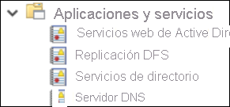
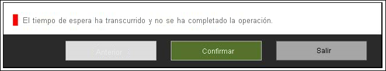

# <a name="troubleshoot-ecma-connector-host-issues"></a>Solución de problemas del host del conector ECMA

>[!IMPORTANT]
> La versión preliminar de aprovisionamiento local se encuentra actualmente en una versión preliminar solo por invitación. Para solicitar acceso a la capacidad, use el [formulario de solicitud de acceso](https://aka.ms/onpremprovisioningpublicpreviewaccess). La versión preliminar estará a disposición de más clientes y conectores durante los próximos meses, cuando se prepare la disponibilidad general.

## <a name="troubleshoot-test-connection-issues"></a>Solución de problemas de conexión de prueba.
Después de configurar el host ECMA y el agente de aprovisionamiento, es el momento de probar la conectividad desde el servicio de aprovisionamiento de Azure Active Directory (Azure AD) al agente de aprovisionamiento, el host ECMA y la aplicación. Para llevar a cabo esta prueba de un extremo a otro, seleccione **Probar conexión** en la aplicación en el Azure Portal. Cuando se produce un error en la conexión de prueba, pruebe los siguientes pasos de solución de problemas:

 1. Compruebe que el agente y el host ECMA se están ejecutando:
     1. En el servidor con el agente instalado, abra **Servicios**. Para ello, vaya a **Inicio** > **Ejecutar** > **Services.msc**.
     1. En **Servicios** asegúrese de que los servicios del **Actualizador del Agente de Microsoft Azure AD Connect**, el **Agente de aprovisionamiento de Microsoft Azure AD Connect** y **Microsoft ECMA2Host** están presentes y que su estado es *En ejecución*.
    
        

 1. Vaya a la carpeta en la que se instaló el host ECMA seleccionando **Solución de problemas** > **Scripts** > **TestECMA2HostConnection**. Ejecute el script. Este script envía una solicitud SCIM GET o POST para validar que el host del conector ECMA funciona y responde a las solicitudes. Debe ejecutarse en el mismo equipo que el propio servicio de host del conector ECMA.
 1. Asegúrese de que el agente está activo; para ello, vaya a la aplicación en el Azure Portal, seleccione **conectividad del administrador**, haga clic en la lista desplegable del agente y asegúrese de que el agente está activo.
 1. Compruebe si el token secreto proporcionado es el mismo que el token secreto local. Vaya al entorno local, vuelva a proporcionar el token secreto y cópielo en el Azure Portal.
 1. Asegúrese de que ha asignado uno o varios agentes a la aplicación en Azure Portal.
 1. Una vez asignado un agente, debe esperar de 10 a 20 minutos para que se complete el registro. La prueba de conectividad no funciona hasta que se completa el registro.
 1. Asegúrese de que usa un certificado válido. La pestaña **Configuración** del host ECMA le permite generar un certificado nuevo.
 1. Reinicie el agente de aprovisionamiento; para ello, vaya a la barra de tareas de la máquina virtual y busque el agente de aprovisionamiento de Microsoft Azure AD Connect. Haga clic con el botón derecho en **Detener** y seleccione **Iniciar**.
 1. Al proporcionar la dirección URL del inquilino en Azure Portal, asegúrese de aplicar el siguiente patrón. Puede reemplazar `localhost` por el nombre del host, pero no es necesario. Reemplace `connectorName` por el nombre del conector especificado en el host ECMA.
 
    ```
    https://localhost:8585/ecma2host_connectorName/scim
    ```

## <a name="unable-to-configure-the-ecma-host-view-logs-in-event-viewer-or-start-the-ecma-host-service"></a>No se puede configurar el host ECMA, ver los registros en el visor de eventos ni iniciar el servicio de host ECMA

Para resolver los siguientes problemas, ejecute el host ECMA como administrador:

* Me da un error cuando abro el asistente de host ECMA.

   

* Puedo configurar el asistente para host ECMA, pero no puedo ver los registros de host ECMA. En este caso, deberá abrir el host como administrador y configurar un conector de un extremo a otro. Este paso se puede simplificar; para ello, exporte un conector existente y vuélvalo a importar. 

   

* Puedo configurar el asistente para host ECMA, pero no puedo iniciar el servicio de host ECMA.

   


## <a name="turn-on-verbose-logging"></a>Activación del registro detallado 

De forma predeterminada, `switchValue` para el host del conector ECMA se establece en `Error`. Esta configuración significa que solo registrará los eventos que son errores. Para habilitar el registro detallado para el servicio de host o el asistente de ECMA, establezca `switchValue` en `Verbose` en ambas ubicaciones, tal y como se muestra.

La ubicación del archivo para el registro detallado del servicio es C:\Archivos de programa\Microsoft ECMA2Host\Service\Microsoft.ECMA2Host.Service.exe.config.
  ```
  <?xml version="1.0" encoding="utf-8"?> 
  <configuration> 
      <startup>  
          <supportedRuntime version="v4.0" sku=".NETFramework,Version=v4.6" /> 
      </startup> 
      <appSettings> 
        <add key="Debug" value="true" /> 
      </appSettings> 
      <system.diagnostics> 
        <sources> 
      <source name="ConnectorsLog" switchValue="Verbose"> 
            <listeners> 
              <add initializeData="ConnectorsLog" type="System.Diagnostics.EventLogTraceListener, System, Version=2.0.0.0, Culture=neutral, PublicKeyToken=b77a5c561934e089" name="ConnectorsLog" traceOutputOptions="LogicalOperationStack, DateTime, Timestamp, Callstack"> 
                <filter type=""/> 
              </add> 
            </listeners> 
          </source> 
          <!-- Choose one of the following switchTrace:  Off, Error, Warning, Information, Verbose --> 
          <source name="ECMA2Host" switchValue="Verbose"> 
            <listeners>  
              <add initializeData="ECMA2Host" type="System.Diagnos
  ```

La ubicación del archivo para el registro detallado del servicio es C:\Archivos de programa\Microsoft ECMA2Host\Wizard\Microsoft.ECMA2Host.ConfigWizard.exe.config.
  ```
        <source name="ConnectorsLog" switchValue="Verbose"> 
          <listeners> 
            <add initializeData="ConnectorsLog" type="System.Diagnostics.EventLogTraceListener, System, Version=2.0.0.0, Culture=neutral, PublicKeyToken=b77a5c561934e089" name="ConnectorsLog" traceOutputOptions="LogicalOperationStack, DateTime, Timestamp, Callstack"> 
              <filter type=""/> 
            </add> 
          </listeners> 
        </source> 
        <!-- Choose one of the following switchTrace:  Off, Error, Warning, Information, Verbose --> 
        <source name="ECMA2Host" switchValue="Verbose"> 
          <listeners> 
            <add initializeData="ECMA2Host" type="System.Diagnostics.EventLogTraceListener, System, Version=4.0.0.0, Culture=neutral, PublicKeyToken=b77a5c561934e089" name="ECMA2HostListener" traceOutputOptions="LogicalOperationStack, DateTime, Timestamp, Callstack" /> 
  ```

## <a name="target-attribute-is-missing"></a>Falta el atributo de destino 
El servicio de aprovisionamiento detecta automáticamente los atributos de la aplicación de destino. Si ve que falta un atributo de destino en la lista de atributos de destino en Azure Portal, realice el siguiente paso de solución de problemas:

 1. Revise la página **Seleccionar atributos** de la configuración del host ECMA para comprobar que el atributo se ha seleccionado para exponerse en Azure Portal.
 1. Asegúrese de que el servicio de host ECMA está activado. 
 1. Revise los registros del host ECMA para comprobar que se realizó una solicitud /schemas y revise los atributos de la respuesta. Esta información será útil para que el servicio de soporte técnico solucione el problema.

## <a name="collect-logs-from-event-viewer-as-a-zip-file"></a>Recopilación de registros del visor de eventos como un archivo ZIP

Vaya a la carpeta en la que se instaló el host ECMA seleccionando **Solución de problemas** > **Scripts**. Ejecute el script `CollectTroubleshootingInfo` como administrador. Puede usarlo para capturar los registros en un archivo ZIP y exportarlos.

## <a name="review-events-in-event-viewer"></a>Revisión de eventos en el visor de eventos

Una vez configurada la asignación del esquema de host del conector ECMA, inicie el servicio para que escuche las conexiones entrantes. A continuación, supervise las solicitudes entrantes.

  1. Seleccione el menú **Inicio**, escriba **visor de eventos** y elija **Visor de eventos**. 
  1. En **Visor de eventos**, expanda **Registros de aplicaciones y servicios** y seleccione **Registros de Microsoft ECMA2Host**. 
  1. A medida que el host del conector reciba los cambios, los eventos se escribirán en el registro de aplicaciones. 

## <a name="understand-incoming-scim-requests"></a>Descripción de las solicitudes de SCIM entrantes

Las solicitudes realizadas por Azure AD al agente de aprovisionamiento y al host del conector usan el protocolo SCIM. Las solicitudes realizadas desde el host a las aplicaciones usan el protocolo que admite la aplicación. Las solicitudes del host al agente para Azure AD se basan en SCIM. Puede obtener más información sobre la implementación de SCIM en [Tutorial: Desarrollo y planeación del aprovisionamiento de un punto de conexión SCIM en Azure Active Directory](use-scim-to-provision-users-and-groups.md).

Al principio de cada ciclo de aprovisionamiento, antes de realizar el aprovisionamiento a petición y al realizar la conexión de prueba, el servicio de aprovisionamiento de Azure AD suele realizar una llamada de usuario get para un [usuario ficticio](use-scim-to-provision-users-and-groups.md#request-3), a fin de asegurarse de que el punto de conexión de destino está disponible y devuelve respuestas compatibles con SCIM. 


## <a name="how-do-i-troubleshoot-the-provisioning-agent"></a>¿Cómo puedo solucionar los problemas del agente de aprovisionamiento?
Es posible que experimente los siguientes escenarios de error.

### <a name="agent-failed-to-start"></a>El agente no se pudo iniciar

Puede recibir un mensaje de error que indique lo siguiente:

«No se pudo iniciar el servicio Agente de aprovisionamiento de Microsoft Azure AD Connect. Compruebe que dispone de suficientes privilegios para iniciar servicios del sistema". 

Este problema suele deberse a que una directiva de grupo impidió que se aplicaran permisos a la cuenta de inicio de sesión del servicio NT local creada por el instalador (NT SERVICE\AADConnectProvisioningAgent). Estos permisos son necesarios para iniciar el servicio.

Para resolver este problema:

1. Inicie sesión en el servidor con una cuenta de administrador.
1. Abra **Servicios**. Para ello, vaya ahí o a **Inicio** > **Ejecutar** > **Services.msc**.
1. En **Servicios**, haga doble clic en **Agente de aprovisionamiento de Microsoft Azure AD Connect**.
1. En la pestaña **Iniciar sesión**, cambie **Esta cuenta** a un administrador de dominio. A continuación, reinicie el servicio. 

En esta prueba se comprobará que los agentes pueden comunicarse con Azure a través del puerto 443. Abra un explorador y vaya a la dirección URL anterior desde el servidor en el que está instalado el agente.

### <a name="agent-times-out-or-certificate-is-invalid"></a>El agente agota el tiempo de espera o el certificado no es válido

Al intentar registrar el agente, es posible que reciba el siguiente mensaje de error.



Este problema suele deberse a que el agente no puede conectarse al servicio de identidad híbrida y requiere configurar un proxy HTTP. Para solucionar este problema, configure un proxy de salida. 

El agente de aprovisionamiento admite el uso de un proxy de salida. Puede configurarlo al editar el archivo de configuración del agente *C:\Archivos de programa\Microsoft Azure AD Connect Provisioning Agent\AADConnectProvisioningAgent.exe.config*. Agregue al archivo las siguientes líneas, hacia el final del archivo, justo antes de la etiqueta de cierre `</configuration>`.
Reemplace las variables `[proxy-server]` y `[proxy-port]` con los valores del puerto y el nombre del servidor proxy.

```xml
    <system.net>
        <defaultProxy enabled="true" useDefaultCredentials="true">
            <proxy
                usesystemdefault="true"
                proxyaddress="http://[proxy-server]:[proxy-port]"
                bypassonlocal="true"
            />
        </defaultProxy>
    </system.net>
```
### <a name="agent-registration-fails-with-security-error"></a>Error de seguridad al registrar el agente

Es posible que reciba un mensaje de error al instalar el agente de aprovisionamiento en la nube.

Este problema suele deberse a que el agente no puede ejecutar los scripts de registro de PowerShell debido a las directivas de ejecución locales de PowerShell.

Para solucionar este problema, cambie las directivas de ejecución de PowerShell en el servidor. Debe establecer las directivas de máquina y usuario en *Undefined* o *RemoteSigned*. Si se establece como *Unrestricted*, verá este error. Para más información, consulte las [directivas de ejecución de PowerShell](/powershell/module/microsoft.powershell.core/about/about_execution_policies?view=powershell-6). 

### <a name="log-files"></a>Archivos de registro

De manera predeterminada, el agente emite mensajes de error mínimos e información de seguimiento de la pila. Puede encontrar los registros de seguimiento en la carpeta C:\ProgramData\Microsoft\Azure AD Connect Provisioning Agent\Trace.

Para recopilar más información para solucionar problemas relacionados con el agente:

1. Instale el módulo de PowerShell AADCloudSyncTools como se describe en [Módulo de PowerShell AADCloudSyncTools Azure AD Connect Cloud Sync](../../active-directory/cloud-sync/reference-powershell.md#install-the-aadcloudsynctools-powershell-module).
1. Use el cmdlet `Export-AADCloudSyncToolsLogs` de PowerShell para capturar la información. Utilice los siguientes modificadores para ajustar la recopilación de datos. Uso:

      - **SkipVerboseTrace** para exportar solo los registros actuales sin capturar registros detallados (valor predeterminado = false).
      - **TracingDurationMins** para especificar una duración de captura diferente (valor predeterminado = 3 minutos).
      - **OutputPath** para especificar una ruta de acceso de salida diferente (valor predeterminado = Documentos del usuario).

---------------------

Usar Azure AD permite supervisar el servicio de aprovisionamiento en la nube y recopilar registros en el entorno local. El servicio de aprovisionamiento emite registros para cada usuario que se evaluó como parte del proceso de sincronización. Esos registros se pueden utilizar mediante la [interfaz de usuario de Azure Portal, las API y Log Analytics](../reports-monitoring/concept-provisioning-logs.md). El host ECMA también genera registros en el entorno local. Muestra cada solicitud de aprovisionamiento que se recibió y la respuesta que se envió a Azure AD.

### <a name="agent-installation-fails"></a>Error en la instalación del agente
* El error `System.ComponentModel.Win32Exception: The specified service already exists` indica que el host ECMA anterior se desinstaló incorrectamente. Desinstale la aplicación host. Vaya a los archivos de programa y quite la carpeta del host ECMA. Es posible que desee almacenar el archivo de configuración para la copia de seguridad. 
* El siguiente error indica que no se ha cumplido un requisito previo. Asegúrese de que tiene instalado .NET 4.7.1.

  ```
    Method Name : <>c__DisplayClass0_1 : 
    RegisterNotLoadedAssemblies Error during load assembly: System.Management.Automation.resources.dll
    --------- Outer Exception Data ---------
    Message: Could not load file or assembly 'file:///C:\Program Files\Microsoft ECMA2Host\Service\ECMA\System.Management.Automation.resources.dll' or one of its dependencies. The system cannot find the file specified.

  ```


## <a name="next-steps"></a>Pasos siguientes

- [Instalación del host del conector ECMA de Azure AD](on-premises-ecma-install.md)
- [Configuración del host del conector ECMA de Azure AD](on-premises-ecma-configure.md)
- [Conector SQL genérico](on-premises-sql-connector-configure.md)
- [Tutorial: Conector SQL genérico del host del conector ECMA de Azure AD](tutorial-ecma-sql-connector.md)