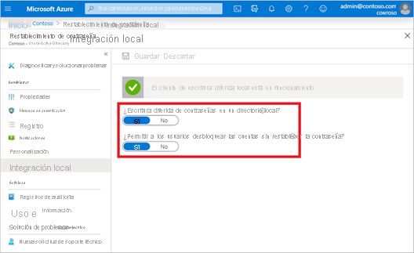

# <a name="tutorial-enable-cloud-sync-self-service-password-reset-writeback-to-an-on-premises-environment-preview"></a>Tutorial: Habilitación de la escritura diferida del autoservicio de restablecimiento de contraseña de sincronización en la nube en un entorno local (versión preliminar)

La sincronización en la nube de Azure Active Directory Connect puede sincronizar los cambios de contraseña de Azure AD en tiempo real entre los usuarios de dominios de Active Directory Domain Services (AD DS) local desconectados. La versión preliminar pública de Azure AD Connect Cloud Sync se puede ejecutar en paralelo con [Azure Active Directory Connect](tutorial-enable-sspr-writeback.md) en el nivel de dominio para simplificar la escritura diferida de contraseñas en escenarios adicionales, como los usuarios que están en dominios desconectados debido a una división o combinación de la empresa. Puede configurar cada servicio en dominios diferentes para dirigirse a distintos conjuntos de usuarios en función de sus necesidades. La sincronización en la nube de Azure Active Directory Connect usa el agente ligero de aprovisionamiento en la nube de Azure AD para simplificar la configuración de la escritura diferida del autoservicio de restablecimiento de contraseña (SSPR) y proporcionar una manera segura de enviar los cambios de contraseña en la nube de vuelta a un directorio local. 

La escritura diferida del autoservicio de restablecimiento de contraseña de Azure Active Directory Connect Cloud Sync se admite como parte de una versión preliminar pública. Para más información sobre las versiones preliminares, consulte [Términos de uso complementarios de las versiones preliminares de Microsoft Azure](https://azure.microsoft.com/support/legal/preview-supplemental-terms/).

## <a name="prerequisites"></a>Prerrequisitos 

- Un inquilino de Azure AD con al menos una licencia de Azure AD Premium P1 o de prueba habilitada. Si es preciso, [cree una cuenta gratuita](https://azure.microsoft.com/free/?WT.mc_id=A261C142F). 
- Una cuenta con cualquiera de los siguientes roles:
  - Roles de [Administrador de directivas de autenticación](../roles/permissions-reference.md#authentication-policy-administrator) y [Administrador de identidad híbrida](../roles/permissions-reference.md#hybrid-identity-administrator)
  - Rol de [Administrador global](../roles/permissions-reference.md#global-administrator) 
- Azure AD configurado para el autoservicio de restablecimiento de contraseña. Si es necesario, complete este tutorial para habilitar SSPR de Azure AD. 
- Un entorno de AD DS local configurado con la versión 1.1.587 o posterior de Azure AD Connect Cloud Sync. Si es necesario, configure Azure AD Connect Cloud Sync mediante [este tutorial](tutorial-enable-sspr.md). 
- La habilitación de la escritura diferida de contraseñas en Azure AD Connect Cloud Sync requiere la ejecución de scripts de PowerShell firmados.
  - Asegúrese de que la directiva de ejecución de PowerShell permita la ejecución de scripts. 
  - La directiva de ejecución recomendada durante la instalación es "RemoteSigned". 
  - Para más información sobre cómo establecer la directiva de ejecución de PowerShell, consulte [Set-ExecutionPolicy](/powershell/module/microsoft.powershell.security/set-executionpolicy.md?view=powershell-7.1). 


## <a name="deployment-steps"></a>Pasos de implementación

1. [Configuración de los permisos de la cuenta del servicio de Azure AD Connect Cloud Sync](#configure-azure-ad-connect-cloud-sync-service-account-permissions)
1. [Habilitación de la escritura diferida de contraseñas en Azure AD Connect Cloud Sync](#enable-password-writeback-in-azure-ad-connect-cloud-sync)
1. [Habilitación de la escritura diferida de contraseñas para el autoservicio de restablecimiento de contraseña](#enable-password-writeback-for-sspr)
 
### <a name="configure-azure-ad-connect-cloud-sync-service-account-permissions"></a>Configuración de los permisos de la cuenta del servicio de Azure AD Connect Cloud Sync 

Los permisos para la sincronización en la nube están configurados de manera predeterminada. Si es necesario restablecer los permisos, consulte [Solución de problemas](#troubleshooting) para obtener más detalles sobre los permisos específicos necesarios para la escritura diferida de contraseñas y cómo establecerlos mediante PowerShell. 

### <a name="enable-password-writeback-in-azure-ad-connect-cloud-sync"></a>Habilitación de la escritura diferida de contraseñas en Azure AD Connect Cloud Sync

Para la versión preliminar pública, debe habilitar la escritura diferida de contraseña en Azure AD Connect Cloud Sync mediante el cmdlet Set-AADCloudSyncPasswordWritebackConfiguration y las credenciales de administrador global del inquilino: 

```powershell
Import-Module 'C:\\Program Files\\Microsoft Azure AD Connect Provisioning Agent\\Microsoft.CloudSync.Powershell.dll' 
Set-AADCloudSyncPasswordWritebackConfiguration -Enable $true -Credential $(Get-Credential)
``` 

### <a name="enable-password-writeback-for-sspr"></a>Habilitación de la escritura diferida de contraseñas para el autoservicio de restablecimiento de contraseña 

Con la escritura diferida de contraseñas habilitada en Azure AD Connect Cloud Sync, compruebe y configure el autoservicio de restablecimiento de contraseña (SSPR) de Azure AD para la escritura diferida de contraseñas. Al habilitar el autoservicio de restablecimiento de contraseña para que use la escritura diferida de contraseñas, los usuarios que cambien o restablezcan su contraseña tendrán la contraseña actualizada sincronizada de nuevo en el entorno de AD DS local. 

Para comprobar y habilitar la escritura diferida de contraseñas en SSPR, complete los pasos siguientes: 

1. Inicie sesión en Azure Portal con una cuenta de administrador global. 
1. Vaya a Azure Active Directory, haga clic en **Restablecer contraseña** y, a continuación, elija **Integración local**. 
1. Compruebe que la configuración del agente de Azure AD Connect Cloud Sync está completa.
1. Establezca **¿Quiere habilitar Escritura diferida de contraseñas en el directorio local** en **Sí**. 
1. Establezca **¿Quiere permitir que los usuarios desbloqueen las cuentas sin restablecer la contraseña?** en **Sí**.
   
   

1. Cuando esté preparado, seleccione **Guardar**. 

## <a name="clean-up-resources"></a>Limpieza de recursos

Si decide que ya no desea utilizar la funcionalidad de escritura diferida de contraseñas del autoservicio de restablecimiento de contraseña que se ha configurado como parte de este documento, realice los siguientes pasos: 

1. Inicie sesión en Azure Portal con una cuenta de administrador global. 
1. Busque y seleccione Azure Active Directory, seleccione **Restablecimiento de contraseña** y, después, elija **Integración local**. 
1. Establezca **¿Quiere habilitar Escritura diferida de contraseñas en el directorio local** en **No**. 
1. Establezca **¿Quiere permitir que los usuarios desbloqueen las cuentas sin restablecer la contraseña?** en **No**. 

Desde Azure AD Connect Cloud Sync, ejecute `Set-AADCloudSyncPasswordWritebackConfiguration` con credenciales de administrador global para deshabilitar la escritura diferida de contraseñas con Azure AD Connect Cloud Sync. 

```powershell
Import-Module ‘C:\\Program Files\\Microsoft Azure AD Connect Provisioning Agent\\Microsoft.CloudSync.Powershell.dll’ 
Set-AADCloudSyncPasswordWritebackConfiguration -Enable $false -Credential $(Get-Credential)
```

## <a name="supported-operations"></a>Operaciones compatibles

Las contraseñas se reescriben en las siguientes situaciones para los usuarios finales y los administradores.


| Cuenta        | Operaciones compatibles | 
|----------------|------------------------|
| Usuarios finales      |  Cualquier operación voluntaria de autoservicio de cambio de contraseña del usuario final.<br>Cualquier operación obligatoria de autoservicio de cambio de contraseña del usuario final (por ejemplo, la expiración de la contraseña).<br>Cualquier operación de autoservicio de restablecimiento de contraseña del usuario final que se origina en el portal de restablecimiento de contraseñas. |
| Administradores |  Cualquier operación voluntaria de autoservicio de cambio de contraseña del administrador.<br>Cualquier operación obligatoria de autoservicio de cambio de contraseña del administrador (por ejemplo, la expiración de la contraseña).<br>Cualquier operación de autoservicio de restablecimiento de contraseña del administrador que se origina en el portal de restablecimiento de contraseñas.<br> Cualquier operación de restablecimiento de contraseña del usuario final iniciada por el administrador desde Azure Portal.<br>Cualquier operación de restablecimiento de contraseña del usuario final que inicie el administrador desde API de Microsoft Graph.                       |

## <a name="unsupported-operations"></a>Operaciones no admitidas

Las contraseñas no se vuelven a escribir en ninguna de las situaciones siguientes.

| Cuenta        | Operaciones no admitidas | 
|----------------|------------------------|
| Usuarios finales      | Cualquier usuario final que restablezca su propia contraseña mediante cmdlets de PowerShell o Microsoft Graph API.                        |
| Administradores | Cualquier restablecimiento de contraseña de usuario final iniciado por el administrador mediante cmdlets de PowerShell.<br>Cualquier operación de restablecimiento de contraseña del usuario final que inicie el administrador desde el Centro de administración de Microsoft 365.<br>Ningún administrador puede usar la herramienta de restablecimiento de contraseña para restablecer su propia contraseña, así como ningún otro administrador de Azure AD para la escritura diferida de contraseñas.                        |

## <a name="validation-scenarios"></a>Escenarios de validación

Pruebe las siguientes operaciones para validar escenarios mediante la escritura diferida de contraseñas. Todos los escenarios de validación requieren que la sincronización en la nube esté instalada y que el usuario esté en el ámbito de la escritura diferida de contraseñas.  


|Escenario|Detalles |
|--------|--------|
| Restablecimiento de contraseña desde la página de inicio de sesión | Haga que dos usuarios de dominios y bosques desconectados realicen SSPR. También podría tener Azure AD Connect y la sincronización en la nube implementados en paralelo, así como un usuario en el ámbito de la configuración de sincronización en la nube y otro en el ámbito de Azure AD Connect y hacer que restablezcan su contraseña. |
| Forzado del cambio de contraseña expirada | Haga que dos usuarios de dominios y bosques desconectados cambien las contraseñas expiradas. También podría tener Azure AD Connect y la sincronización en la nube implementados en paralelo, así como un usuario en el ámbito de la configuración de sincronización en la nube y otro en el ámbito de Azure AD Connect. |
| Cambio de contraseña normal | Haga que dos usuarios de dominios y bosques desconectados realicen un cambio de contraseña rutinario. También podría tener Azure AD Connect y la sincronización en la nube en paralelo, así como un usuario en el ámbito de la configuración de sincronización en la nube y otro en el ámbito de Azure AD Connect.  |
| Administración del restablecimiento de contraseña de usuario | Haga que dos usuarios de dominios y bosques desconectados restablezcan su contraseña desde el Portal de administración de Azure o el portal de trabajo de Frontline. También podría tener Azure AD Connect y la sincronización en la nube en paralelo, así como un usuario en el ámbito de la configuración de sincronización en la nube y otro en el ámbito de Azure AD Connect.  |
| Desbloqueo de cuentas de autoservicio | Haga que dos usuarios de dominios y bosques desconectados desbloqueen cuentas en el portal de SSPR y restablezcan la contraseña. También podría tener Azure AD Connect y la sincronización en la nube en paralelo, así como un usuario en el ámbito de la configuración de sincronización en la nube y otro en el ámbito de Azure AD Connect. |

## <a name="troubleshooting"></a>Solución de problemas

La cuenta de servicio administrado de Azure AD Connect Cloud Sync debe tener los permisos siguientes establecidos para reescribir contraseñas de manera predeterminada: 

- Restablecimiento de contraseña
- Permisos de escritura en lockoutTime
- Permisos de escritura en pwdLastSet
- Derechos extendidos para "Contraseña no expirada" en el objeto raíz de cada dominio de ese bosque, si aún no se ha establecido. 

Si no se establecen estos permisos, puede establecer el permiso PasswordWriteBack en la cuenta de servicio mediante el cmdlet Set-AADCloudSyncPermissions y las credenciales de administrador de empresa local: 

```powershell
Import-Module ‘C:\\Program Files\\Microsoft Azure AD Connect Provisioning Agent\\Microsoft.CloudSync.Powershell.dll’ 
Set-AADCloudSyncPermissions -PermissionType PasswordWriteBack -EACredential $(Get-Credential)
```

Después de actualizar los permisos, pueden tardar una hora (o más) en replicarse en todos los objetos del directorio. 

Si no asigna estos permisos, la escritura diferida puede parecer estar configurada correctamente, pero los usuarios encuentran errores al intentar actualizar sus contraseñas locales desde la nube. Para que aparezca "contraseña sin expiración", los permisos deben aplicarse a "Este objeto y todos los descendientes". 

Si las contraseñas de algunas cuentas de usuario no se escriben de nuevo en el directorio local, asegúrese de que la herencia no esté deshabilitada para la cuenta en el entorno de AD DS local. Los permisos de escritura para las contraseñas se deben aplicar a los objetos descendientes para que la característica funcione correctamente. 

Las directivas de contraseñas en el entorno de AD DS local pueden impedir que se procesen correctamente los restablecimientos de contraseña. Si va a probar esta característica y desea restablecer la contraseña de los usuarios más de una vez al día, la directiva de grupo de Vigencia mínima de la contraseña debe establecerse en 0. Esta configuración se puede encontrar en Configuración del equipo > Directivas > Configuración de Windows > Configuración de seguridad > Directivas de cuenta en gpmc.msc. 

Si actualiza la directiva de grupo, espere a que la directiva actualizada se replique o use el comando gpupdate /force. 

Para que las contraseñas se cambien inmediatamente, la vigencia mínima de la contraseña debe establecerse en 0. Sin embargo, si los usuarios se adhieren a las directivas locales y el campo Vigencia mínima de la contraseña se establece en un valor mayor que cero, la escritura diferida de contraseñas no funcionará después de que se evalúen las directivas locales. 

Para obtener más información sobre cómo validar o configurar los permisos adecuados, vea [Configuración de permisos de cuenta para Azure AD Connect](tutorial-enable-sspr-writeback.md#configure-account-permissions-for-azure-ad-connect). 

## <a name="next-steps"></a>Pasos siguientes

- Para obtener más información sobre la sincronización en la nube y una comparación entre Azure AD Connect y la sincronización en la nube, consulte [¿Qué es Azure AD Connect Cloud Sync?](../cloud-sync/what-is-cloud-sync.md)
- Para obtener un tutorial sobre cómo configurar la escritura diferida de contraseñas de Azure AD Connect mediante Azure AD Connect, consulte [Tutorial: Habilitación de la escritura diferida del autoservicio de restablecimiento de contraseña de Azure Active Directory en un entorno local](tutorial-enable-sspr-writeback.md).
