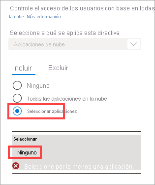

# Tutorial: Aplicación de la autenticación multifactor para usuarios invitados de B2B

Al colaborar con los usuarios externos invitados de B2B, es una buena idea proteger sus aplicaciones con directivas de autenticación multifactor (MFA). Después, los usuarios externos necesitarán más de un nombre de usuario y una contraseña para acceder a los recursos. En Azure Active Directory (Azure AD), puede lograr este objetivo con una directiva de acceso condicional que precisa de MFA para el acceso. Las directivas de MFA se pueden exigir en el nivel de inquilino, aplicación o usuario invitado individual, del mismo modo que pueden habilitarse para miembros de la organización.

Ejemplo:

1. Un administrador o un empleado de la empresa A invita a un usuario invitado para usar una aplicación local o en la nube que está configurada para requerir MFA para el acceso.
1. El usuario invitado inicia sesión con su identidad profesional, educativa o social.
1. Al usuario se le pide que complete un desafío de MFA. 
1. El usuario configura su MFA con la empresa A y elegir su opción de MFA. El usuario puede tener acceso a la aplicación.

En este tutorial, aprenderá lo siguiente:

> [!div class="checklist"]
> - Probar la experiencia de inicio de sesión antes de la configuración de MFA.
> - Crear una directiva de acceso condicional que requiere MFA para acceder a una aplicación en la nube en su entorno. En este tutorial, vamos a usar la aplicación de administración de Microsoft Azure para ilustrar el proceso.
> - Use la herramienta What If para simular el inicio de sesión con MFA.
> - Pruebe la directiva de acceso condicional.
> - Limpie el usuario de prueba y la directiva.

Si no tiene una suscripción a Azure, cree una [cuenta gratuita](https://azure.microsoft.com/free/?WT.mc_id=A261C142F) antes de empezar.

## Requisitos previos

Para completar el escenario de este tutorial, necesita:

- **Acceder a la edición Azure AD Premium**, que incluye funcionalidades de directiva de acceso condicional. Para exigir MFA, debe crear una directiva de acceso condicional de Azure AD. Tenga en cuenta que siempre se aplican directivas de MFA en su organización, independientemente de si el asociado tiene funcionalidades de MFA.
- **Una cuenta válida de correo electrónico externa** que puede agregar a su directorio de inquilino como un usuario invitado y usarla para iniciar sesión. Si no sabe cómo crear una cuenta de invitado, vea [Incorporación de usuarios de colaboración B2B de Azure Active Directory en Azure Portal](add-users-administrator.md).

## Creación de un usuario invitado de prueba en Azure AD

1. Inicie sesión en [Azure Portal](https://portal.azure.com/) como administrador de Azure AD.
1. En Azure Portal, seleccione **Azure Active Directory**.
1. En el menú de la izquierda, en **Administrar**, seleccione **Usuarios**.
1. Seleccione **Nuevo usuario invitado**.

    

1. En **Identidad**, escriba la dirección de correo electrónico del usuario externo. Opcionalmente, incluya un nombre y un mensaje de bienvenida.

    

1. Seleccione **Invitar** para enviar automáticamente la invitación al usuario invitado. Aparece un mensaje **Usuario invitado correctamente**.
1. Después de enviar la invitación, la cuenta de usuario se agrega automáticamente al directorio como invitado.

## Probar la experiencia de inicio de sesión antes de la configuración de MFA

1. Use la contraseña y el nombre de usuario invitado para iniciar sesión en [Azure Portal](https://portal.azure.com/).
1. Tenga en cuenta que podrá acceder a Azure Portal solo con sus credenciales de inicio de sesión. No se requiere la autenticación adicional.
1. Cierre la sesión.

## Creación de una directiva de acceso condicional que requiere MFA

1. Inicie sesión en [Azure Portal](https://portal.azure.com/) como administrador de seguridad o administrador de acceso condicional.
1. En Azure Portal, seleccione **Azure Active Directory**.
1. En el menú de la izquierda, en **Administrar**, seleccione **Seguridad**.
1. En **Proteger**, seleccione **Acceso condicional**.
1. En la página **Acceso condicional**, en la barra de herramientas de la parte superior, seleccione **Nueva directiva**.
1. En la página **Nuevo**, en el cuadro de texto **Nombre**, escriba **Requerir MFA para acceder al portal de B2B**.
1. En la sección **Asignaciones**, elija el vínculo situado en **Usuarios y grupos**.
1. En la página **Usuarios y grupos**, elija **Seleccionar usuarios y grupos** y luego elija **Todos los usuarios externos e invitados**.

    
1. En la sección **Asignaciones**, elija el vínculo situado en **Aplicaciones en la nube o acciones**.
1. Elija **Seleccionar aplicaciones** y, a continuación, elija el vínculo situado en **Seleccionar**.

    

1.  En la página **Seleccionar**, elija **Administración de Microsoft Azure** y después haga clic en **Seleccionar**.

    

1.  En la página **Nuevo**, en la sección **Controles de acceso**, seleccione el vínculo situado en **Conceder**.
1.  En la página **Conceder**, elija **Conceder acceso**, marque la casilla **Requerir autenticación multifactor** y luego haga clic en **Seleccionar**.

    

1.  En **Habilitar directiva**, seleccione **Activar**.

    

1.  Seleccione **Crear**.

## Uso de la opción What If para simular el inicio de sesión

1. En la página **Acceso condicional | Directivas**, seleccione **What If**.

    

1. Seleccione el vínculo situado en **Usuario**. 
1. En el cuadro de búsqueda, escriba el nombre del usuario invitado de prueba. En los resultados de la búsqueda, elija el usuario y, a continuación, **Seleccionar**.

    

1. Seleccione el vínculo situado en **Cloud apps, actions, or authentication content** (Aplicaciones en la nube, acciones o contenido de autenticación). . Elija **Seleccionar aplicaciones** y, a continuación, elija el vínculo situado en **Seleccionar**.

    

1. En la página **Aplicaciones en la nube**, en la lista de aplicaciones, elija **Administración de Microsoft Azure** y, a continuación, elija **Seleccionar**.
1. Elija **What If** y compruebe que la nueva directiva aparezca en **Resultados de la evaluación** en la pestaña **Directivas que se aplicarán**.

    

## Prueba de la directiva de acceso condicional

1. Use la contraseña y el nombre de usuario invitado para iniciar sesión en [Azure Portal](https://portal.azure.com/).
1. Debería ver una solicitud para los métodos de autenticación adicionales. Tenga en cuenta que la directiva puede tardar algún tiempo en aplicarse.

    

1. Cierre la sesión.

## Limpieza de recursos

Cuando ya no sean necesarios, elimine el usuario de prueba y la directiva de acceso condicional de prueba.

1. Inicie sesión en [Azure Portal](https://portal.azure.com/) como administrador de Azure AD.
1. En el panel izquierdo, seleccione **Azure Active Directory**.
1. En **Administrar**, seleccione **Usuarios**.
1. Seleccione el usuario de prueba y después **Eliminar usuario**.
1. En el panel izquierdo, seleccione **Azure Active Directory**.
1. En **Seguridad**, seleccione **Acceso condicional**.
1. En la lista **Nombre de la directiva**, seleccione el menú contextual (…) de la directiva de prueba y después seleccione **Eliminar**. Seleccione **Sí** para confirmar la acción.

## Pasos siguientes

En este tutorial, ha creado una directiva de acceso condicional que requiere que los usuarios invitados usen MFA al iniciar sesión en una de las aplicaciones en la nube. Para más información sobre cómo agregar usuarios invitados para la colaboración, vea [Incorporación de usuarios de colaboración B2B de Azure Active Directory en Azure Portal](add-users-administrator.md).
