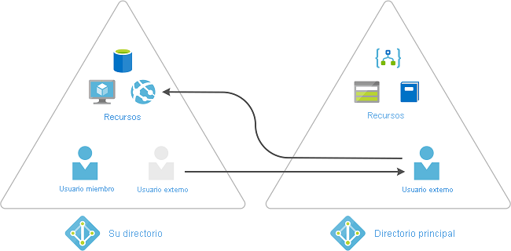

# ¿Qué es Azure AD Privileged Identity Management?

 Privileged Identity Management (PIM) es un servicio de Azure Active Directory (Azure AD) que permite administrar, controlar y supervisar el acceso a recursos importantes de la organización. Estos recursos incluyen los de Azure AD, Azure y los de otros servicios de Microsoft Online Services, como Microsoft 365 o Microsoft Intune. En el vídeo siguiente se presentan los conceptos y características importantes de PIM.
  

> [!VIDEO https://www.youtube.com/embed/f-0K7mRUPpQ]

## Motivos para su uso

Las organizaciones buscan reducir el número de personas que tienen acceso a información segura o a recursos, ya que de esta manera se reduce la posibilidad de que

- un usuario malintencionado obtengan acceso a ellos
- un usuario autorizado afecta a un recurso confidencial involuntariamente

Sin embargo, los usuarios siguen teniendo la necesidad de llevar a cabo operaciones con privilegios en aplicaciones de Azure AD, Azure, Microsoft 365 o SaaS. Las organizaciones pueden proporcionar a los usuarios acceso con privilegios cuando es necesario a los recursos de Azure y Azure AD y supervisar lo que hacen esos usuarios con su acceso con privilegios.

## Requisitos de licencia

[!INCLUDE [Azure AD Premium P2 license](../../../includes/active-directory-p2-license.md)]

Para más información sobre las licencias para usuarios, consulte [License requirements to use Privileged Identity Management](subscription-requirements.md) (Requisitos de licencia para usar Privileged Identity Management).

## ¿Para qué sirve?

Privileged Identity Management proporciona activación de rol basada en tiempo y en aprobación para mitigar los riesgos de tener unos permisos de acceso excesivos, innecesarios o mal utilizados en los recursos que le interesan. Estas son algunas de las características clave de Privileged Identity Management:

- Conceda privilegios de acceso **Just-In-Time** a Azure AD y a los recursos de Azure
- Asigne acceso **limitado** a los recursos con fechas de inicio y fin
- Requiera **aprobación** para activar los roles con privilegios
- Aplique la **autenticación multifactor** para activar cualquier rol
- Use la **justificación** para comprender por qué se activan los usuarios
- Obtenga **notificaciones** cuando se activan los roles con privilegios
- Lleve a cabo **revisiones de acceso** para asegurarse de que los usuarios siguen necesitando roles
- Descargue el **historial de auditoría** para la auditoría interna o externa
- Impide la eliminación de la **última asignación de roles de administrador global activa**

## ¿Qué se puede hacer con Privileged Identity Management (PIM)?

Una vez que se haya configurado Privileged Identity Management, verá las opciones **Tareas**, **Administrar**, y **Actividad** en el menú de navegación izquierdo. Como administrador, tendrá que elegir entre distintas opciones, como administrar **roles de Azure AD**, administrar roles de **recursos de Azure** o grupos de acceso con privilegios. Cuando elija lo que desea administrar, verá el conjunto de opciones adecuado para esa opción.

## ¿Quién puede realizar cada tarea en PIM?

En el caso de los roles de Azure AD en Privileged Identity Management, los usuarios que tengan el rol Administrador de roles con privilegios o el rol Administrador global son los únicos que pueden administrar las asignaciones de otros administradores. Los administradores globales, administradores de seguridad, lectores globales y lectores de seguridad pueden ver también las asignaciones de roles de Azure AD en Privileged Identity Management.

En el caso de los roles de los recursos de Azure en Privileged Identity Management, los únicos que pueden administrar asignaciones para los demás administradores son los administradores de suscripciones, los propietarios de los recursos o los administradores de acceso de usuario de los recursos. De forma predeterminada, los usuarios que son administradores de roles con privilegios, administradores de seguridad o lectores de seguridad no tienen acceso para ver asignaciones a roles de recursos de Azure en Privileged Identity Management.

## Terminología

Para conocer mejor Privileged Identity Management y su documentación, debe revisar los términos siguientes.

| Término o concepto | Categoría de asignación de roles | Descripción |
| --- | --- | --- |
| Apto | Tipo | Asignación de roles que requiere que un usuario realice una o varias acciones para usar el rol. Si un usuario es apto para un rol, eso significa que puede activarlo cuando necesite para realizar tareas con privilegios. No hay ninguna diferencia en el acceso proporcionado de forma permanente a una persona o una asignación de roles aptos. La única diferencia es que algunas personas no necesitan ese acceso todo el tiempo. |
| active | Tipo | Asignación de roles que no requiere que el usuario realice ninguna acción para usar el rol. Los usuarios asignados como activos tienen privilegios asignados al rol. |
| activar |  | Proceso de realizar una o varias acciones para usar un rol para el que es apto un usuario. Entre las acciones se puede incluir realizar una comprobación de autenticación multifactor (MFA), proporcionar una justificación de negocios o solicitar la aprobación de los aprobadores designados. |
| asignado | State | Usuario que tiene una asignación de roles activa. |
| activado | State | Usuario con una asignación de roles apta, que ha realizado las acciones necesarias para activar el rol y ahora está activo. Una vez activado, el usuario puede utilizar el rol durante un período preconfigurado de tiempo antes de tener que volver a activarlo. |
| apto permanente | Duration | Asignación de roles en la que un usuario siempre es apto para activar el rol. |
| activo permanente | Duration | Asignación de roles en la que un usuario siempre puede usar el rol, sin realizar ninguna acción. |
| apto temporal | Duration | Asignación de roles en la que un usuario es apto para activar el rol solo dentro de un intervalo entre una fecha de inicio y otra de finalización. |
| activo temporal | Duration | Asignación de roles en la que un usuario puede usar el rol solo dentro de un intervalo entre una fecha de inicio y otra de finalización. |
| Acceso Just-In-Time (JIT) |  | Modelo en el que los usuarios reciben permisos temporales para realizar tareas con privilegios, lo que impide que usuarios malintencionados o sin autorización obtengan acceso después de que el permiso haya expirado. El acceso se concede solo cuando los usuarios lo necesitan. |
| Principio de acceso con privilegios mínimos |  | Una práctica de seguridad recomendada en la que se proporcionan a todos los usuarios únicamente los privilegios mínimos necesarios para realizar las tareas que están autorizados a realizar. Esta práctica minimiza el número de administradores globales, ya que en su lugar utiliza roles de administrador específicos para determinados escenarios. |

## Extensión y renovación de asignaciones

Después de configurar las asignaciones de miembros o propietarios con límite de tiempo, la primera pregunta que podría surgir es qué sucede si una asignación expira. En esta nueva versión, se proporcionan dos opciones para este escenario:

- Extensión: cuando una asignación de roles está a punto de expirar, el usuario puede usar Privileged Identity Management para solicitar una extensión.
- Renovación: cuando una asignación de roles ya ha expirado, el usuario puede usar Privileged Identity Management para solicitar una renovación.

Ambas acciones iniciadas por el usuario requieren una aprobación de un Administrador global o un Administrador de roles con privilegios. Los administradores no necesitan estar en el negocio de administrar las expiraciones de las asignaciones. Puede simplemente esperar a que lleguen las solicitudes de extensión o renovación para la aprobación o denegación.

## Escenarios

Privileged Identity Management admite los siguientes escenarios:

### Permisos de administrador de roles con privilegios

- Habilitar la aprobación de roles específicos
- Especificar usuarios y grupos de aprobadores para la aprobación de solicitudes
- Ver el historial de solicitudes y aprobaciones de todos los roles con privilegios

### Permisos de aprobador

- Ver aprobaciones o solicitudes pendientes
- Aprobar o rechazar solicitudes de elevación de rol (de forma individual o masiva)
- Proporcionar una justificación de la aprobación o el rechazo

### Permisos de usuario de rol válidos

- Solicitar la activación de un rol que requiere aprobación
- Ver el estado de la solicitud de activación
- Completar la tarea en Azure AD si la activación se ha aprobado

## Administración de grupos de Azure AD de acceso con privilegios (versión preliminar)

En Privileged Identity Management (PIM), ya se pueden asignar la idoneidad para pertenecer a grupos de acceso con privilegios o poseerlos. A partir de esta versión preliminar, es posible asignar roles integrados de Azure Active Directory (Azure AD) a grupos en la nube y usar PIM para administrar la idoneidad y la activación tanto de los propietarios como de los miembros de los grupos. Para más información sobre los grupos de roles asignables en Azure AD, consulte [Uso de grupos de Azure AD para administrar las asignaciones de roles](../roles/groups-concept.md).

>[!Important]
> Para asignar un grupo de acceso con privilegios a un rol para el acceso administrativo a Exchange, Centro de seguridad y cumplimiento, o SharePoint, use la experiencia **Roles y administradores** del portal de Azure AD y no de la experiencia Grupos de acceso con privilegios para que el usuario o el grupo sean válidos para la activación en el grupo.

### Diferentes directivas Just-In-Time para cada grupo

Algunas organizaciones usan herramientas, como la colaboración B2B de Azure AD, para invitar a sus asociados a su organización de Azure AD. En lugar de crear una única directiva cuando es necesario para todas las asignaciones a un rol con privilegios, se pueden crear dos grupos de acceso con privilegios diferentes con sus propias directivas. Puede exigir requisitos menos estrictos para los empleados de confianza y más estrictos para los asociados, como el flujo de trabajo de aprobación, cuando solicitan la activación en su grupo asignado.

### Activación de varias asignaciones de roles en una solicitud

Con la versión preliminar de los grupos de acceso con privilegios, puede proporcionar a los administradores específicos de las cargas de trabajo un acceso rápido a varios roles con una única solicitud cuando es necesario. Por ejemplo, es posible que unos administradores de Office de nivel 3 necesiten acceso cuando es necesario a los roles Administrador de Exchange, Administrador de aplicaciones de Office, Administrador de Teams y Administrador de Search para investigar los incidentes que se producen a diario. Antes se necesitarían cuatro solicitudes consecutivas, lo que conlleva un proceso que tarda un tiempo en realizarse. En su lugar, se puede crear un grupo, al que se pueden asignar roles, llamado “Administradores de Office de nivel 3”, asignarlo a los cuatro roles que hemos mencionado (o a cualquier rol integrado de Azure AD) y habilitarlo para un acceso con privilegios en la sesión Actividad del grupo. Una vez habilitado para el acceso con privilegios, puede configurar el acceso cuando es necesario de los miembros del grupo y asignar los administradores y propietarios como aptos. Cuando se eleven los privilegios de los administradores en el grupo, se convertirán en miembros de los cuatro roles de Azure AD.

## Invite a usuarios invitados y asigne roles de recursos de Azure en Privileged Identity Management

Los usuarios invitados de Azure Active Directory (Azure AD) forman parte de las funcionalidades de colaboración negocio a negocio (B2B) dentro de Azure AD para que pueda administrar los usuarios y proveedores de invitados externos como invitados en Azure AD. Por ejemplo, puede usar estas características de Privileged Identity Management para las tareas de identidad de Azure con invitados, como asignar acceso a recursos específicos de Azure, especificar la duración de la asignación y la fecha de finalización, o requerir la verificación en dos pasos en la asignación o activación activas. Para obtener más información sobre cómo invitar a un invitado a su organización y administrar su acceso, vea [Agregar usuarios de colaboración B2B en el portal de Azure AD](../external-identities/add-users-administrator.md).

### ¿Cuándo invitaría a invitados?

Estos son algunos ejemplos de cuándo se pueden invitar a los invitados a su organización:

- Permitir que un proveedor externo por cuenta propia que solo tiene una cuenta de correo electrónico acceda a los recursos de Azure para la realización de un proyecto
- Permitir que a un asociado externo de una gran organización que usa Servicios de federación de Active Directory (AD FS) locales acceda a la aplicación de gastos
- Permitir que los ingenieros del servicio de soporte técnico que no están en su organización (por ejemplo, el soporte técnico de Microsoft) accedan temporalmente a los recursos de Azure para solucionar problemas

### ¿Cómo funciona la colaboración mediante invitados B2B?

Al usar la colaboración B2B, puede invitar a un usuario externo a su organización como invitado. El invitado puede administrarse como un usuario de la organización, pero un invitado debe estar autenticado en su organización principal y no en la organización de Azure AD. Esto significa que, si el invitado ya no tiene acceso a su organización principal, también perderá el acceso a su organización. Por ejemplo, si el invitado abandona la organización, automáticamente pierde acceso a los recursos compartidos con él en Azure AD sin necesidad de hacer nada. Para más información sobre la colaboración B2B, consulte [¿Qué es el acceso de usuarios invitados en Azure Active Directory B2B?](../external-identities/what-is-b2b.md).

## Pasos siguientes

- [Requisitos de licencia para usar Privileged Identity Management](subscription-requirements.md)
- [Protección del acceso con privilegios para las implementaciones híbridas y en la nube en Azure AD](../roles/security-planning.md?toc=%2fazure%2factive-directory%2fprivileged-identity-management%2ftoc.json)
- [Implementación de Privileged Identity Management](pim-deployment-plan.md)
