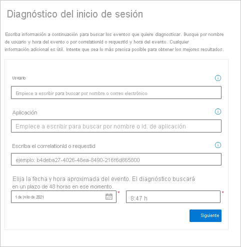
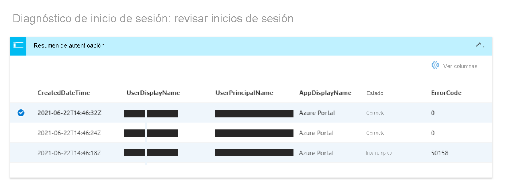
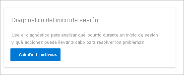
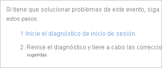

# ¿Qué es el diagnóstico de inicio de sesión en Azure AD?

Determinar el motivo de un inicio de sesión con errores puede convertirse rápidamente en una tarea complicada. Para resolver el problema, debe analizar lo que ha ocurrido durante el intento de inicio de sesión e investigar las recomendaciones disponibles. Lo ideal podría ser resolver el problema sin implicar a otros usuarios, como el soporte técnico de Microsoft. Si se encuentra en una situación como esta, puede usar el diagnóstico de inicios de sesión en Azure AD, que es una herramienta que le ayuda a investigar los inicios de sesión en Azure AD. 

En este artículo se proporciona información general sobre qué es el diagnóstico y cómo se puede usar para solucionar errores relacionados con el inicio de sesión. 

## Cómo funciona  

En Azure AD, los intentos de inicio de sesión se controlan mediante:

- **Quién**: el usuario que realiza un intento de inicio de sesión.
- **Cómo**: cómo se realizó un intento de inicio de sesión.

Por ejemplo, puede configurar directivas de acceso condicional que permitan a los administradores configurar todos los aspectos del inquilino cuando inician sesión desde la red corporativa. Sin embargo, el mismo usuario podría estar bloqueado cuando inicia sesión en la misma cuenta desde una red que no es de confianza. 

Dada la mayor flexibilidad del sistema para responder a un intento de inicio de sesión, podría acabar en escenarios en los que tenga que solucionar problemas de inicios de sesión. El diagnóstico de inicio de sesión es una herramienta diseñada para habilitar el autodiagnóstico de los problemas de inicio de sesión mediante las siguientes operaciones:  

- Analizar datos de los eventos de inicio de sesión.  

- Mostrar información de lo que ha ocurrido.  

- Proporcionar recomendaciones para resolver problemas.  

Para iniciar y completar el proceso de diagnóstico, es preciso:   

1. **Identificar evento**: escriba información sobre el evento de inicio de sesión. 

2. **Seleccionar evento**: seleccione un evento en función de la información compartida. 

3. **Tomar medidas**: revise los resultados del diagnóstico y dé los pasos necesarios.

### Identificar evento 

Para identificar los eventos adecuados, puede filtrarlos en función de las siguientes opciones:

- Nombre del usuario
- Application 
- Identificador de correlación o identificador. de solicitud 
- Fecha y hora

### Seleccionar evento  

En función de los criterios de búsqueda, Azure AD recupera todos los eventos de inicio de sesión coincidentes y los presenta en una vista de lista de resumen de autenticación.  

Puede cambiar el contenido que se muestra en las columnas para ajustarlo a sus preferencias. Algunos ejemplos son:

- Detalle del riesgo
- Estado de acceso condicional
- Location
- Id. de recurso
- Tipo de usuario
- Detalles de la autenticación

### Realizar acción

En el caso del evento de inicio de sesión seleccionado, se obtienen los resultados de un diagnóstico. Lea los resultados para identificar las acciones que puede realizar para corregir el problema. Estos resultados agregan los pasos recomendados y arrojan luz sobre información relevante, como las directivas relacionadas, los detalles de inicio de sesión y la documentación de apoyo. Como no siempre es posible resolver problemas sin ayuda adicional, un paso recomendado podría ser abrir una incidencia de soporte técnico. 

## Acceso

Para usar el diagnóstico, debe haber iniciado sesión en el inquilino como administrador global o lector global. Si no tiene este nivel de acceso, use [Privileged Identity Management, PIM](../privileged-identity-management/pim-resource-roles-activate-your-roles.md), para elevar el acceso a administrador o lector globales dentro del inquilino. Esto le permitirá tener acceso temporal al diagnóstico.  

Con el nivel de acceso correcto, puede encontrar el diagnóstico en varios lugares: 

**Opción A**: diagnóstico y solución de problemas 

1. Abra **Azure Active Directory o el acceso condicional a Azure AD**. 

2. En el menú principal, haga clic en **Diagnosticar y solucionar problemas**.  

3. En **Solucionadores de problemas**, hay un icono de diagnóstico de inicios de sesión. 

4. Haga clic en el botón **Solucionar problemas**.  

 

 

**Opción B**: eventos de inicio de sesión 

1. Abra Azure Active Directory. 

2. En el menú principal, en la sección **Supervisión**, seleccione **Inicios de sesión**. 

3. En la lista de inicios de sesión, seleccione alguno cuyo estado sea **Error**. Puede filtrar la lista por estado para facilitar la búsqueda de inicios de sesión con errores. 

4. Se abrirá la pestaña **Detalles de actividad: Inicios de sesión** del inicio de sesión seleccionado. Haga clic en el icono de puntos para ver más iconos de menú. Seleccione la pestaña **Solución de problemas y soporte técnico**. 

5. Haga clic en el vínculo para **iniciar el diagnóstico de inicios de sesión**. 

 

**Opción C**: caso de soporte técnico 

El diagnóstico también se puede encontrar al crear un caso de soporte técnico para ofrecerle la oportunidad de realizar un autodiagnóstico antes de recurrir al envío de un caso. 

## Pasos siguientes

- [Diagnósticos de inicios de sesión para escenarios de Azure AD](concept-sign-in-diagnostics-scenarios.md)
