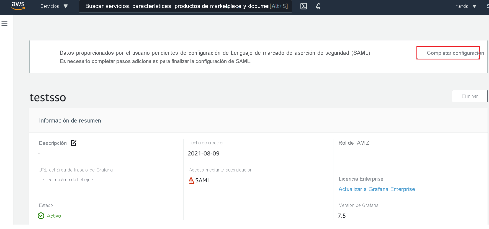

# Tutorial: Integración del inicio de sesión único (SSO) de Azure Active Directory con Amazon Managed Grafana

En este tutorial, aprenderá a integrar Amazon Managed Grafana con Azure Active Directory (Azure AD). Al integrar Amazon Managed Grafana con Azure AD, puede:

* Controlar en Azure AD quién tiene acceso a Amazon Managed Grafana.
* Permitir que los usuarios puedan iniciar sesión automáticamente en Amazon Managed Grafana con sus cuentas de Azure AD.
* Administrar las cuentas desde una ubicación central (Azure Portal).

## Requisitos previos

Para empezar, necesita los siguientes elementos:

* Una suscripción de Azure AD. Si no tiene una suscripción, puede crear una [cuenta gratuita](https://azure.microsoft.com/free/).
* Una [cuenta gratuita](https://aws.amazon.com/free/) de Amazon Web Services (AWS).
* Una suscripción habilitada para el inicio de sesión único (SSO) en Amazon Managed Grafana.

## Descripción del escenario

En este tutorial, va a configurar y probar el inicio de sesión único de Azure AD en un entorno de prueba.

* Amazon Managed Grafana admite el inicio de sesión único iniciado por **SP**.
* Amazon Managed Grafana admite el aprovisionamiento de usuarios **Just-In-Time**.

## Adición de Amazon Managed Grafana desde la galería

Para configurar la integración de Amazon Managed Grafana en Azure AD, es preciso agregar Amazon Managed Grafana desde la galería a la lista de aplicaciones SaaS administradas.

1. Inicie sesión en Azure Portal con una cuenta personal, profesional o educativa de Microsoft.
1. En el panel de navegación de la izquierda, seleccione el servicio **Azure Active Directory**.
1. Vaya a **Aplicaciones empresariales** y seleccione **Todas las aplicaciones**.
1. Para agregar una nueva aplicación, seleccione **Nueva aplicación**.
1. En la sección **Agregar desde la galería**, escriba **Amazon Managed Grafana** en el cuadro de búsqueda.
1. Seleccione **Amazon Managed Grafana** en el panel de resultados y, luego, agregue la aplicación. Espere unos segundos mientras la aplicación se agrega al inquilino.

## Configuración y prueba del inicio de sesión único de Azure AD para Amazon Managed Grafana

Configure y pruebe el inicio de sesión único de Azure AD con Amazon Managed Grafana mediante un usuario de prueba llamado **B.Simon**. Para que el inicio de sesión único funcione, es necesario establecer una relación de vinculación entre un usuario de Azure AD y el usuario relacionado de Amazon Managed Grafana.

Para configurar el inicio de sesión único de Azure AD con Amazon Managed Grafana, siga estos pasos:

1. **[Configuración del inicio de sesión único de Azure AD](#configure-azure-ad-sso)** , para permitir que los usuarios puedan utilizar esta característica.
    1. **[Creación de un usuario de prueba de Azure AD](#create-an-azure-ad-test-user)** , para probar el inicio de sesión único de Azure AD con B.Simon.
    1. **[Asignación del usuario de prueba de Azure AD](#assign-the-azure-ad-test-user)** , para habilitar a B.Simon para que use el inicio de sesión único de Azure AD.
1. **[Configuración del inicio de sesión único en Amazon Managed Grafana](#configure-amazon-managed-grafana-sso)** : para configurar los valores de inicio de sesión único en la aplicación.
    1. **[Creación de un usuario de prueba de Amazon Managed Grafana](#create-amazon-managed-grafana-test-user)** : para tener un homólogo de B.Simon en Amazon Managed Grafana que esté vinculado a la representación del usuario en Azure AD.
1. **[Prueba del inicio de sesión único](#test-sso)** : para comprobar si la configuración funciona.

## Configuración del inicio de sesión único de Azure AD

Siga estos pasos para habilitar el inicio de sesión único de Azure AD en Azure Portal.

1. En Azure Portal, en la página de integración de la aplicación **Amazon Managed Grafana**, busque la sección **Administrar** y seleccione **Inicio de sesión único**.
1. En la página **Seleccione un método de inicio de sesión único**, elija **SAML**.
1. En la página **Configuración del inicio de sesión único con SAML**, haga clic en el icono de lápiz de **Configuración básica de SAML** para editar la configuración.

   

1. En la sección **Configuración básica de SAML**, siga estos pasos:

    a. En el cuadro de texto **Identificador (id. de entidad)** , escriba una dirección URL con el siguiente patrón: `https://<namespace>.grafana-workspace.<region>.amazonaws.com/saml/metadata`

    b. En el cuadro de texto **URL de inicio de sesión**, escriba una dirección URL con el siguiente patrón: `https://<namespace>.grafana-workspace.<region>.amazonaws.com/login/saml`

    > [!NOTE]
    > Estos valores no son reales. Actualice estos valores con el identificador y la dirección URL de inicio de sesión reales. Póngase en contacto con el [equipo de soporte técnico al cliente de Amazon Managed Grafana](https://aws.amazon.com/contact-us/) para obtener estos valores. También puede hacer referencia a los patrones que se muestran en la sección **Configuración básica de SAML** de Azure Portal.

1. La aplicación Amazon Managed Grafana espera las aserciones de SAML en un formato específico, que requiere que se agreguen asignaciones de atributos personalizados a la configuración de los atributos del token SAML. La siguiente captura de muestra la lista de atributos predeterminados.

    

1. Además de lo anterior, la aplicación Amazon Managed Grafana espera que se devuelvan algunos atributos más, que se muestran a continuación, en la respuesta de SAML. Estos atributos también se rellenan previamente, pero puede revisarlos según sus requisitos.
    
    | Nombre | Atributo de origen |
    | ----------| --------- |
    | DisplayName | user.displayname |
    | mail | user.userprincipalname |

1. En la página **Configurar el inicio de sesión único con SAML**, en la sección **Certificado de firma de SAML**, busque **XML de metadatos de federación** y seleccione **Descargar** para descargar el certificado y guardarlo en su equipo.

    

1. En la sección **Configurar Amazon Managed Grafana**, copie las direcciones URL adecuadas según sus necesidades.

    

### Creación de un usuario de prueba de Azure AD

En esta sección, va a crear un usuario de prueba llamado B.Simon en Azure Portal.

1. En el panel izquierdo de Azure Portal, seleccione **Azure Active Directory**, **Usuarios** y **Todos los usuarios**.
1. Seleccione **Nuevo usuario** en la parte superior de la pantalla.
1. En las propiedades del **usuario**, siga estos pasos:
   1. En el campo **Nombre**, escriba `B.Simon`.  
   1. En el campo **Nombre de usuario**, escriba username@companydomain.extension. Por ejemplo, `B.Simon@contoso.com`.
   1. Active la casilla **Show password** (Mostrar contraseña) y, después, anote el valor que se muestra en el cuadro **Contraseña**.
   1. Haga clic en **Crear**.

### Asignación del usuario de prueba de Azure AD

En esta sección, va a permitir que B.Simon acceda a Amazon Managed Grafana mediante el inicio de sesión único de Azure.

1. En Azure Portal, seleccione sucesivamente **Aplicaciones empresariales** y **Todas las aplicaciones**.
1. En la lista de aplicaciones, seleccione **Amazon Managed Grafana**.
1. En la página de información general de la aplicación, busque la sección **Administrar** y seleccione **Usuarios y grupos**.
1. Seleccione **Agregar usuario**. A continuación, en el cuadro de diálogo **Agregar asignación**, seleccione **Usuarios y grupos**.
1. En el cuadro de diálogo **Usuarios y grupos**, seleccione **B.Simon** de la lista de usuarios y haga clic en el botón **Seleccionar** de la parte inferior de la pantalla.
1. Si espera que se asigne un rol a los usuarios, puede seleccionarlo en la lista desplegable **Seleccionar un rol**. Si no se ha configurado ningún rol para esta aplicación, verá seleccionado el rol "Acceso predeterminado".
1. En el cuadro de diálogo **Agregar asignación**, haga clic en el botón **Asignar**.

## Configuración del inicio de sesión único de Amazon Managed Grafana

1. Inicie sesión en la consola de Amazon Managed Grafana como administrador.

1. Haga clic en **Crear área de trabajo**. 

    

1. En la página **Specify workspace details** (Especificar detalles del área de trabajo), escriba un valor único para el campo **Workspace name** (Nombre del área de trabajo) y haga clic en **Next** (Siguiente).

    

1. En la página **Configure settings** (Parámetros de configuración), seleccione la casilla **Security Assertion Markup Language(SAML)** (Lenguaje de marcado de aserción de seguridad [SAML]), habilite **Service managed** (Administrado por el servicio) como tipo de permiso y haga clic en **Next** (Siguiente).

    

1. En **Service managed permission settings** (Configuración de permisos administrados por el servicio), seleccione **Current account** (Cuenta actual) y haga clic en **Next** (Siguiente).

    

1. En la página **Review and create** (Revisar y crear), compruebe todos los detalles del área de trabajo y haga clic en **Create workspace** (Crear área de trabajo).

    

1. Después de crear el área de trabajo, haga clic en **Complete setup** (Completar configuración) para completar la configuración de SAML.

    

1. En la página **Security Assertion Markup Language (SAML)** (Lenguaje de marcado de aserción de seguridad [SAML]), realice los pasos siguientes.

    

    1. Copie el valor de **Service provider identifier (Entity ID)** (Identificador del proveedor de servicios [Id. de entidad]) y péguelo en el cuadro de texto **Identificador** de la sección **Configuración básica de SAML** en Azure Portal.

    1. Copie el valor de **Service provider reply URL(Assertion consumer service URL)** (Dirección URL de respuesta del proveedor de servicios [Dirección URL del Servicio de consumidor de aserciones]) y péguelo en el cuadro **URL de respuesta**, en la sección **Configuración básica de SAML** de Azure Portal.

    1. Copie el valor de **Service provider login URL** (Dirección URL de inicio de sesión del proveedor de servicios) y péguelo en el cuadro de texto **URL de respuesta** de la sección **Configuración básica de SAML** de Azure Portal.

    1. Abra el archivo **XML de metadatos de federación** descargado de Azure Portal en el Bloc de notas y cargue el archivo XML; para ello, haga clic en **Choose file** (Elegir archivo).

    1. En la sección **Assertion mapping** (Asignación de aserciones), rellene los valores necesarios según sus necesidades.

    1. Haga clic en **Save SAML Configuration** (Guardar configuración de SAML).

### Creación de un usuario de prueba de Amazon Managed Grafana

En esta sección, se crea un usuario llamado Britta Simon en Amazon Managed Grafana. Amazon Managed Grafana admite el aprovisionamiento de usuarios Just-In-Time, que está habilitado de forma predeterminada. No hay ningún elemento de acción para usted en esta sección. Si el usuario no existe aún en Amazon Managed Grafana, se crea uno después de la autenticación.

## Prueba de SSO 

En esta sección, probará la configuración de inicio de sesión único de Azure AD con las siguientes opciones. 

* Haga clic en **Probar esta aplicación** en Azure Portal. Esta acción le redirigirá a la dirección URL de inicio de sesión de Amazon Managed Grafana, donde podrá iniciar el flujo de inicio de sesión. 

* Vaya directamente a la dirección URL de inicio de sesión de Amazon Managed Grafana e inicie el flujo de inicio de sesión desde allí.

* Puede usar Mis aplicaciones de Microsoft. Al hacer clic en el icono de Amazon Managed Grafana en Aplicaciones, se le redirigirá a la dirección URL de inicio de sesión de esta aplicación. Para más información acerca de Aplicaciones, consulte [Inicio de sesión e inicio de aplicaciones desde el portal Aplicaciones](https://support.microsoft.com/account-billing/sign-in-and-start-apps-from-the-my-apps-portal-2f3b1bae-0e5a-4a86-a33e-876fbd2a4510).

## Pasos siguientes

Una vez configurado Amazon Managed Grafana, puede aplicar el control de sesión, que protege la filtración y la infiltración de la información confidencial de la organización en tiempo real. El control de sesión procede del acceso condicional. [Aprenda a aplicar el control de sesión con Microsoft Cloud App Security](/cloud-app-security/proxy-deployment-aad).