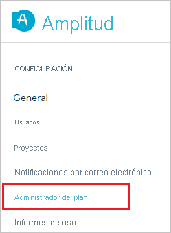
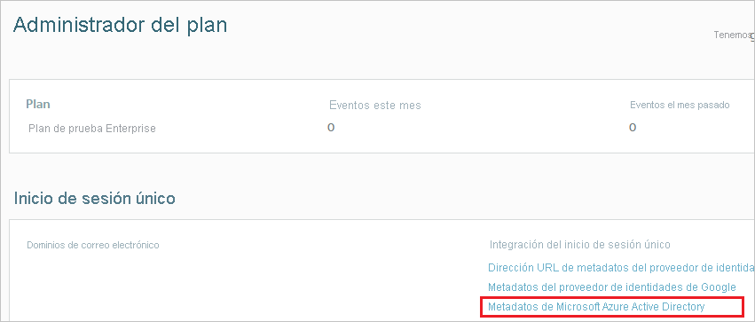
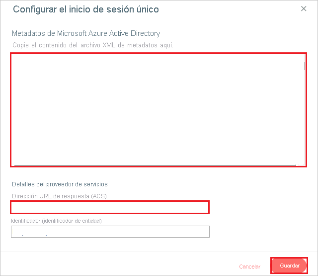

# Tutorial: Integración del inicio de sesión único (SSO) de Azure Active Directory con Amplitude

En este tutorial, aprenderá a integrar Amplitude con Azure Active Directory (Azure AD). Al integrar Amplitude con Azure AD, puede hacer lo siguiente:

* Controlar en Azure AD quién tiene acceso a Amplitude.
* Permitir que los usuarios inicien sesión automáticamente en Amplitude con sus cuentas de Azure AD.
* Administrar las cuentas desde una ubicación central (Azure Portal).

## Requisitos previos

Para empezar, necesita los siguientes elementos:

* Una suscripción de Azure AD. Si no tiene una suscripción, puede crear una [cuenta gratuita](https://azure.microsoft.com/free/).
* Una suscripción habilitada para el inicio de sesión único en Amplitude.

## Descripción del escenario

En este tutorial, va a configurar y probar el inicio de sesión único de Azure AD en un entorno de prueba.

* Amplitude admite el inicio de sesión único iniciado por **SP e IDP**.
* Amplitude admite el aprovisionamiento de usuarios **Just-In-Time**.

> [!NOTE]
> El identificador de esta aplicación es un valor de cadena fijo, por lo que solo se puede configurar una instancia en un inquilino.

## Adición de Amplitude desde la galería

Para configurar la integración de Amplitude en Azure AD, es preciso agregarlo desde la galería a la lista de aplicaciones SaaS administradas.

1. Inicie sesión en Azure Portal con una cuenta personal, profesional o educativa de Microsoft.
1. En el panel de navegación de la izquierda, seleccione el servicio **Azure Active Directory**.
1. Vaya a **Aplicaciones empresariales** y seleccione **Todas las aplicaciones**.
1. Para agregar una nueva aplicación, seleccione **Nueva aplicación**.
1. En la sección **Agregar desde la galería**, escriba **Amplitude** en el cuadro de búsqueda.
1. Seleccione **Amplitude** en el panel de resultados y agregue la aplicación. Espere unos segundos mientras la aplicación se agrega al inquilino.

## Configuración y prueba del SSO de Azure AD para Amplitude

Configure y pruebe el inicio de sesión único de Azure AD con Amplitude mediante una usuaria de prueba llamada **B.Simon**. Para que el inicio de sesión único funcione, es necesario establecer una relación de vinculación entre un usuario de Azure AD y el usuario relacionado de Amplitude.

Para configurar y probar el inicio de sesión único de Azure AD con Amplitude, siga estos pasos:

1. **[Configuración del inicio de sesión único de Azure AD](#configure-azure-ad-sso)** , para permitir que los usuarios puedan utilizar esta característica.
    1. **[Creación de un usuario de prueba de Azure AD](#create-an-azure-ad-test-user)** , para probar el inicio de sesión único de Azure AD con B.Simon.
    1. **[Asignación del usuario de prueba de Azure AD](#assign-the-azure-ad-test-user)** , para habilitar a B.Simon para que use el inicio de sesión único de Azure AD.
1. **[Configuración del inicio de sesión único en Amplitude](#configure-amplitude-sso)** , para configurar los valores de inicio de sesión único en la aplicación.
    1. **[Creación de un usuario de prueba de Amplitude](#create-amplitude-test-user)** , para tener un homólogo de B.Simon en Amplitude que esté vinculado a la representación de ella en Azure AD.
1. **[Prueba del inicio de sesión único](#test-sso)** : para comprobar si la configuración funciona.

## Configuración del inicio de sesión único de Azure AD

Siga estos pasos para habilitar el inicio de sesión único de Azure AD en Azure Portal.

1. En Azure Portal, en la página de integración de aplicaciones de **Amplitude**, busque la sección **Administrar** y seleccione **Inicio de sesión único**.
1. En la página **Seleccione un método de inicio de sesión único**, elija **SAML**.
1. En la página **Configuración del inicio de sesión único con SAML**, haga clic en el icono de lápiz de **Configuración básica de SAML** para editar la configuración.

   

1. En la sección **Configuración básica de SAML**, si desea configurar la aplicación en modo iniciado por **IDP**, realice los siguientes pasos:

    a. En el cuadro de texto **Identificador**, escriba la dirección URL: `https://amplitude.com/saml/sso/metadata`

    b. En el cuadro de texto **URL de respuesta**, escriba una dirección URL con el siguiente patrón: `https://analytics.amplitude.com/saml/sso/<UNIQUE_ID>`

    > [!NOTE]
    > El valor de dirección URL de respuesta no es real. Obtendrá el valor de dirección URL de respuesta más adelante en este tutorial.

1. Haga clic en **Establecer direcciones URL adicionales** y siga este paso si desea configurar la aplicación en el modo iniciado por **SP**:

    En el cuadro de texto **URL de inicio de sesión**, escriba la dirección URL: `https://analytics.amplitude.com/sso`

1. En la página **Configurar el inicio de sesión único con SAML**, en la sección **Certificado de firma de SAML**, busque **XML de metadatos de federación** y seleccione **Descargar** para descargar el certificado y guardarlo en su equipo.

    

1. En la sección **Set up Amplitude** (Configurar Amplitude), copie las direcciones URL adecuadas según sus necesidades.

    

### Creación de un usuario de prueba de Azure AD

En esta sección, va a crear un usuario de prueba llamado B.Simon en Azure Portal.

1. En el panel izquierdo de Azure Portal, seleccione **Azure Active Directory**, **Usuarios** y **Todos los usuarios**.
1. Seleccione **Nuevo usuario** en la parte superior de la pantalla.
1. En las propiedades del **usuario**, siga estos pasos:
   1. En el campo **Nombre**, escriba `B.Simon`.  
   1. En el campo **Nombre de usuario**, escriba username@companydomain.extension. Por ejemplo, `B.Simon@contoso.com`.
   1. Active la casilla **Show password** (Mostrar contraseña) y, después, anote el valor que se muestra en el cuadro **Contraseña**.
   1. Haga clic en **Crear**.

### Asignación del usuario de prueba de Azure AD

En esta sección, va a permitir que B. Simon acceda a Amplitude utilizando el inicio de sesión único de Azure.

1. En Azure Portal, seleccione sucesivamente **Aplicaciones empresariales** y **Todas las aplicaciones**.
1. En la lista de aplicaciones, seleccione **Amplitude**.
1. En la página de información general de la aplicación, busque la sección **Administrar** y seleccione **Usuarios y grupos**.
1. Seleccione **Agregar usuario**. A continuación, en el cuadro de diálogo **Agregar asignación**, seleccione **Usuarios y grupos**.
1. En el cuadro de diálogo **Usuarios y grupos**, seleccione **B.Simon** de la lista de usuarios y haga clic en el botón **Seleccionar** de la parte inferior de la pantalla.
1. Si espera que haya un valor de rol en la aserción de SAML, en el cuadro de diálogo **Seleccionar rol**, seleccione en la lista el rol adecuado para el usuario y haga clic en el botón **Seleccionar** en la parte inferior de la pantalla.
1. En el cuadro de diálogo **Agregar asignación**, haga clic en el botón **Asignar**.

## Configuración del inicio de sesión único de Amplitude

1. Para automatizar la configuración en Amplitude, debe instalar la **extensión del explorador de inicio de sesión seguro de Mis aplicaciones**. Para ello, haga clic en **Instalar la extensión**.

    

1. Después de agregar la extensión al explorador, haga clic en **Configurar Amplitude** para ir a la aplicación del mismo nombre. En ella, escriba las credenciales de administrador para iniciar sesión en Amplitude. La extensión de explorador configurará automáticamente la aplicación y automatizará los pasos 3 a 6.

    

1. Si quiere configurar Amplitude manualmente, abra una nueva ventana del explorador web, inicie sesión en el sitio de empresa de Amplitude como administrador y lleve a cabo los siguientes pasos:

1. Haga clic en **Plan Admin** (Planear administración) en la barra de navegación izquierda.

    

1. Seleccione **Microsoft Azure Active Directory Metadata** (Metadatos de Microsoft Azure Active Directory) desde **SSO Integration** (Integración de SSO).

    

1. En la sección **Set Up Single Sign-On** (Configurar inicio de sesión único), realice los pasos siguientes:

    

    a. Abra el **XML de metadatos** descargado de Azure Portal en Bloc de notas y pegue el contenido en el cuadro de texto **Microsoft Azure Active Directory Metadata** (Metadatos de Microsoft Azure Active Directory).

    b. Copie el valor de **Reply URL (ACS)** (Dirección URL de respuesta [ACS]) y péguelo en el cuadro de texto **URL de respuesta** de **Basic SAML Configuration** (Configuración básica de SAML) de Azure Portal.

    c. Haga clic en **Guardar**

### Creación de un usuario de prueba de Amplitude

En esta sección, se crea un usuario llamado B. Simon en Amplitude. Amplitude admite el aprovisionamiento de usuarios Just-In-Time, que está habilitado de forma predeterminada. No hay ningún elemento de acción para usted en esta sección. Si el usuario no existe ya en Amplitude, se crea uno después de la autenticación.

> [!Note]
> Si necesita crear manualmente un usuario, póngase en contacto con el [equipo de soporte técnico de Amplitude](https://amplitude.zendesk.com).

## Prueba de SSO

En esta sección, probará la configuración de inicio de sesión único de Azure AD con las siguientes opciones. 

#### Iniciado por SP:

* Haga clic en **Probar esta aplicación** en Azure Portal. Esta acción le redirigirá a la dirección URL de inicio de sesión de Amplitude, donde puede iniciar el flujo de inicio de sesión.  

* Vaya directamente a la dirección URL de inicio de sesión de Amplitude e inicie el flujo de inicio de sesión desde allí.

#### Iniciado por IDP:

* Haga clic en **Probar esta aplicación** en Azure Portal y debería iniciar sesión automáticamente en la instancia de Amplitude para la que configuró el inicio de sesión único. 

También puede usar Aplicaciones de Microsoft para probar la aplicación en cualquier modo. Al hacer clic en el mosaico de Amplitude en Aplicaciones, si se ha configurado en modo SP, se le redirigirá a la página de inicio de sesión de la aplicación para comenzar el flujo de inicio de sesión; y si se ha configurado en modo IDP, debería iniciar sesión automáticamente en la instancia de Amplitude para la que configuró el inicio de sesión único. Para más información acerca de Aplicaciones, consulte [Inicio de sesión e inicio de aplicaciones desde el portal Aplicaciones](https://support.microsoft.com/account-billing/sign-in-and-start-apps-from-the-my-apps-portal-2f3b1bae-0e5a-4a86-a33e-876fbd2a4510).

## Pasos siguientes

Una vez configurado Amplitude, puede aplicar el control de sesión, que protege la filtración y la infiltración de la información confidencial de la organización en tiempo real. El control de sesión procede del acceso condicional. [Aprenda a aplicar el control de sesión con Microsoft Cloud App Security](/cloud-app-security/proxy-deployment-aad).