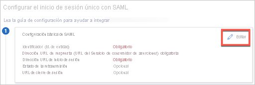
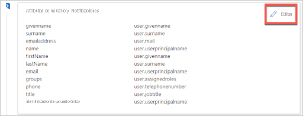

# Tutorial: Integración del inicio de sesión único (SSO) de Azure Active Directory con AppNeta Performance Manager

En este tutorial, aprenderá a integrar AppNeta Performance Manager con Azure Active Directory (Azure AD). Al integrar AppNeta Performance Manager con Azure AD, puede:

- Controlar en Azure AD quién tiene acceso a AppNeta Performance Manager.
- Permitir que los usuarios inicien sesión automáticamente en AppNeta Performance Manager con sus cuentas de Azure AD.
- Administrar las cuentas desde una ubicación central (Azure Portal).

## Requisitos previos

Para empezar, necesita los siguientes elementos:

- Una suscripción de Azure AD. Si no tiene una suscripción, puede crear una [cuenta gratuita](https://azure.microsoft.com/free/).
- Una suscripción habilitada con inicio de sesión único (SSO) de AppNeta Performance Manager.

## Descripción del escenario

En este tutorial, va a configurar y probar el inicio de sesión único de Azure AD en un entorno de prueba.

- AppNeta Performance Manager admite el inicio de sesión único iniciado por **SP**.
- AppNeta Performance Manager admite el aprovisionamiento de usuarios **Just In Time**.

> [!NOTE]
> El identificador de esta aplicación es un valor de cadena fijo, por lo que solo se puede configurar una instancia en un inquilino.

## Adición de AppNeta Performance Manager desde la galería

Para configurar la integración de AppNeta Performance Manager en Azure AD, deberá agregar AppNeta Performance Manager desde la galería a la lista de aplicaciones SaaS administradas.

1. Inicie sesión en Azure Portal con una cuenta personal, profesional o educativa de Microsoft.
1. En el panel de navegación de la izquierda, seleccione el servicio **Azure Active Directory**.
1. Vaya a **Aplicaciones empresariales** y seleccione **Todas las aplicaciones**.
1. Para agregar una nueva aplicación, seleccione **Nueva aplicación**.
1. En la sección **Agregar desde la galería**, escriba **AppNeta Performance Manager** en el cuadro de búsqueda.
1. Seleccione **AppNeta Performance Manager** en el panel de resultados y, a continuación, agregue la aplicación. Espere unos segundos mientras la aplicación se agrega al inquilino.

## Configuración y prueba del inicio de sesión único de Azure AD para AppNeta Performance Manager

Configure y pruebe el inicio de sesión único (SSO) de Azure AD con AppNeta Performance Manager mediante un usuario de prueba llamado **B.Simon**. Para que el inicio de sesión único funcione, es necesario establecer una relación de vínculo entre un usuario de Azure AD y el usuario relacionado de AppNeta Performance Manager.

Para configurar el inicio de sesión único de Azure AD con AppNeta Performance Manager, realice los pasos siguientes:

1. **[Configuración del inicio de sesión único de Azure AD](#configure-azure-ad-sso)** , para permitir que los usuarios puedan utilizar esta característica.
   1. **[Creación de un usuario de prueba de Azure AD](#create-an-azure-ad-test-user)** , para probar el inicio de sesión único de Azure AD con B.Simon.
   1. **[Asignación del usuario de prueba de Azure AD](#assign-the-azure-ad-test-user)** , para habilitar a B.Simon para que use el inicio de sesión único de Azure AD.
1. **[Configuración del inicio de sesión único de AppNeta Performance Manager](#configure-appneta-performance-manager-sso)** , para configurar los valores de inicio de sesión único en la aplicación.
   1. **[Creación de un usuario de prueba de AppNeta Performance Manager](#create-appneta-performance-manager-test-user)** , para tener un homólogo de B.Simon en AppNeta Performance Manager que esté vinculado a su representación en Azure AD.
1. **[Prueba del inicio de sesión único](#test-sso)** : para comprobar si la configuración funciona.

## Configuración del inicio de sesión único de Azure AD

Siga estos pasos para habilitar el inicio de sesión único de Azure AD en Azure Portal.

1. En Azure Portal, en la página de integración de aplicaciones de **AppNeta Performance Manager**, busque la sección **Administrar** y seleccione **Inicio de sesión único**.
1. En la página **Seleccione un método de inicio de sesión único**, elija **SAML**.
1. En la página **Configuración del inicio de sesión único con SAML**, haga clic en el icono de lápiz de **Configuración básica de SAML** para editar la configuración.

   

1. En la sección **Configuración básica de SAML**, especifique los valores de los siguientes campos:

   a. En el cuadro de texto **URL de inicio de sesión**, escriba una dirección URL con el siguiente patrón: `https://<subdomain>.pm.appneta.com`

   b. En el campo URL de respuesta (URL del Servicio de consumidor de aserciones), escriba: `https://sso.connect.pingidentity.com/sso/sp/ACS.saml2`.

   > [!NOTE]
   > El valor de la URL de inicio de sesión anterior es un ejemplo. Actualícelo con la dirección URL de inicio de sesión real. Póngase en contacto con el [equipo de soporte técnico de cliente de AppNeta Performance Manager](mailto:support@appneta.com) para obtener este valor. También puede hacer referencia a los patrones que se muestran en la sección **Configuración básica de SAML** de Azure Portal.

1. La aplicación AppNeta Performance Manager espera las aserciones de SAML en un formato específico, lo que requiere que se agreguen asignaciones de atributos personalizados a la configuración de los atributos del token de SAML. En la siguiente captura se muestra la lista de los atributos predeterminados:

   

1. Además de lo anterior, la aplicación AppNeta Performance Manager espera que se devuelvan algunos atributos más, que se muestran a continuación, en la respuesta de SAML. Estos atributos también se rellenan previamente, pero puede revisarlos según sus requisitos.

   | Nombre      | Atributo de origen       |
   | --------- | ---------------------- |
   | firstName | user.givenname         |
   | lastName  | user.surname           |
   | email     | user.userprincipalname |
   | name      | user.userprincipalname |
   | groups    | user.assignedroles     |
   | phone     | user.telephonenumber   |
   | title     | user.jobtitle          |
   |           |                        |

1. Para pasar correctamente las aserciones de SAML de "grupos", debe configurar roles de aplicación y establecer el valor para que coincida con las asignaciones de roles establecidas en AppNeta Performance Manager. En **Azure Active Directory** > **Registros de aplicaciones** >  **Todas las aplicaciones**, seleccione **Appneta Performance Manager**.
1. Haga clic en **Roles de aplicación** en el panel izquierdo.
1. Haga clic en **Crear rol de aplicación**.
1. En el panel **Crear rol de aplicación**, realice estos pasos:
   1. En **Nombre para mostrar**, escriba un nombre para el rol.
   1. En **Tipos de miembro permitidos**, seleccione **Usuarios o grupos**.
   1. En **Valor**, escriba el valor del grupo de seguridad establecido en las asignaciones de roles de AppNeta Performance Manager.
   1. En **Descripción**, escriba una descripción del rol.
   1. Haga clic en **Aplicar**.

1. Después de crear los roles, debe asignarlos a los usuarios y grupos. Vaya a **Azure Active Directory** > **Aplicaciones empresariales** > **Appneta Performance Manager** > **Usuarios y grupos**.
1. Seleccione un usuario o grupo y, a continuación, asigne el rol de aplicación correspondiente al usuario o grupo.
1. Después de asignar los roles de aplicación, vaya a **Azure Active Directory** > **Aplicaciones empresariales** > **Appneta Performance Manager** > **Inicio de sesión único**.
1. En el panel **Configurar el inicio de sesión único con SAML**, en la sección **Certificado de firma de SAML**, busque **XML de metadatos de federación** y seleccione **Descargar** para descargar el certificado y guardarlo en su equipo.

   

### Creación de un usuario de prueba de Azure AD

En esta sección, va a crear un usuario de prueba llamado B.Simon en Azure Portal.

1. En el panel izquierdo de Azure Portal, seleccione **Azure Active Directory**, **Usuarios** y **Todos los usuarios**.
1. Seleccione **Nuevo usuario** en la parte superior de la pantalla.
1. En las propiedades del **usuario**, siga estos pasos:
   1. En el campo **Nombre**, escriba `B.Simon`.
   1. En el campo **Nombre de usuario**, escriba username@companydomain.extension. Por ejemplo, `B.Simon@contoso.com`.
   1. Active la casilla **Show password** (Mostrar contraseña) y, después, anote el valor que se muestra en el cuadro **Contraseña**.
   1. Haga clic en **Crear**.

### Asignación del usuario de prueba de Azure AD

En esta sección, va a permitir que B.Simon acceda a AppNeta Performance Manager utilizando el inicio de sesión único de Azure.

1. En Azure Portal, seleccione sucesivamente **Aplicaciones empresariales** y **Todas las aplicaciones**.
1. En la lista de aplicaciones, seleccione **AppNeta Performance Manager**.
1. En la página de información general de la aplicación, busque la sección **Administrar** y seleccione **Usuarios y grupos**.
1. Seleccione **Agregar usuario**. A continuación, en el cuadro de diálogo **Agregar asignación**, seleccione **Usuarios y grupos**.
1. En el cuadro de diálogo **Usuarios y grupos**, seleccione **B.Simon** de la lista de usuarios y haga clic en el botón **Seleccionar** de la parte inferior de la pantalla.
1. Si ha configurado los roles tal y como se explica en el apartado anterior, puede seleccionarlo en la lista desplegable **Seleccionar un rol**.
1. En el cuadro de diálogo **Agregar asignación**, haga clic en el botón **Asignar**.

   > [!NOTE]
   > En la práctica, agregará grupos a la aplicación en lugar de usuarios individuales.

## Configuración del inicio de sesión único de AppNeta Performance Manager

Para configurar el inicio de sesión único en **AppNeta Performance Manager**, tiene que enviar el **XML de metadatos de federación** descargado al [equipo de soporte técnico de AppNeta Performance Manager](mailto:support@appneta.com). Dicho equipo lo configura para establecer la conexión de SSO de SAML correctamente en ambos lados.

### Creación de un usuario de prueba de AppNeta Performance Manager

En esta sección, se crea un usuario llamado B.Simon en AppNeta Performance Manager. AppNeta Performance Manager admite el aprovisionamiento de usuarios Just-In-Time, que está habilitado de forma predeterminada. No hay ningún elemento de acción para usted en esta sección. Si el usuario no existe ya en AppNeta Performance Manager, se crea uno después de la autenticación.

> [!Note]
> Si necesita crear manualmente un usuario, póngase en contacto con el [equipo de soporte técnico de AppNeta Performance Manager](mailto:support@appneta.com).

## Prueba de SSO

En esta sección, probará la configuración de inicio de sesión único de Azure AD con las siguientes opciones.

- En Azure Portal, seleccione **Probar esta aplicación**. Esta acción le redirigirá a la dirección URL de inicio de sesión de AppNeta Performance Manager, donde puede poner en marcha el flujo de inicio de sesión.

- Acceda directamente a la dirección URL de inicio de sesión de AppNeta Performance Manager y comience el flujo de inicio de sesión desde ahí.

- Puede usar Mis aplicaciones de Microsoft. Al hacer clic en el icono de AppNeta Performance Manager en el portal Aplicaciones, se le redirigirá a la dirección URL de inicio de sesión de esa aplicación. Para más información acerca del portal Aplicaciones, consulte [Inicio de sesión e inicio de aplicaciones desde el portal Aplicaciones](../user-help/my-apps-portal-end-user-access.md).

## Pasos siguientes

Una vez que haya configurado AppNeta Performance Manager, puede aplicar el control de sesión, que protege su organización, en tiempo real, frente a la filtración e infiltración de información confidencial. El control de sesión procede del acceso condicional. [Aprenda a aplicar el control de sesión con Microsoft Cloud App Security](/cloud-app-security/proxy-deployment-any-app).
