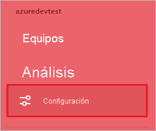

# Tutorial: Integración del inicio de sesión único (SSO) de Azure Active Directory con askSpoke

En este tutorial, aprenderá a integrar askSpoke con Azure Active Directory (Azure AD). Al integrar askSpoke con Azure AD, puede:

* Controlar en Azure AD quién tiene acceso a askSpoke.
* Permitir que los usuarios inicien sesión automáticamente en askSpoke con sus cuentas de Azure AD.
* Administrar las cuentas desde una ubicación central (Azure Portal).

## Requisitos previos

Para empezar, necesita los siguientes elementos:

* Una suscripción de Azure AD. Si no tiene una suscripción, puede crear una [cuenta gratuita](https://azure.microsoft.com/free/).
* Una suscripción habilitada para el inicio de sesión único (SSO) en askSpoke.

## Descripción del escenario

En este tutorial, va a configurar y probar el inicio de sesión único de Azure AD en un entorno de prueba.

* askSpoke admite el SSO iniciado por **SP e IDP**.
* askSpoke admite el aprovisionamiento de usuarios **Just-In-Time**.
* askSpoke admite el [aprovisionamiento automatizado de usuarios](askspoke-provisioning-tutorial.md).

> [!NOTE]
> El identificador de esta aplicación es un valor de cadena fijo, por lo que solo se puede configurar una instancia en un inquilino.

## Incorporación de askSpoke desde la galería

Para configurar la integración de askSpoke en Azure AD, tiene que agregar askSpoke desde la galería a la lista de aplicaciones SaaS administradas.

1. Inicie sesión en Azure Portal con una cuenta personal, profesional o educativa de Microsoft.
1. En el panel de navegación de la izquierda, seleccione el servicio **Azure Active Directory**.
1. Vaya a **Aplicaciones empresariales** y seleccione **Todas las aplicaciones**.
1. Para agregar una nueva aplicación, seleccione **Nueva aplicación**.
1. En la sección **Add from the gallery** (Agregar desde la galería), escriba **askSpoke** en el cuadro de búsqueda.
1. Seleccione **askSpoke** en el panel de resultados y agregue la aplicación. Espere unos segundos mientras la aplicación se agrega al inquilino.

## Configuración y prueba del inicio de sesión único de Azure AD para askSpoke

Configure y pruebe el inicio de sesión único de Azure AD con askSpoke mediante un usuario de prueba llamado **B.Simon**. Para que el inicio de sesión único funcione, es necesario establecer una vinculación entre un usuario de Azure AD y el usuario correspondiente de askSpoke.

Para configurar y probar el inicio de sesión único de Azure AD con askSpoke, haga lo siguiente:

1. **[Configuración del inicio de sesión único de Azure AD](#configure-azure-ad-sso)** , para permitir que los usuarios puedan utilizar esta característica.
    1. **[Creación de un usuario de prueba de Azure AD](#create-an-azure-ad-test-user)** , para probar el inicio de sesión único de Azure AD con B.Simon.
    1. **[Asignación del usuario de prueba de Azure AD](#assign-the-azure-ad-test-user)** , para habilitar a B.Simon para que use el inicio de sesión único de Azure AD.
1. **[Configuración del inicio de sesión único de askSpoke](#configure-askspoke-sso)** , para configurar los valores de inicio de sesión único en la aplicación.
    1. **[Creación de un usuario de prueba de askSpoke](#create-askspoke-test-user)** , para tener un usuario correspondiente a B.Simon en askSpoke que esté vinculado a la representación de usuario en Azure AD.
1. **[Prueba del inicio de sesión único](#test-sso)** : para comprobar si la configuración funciona.

## Configuración del inicio de sesión único de Azure AD

Siga estos pasos para habilitar el inicio de sesión único de Azure AD en Azure Portal.

1. En Azure Portal, en la página de integración de aplicaciones **askSpoke**, busque la sección **Administrar** y seleccione el **inicio de sesión único**.
1. En la página **Seleccione un método de inicio de sesión único**, elija **SAML**.
1. En la página **Configuración del inicio de sesión único con SAML**, haga clic en el icono de lápiz de **Configuración básica de SAML** para editar la configuración.

   

1. En la sección **Configuración básica de SAML**, si desea configurar la aplicación en modo iniciado por **IDP**, escriba los valores de los siguientes campos:

    En el cuadro de texto **URL de respuesta**, escriba una dirección URL con el siguiente patrón: `https://<SUBDOMAIN>.askspoke.com/saml/callback`

    > [!NOTE]
    > El valor de dirección URL de respuesta no es real. Actualice este valor con la dirección URL de respuesta real. Póngase en contacto con el [equipo de atención al cliente de askSpoke](mailto:support@askspoke.com) para obtener este valor. También puede hacer referencia a los patrones que se muestran en la sección **Configuración básica de SAML** de Azure Portal.

1. Haga clic en **Establecer direcciones URL adicionales** y siga este paso si desea configurar la aplicación en el modo iniciado por **SP**:

    En el cuadro de texto **URL de inicio de sesión**, escriba la dirección URL: `https://askspoke.com/login`

1. La aplicación askSpoke espera las aserciones de SAML en un formato específico, por lo que es necesario agregar asignaciones de atributos personalizados a la configuración de los atributos del token de SAML. La siguiente captura de muestra la lista de atributos predeterminados.

    

1. Además de lo anterior, la aplicación askSpoke espera que se devuelvan algunos atributos más en la respuesta de SAML que se muestran a continuación. Estos atributos también se rellenan previamente, pero puede revisarlos según sus requisitos.

    | Nombre |  Atributo de origen|
    | ---------------| --------- |
    | firstName | user.givenname |
    | lastName | user.surname |

1. En la página **Configurar el inicio de sesión único con SAML**, en la sección **Certificado de firma de SAML**, busque **Certificado (Base64)** y seleccione **Descargar** para descargarlo y guardarlo en el equipo.

    

1. En la sección **Set up askSpoke** (Configurar askSpoke), copie las direcciones URL adecuadas según sus requisitos.

    

### Creación de un usuario de prueba de Azure AD

En esta sección, va a crear un usuario de prueba llamado B.Simon en Azure Portal.

1. En el panel izquierdo de Azure Portal, seleccione **Azure Active Directory**, **Usuarios** y **Todos los usuarios**.
1. Seleccione **Nuevo usuario** en la parte superior de la pantalla.
1. En las propiedades del **usuario**, siga estos pasos:
   1. En el campo **Nombre**, escriba `B.Simon`.  
   1. En el campo **Nombre de usuario**, escriba username@companydomain.extension. Por ejemplo, `B.Simon@contoso.com`.
   1. Active la casilla **Show password** (Mostrar contraseña) y, después, anote el valor que se muestra en el cuadro **Contraseña**.
   1. Haga clic en **Crear**.

### Asignación del usuario de prueba de Azure AD

En esta sección, va a permitir que B.Simon acceda a askSpoke mediante el inicio de sesión único de Azure.

1. En Azure Portal, seleccione sucesivamente **Aplicaciones empresariales** y **Todas las aplicaciones**.
1. En la lista de aplicaciones, seleccione **askSpoke**.
1. En la página de información general de la aplicación, busque la sección **Administrar** y seleccione **Usuarios y grupos**.
1. Seleccione **Agregar usuario**. A continuación, en el cuadro de diálogo **Agregar asignación**, seleccione **Usuarios y grupos**.
1. En el cuadro de diálogo **Usuarios y grupos**, seleccione **B.Simon** de la lista de usuarios y haga clic en el botón **Seleccionar** de la parte inferior de la pantalla.
1. Si espera que se asigne un rol a los usuarios, puede seleccionarlo en la lista desplegable **Seleccionar un rol**. Si no se ha configurado ningún rol para esta aplicación, verá seleccionado el rol "Acceso predeterminado".
1. En el cuadro de diálogo **Agregar asignación**, haga clic en el botón **Asignar**.

## Configuración del inicio de sesión único de askSpoke

1. Abra una nueva ventana del explorador web e inicie sesión en el sitio web de askSpoke como administrador.

1. Haga clic en la pestaña **Settings** (Configuración) en el panel de navegación izquierdo.

    

1. Desplácese hacia abajo hasta **SSO** y haga clic en **Connect** (Conectar).

    

1. En la sección **Enable SAML & SCIM** (Habilitar SAML y SCIM), realice los pasos siguientes:

    

    1. En el cuadro de texto **Sign-on URL** (URL de inicio de sesión), pegue el valor de la **dirección URL de inicio de sesión** que ha copiado de Azure Portal.

    1. En el cuadro de texto **Issuer** (Emisor), pegue el valor de **Identificador de Azure AD** que ha copiado de Azure Portal.

    1. Abra el archivo **Certificado(Base64)** que descargó de Azure Portal en el Bloc de notas, copie el contenido y, luego, péguelo en el cuadro de texto **Certificado público**.

    1. Copie el valor de **URL de ACS** y péguelo en el cuadro de texto **URL de respuesta** de la sección **Basic SAML Configuration** (Configuración básica de SAML) en Azure Portal.

    1. Haga clic en **Test SAML connection** (Probar conexión SAML).

### Creación de un usuario de prueba de askSpoke

En esta sección, se crea un usuario llamado B.Simon en askSpoke. askSpoke admite el aprovisionamiento Just-In-Time, que está habilitado de forma predeterminada. No hay ningún elemento de acción para usted en esta sección. Si el usuario no existe aún en askSpoke, se creará uno después de la autenticación.

askSpoke también admite el aprovisionamiento automático de usuarios. [Aquí](./askspoke-provisioning-tutorial.md) puede encontrar más detalles sobre cómo configurar el aprovisionamiento automático de usuarios.

## Prueba de SSO

En esta sección, probará la configuración de inicio de sesión único de Azure AD con las siguientes opciones. 

#### Iniciado por SP:

* Haga clic en **Probar esta aplicación** en Azure Portal. Esta acción le redirigirá a la dirección URL de inicio de sesión de askSpoke, donde puede iniciar el flujo de inicio de sesión.  

* Vaya directamente a la dirección URL de inicio de sesión de askSpoke e inicie el flujo de inicio de sesión desde allí.

#### Iniciado por IDP:

* Haga clic en **Probar esta aplicación** en Azure Portal; debería iniciar sesión automáticamente en la instancia de askSpoke para la que configuró el inicio de sesión único. 

También puede usar Aplicaciones de Microsoft para probar la aplicación en cualquier modo. Al hacer clic en el icono de askSpoke en Aplicaciones, si se ha configurado en modo SP, se le redirigirá a la página de inicio de sesión de la aplicación para comenzar el flujo de inicio de sesión; y si se ha configurado en modo IDP, debería iniciar sesión automáticamente en la instancia de askSpoke para la que configuró el inicio de sesión único. Para más información acerca de Aplicaciones, consulte [Inicio de sesión e inicio de aplicaciones desde el portal Aplicaciones](../user-help/my-apps-portal-end-user-access.md).

## Pasos siguientes

Una vez configurado askSpoke, puede aplicar el control de sesión, que protege en tiempo real su organización frente a la filtración e infiltración de información confidencial. El control de sesión procede del acceso condicional. [Aprenda a aplicar el control de sesión con Microsoft Cloud App Security](/cloud-app-security/proxy-deployment-aad).