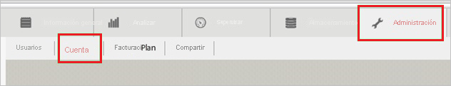
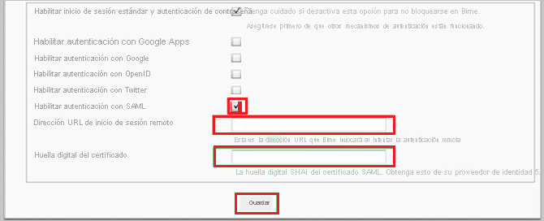
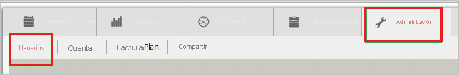
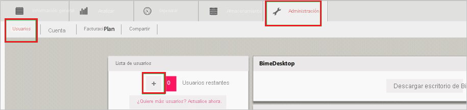
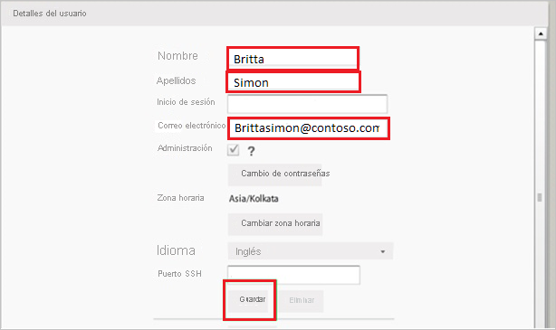

# Tutorial: Integración del inicio de sesión único de Azure AD con Bime

En este tutorial, aprenderá a integrar Bime con Azure Active Directory (Azure AD). Al integrar Bime con Azure AD, puede hacer lo siguiente:

* Controlar en Azure AD quién tiene acceso a Bime.
* Permitir que los usuarios inicien sesión automáticamente en Bime con sus cuentas de Azure AD.
* Administrar las cuentas desde una ubicación central (Azure Portal).

## Requisitos previos

Para empezar, necesita los siguientes elementos:

* Una suscripción de Azure AD. Si no tiene una suscripción, puede crear una [cuenta gratuita](https://azure.microsoft.com/free/).
* Suscripción habilitada para el inicio de sesión único (SSO) en Bime.

## Descripción del escenario

En este tutorial, puede configurar y probar el inicio de sesión único de Azure AD en un entorno de prueba.

* Bime admite el inicio de sesión único iniciado por **SP**.

## Adición de Bime desde la galería

Para configurar la integración de Bime en Azure AD, es preciso agregarlo desde la galería a la lista de aplicaciones SaaS administradas.

1. Inicie sesión en Azure Portal con una cuenta personal, profesional o educativa de Microsoft.
1. En el panel de navegación de la izquierda, seleccione el servicio **Azure Active Directory**.
1. Vaya a **Aplicaciones empresariales** y seleccione **Todas las aplicaciones**.
1. Para agregar una nueva aplicación, seleccione **Nueva aplicación**.
1. En la sección **Agregar desde la galería**, escriba **Bime** en el cuadro de búsqueda.
1. Seleccione **Bime** en el panel de resultados y agregue la aplicación. Espere unos segundos mientras la aplicación se agrega al inquilino.

## Configuración y prueba del inicio de sesión único de Azure AD para Bime

Configure y pruebe el inicio de sesión único de Azure AD con Bime mediante un usuario de prueba llamado **B.Simon**. Para que el inicio de sesión único funcione, es preciso establecer una relación de vinculación entre un usuario de Azure AD y el usuario relacionado de Bime.

Para configurar y probar el inicio de sesión único de Azure AD con Bime, lleve a cabo los siguientes pasos:

1. **[Configuración del inicio de sesión único de Azure AD](#configure-azure-ad-sso)** , para permitir que los usuarios puedan utilizar esta característica.
    1. **[Creación de un usuario de prueba de Azure AD](#create-an-azure-ad-test-user)**, para probar el inicio de sesión único de Azure AD con B.Simon.
    1. **[Asignación del usuario de prueba de Azure AD](#assign-the-azure-ad-test-user)** , para habilitar a B.Simon para que use el inicio de sesión único de Azure AD.
1. **[Configuración del inicio de sesión único en Bime](#configure-bime-sso)** : para configurar los valores de inicio de sesión único en la aplicación.
    1. **[Creación de un usuario de prueba de Bime](#create-bime-test-user)** : para tener un homólogo de B.Simon en Bime que esté vinculado a la representación del usuario en Azure AD.
1. **[Prueba del inicio de sesión único](#test-sso)** : para comprobar si la configuración funciona.

## Configuración del inicio de sesión único de Azure AD

Siga estos pasos para habilitar el inicio de sesión único de Azure AD en Azure Portal.

1. En Azure Portal, en la página de integración de aplicaciones de **Bime**, busque la sección **Administrar** y seleccione **Inicio de sesión único**.
1. En la página **Seleccione un método de inicio de sesión único**, elija **SAML**.
1. En la página **Configuración del inicio de sesión único con SAML**, haga clic en el icono de lápiz de **Configuración básica de SAML** para editar la configuración.

   

4. En la sección **Configuración básica de SAML**, siga estos pasos:

    a. En el cuadro de texto **Identificador (id. de entidad)** , escriba una dirección URL con el siguiente patrón: `https://<tenant-name>.Bimeapp.com`

    b. En el cuadro de texto **URL de inicio de sesión**, escriba una dirección URL con el siguiente patrón: `https://<tenant-name>.Bimeapp.com`

    > [!NOTE]
    > Estos valores no son reales. Actualice estos valores con el identificador y la dirección URL de inicio de sesión reales. Póngase en contacto con el [equipo de soporte de cliente de Bime](https://bime.zendesk.com/hc/categories/202604307-Support-tech-notes-and-tips-) para obtener estos valores. También puede hacer referencia a los patrones que se muestran en la sección **Configuración básica de SAML** de Azure Portal.

5. En la sección **Certificado de firma de SAML**, haga clic en el botón **Editar** para abrir el cuadro de diálogo **Certificado de firma de SAML**.

    

6. En la sección **Certificado de firma de SAML**, copie el valor de **Huella digital** y guárdelo en el equipo.

    

7. En la sección **Set up Bime** (Configurar Bime), copie las direcciones URL apropiadas según sus necesidades.

    

### Creación de un usuario de prueba de Azure AD

En esta sección, va a crear un usuario de prueba llamado B.Simon en Azure Portal.

1. En el panel izquierdo de Azure Portal, seleccione **Azure Active Directory**, **Usuarios** y **Todos los usuarios**.
1. Seleccione **Nuevo usuario** en la parte superior de la pantalla.
1. En las propiedades del **usuario**, siga estos pasos:
   1. En el campo **Nombre**, escriba `B.Simon`.  
   1. En el campo **Nombre de usuario**, escriba username@companydomain.extension. Por ejemplo, `B.Simon@contoso.com`.
   1. Active la casilla **Show password** (Mostrar contraseña) y, después, anote el valor que se muestra en el cuadro **Contraseña**.
   1. Haga clic en **Crear**.

### Asignación del usuario de prueba de Azure AD

En esta sección, va a conceder a B.Simon acceso a Bime para que use el inicio de sesión único de Azure.

1. En Azure Portal, seleccione sucesivamente **Aplicaciones empresariales** y **Todas las aplicaciones**.
1. En la lista de aplicaciones, seleccione **Bime**.
1. En la página de información general de la aplicación, busque la sección **Administrar** y seleccione **Usuarios y grupos**.
1. Seleccione **Agregar usuario**. A continuación, en el cuadro de diálogo **Agregar asignación**, seleccione **Usuarios y grupos**.
1. En el cuadro de diálogo **Usuarios y grupos**, seleccione **B.Simon** de la lista de usuarios y haga clic en el botón **Seleccionar** de la parte inferior de la pantalla.
1. Si espera que se asigne un rol a los usuarios, puede seleccionarlo en la lista desplegable **Seleccionar un rol**. Si no se ha configurado ningún rol para esta aplicación, verá seleccionado el rol "Acceso predeterminado".
1. En el cuadro de diálogo **Agregar asignación**, haga clic en el botón **Asignar**.

## Configuración del inicio de sesión único de Bime

1. En otra ventana del explorador web, inicie sesión como administrador en el sitio de la compañía de Bime.

2. En la barra de herramientas, haga clic en **Admin** y, luego, en **Account** (Cuenta).

    

3. En la página de configuración de la cuenta, realice los siguientes pasos:

    

    a. Seleccione **Enable SAML authentication** (Habilitar autenticación SAML).

    b. En el cuadro de texto **Remote Login URL** (Dirección URL de inicio de sesión remoto), pegue el valor de **Login URL**, (Dirección URL de inicio de sesión) que ha copiado de Azure Portal.

    c. En el cuadro de texto **Certificate Fingerprint** (Huella digital de certificado), pegue el valor de **THUMBPRINT** (HUELLA DIGITAL) que copió de Azure Portal.

    d. Haga clic en **Save**(Guardar).

### Creación de un usuario de prueba de Bime

Para permitir que los usuarios de Azure AD inicien sesión en Bime, tienen que aprovisionarse en Bime. En el caso de Bime, el aprovisionamiento es una tarea manual.

**Siga estos pasos para configurar el aprovisionamiento de usuario:**

1. Inicie sesión en su inquilino de **Bime** .

2. En la barra de herramientas, haga clic en **Admin** y, luego, en **Users** (Usuarios).

    

3. En **Users List** (Lista de usuarios), haga clic en **Agregar nuevo usuario** (+).

    

4. En la página de diálogo **User Details** (Detalles del usuario), siga estos pasos:

    

    a. En el cuadro de texto **Nombre**, escriba el nombre de usuario, en este caso **Britta**.

    b. En el cuadro de texto **Apellidos**, escriba el apellido del usuario, en este caso **Simon**.

    c. En el cuadro de texto **Email** (Correo electrónico), escriba el correo electrónico del usuario; por ejemplo, **brittasimon\@contoso.com**.

    d. Haga clic en **Save**(Guardar).

> [!NOTE]
> Puede usar cualquier otra API o herramienta de creación de cuentas de usuario de Bime que proporcione Bime para aprovisionar cuentas de usuario de Azure AD.

## Prueba de SSO

En esta sección, probará la configuración de inicio de sesión único de Azure AD con las siguientes opciones. 

* Haga clic en **Probar esta aplicación** en Azure Portal. Esta acción le redirigirá a la dirección URL de inicio de sesión de Bime, donde puede comenzar el flujo de inicio de sesión. 

* Vaya directamente a la dirección URL de inicio de sesión de Bime y comience desde allí el flujo de inicio de sesión.

* Puede usar Mis aplicaciones de Microsoft. Al hacer clic en el icono de Bime en Aplicaciones, se le redirigirá a la dirección URL de inicio de sesión de dicha aplicación. Para más información acerca de Aplicaciones, consulte [Inicio de sesión e inicio de aplicaciones desde el portal Aplicaciones](../user-help/my-apps-portal-end-user-access.md).

## Pasos siguientes

Cuando haya configurado Bime, puede aplicar puede aplicar el control de sesión, que protege a la organización en tiempo real frente a la filtración e infiltración de información confidencial. El control de sesión procede del acceso condicional. [Aprenda a aplicar el control de sesión con Microsoft Defender para aplicaciones en la nube](/cloud-app-security/proxy-deployment-aad).
