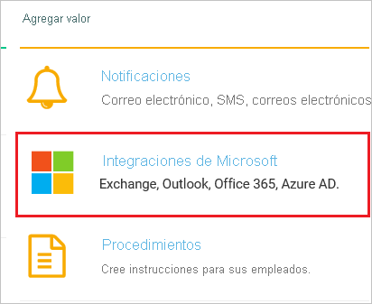
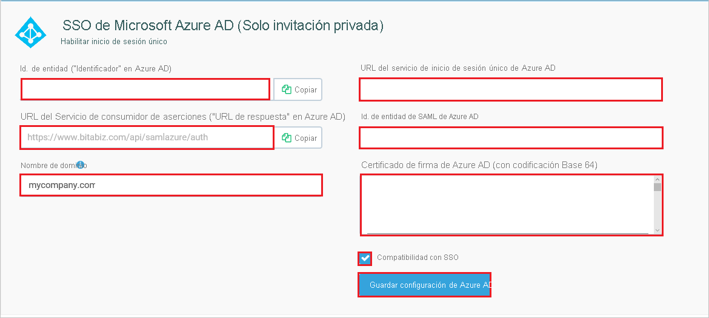
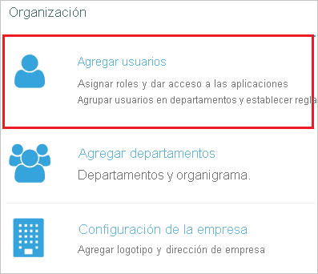
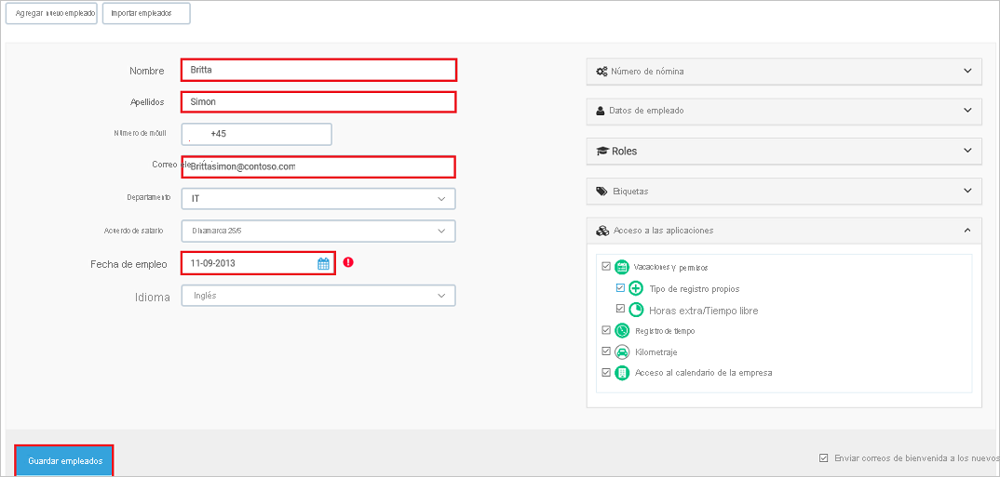

# Tutorial: Integración de Azure Active Directory con BitaBIZ

En este tutorial, aprenderá a integrar BitaBIZ con Azure Active Directory (Azure AD). Al integrar BitaBIZ con Azure AD, puede hacer lo siguiente:

* Controlar en Azure AD quién tiene acceso a BitaBIZ.
* Permitir que los usuarios inicien sesión automáticamente en BitaBIZ con sus cuentas de Azure AD.
* Administrar las cuentas desde una ubicación central (Azure Portal).

## Requisitos previos

Para configurar la integración de Azure AD con BitaBIZ, necesita los siguientes elementos:

* Una suscripción de Azure AD. Si no dispone de un entorno de Azure AD, puede obtener [una cuenta gratuita](https://azure.microsoft.com/free/).
* Una suscripción habilitada para el inicio de sesión único en BitaBIZ.

## Descripción del escenario

En este tutorial, puede configurar y probar el inicio de sesión único de Azure AD en un entorno de prueba.

* BitaBIZ admite el inicio de sesión único iniciado por **SP e IDP**.
* BitaBIZ admite el [aprovisionamiento automatizado de usuarios](bitabiz-provisioning-tutorial.md).

## Adición de BitaBIZ desde la galería

Para configurar la integración de BitaBIZ en Azure AD, deberá agregar BitaBIZ desde la galería a la lista de aplicaciones SaaS administradas.

1. Inicie sesión en Azure Portal con una cuenta personal, profesional o educativa de Microsoft.
1. En el panel de navegación de la izquierda, seleccione el servicio **Azure Active Directory**.
1. Vaya a **Aplicaciones empresariales** y seleccione **Todas las aplicaciones**.
1. Para agregar una nueva aplicación, seleccione **Nueva aplicación**.
1. En la sección **Agregar desde la galería**, escriba **BitaBIZ** en el cuadro de búsqueda.
1. Seleccione **BitaBIZ** en el panel de resultados y, a continuación, agregue la aplicación. Espere unos segundos mientras la aplicación se agrega al inquilino.

## Configuración y prueba del inicio de sesión único de Azure AD para BitaBIZ

Configure y pruebe el inicio de sesión único de Azure AD con BitaBIZ mediante un usuario de prueba llamado **B.Simon**. Para que el inicio de sesión único funcione, es preciso establecer una relación de vinculación entre un usuario de Azure AD y el usuario correspondiente de BitaBIZ.

Para configurar y probar el inicio de sesión único de Azure AD con BitaBIZ, haga lo siguiente:

1. **[Configuración del inicio de sesión único de Azure AD](#configure-azure-ad-sso)** , para permitir que los usuarios puedan utilizar esta característica.
    1. **[Creación de un usuario de prueba de Azure AD](#create-an-azure-ad-test-user)** , para probar el inicio de sesión único de Azure AD con Britta Simon.
    1. **[Asignación del usuario de prueba de Azure AD](#assign-the-azure-ad-test-user)** , para permitir que Britta Simon use el inicio de sesión único de Azure AD.
2. **[Configuración del inicio de sesión único en BitaBIZ](#configure-bitabiz-sso)** : para configurar los valores de inicio de sesión único en la aplicación.
    1. **[Creación de un usuario de prueba en BitaBIZ](#create-bitabiz-test-user)** : para tener un homólogo de Britta Simon en BitaBIZ que esté vinculado a su representación en Azure AD.
1. **[Prueba del inicio de sesión único](#test-sso)** : para comprobar si la configuración funciona.

## Configuración del inicio de sesión único de Azure AD

Siga estos pasos para habilitar el inicio de sesión único de Azure AD en Azure Portal.

1. En Azure Portal, en la página de integración de la aplicación **BitaBIZ**, busque la sección **Administrar** y seleccione **Inicio de sesión único**.
1. En la página **Seleccione un método de inicio de sesión único**, elija **SAML**.
1. En la página **Configuración del inicio de sesión único con SAML**, haga clic en el icono de lápiz de **Configuración básica de SAML** para editar la configuración.

   

4. En la sección **Configuración básica de SAML**, si desea configurar la aplicación en el modo **iniciado por IDP** siga estos pasos:

    En el cuadro de texto **Identificador**, escriba una dirección URL con el patrón siguiente: `https://www.bitabiz.com/<INSTANCE_ID>`.

    > [!NOTE]
    > El valor de la dirección URL anterior es exclusivamente para la demostración. Actualice el valor con el identificador real, lo que se explica más adelante en el tutorial.

5. Haga clic en **Establecer direcciones URL adicionales** y siga este paso si desea configurar la aplicación en el modo iniciado por **SP**:

    En el cuadro de texto **URL de inicio de sesión**, escriba la dirección URL: `https://www.bitabiz.com/dashboard`

6. En la página **Configurar el inicio de sesión único con SAML**, en la sección **Certificado de firma de SAML**, haga clic en **Descargar** para descargar el **certificado (Base64)** de las opciones proporcionadas según sus requisitos y guárdelo en el equipo.

    

7. En la sección **Set up BitaBIZ** (Configurar BitaBIZ), copie las direcciones URL adecuadas según sus necesidades.

    

### Creación de un usuario de prueba de Azure AD

En esta sección, va a crear un usuario de prueba llamado B.Simon en Azure Portal.

1. En el panel izquierdo de Azure Portal, seleccione **Azure Active Directory**, **Usuarios** y **Todos los usuarios**.
1. Seleccione **Nuevo usuario** en la parte superior de la pantalla.
1. En las propiedades del **usuario**, siga estos pasos:
   1. En el campo **Nombre**, escriba `B.Simon`.  
   1. En el campo **Nombre de usuario**, escriba username@companydomain.extension. Por ejemplo, `B.Simon@contoso.com`.
   1. Active la casilla **Show password** (Mostrar contraseña) y, después, anote el valor que se muestra en el cuadro **Contraseña**.
   1. Haga clic en **Crear**.

### Asignación del usuario de prueba de Azure AD

En esta sección, va a permitir que B.Simon acceda a BitaBIZ mediante el inicio de sesión único de Azure.

1. En Azure Portal, seleccione sucesivamente **Aplicaciones empresariales** y **Todas las aplicaciones**.
1. En la lista de aplicaciones, seleccione **BitaBIZ**.
1. En la página de información general de la aplicación, busque la sección **Administrar** y seleccione **Usuarios y grupos**.
1. Seleccione **Agregar usuario**. A continuación, en el cuadro de diálogo **Agregar asignación**, seleccione **Usuarios y grupos**.
1. En el cuadro de diálogo **Usuarios y grupos**, seleccione **B.Simon** de la lista de usuarios y haga clic en el botón **Seleccionar** de la parte inferior de la pantalla.
1. Si espera que se asigne un rol a los usuarios, puede seleccionarlo en la lista desplegable **Seleccionar un rol**. Si no se ha configurado ningún rol para esta aplicación, verá seleccionado el rol "Acceso predeterminado".
1. En el cuadro de diálogo **Agregar asignación**, haga clic en el botón **Asignar**.

## Configuración del inicio de sesión único de BitaBIZ

1. En otra ventana del explorador web, inicie sesión en el inquilino de BitaBIZ como administrador.

2. Haga clic en **SETUP ADMIN**.

    

3. Haga clic en **Microsoft integrations** (Integraciones de Microsoft) en la sección **Agregar valor**.

    

4. Desplácese hacia abajo hasta la sección **Microsoft Azure AD (Habilitar inicio de sesión único)** y realice los siguientes pasos:

    

    a. Copie el valor del cuadro de texto **Entity ID (”Identifier” in Azure AD)** [Id. de entidad ("Identificador" en Azure AD)]y péguelo en el cuadro de texto **Identificador** de la sección **Configuración básica de SAML** de Azure Portal. 

    b. En el cuadro de texto **Azure AD Single Sign-On Service URL** (Dirección URL del servicio de inicio de sesión único de Azure AD), pegue el valor de **Dirección URL de inicio de sesión** que copió desde Azure Portal.

    c. En el cuadro de texto **Azure AD SAML Entity ID** (Identificador de entidad en SAML de Azure AD), pegue el valor de **Identificador de Azure AD** que copió de Azure Portal.

    d. Abra en el Bloc de notas el archivo **Certificado (Base64)** descargado, copie su contenido en el Portapapeles y luego péguelo en el cuadro de texto **Azure AD Signing Certificate (Base64 encoded)** [Certificado de firma de Azure AD (codificado en Base64)].

    e. Agregue el nombre de dominio del correo electrónico empresarial, es decir, mycompany.com, en el cuadro de texto **Nombre de dominio** para asignar SSO a los usuarios de su empresa con este dominio de correo electrónico (no es obligatorio).

    f. Marque la cuenta de BitaBIZ como **SSO enabled** (habilitada para SSO).

    g. Haga clic en **Save Azure AD configuration** (Guardar configuración de Azure AD) para guardar y activar la configuración de SSO.

### Creación de un usuario de prueba en BitaBIZ

Para permitir que los usuarios de Azure AD inicien sesión en BitaBIZ, deben aprovisionarse en BitaBIZ.  
En el caso de BitaBIZ, el aprovisionamiento es una tarea manual.

**Para aprovisionar una cuenta de usuario, realice estos pasos:**

1. Inicie sesión como administrador en su sitio de la compañía de BitaBIZ.

2. Haga clic en **SETUP ADMIN**.

    

3. Haga clic en **Agregar usuarios** en la sección **Organización**.

    

4. Haga clic en **Add new employee** (Agregar nuevo empleado).

    

5. En la página de diálogo **Add new employee** (Agregar nuevo empleado), siga estos pasos:

    

    a. En el cuadro de texto **Nombre**, escriba el nombre del usuario, en este caso, Britta.

    b. En el cuadro de texto **Apellidos**, escriba los apellidos del usuario, en este caso, Simon.

    c. En el cuadro de texto **Correo electrónico**, escriba la dirección de correo electrónico de un usuario, por ejemplo, Brittasimon@contoso.com.

    d. Seleccione una fecha en **Date of employment** (Fecha del contrato).

    e. Hay otros atributos de usuario no obligatorios que se pueden configurar para el usuario. Consulte la [documentación de configuración de los empleados](https://help.bitabiz.dk/manage-or-set-up-your-account/on-boarding-employees/new-employee) para obtener más detalles.

    f. Haga clic en **Save employee** (Guardar empleado).

    > [!NOTE]
    > El titular de la cuenta de Azure Active Directory recibirá un mensaje de correo y seguirá un vínculo para confirmar su cuenta antes de que se active.

> [!NOTE]
>BitaBIZ también admite el aprovisionamiento automático de usuarios. [Aquí](./bitabiz-provisioning-tutorial.md) puede encontrar más detalles sobre cómo configurar el aprovisionamiento automático de usuarios.

## Prueba de SSO

En esta sección, probará la configuración de inicio de sesión único de Azure AD con las siguientes opciones. 

#### Iniciado por SP:

* Haga clic en **Probar esta aplicación** en Azure Portal. Esta acción le redirigirá a la dirección URL de inicio de sesión de BitaBIZ, donde puede iniciar el flujo de inicio de sesión.  

* Vaya directamente a la dirección URL de inicio de sesión de BitaBIZ y comience el flujo de inicio de sesión desde allí.

#### Iniciado por IDP:

* En Azure Portal, haga clic en **Probar esta aplicación**. Al hacerlo, debería iniciar sesión automáticamente en la instancia de BitaBIZ en la que configuró el inicio de sesión único. 

También puede usar Aplicaciones de Microsoft para probar la aplicación en cualquier modo. Al hacer clic en el icono de BitaBIZ en Aplicaciones, si se ha configurado en modo SP, se le redirigirá a la página de inicio de sesión de la aplicación para comenzar el flujo de inicio de sesión; y, si se ha configurado en modo IDP, iniciará sesión automáticamente en la instancia de BitaBIZ para la que configuró el inicio de sesión único. Para más información acerca de Aplicaciones, consulte [Inicio de sesión e inicio de aplicaciones desde el portal Aplicaciones](../user-help/my-apps-portal-end-user-access.md).

## Pasos siguientes

Una vez que haya configurado BitaBIZ, puede aplicar el control de sesión, que protege a la organización en tiempo real frente a la filtración e infiltración de información confidencial. El control de sesión procede del acceso condicional. [Aprenda a aplicar el control de sesión con Microsoft Cloud App Security](/cloud-app-security/proxy-deployment-aad).
