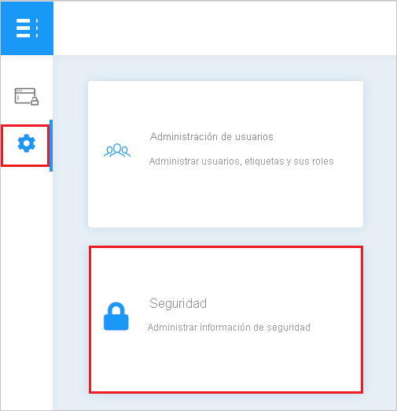
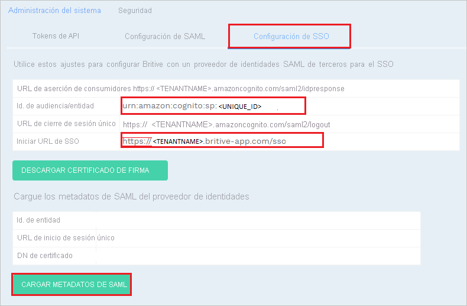
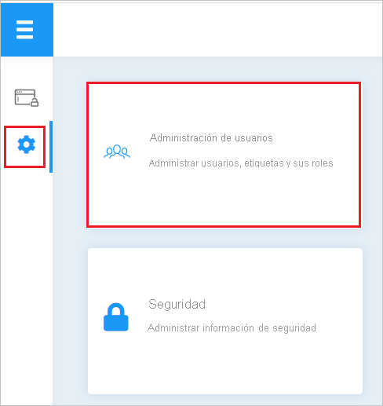
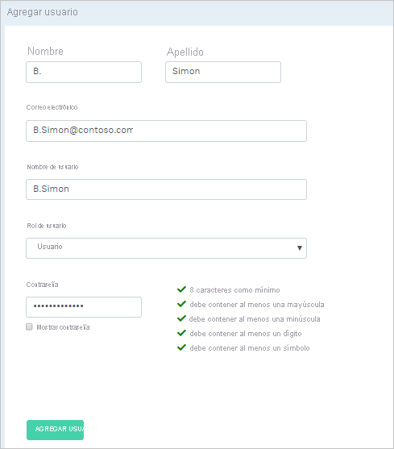

# Tutorial: Integración del inicio de sesión único (SSO) de Azure Active Directory con Britive

En este tutorial aprenderá a integrar Britive con Azure Active Directory (Azure AD). Al integrar Britive con Azure AD, podrá:

* Controlar en Azure AD quién tiene acceso a Britive.
* Permitir que los usuarios inicien sesión automáticamente en Britive con sus cuentas de Azure AD.
* Administrar las cuentas desde una ubicación central (Azure Portal).

## Requisitos previos

Para empezar, necesita los siguientes elementos:

* Una suscripción de Azure AD. Si no tiene una suscripción, puede crear una [cuenta gratuita](https://azure.microsoft.com/free/).
* Una suscripción habilitada para el inicio de sesión único (SSO) en Britive.

## Descripción del escenario

En este tutorial, va a configurar y probar el inicio de sesión único de Azure AD en un entorno de prueba.

* Britive admite el inicio de sesión único iniciado por **SP**.
* Britive admite el [aprovisionamiento automático de usuarios](britive-provisioning-tutorial.md).

## Adición de Britive desde la galería

Para configurar la integración de Britive en Azure AD, es preciso agregar Britive desde la galería a la lista de aplicaciones SaaS administradas.

1. Inicie sesión en Azure Portal con una cuenta personal, profesional o educativa de Microsoft.
1. En el panel de navegación de la izquierda, seleccione el servicio **Azure Active Directory**.
1. Vaya a **Aplicaciones empresariales** y seleccione **Todas las aplicaciones**.
1. Para agregar una nueva aplicación, seleccione **Nueva aplicación**.
1. En la sección **Agregar desde la galería**, escriba **Britive** en el cuadro de búsqueda.
1. Seleccione **Britive** en el panel de resultados y, a continuación, agregue la aplicación. Espere unos segundos mientras la aplicación se agrega al inquilino.

## Configuración y prueba del SSO de Azure AD para Britive

Configure y pruebe el inicio de sesión único de Azure AD con Britive mediante un usuario de prueba llamado **B.Simon**. Para que el inicio de sesión único funcione, es preciso establecer una relación de vinculación entre un usuario de Azure AD y el usuario relacionado de Britive.

Para configurar y probar el inicio de sesión único de Azure AD con Britive, haga lo siguiente:

1. **[Configuración del inicio de sesión único de Azure AD](#configure-azure-ad-sso)** , para permitir que los usuarios puedan utilizar esta característica.
    1. **[Creación de un usuario de prueba de Azure AD](#create-an-azure-ad-test-user)** , para probar el inicio de sesión único de Azure AD con B.Simon.
    1. **[Asignación del usuario de prueba de Azure AD](#assign-the-azure-ad-test-user)** , para habilitar a B.Simon para que use el inicio de sesión único de Azure AD.
1. **[Configuración del inicio de sesión único en Britive](#configure-britive-sso)** : para configurar los valores de inicio de sesión único en la aplicación.
    1. **[Creación de un usuario de prueba de Britive](#create-britive-test-user)** : para tener un homólogo de B.Simon en Britive vinculado a la representación del usuario en Azure AD.
1. **[Prueba del inicio de sesión único](#test-sso)** : para comprobar si la configuración funciona.

## Configuración del inicio de sesión único de Azure AD

Siga estos pasos para habilitar el inicio de sesión único de Azure AD en Azure Portal.

1. En Azure Portal, en la página de integración de la aplicación **Britive**, busque la sección **Administrar** y seleccione **Inicio de sesión único**.
1. En la página **Seleccione un método de inicio de sesión único**, elija **SAML**.
1. En la página **Configuración del inicio de sesión único con SAML**, haga clic en el icono de lápiz de **Configuración básica de SAML** para editar la configuración.

   

1. En la sección **Configuración básica de SAML**, especifique los valores de los siguientes campos:

    a. En el cuadro de texto **URL de inicio de sesión**, escriba una dirección URL con el siguiente patrón: `https://<TENANTNAME>.britive-app.com/sso`

    b. En el cuadro de texto **Identificador (id. de entidad)** , escriba una dirección URL con el siguiente patrón: `urn:amazon:cognito:sp:<UNIQUE_ID>`

    > [!NOTE]
    > Estos valores no son reales. Actualice estos valores con la dirección URL de inicio de sesión y el identificador reales, que se explican más adelante en el tutorial. También puede hacer referencia a los patrones que se muestran en la sección **Configuración básica de SAML** de Azure Portal.

1. En la página **Configurar el inicio de sesión único con SAML**, en la sección **Certificado de firma de SAML**, busque **XML de metadatos de federación** y seleccione **Descargar** para descargar el certificado y guardarlo en su equipo.

    

1. En la sección **Configurar Britive**, copie las direcciones URL adecuadas en función de sus necesidades.

    

### Creación de un usuario de prueba de Azure AD

En esta sección, va a crear un usuario de prueba llamado B.Simon en Azure Portal.

1. En el panel izquierdo de Azure Portal, seleccione **Azure Active Directory**, **Usuarios** y **Todos los usuarios**.
1. Seleccione **Nuevo usuario** en la parte superior de la pantalla.
1. En las propiedades del **usuario**, siga estos pasos:
   1. En el campo **Nombre**, escriba `B.Simon`.  
   1. En el campo **Nombre de usuario**, escriba username@companydomain.extension. Por ejemplo, `B.Simon@contoso.com`.
   1. Active la casilla **Show password** (Mostrar contraseña) y, después, anote el valor que se muestra en el cuadro **Contraseña**.
   1. Haga clic en **Crear**.

### Asignación del usuario de prueba de Azure AD

En esta sección va a permitir que B.Simon acceda a Britive mediante el inicio de sesión único de Azure.

1. En Azure Portal, seleccione sucesivamente **Aplicaciones empresariales** y **Todas las aplicaciones**.
1. En la lista de aplicaciones, seleccione **Britive**.
1. En la página de información general de la aplicación, busque la sección **Administrar** y seleccione **Usuarios y grupos**.
1. Seleccione **Agregar usuario**. A continuación, en el cuadro de diálogo **Agregar asignación**, seleccione **Usuarios y grupos**.
1. En el cuadro de diálogo **Usuarios y grupos**, seleccione **B.Simon** de la lista de usuarios y haga clic en el botón **Seleccionar** de la parte inferior de la pantalla.
1. Si espera que se asigne un rol a los usuarios, puede seleccionarlo en la lista desplegable **Seleccionar un rol**. Si no se ha configurado ningún rol para esta aplicación, verá seleccionado el rol "Acceso predeterminado".
1. En el cuadro de diálogo **Agregar asignación**, haga clic en el botón **Asignar**.

## Configuración del inicio de sesión único de Britive

1. En otra ventana del explorador web, inicie sesión en el sitio web de Britive como administrador.

1. Haga clic en el icono **Admin Settings** (Configuración de administración) y seleccione **Security** (Seguridad).

    

1. Seleccione **SSO Configuration** (Configuración de SSO) y realice los siguientes pasos:

    

    a. Copie el valor de **Audience/Entity ID** (Audiencia/Identificador de entidad) y péguelo en el cuadro de texto **Identificador (Id. de entidad)** de la sección **Configuración básica de SAML** en Azure Portal.

    b. Copie el valor de **Initiate SSO URL** (Inicializar dirección URL de inicio de sesión único) y péguelo en el cuadro de texto **Dirección URL de inicio de sesión** de la sección **Configuración básica de SAML** en Azure Portal.

    c. Haga clic en **UPLOAD SAML METADATA** (Cargar metadatos de SAML) para cargar el archivo XML de metadatos descargado de Azure Portal. Después de cargar el archivo de metadatos, los valores anteriores se rellenarán automáticamente y se guardarán los cambios.

### Creación de un usuario de prueba de Britive

1. En otra ventana del explorador web, inicie sesión en el sitio web de Britive como administrador.

1. Haga clic en el icono **Admin Settings** (Configuración de administración) y seleccione **User Administration** (Administración de usuarios).

    

1. Haga clic en **ADD USER** (Agregar usuario).

    

1. Rellene todos los detalles necesarios del usuario según los requisitos de la organización y haga clic en **ADD USER** (Agregar usuario).

    

> [!NOTE]
>Britive también admite el aprovisionamiento automático de usuarios. [Aquí](./britive-provisioning-tutorial.md) puede encontrar más detalles sobre cómo configurar el aprovisionamiento automático de usuarios.

## Prueba de SSO

En esta sección, probará la configuración de inicio de sesión único de Azure AD con las siguientes opciones. 

* Haga clic en **Probar esta aplicación** en Azure Portal. Esto le redirigirá a la dirección URL de inicio de sesión de Britive, donde puede iniciar el flujo de inicio de sesión. 

* Vaya directamente a la dirección URL de inicio de sesión de Britive e inicie el flujo de inicio de sesión desde allí.

* Puede usar Mis aplicaciones de Microsoft. Al hacer clic en el icono de Britive en Aplicaciones, se le redirigirá a la dirección URL de inicio de sesión de Britive. Para más información acerca de Aplicaciones, consulte [Inicio de sesión e inicio de aplicaciones desde el portal Aplicaciones](../user-help/my-apps-portal-end-user-access.md).

## Pasos siguientes

Una vez que haya configurado Britive, puede aplicar el control de sesión, que protege a su organización, en tiempo real, frente a la filtración e infiltración de información confidencial. El control de sesión procede del acceso condicional. [Aprenda a aplicar el control de sesión con Microsoft Cloud App Security](/cloud-app-security/proxy-deployment-aad).
