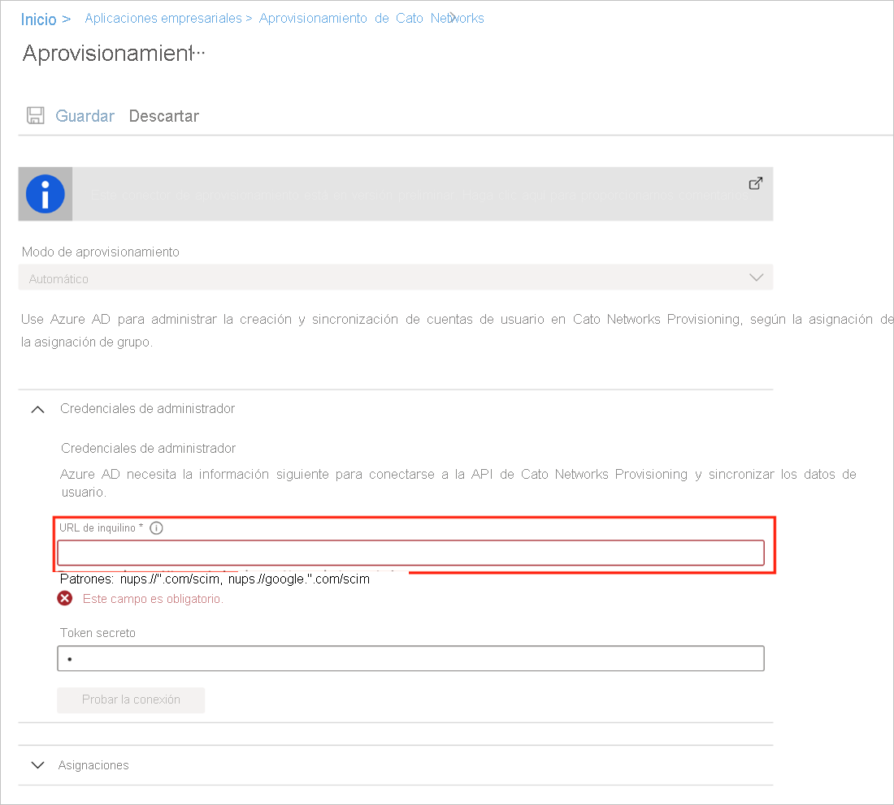

# Tutorial: Configuración de Cato Networks para el aprovisionamiento automático de usuarios

En este tutorial, se describen los pasos que debe realizar en Cato Networks y Azure Active Directory (Azure AD) para configurar el aprovisionamiento automático de usuarios. Cuando se configura, Azure AD aprovisiona y desaprovisiona de forma automática usuarios y grupos en [Cato Networks](https://www.catonetworks.com/) mediante el servicio de aprovisionamiento de Azure AD. Para obtener información importante acerca de lo que hace este servicio, cómo funciona y ver preguntas frecuentes al respecto, consulte [Automatización del aprovisionamiento y desaprovisionamiento de usuarios para aplicaciones SaaS con Azure Active Directory](../app-provisioning/user-provisioning.md). 

## Funcionalidades admitidas
> [!div class="checklist"]
> * Creación de usuarios en Cato Networks
> * Eliminación de usuarios de Cato Networks cuando ya no necesiten acceso
> * Mantenimiento de la sincronización de los atributos de usuario entre Azure AD y Cato Networks
> * Aprovisionamiento de grupos y pertenencias a grupos en Cato Networks

## Requisitos previos

En el escenario descrito en este tutorial se supone que ya cuenta con los requisitos previos siguientes:

* [Un inquilino de Azure AD](../develop/quickstart-create-new-tenant.md) 
* Una cuenta de usuario en Azure AD con [permiso](../roles/permissions-reference.md) para configurar el aprovisionamiento (por ejemplo, Administrador de aplicaciones, Administrador de aplicaciones en la nube, Propietario de la aplicación o Administrador global). 
* Una cuenta de [Cato Networks](https://www.catonetworks.com/).
* Una cuenta de administrador en Cato Networks con permisos de administrador.
* Licencia con un número suficiente de usuarios.

## Paso 1. Planeación de la implementación de aprovisionamiento
1. Obtenga información sobre [cómo funciona el servicio de aprovisionamiento](../app-provisioning/user-provisioning.md).
1. Determine quién estará en el [ámbito de aprovisionamiento](../app-provisioning/define-conditional-rules-for-provisioning-user-accounts.md).
1. Determine qué datos quiere [asignar entre Azure AD y Cato Networks](../app-provisioning/customize-application-attributes.md). 

## Paso 2. Configuración de Cato Networks para admitir el aprovisionamiento con Azure AD

1. Inicie sesión en su cuenta en la [aplicación de administración de Cato](https://cc2.catonetworks.com).
1. En el menú de navegación, seleccione **Configuración > Configuración global** y, a continuación, expanda la sección de **Configuración VPN**.
        
1. Expanda la sección **Aprovisionamiento de SCIM** y habilite el aprovisionamiento de SCIM haciendo clic en **Habilitar aprovisionamiento de SCIM**.
         
1. Copie la dirección URL de base y el token de portador de la aplicación de administración de Cato en la aplicación SCIM de Azure Portal:
   1. En la aplicación de administración de Cato (de la sección **Aprovisionamiento de SCIM),** copie la dirección URL de base.
   1. En la aplicación SCIM de Cato Networks de Azure Portal, en la pestaña **Aprovisionamiento**, pegue la dirección URL de base en el campo **URL del inquilino**.
        
   1. En la aplicación de administración de Cato (de la sección **Aprovisionamiento de SCIM**), haga clic en **Generar token** y copie el token de portador.
   1. En la aplicación SCIM de Cato Networks de Azure Portal, pegue el token de portador en el campo **Token secreto**.
        
1. En la aplicación de administración de Cato (de la sección **Aprovisionamiento de SCIM**), haga clic en **Guardar**. Se ha configurado el aprovisionamiento SCIM entre la cuenta de Cato y Azure AD. 
        
1. Pruebe la conexión entre la aplicación SCIM de Azure y la nube de Cato. En las aplicaciones SCIM de Cato Networks de Azure Portal, en la pestaña **Aprovisionamiento**, haga clic en **Probar conexión**.         
                                  

## Paso 3. Incorporación de Cato Networks desde la galería de aplicaciones de Azure AD

Para empezar a administrar el aprovisionamiento en Cato Networks, agregue Cato Networks desde la galería de aplicaciones de Azure AD. Puede encontrar más información sobre cómo agregar una aplicación desde la galería [aquí](../manage-apps/add-application-portal.md). 

## Paso 4. Determinar quién estará en el ámbito de aprovisionamiento 

El servicio de aprovisionamiento de Azure AD le permite definir quién se aprovisionará, en función de la asignación a la aplicación y de los atributos del usuario o grupo. Si elige el ámbito del que se aprovisionará en la aplicación en función de la asignación, puede usar los pasos [siguientes](../manage-apps/assign-user-or-group-access-portal.md) para asignar usuarios y grupos a la aplicación. Si elige el ámbito del que se aprovisionará en función únicamente de los atributos del usuario o grupo, puede usar un filtro de ámbito, tal como se describe [aquí](../app-provisioning/define-conditional-rules-for-provisioning-user-accounts.md). 

* Al asignar usuarios y grupos a Cato Networks, debe seleccionar un rol que no sea **Acceso predeterminado**. Los usuarios con el rol de acceso predeterminado se excluyen del aprovisionamiento y se marcarán como no autorizados en los registros de aprovisionamiento. Si el único rol disponible en la aplicación es el rol de acceso predeterminado, puede [actualizar el manifiesto de aplicación](../develop/howto-add-app-roles-in-azure-ad-apps.md) para agregar más roles. 

* Empiece por algo pequeño. Pruebe con un pequeño conjunto de usuarios y grupos antes de implementarlo en todos. Cuando el ámbito del aprovisionamiento se define en los usuarios y grupos asignados, puede controlar el aprovisionamiento asignando uno o dos usuarios o grupos a la aplicación. Cuando el ámbito se establece en todos los usuarios y grupos, puede especificar un [filtro de ámbito basado en atributos](../app-provisioning/define-conditional-rules-for-provisioning-user-accounts.md). 

## Paso 5. Configuración del aprovisionamiento automático de usuarios en Cato Networks 

Esta sección le guía por los pasos necesarios para configurar el servicio de aprovisionamiento de Azure AD a fin de crear, actualizar y deshabilitar usuarios o grupos en Cato Networks en función de las asignaciones de usuarios y grupos de Azure AD.

### Para configurar el aprovisionamiento automático de usuarios para Cato Networks en Azure AD:

1. Inicie sesión en [Azure Portal](https://portal.azure.com). Seleccione **Aplicaciones empresariales** y luego **Todas las aplicaciones**.

    

1. En la lista de aplicaciones, seleccione **Cato Networks**.

    

1. Seleccione la pestaña **Aprovisionamiento**.

    

1. Establezca el **modo de aprovisionamiento** en **Automático**.

    

1. En la sección **Credenciales de administrador**, escriba los valores de URL de inquilino y de token secreto de Cato Networks. Haga clic en **Probar conexión** para comprobar que Azure AD puede conectarse a Cato Networks. Si la conexión no se establece, asegúrese de que la cuenta de Cato Networks tenga permisos de administrador e inténtelo de nuevo.

    

1. En el campo **Correo electrónico de notificación**, escriba la dirección de correo electrónico de una persona o grupo que deba recibir las notificaciones de error de aprovisionamiento y active la casilla **Enviar una notificación por correo electrónico cuando se produzca un error**.

    

1. Seleccione **Guardar**.

1. En la sección **Asignaciones**, seleccione **Sincronizar usuarios de Azure Active Directory con Cato Networks**.

1. Examine los atributos de usuario que se sincronizan entre Azure AD y Cato Networks en la sección **Asignación de atributos**. Los atributos seleccionados como propiedades **Coincidentes** se usan para establecer correspondencia con las cuentas de usuario de Cato Networks a fin de realizar operaciones de actualización. Si decide cambiar el [atributo de destino coincidente](../app-provisioning/customize-application-attributes.md), deberá asegurarse de que la API de Cato Networks admite el filtrado de usuarios basado en ese atributo. Seleccione el botón **Guardar** para confirmar los cambios.

   |Atributo|Tipo|Compatible con el filtrado|
   |---|---|---|
   |userName|String|&check;
   |emails[type eq "work"].value|String|
   |active|Boolean|
   |externalId|String|
   |name.givenName|String|
   |name.familyName|String|
   |phoneNumbers[type eq "work"].value|String|

1. En la sección **Asignaciones**, seleccione **Sincronizar grupos de Azure Active Directory con Cato Networks**.

1. Examine los atributos de grupo que se sincronizan entre Azure AD y Cato Networks en la sección **Asignación de atributos**. Los atributos seleccionados como propiedades **Coincidentes** se usan para establecer correspondencia con los grupos de Cato Networks para operaciones de actualización. Seleccione el botón **Guardar** para confirmar los cambios.

      |Atributo|Tipo|Compatible con el filtrado|
      |---|---|---|
      |DisplayName|String|&check;
      |externalId|String|
      |members|Referencia|

1. Para configurar filtros de ámbito, consulte las siguientes instrucciones, que se proporcionan en el artículo [Aprovisionamiento de aplicaciones basado en atributos con filtros de ámbito](../app-provisioning/define-conditional-rules-for-provisioning-user-accounts.md).

1. Para habilitar el servicio de aprovisionamiento de Azure AD con Cato Networks, cambie el **estado de aprovisionamiento** a **Activado** en la sección **Configuración**.

    

1. Elija los valores deseados en **Ámbito**, en la sección **Configuración**, para definir los usuarios o grupos que desea aprovisionar en Cato Networks.

    

1. Cuando esté listo para realizar el aprovisionamiento, haga clic en **Guardar**.

    

Esta operación inicia el ciclo de sincronización inicial de todos los usuarios y grupos definidos en **Ámbito** en la sección **Configuración**. El ciclo de sincronización inicial tarda más tiempo en realizarse que los ciclos posteriores, que se producen aproximadamente cada 40 minutos si el servicio de aprovisionamiento de Azure AD está ejecutándose. 

## Paso 6. Supervisión de la implementación
Una vez configurado el aprovisionamiento, use los recursos siguientes para supervisar la implementación:

* Use los [registros de aprovisionamiento](../reports-monitoring/concept-provisioning-logs.md) para determinar qué usuarios se han aprovisionado correctamente o sin éxito.
* Consulte la [barra de progreso](../app-provisioning/application-provisioning-when-will-provisioning-finish-specific-user.md) para ver el estado del ciclo de aprovisionamiento y cuánto falta para que finalice
* Si la configuración de aprovisionamiento parece estar en mal estado, la aplicación pasará a estar en cuarentena. Más información sobre los estados de cuarentena [aquí](../app-provisioning/application-provisioning-quarantine-status.md).  

## Más recursos

* [Administración del aprovisionamiento de cuentas de usuario para aplicaciones empresariales](../app-provisioning/configure-automatic-user-provisioning-portal.md)
* [¿Qué es el acceso a aplicaciones y el inicio de sesión único con Azure Active Directory?](../manage-apps/what-is-single-sign-on.md)

## Pasos siguientes

* [Aprenda a revisar los registros y a obtener informes sobre la actividad de aprovisionamiento](../app-provisioning/check-status-user-account-provisioning.md)