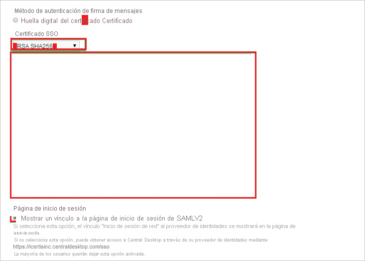

# Tutorial: integración de Azure Active Directory con Central Desktop

En este tutorial, obtendrá información sobre cómo integrar Central Desktop con Azure Active Directory (Azure AD). Al integrar Central Desktop con Azure AD, puede hacer lo siguiente:

* Controlar en Azure AD quién tiene acceso a Central Desktop.
* Permitir que los usuarios inicien sesión automáticamente en Central Desktop con sus cuentas de Azure AD.
* Administrar las cuentas desde una ubicación central (Azure Portal).

## Requisitos previos

Para empezar, necesita los siguientes elementos:

* Una suscripción de Azure AD. Si no tiene una suscripción, puede crear una [cuenta gratuita](https://azure.microsoft.com/free/).
* Una suscripción a Central Desktop con el inicio de sesión único (SSO) habilitado.

## Descripción del escenario

En este tutorial, puede configurar y probar el inicio de sesión único de Azure AD en un entorno de prueba.

* Central Desktop admite el inicio de sesión único iniciado por **SP**.

## Agregar Central Desktop desde la galería

Para configurar la integración de Central Desktop en Azure AD, deberá agregar Central Desktop desde la galería a la lista de aplicaciones SaaS administradas.

1. Inicie sesión en Azure Portal con una cuenta personal, profesional o educativa de Microsoft.
1. En el panel de navegación de la izquierda, seleccione el servicio **Azure Active Directory**.
1. Vaya a **Aplicaciones empresariales** y seleccione **Todas las aplicaciones**.
1. Para agregar una nueva aplicación, seleccione **Nueva aplicación**.
1. En la sección **Agregar desde la galería**, escriba **Central Desktop** en el cuadro de búsqueda.
1. Seleccione **Central Desktop** en el panel de resultados y agregue la aplicación. Espere unos segundos mientras la aplicación se agrega al inquilino.

## Configuración y prueba del inicio de sesión único de Azure AD para Central Desktop

Configure y pruebe el inicio de sesión único de Azure AD con Central Desktop mediante un usuario de prueba llamado **B.Simon**. Para que el inicio de sesión único funcione, es necesario establecer una relación de vinculación entre un usuario de Azure AD y el usuario correspondiente de Central Desktop.

Para configurar y probar el inicio de sesión único de Azure AD con Central Desktop, complete los siguientes pasos:

1. **[Configuración del inicio de sesión único de Azure AD](#configure-azure-ad-sso)** , para permitir que los usuarios puedan utilizar esta característica.
    1. **[Creación de un usuario de prueba de Azure AD](#create-an-azure-ad-test-user)** , para probar el inicio de sesión único de Azure AD con B.Simon.
    1. **[Asignación del usuario de prueba de Azure AD](#assign-the-azure-ad-test-user)** , para habilitar a B.Simon para que use el inicio de sesión único de Azure AD.
1. **[Configuración del inicio de sesión único en Central Desktop](#configure-central-desktop-sso)** : para configurar los valores de inicio de sesión único en la aplicación.
    1. **[Creación del usuario de prueba de Central Desktop](#create-central-desktop-test-user)** : para tener un homólogo de B. Simon en Central Desktop vinculado a la representación del usuario en Azure AD.
1. **[Prueba del inicio de sesión único](#test-sso)** : para comprobar si la configuración funciona.

## Configuración del inicio de sesión único de Azure AD

Siga estos pasos para habilitar el inicio de sesión único de Azure AD en Azure Portal.

1. En Azure Portal, en la página de integración de aplicaciones de **Central Desktop**, busque la sección **Administrar** y seleccione **Inicio de sesión único**.
1. En la página **Seleccione un método de inicio de sesión único**, elija **SAML**.
1. En la página **Configuración del inicio de sesión único con SAML**, haga clic en el icono de lápiz de **Configuración básica de SAML** para editar la configuración.

   

4. En la sección **Configuración básica de SAML**, siga estos pasos:

    a. En el cuadro **Identificador**, escriba una dirección URL con uno de los siguientes patrones:

    | **Identificador** |
    |-------|
    | `https://<companyname>.centraldesktop.com/saml2-metadata.php` |
    | `https://<companyname>.imeetcentral.com/saml2-metadata.php` |

    b. En el cuadro de texto **URL de respuesta**, escriba una dirección URL con el siguiente patrón: `https://<companyname>.centraldesktop.com/saml2-assertion.php`

    c. En el cuadro de texto **URL de inicio de sesión**, escriba una dirección URL con el siguiente patrón: `https://<companyname>.centraldesktop.com`

    > [!NOTE]
    > Estos valores no son reales. Actualice estos valores con los valores reales de Identificador, URL de respuesta y URL de inicio de sesión. Póngase en contacto con el [equipo de soporte técnico para clientes de Central Desktop](https://imeetcentral.com/contact-us) para obtener estos valores. También puede hacer referencia a los patrones que se muestran en la sección **Configuración básica de SAML** de Azure Portal.

5. En la página **Configurar el inicio de sesión único con SAML**, en la sección **Certificado de firma de SAML**, haga clic en **Descargar** para descargar el **certificado (sin procesar)** de las opciones proporcionadas según sus requisitos y guárdelo en el equipo.

    

6. En la sección **Set up Central Desktop** (Configurar Central Desktop), copie las direcciones URL que necesite.

    

### Creación de un usuario de prueba de Azure AD

En esta sección, va a crear un usuario de prueba llamado B.Simon en Azure Portal.

1. En el panel izquierdo de Azure Portal, seleccione **Azure Active Directory**, **Usuarios** y **Todos los usuarios**.
1. Seleccione **Nuevo usuario** en la parte superior de la pantalla.
1. En las propiedades del **usuario**, siga estos pasos:
   1. En el campo **Nombre**, escriba `B.Simon`.  
   1. En el campo **Nombre de usuario**, escriba username@companydomain.extension. Por ejemplo, `B.Simon@contoso.com`.
   1. Active la casilla **Show password** (Mostrar contraseña) y, después, anote el valor que se muestra en el cuadro **Contraseña**.
   1. Haga clic en **Crear**.

### Asignación del usuario de prueba de Azure AD

En esta sección, habilitará a Britta Simon para que use el inicio de sesión único de Azure concediéndole acceso a Central Desktop.

1. En Azure Portal, seleccione sucesivamente **Aplicaciones empresariales** y **Todas las aplicaciones**.
1. En la lista de aplicaciones, seleccione **Central Desktop**.
1. En la página de información general de la aplicación, busque la sección **Administrar** y seleccione **Usuarios y grupos**.
1. Seleccione **Agregar usuario**. A continuación, en el cuadro de diálogo **Agregar asignación**, seleccione **Usuarios y grupos**.
1. En el cuadro de diálogo **Usuarios y grupos**, seleccione **B.Simon** de la lista de usuarios y haga clic en el botón **Seleccionar** de la parte inferior de la pantalla.
1. Si espera que se asigne un rol a los usuarios, puede seleccionarlo en la lista desplegable **Seleccionar un rol**. Si no se ha configurado ningún rol para esta aplicación, verá seleccionado el rol "Acceso predeterminado".
1. En el cuadro de diálogo **Agregar asignación**, haga clic en el botón **Asignar**.

## Configuración de SSO en Central Desktop

1. Inicie sesión en su inquilino de **Central Desktop**.

2. Vaya a **Configuración**. Seleccione **Avanzado** y, a continuación, seleccione **Inicio de sesión único**.

    

3. En la página **Configuración de inicio de sesión único**, siga estos pasos:

    

    a. Seleccione **Habilitar inicio de sesión único de SAML v2**.

    b. En el cuadro **SSO URL** (URL de SSO), pegue el **Identificador de Azure AD** que copió de Azure Portal.

    c. En el cuadro **SSO Login URL** (URL de inicio de sesión de SSO), pegue la **Dirección URL de inicio de sesión** que copió de Azure Portal.

    d. En el cuadro **SSO Logout URL** (URL de cierre de sesión de SSO), pegue la **Dirección URL de cierre de sesión** que copió de Azure Portal.

4. En la sección **Método de verificación de firmas de mensajes**, siga estos pasos:

    

    a. Seleccione **Certificado**.

    b. En la lista **SSO Certificate** (Certificado de SSO), seleccione **RSH SHA256**.

    c. Abra el certificado descargado en el Bloc de notas. A continuación, copie el contenido del certificado y péguelo en el campo **SSO Certificate** (Certificado de SSO).

    d. Seleccione **Mostrar un vínculo a la página de inicio de sesión de SAMLv2**.

    e. Seleccione **Actualizar**.

### Creación del usuario de prueba de Central Desktop

Para que los usuarios de Azure AD puedan iniciar sesión, deben aprovisionarse en la aplicación Central Desktop. En esta sección se describe cómo crear cuentas de usuario de Azure AD en Central Desktop.

> [!NOTE]
> Puede usar cualquier otra API o herramienta de creación de cuentas de usuario de Central Desktop que ofrezca Central Desktop para aprovisionar cuentas de usuario de Azure AD.

**Para el aprovisionamiento de cuentas de usuario a Central Desktop:**

1. Inicie sesión en su inquilino de Central Desktop.

2. Seleccione **People** (Personas) y **Add Internal Members** (Agregar miembros internos).

    

3. En el cuadro de texto **Email Address of New Members** (Dirección de correo electrónico de nuevos miembros), escriba una cuenta de Azure AD que quiera aprovisionar y luego haga clic en **Siguiente**.

    ")

4. Seleccione **Add Internal Members** (Agregar miembros internos).

    ")

   > [!NOTE]
   > Los usuarios que se agregan reciben un correo electrónico que incluye un vínculo de confirmación para activar sus cuentas.

## Prueba de SSO

En esta sección, probará la configuración de inicio de sesión único de Azure AD con las siguientes opciones. 

* Haga clic en **Probar esta aplicación** en Azure Portal. Esta acción le redirigirá a la URL de inicio de sesión de Central Desktop, donde puede poner en marcha el flujo de inicio de sesión. 

* Acceda directamente a la URL de inicio de sesión de Central Desktop y ponga en marcha el flujo de inicio de sesión desde ahí.

* Puede usar Mis aplicaciones de Microsoft. Al hacer clic en el icono de Central Desktop en Aplicaciones, se le redirigirá a la URL de inicio de sesión de esa plataforma. Para más información acerca de Aplicaciones, consulte [Inicio de sesión e inicio de aplicaciones desde el portal Aplicaciones](../user-help/my-apps-portal-end-user-access.md).

## Pasos siguientes

Una vez que haya configurado Central Desktop, puede aplicar el control de sesión, que protege su organización en tiempo real frente a la filtración e infiltración de información confidencial. El control de sesión procede del acceso condicional. [Aprenda a aplicar el control de sesión con Microsoft Cloud App Security](/cloud-app-security/proxy-deployment-aad).