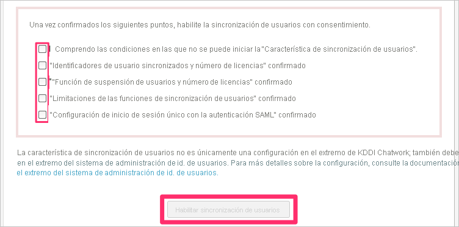
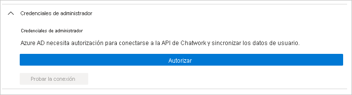

# Tutorial: Configuración de Chatwork para el aprovisionamiento automático de usuarios

En este tutorial, se explican los pasos que debe seguir en Chatwork y Azure Active Directory (Azure AD) para configurar el aprovisionamiento automático de usuarios. Cuando esta funcionalidad está configurada, Azure AD aprovisiona y desaprovisiona de forma automática usuarios y grupos en [Chatwork](https://corp.chatwork.com/) utilizando el servicio de aprovisionamiento de Azure AD. Para obtener información importante acerca de lo que hace este servicio, cómo funciona y ver preguntas frecuentes al respecto, consulte [Automatización del aprovisionamiento y desaprovisionamiento de usuarios para aplicaciones SaaS con Azure Active Directory](../app-provisioning/user-provisioning.md). 

## Funcionalidades admitidas
> [!div class="checklist"]
> * Creación de usuarios en Chatwork
> * Eliminación de usuarios de Chatwork cuando ya no necesitan acceso
> * Mantenimiento de la sincronización de los atributos de usuario entre Azure AD y Clebex
> * [Inicio de sesión único](chatwork-tutorial.md) en Chatwork (obligatorio)

## Requisitos previos

En el escenario descrito en este tutorial se supone que ya cuenta con los requisitos previos siguientes:

* [Un inquilino de Azure AD](../develop/quickstart-create-new-tenant.md). 
* Una cuenta de usuario en Azure AD con [permiso](../roles/permissions-reference.md) para configurar el aprovisionamiento (por ejemplo, Administrador de aplicaciones, Administrador de aplicaciones en la nube, Propietario de la aplicación o Administrador global). 
* Un inquilino de [Chatwork](https://corp.chatwork.com/).
* Una cuenta de usuario de Chatwork con permisos de administrador.
* Las organizaciones que hayan contratado Chatwork Enterprise Plan o KDDI Chatwork.

## Paso 1. Planeación de la implementación de aprovisionamiento
1. Obtenga información sobre [cómo funciona el servicio de aprovisionamiento](../app-provisioning/user-provisioning.md).
1. Determine quién estará en el [ámbito de aprovisionamiento](../app-provisioning/define-conditional-rules-for-provisioning-user-accounts.md).
1. Determine qué datos quiere [asignar entre Azure AD y Chatwork](../app-provisioning/customize-application-attributes.md). 

## Paso 2. Configuración de Chatwork para admitir el aprovisionamiento con Azure AD

### 1. Abra **User Synchronization** (Sincronización de usuarios) desde la página de administración de Chatwork.

Acceda al portal de administración de Chatwork como un usuario con derechos de administrador. Si tiene privilegios de administrador, podrá acceder a la página **User Synchronization** (Sincronización de usuarios). 

La página **User Synchronization** (Sincronización de usuarios) contiene notas y restricciones sobre el uso de la característica de aprovisionamiento de usuarios. Consulte todos los elementos.

### 2. Configure los valores de inicio de sesión de SAML.

Si usa Azure AD y el aprovisionamiento de usuarios, inicie sesión en Chatwork con su identificador de Azure AD. 

### 3. Active las casillas después de aceptar las diferentes opciones.

Active las casillas después de aceptar las precauciones y restricciones para usar la función de aprovisionamiento de usuarios.

Cuando todos los elementos estén activados, haga clic en **Enable user synchronization** (Habilitar la sincronización de usuarios).

Cuando la función de aprovisionamiento de usuarios esté habilitada, aparecerá un mensaje en la parte superior de la página.

## Paso 3. Adición de Chatwork desde la galería de aplicaciones de Azure AD

Para empezar a administrar el aprovisionamiento en Chatwork, agregue esta aplicación desde la galería de aplicaciones de Azure AD. Si anteriormente configuró el inicio de sesión único de Chatwork, puede usar la misma aplicación. Sin embargo, se recomienda que cree una aplicación independiente al probar la integración inicialmente. Puede encontrar más información sobre cómo agregar una aplicación desde la galería [aquí](../manage-apps/add-application-portal.md).

## Paso 4. Determinar quién estará en el ámbito de aprovisionamiento 

El servicio de aprovisionamiento de Azure AD le permite definir quién se aprovisionará, en función de la asignación a la aplicación y de los atributos del usuario o grupo. Si elige el ámbito del que se aprovisionará en la aplicación en función de la asignación, puede usar los pasos [siguientes](../manage-apps/assign-user-or-group-access-portal.md) para asignar usuarios y grupos a la aplicación. Si elige el ámbito del que se aprovisionará en función únicamente de los atributos del usuario o grupo, puede usar un filtro de ámbito, tal como se describe [aquí](../app-provisioning/define-conditional-rules-for-provisioning-user-accounts.md). 

* Para asignar usuarios y grupos a Chatwork, debe seleccionar un rol que no sea **Acceso predeterminado**. Los usuarios con el rol de acceso predeterminado se excluyen del aprovisionamiento y se marcarán como no autorizados en los registros de aprovisionamiento. Si el único rol disponible en la aplicación es el rol de acceso predeterminado, puede [actualizar el manifiesto de aplicación](../develop/howto-add-app-roles-in-azure-ad-apps.md) para agregar más roles. 

* Empiece por algo pequeño. Pruebe con un pequeño conjunto de usuarios y grupos antes de implementarlo en todos. Cuando el ámbito del aprovisionamiento se define en los usuarios y grupos asignados, puede controlarlo asignando uno o dos usuarios o grupos a la aplicación. Cuando el ámbito se establece en todos los usuarios y grupos, puede especificar un [filtro de ámbito basado en atributos](../app-provisioning/define-conditional-rules-for-provisioning-user-accounts.md). 

## Paso 5. Configuración del aprovisionamiento automático de usuarios en Chatwork 

En esta sección, se explican los pasos necesarios para configurar el servicio de aprovisionamiento de Azure AD para crear, actualizar y deshabilitar usuarios o grupos de Chatwork en función de las asignaciones de grupos o usuarios de Azure AD.

### Para configurar el aprovisionamiento automático de usuarios para Chatwork en Azure AD:

1. Inicie sesión en [Azure Portal](https://portal.azure.com). Seleccione **Aplicaciones empresariales** y luego **Todas las aplicaciones**.

    

1. En la lista de aplicaciones, seleccione **Chatwork**.

    

1. Seleccione la pestaña **Aprovisionamiento**.

    

1. Establezca el **modo de aprovisionamiento** en **Automático**.

    

1. En la sección **Credenciales de administrador**, haga clic en Autorizar y escriba las credenciales de administración de su cuenta de Chatwork. Haga clic en **Probar conexión** para comprobar que Azure AD puede conectarse a Chatwork. Si la conexión no se establece, asegúrese de que la cuenta de Chatwork tiene permisos de administrador y pruebe de nuevo.

   
1. En el campo **Correo electrónico de notificación**, escriba la dirección de correo electrónico de una persona o grupo que deba recibir las notificaciones de error de aprovisionamiento y active la casilla **Enviar una notificación por correo electrónico cuando se produzca un error**.

    

1. Seleccione **Guardar**.

1. En la sección **Asignaciones**, seleccione **Synchronize Azure Active Directory Users to Chatwork** (Sincronizar usuarios de Azure Active Directory con Chatwork).

1. Examine los atributos de usuario que se sincronizan entre Azure AD y Chatwork en la sección **Asignación de atributos**. Los atributos seleccionados como propiedades **Coincidentes** se usan para establecer correspondencias con las cuentas de usuario de Chatwork en las operaciones de actualización. Si decide cambiar el [atributo de destino coincidente](../app-provisioning/customize-application-attributes.md), deberá asegurarse de que la API de Chatwork permite filtrar usuarios utilizando ese atributo. Seleccione el botón **Guardar** para confirmar los cambios.

   |Atributo|Tipo|Compatible con el filtrado|
   |---|---|---|
   |userName|String|&check;
   |active|Boolean|   
   |title|String|
   |externalId|String|
   |urn:ietf:params:scim:schemas:extension:enterprise:2.0:User:department|String|
   |urn:ietf:params:scim:schemas:extension:enterprise:2.0:User:organization|String|

1. Para configurar filtros de ámbito, consulte las siguientes instrucciones, que se proporcionan en el artículo [Aprovisionamiento de aplicaciones basado en atributos con filtros de ámbito](../app-provisioning/define-conditional-rules-for-provisioning-user-accounts.md).

1. Si desea habilitar el servicio de aprovisionamiento de Azure AD para Chatwork, cambie el **Estado de aprovisionamiento** a **Activado** en la sección **Configuración**.

    

1. Elija los valores que desee en la opción **Ámbito** de la sección **Configuración** para definir los usuarios o grupos que desee aprovisionar en Chatwork.

    

1. Cuando esté listo para realizar el aprovisionamiento, haga clic en **Guardar**.

    

Esta operación inicia el ciclo de sincronización inicial de todos los usuarios y grupos definidos en **Ámbito** en la sección **Configuración**. El ciclo de sincronización inicial tarda más tiempo en realizarse que los ciclos posteriores, que se producen aproximadamente cada 40 minutos si el servicio de aprovisionamiento de Azure AD está ejecutándose. 

## Paso 6. Supervisión de la implementación
Una vez configurado el aprovisionamiento, use los recursos siguientes para supervisar la implementación:

* Use los [registros de aprovisionamiento](../reports-monitoring/concept-provisioning-logs.md) para determinar qué usuarios se han aprovisionado correctamente o sin éxito.
* Consulte la [barra de progreso](../app-provisioning/application-provisioning-when-will-provisioning-finish-specific-user.md) para ver el estado del ciclo de aprovisionamiento y cuánto falta para que finalice.
* Si la configuración de aprovisionamiento parece estar en mal estado, la aplicación pasará a estar en cuarentena. Más información sobre los estados de cuarentena [aquí](../app-provisioning/application-provisioning-quarantine-status.md).  

## Más recursos

* [Administración del aprovisionamiento de cuentas de usuario para aplicaciones empresariales](../app-provisioning/configure-automatic-user-provisioning-portal.md)
* [¿Qué es el acceso a aplicaciones y el inicio de sesión único con Azure Active Directory?](../manage-apps/what-is-single-sign-on.md)

## Pasos siguientes

* [Aprenda a revisar los registros y a obtener informes sobre la actividad de aprovisionamiento](../app-provisioning/check-status-user-account-provisioning.md)