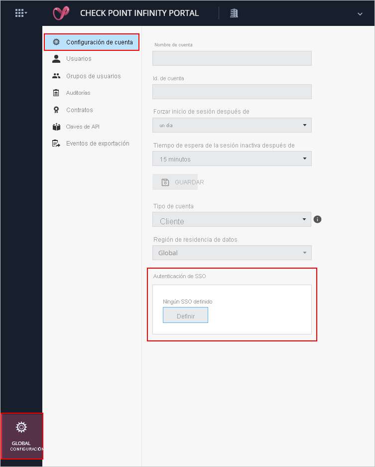
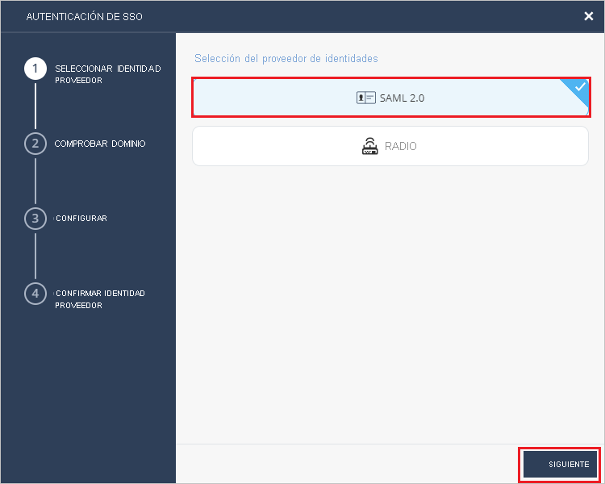
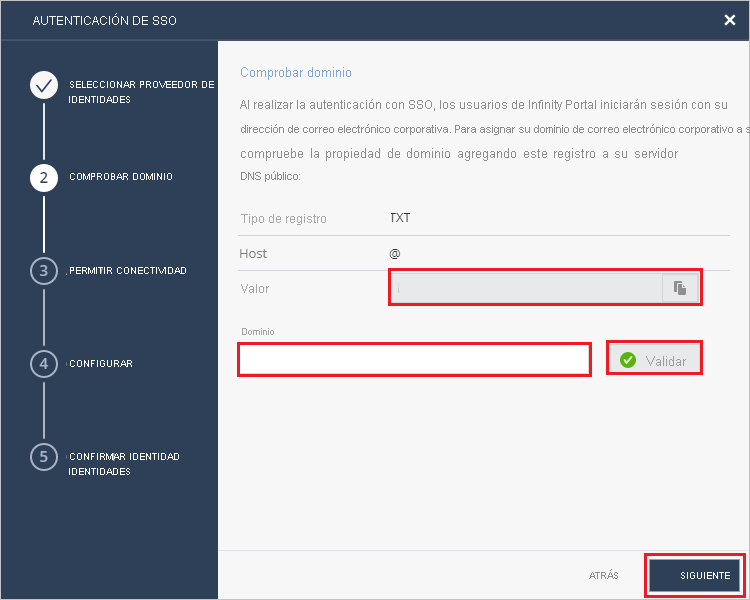
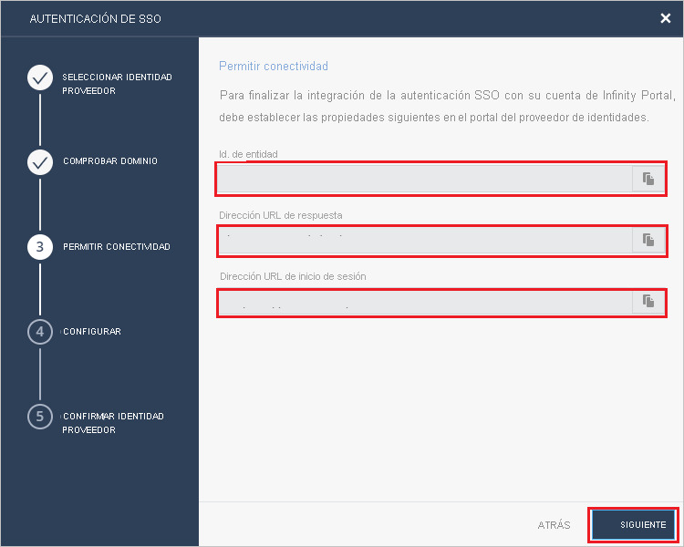
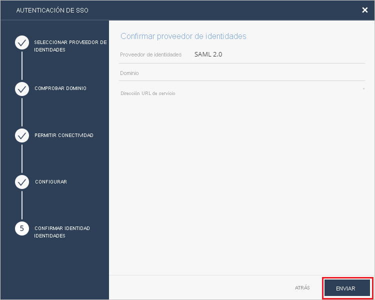

# Tutorial: Integración del inicio de sesión único (SSO) de Azure Active Directory con Check Point Infinity Portal

En este tutorial, aprenderá a integrar Check Point Infinity Portal con Azure Active Directory (Azure AD). Al integrar Check Point Infinity Portal con Azure AD, puede hacer lo siguiente:

* Controlar en Azure AD quién tiene acceso a Check Point Infinity Portal.
* Permitir que los usuarios inicien sesión automáticamente en Check Point Infinity Portal con sus cuentas de Azure AD.
* Administrar las cuentas desde una ubicación central (Azure Portal).

## Requisitos previos

Para empezar, necesita los siguientes elementos:

* Una suscripción de Azure AD. Si no tiene una suscripción, puede crear una [cuenta gratuita](https://azure.microsoft.com/free/).
* Una suscripción habilitada para inicio de sesión único (SSO) en Check Point Infinity Portal.

## Descripción del escenario

En este tutorial, va a configurar y probar el inicio de sesión único de Azure AD en un entorno de prueba.

* Check Point Infinity Portal admite el inicio de sesión único iniciado por **SP**.

* Check Point Infinity Portal admite el aprovisionamiento de usuarios **Just-In-Time**.

> [!NOTE]
> El identificador de esta aplicación es un valor de cadena fijo, por lo que solo se puede configurar una instancia en un inquilino.

## Adición de Check Point Infinity Portal desde la galería

Para configurar la integración de Check Point Infinity Portal en Azure AD, es preciso agregar Check Point Infinity Portal desde la galería hasta la lista de aplicaciones SaaS administradas.

1. Inicie sesión en Azure Portal con una cuenta personal, profesional o educativa de Microsoft.
1. En el panel de navegación de la izquierda, seleccione el servicio **Azure Active Directory**.
1. Vaya a **Aplicaciones empresariales** y seleccione **Todas las aplicaciones**.
1. Para agregar una nueva aplicación, seleccione **Nueva aplicación**.
1. En la sección **Agregar desde la galería**, escriba **Check Point Infinity Portal** en el cuadro de búsqueda.
1. Seleccione **Check Point Infinity Portal** en el panel de resultados y agregue la aplicación. Espere unos segundos mientras la aplicación se agrega al inquilino.

## Configuración y prueba del inicio de sesión único de Azure AD para Check Point Infinity Portal

Utilice un usuario de prueba llamado **B.Simon** para configurar y probar el inicio de sesión único de Azure AD con Check Point Infinity Portal. Para que el inicio de sesión único funcione, es necesario establecer una relación de vinculación entre un usuario de Azure AD y el usuario relacionado de Check Point Infinity Portal.

Para configurar y probar el inicio de sesión único de Azure AD con Check Point Infinity Portal, siga estos pasos:

1. **[Configuración del inicio de sesión único de Azure AD](#configure-azure-ad-sso)** , para permitir que los usuarios puedan utilizar esta característica.
    1. **[Creación de un usuario de prueba de Azure AD](#create-an-azure-ad-test-user)** , para probar el inicio de sesión único de Azure AD con B.Simon.
    1. **[Asignación del usuario de prueba de Azure AD](#assign-the-azure-ad-test-user)** , para habilitar a B.Simon para que use el inicio de sesión único de Azure AD.
1. **[Configuración del inicio de sesión único de Check Point Infinity Portal](#configure-check-point-infinity-portal-sso)** , para configurar los valores del inicio de sesión único en la aplicación.
    1. **[Creación de un usuario de prueba de Check Point Infinity Portal](#create-check-point-infinity-portal-test-user)** , para tener un homólogo de B.Simon en Check Point Infinity Portal que esté vinculado a la representación del usuario en Azure AD.
1. **[Prueba del inicio de sesión único](#test-sso)** : para comprobar si la configuración funciona.

## Configuración del inicio de sesión único de Azure AD

Siga estos pasos para habilitar el inicio de sesión único de Azure AD en Azure Portal.

1. En Azure Portal, en la página de integración de aplicaciones **Check Point Infinity Portal**, busque la sección **Administrar** y seleccione **Inicio de sesión único**.
1. En la página **Seleccione un método de inicio de sesión único**, elija **SAML**.
1. En la página **Configuración del inicio de sesión único con SAML**, haga clic en el icono de lápiz de **Configuración básica de SAML** para editar la configuración.

   

1. En la sección **Configuración básica de SAML**, siga estos pasos:

    a. En el cuadro de texto **Identificador**, escriba uno de los valores siguientes:

    | Entorno | Identificador |
    |-------------| -------------|
    | EU/US | `cloudinfra.checkpoint.com` |
    | AP | `ap.portal.checkpoint.com` |
    |

    b. En el cuadro de texto **URL de respuesta**, escriba una de las siguientes direcciones URL:

    | Entorno | URL de respuesta |
    |-------------| -------------|
    | EU/US | `https://portal.checkpoint.com/` |
    | AP | `https://ap.portal.checkpoint.com/` |
    |

    c. En el cuadro de texto **Sign on URL** (Dirección URL de inicio de sesión), escriba una de las siguientes direcciones URL:

    | Entorno | Dirección URL de inicio de sesión |
    |-------------| -------------|
    | EU/US | `https://portal.checkpoint.com/` |
    | AP | `https://ap.portal.checkpoint.com/` |
    |

1. En la página **Configurar el inicio de sesión único con SAML**, en la sección **Certificado de firma de SAML**, busque **XML de metadatos de federación** y seleccione **Descargar** para descargar el certificado y guardarlo en su equipo.

    

1. En la sección **Configurar Set up Check Point Infinity Portal**, copie las direcciones URL adecuadas según sus necesidades.

    

### Creación de un usuario de prueba de Azure AD

En esta sección, va a crear un usuario de prueba llamado B.Simon en Azure Portal.

1. En el panel izquierdo de Azure Portal, seleccione **Azure Active Directory**, **Usuarios** y **Todos los usuarios**.
1. Seleccione **Nuevo usuario** en la parte superior de la pantalla.
1. En las propiedades del **usuario**, siga estos pasos:
   1. En el campo **Nombre**, escriba `B.Simon`.  
   1. En el campo **Nombre de usuario**, escriba username@companydomain.extension. Por ejemplo, `B.Simon@contoso.com`.
   1. Active la casilla **Show password** (Mostrar contraseña) y, después, anote el valor que se muestra en el cuadro **Contraseña**.
   1. Haga clic en **Crear**.

### Asignación del usuario de prueba de Azure AD

En esta sección, va a permitir que B.Simon acceda a Check Point Infinity Portal mediante el inicio de sesión único de Azure.

1. En Azure Portal, seleccione sucesivamente **Aplicaciones empresariales** y **Todas las aplicaciones**.
1. En la lista de aplicaciones, seleccione **Check Point Infinity Portal**.
1. En la página de información general de la aplicación, busque la sección **Administrar** y seleccione **Usuarios y grupos**.
1. Seleccione **Agregar usuario**. A continuación, en el cuadro de diálogo **Agregar asignación**, seleccione **Usuarios y grupos**.
1. En el cuadro de diálogo **Usuarios y grupos**, seleccione **B.Simon** de la lista de usuarios y haga clic en el botón **Seleccionar** de la parte inferior de la pantalla.
1. Si espera que se asigne un rol a los usuarios, puede seleccionarlo en la lista desplegable **Seleccionar un rol**. Si no se ha configurado ningún rol para esta aplicación, verá seleccionado el rol "Acceso predeterminado".
1. En el cuadro de diálogo **Agregar asignación**, haga clic en el botón **Asignar**.

## Configuración del SSO de Check Point Infinity Portal

1. Regístrese como administrador en el sitio de la compañía de Check Point Infinity Portal.

2. Vaya a **Configuración global** > **Configuración de la cuenta** y haga clic en **Definir** en "Autenticación de SSO".
   
    

3. En la página **Autenticación de SSO**, seleccione **SAML 2.0** como **PROVEEDOR DE IDENTIDADES** y haga clic en **SIGUIENTE**.
     
   

4. En la sección **COMPROBAR DOMINIO**, siga estos pasos:

   
 
   a. Copie los valores de registro DNS y agréguelos a los valores DNS del servidor DNS de la compañía. 

   b. Escriba el nombre de dominio de su compañía en el campo **Dominio** y haga clic en **Validar**. 

   c. Espere a que Check Point apruebe la actualización del registro DNS; puede tardar hasta 30 minutos. 

   d. Haga clic en **SIGUIENTE** una vez validado el nombre de dominio. 

5. En la sección **PERMITIR CONECTIVIDAD**, siga estos pasos:
    
    

   a. Copie el valor de **Entity ID** (Identificador de entidad) y péguelo en el cuadro de texto **Identificador de Azure AD** de la sección Configuración básica de SAML en Azure Portal.

   b. Copie el valor de la **dirección URL de respuesta** y péguelo en el cuadro de texto **Dirección URL de respuesta**, en la sección Configuración básica de SAML de Azure Portal.

   c. Copie el valor **URL de inicio de sesión** y péguelo en el cuadro de texto **URL de inicio de sesión** de la sección "Configuración básica de SAML" de Azure Portal.
      
   d. Haga clic en **SIGUIENTE**.

6. En la sección **CONFIGURAR**, haga clic en **Seleccionar archivo**, cargue el archivo **XML de metadatos de federación** que ha descargado de Azure Portal y haga clic en **SIGUIENTE**. 

    

7. En la sección **CONFIRM IDENTITY PROVIDER** (CONFIRMAR PROVEEDOR DE IDENTIDADES), revise las configuraciones y haga clic en **ENVIAR**.
     
    

### Creación de un usuario de prueba de Check Point Infinity Portal

En esta sección, se crea una usuaria llamada Britta Simon en Check Point Infinity Portal. Check Point Infinity Portal admite el aprovisionamiento de usuarios Just-In-Time, que está habilitado de forma predeterminada. No hay ningún elemento de acción para usted en esta sección. Si un usuario no existe ya en Check Point Infinity Portal, se crea uno después de la autenticación.

## Prueba de SSO 

En esta sección, probará la configuración de inicio de sesión único de Azure AD con las siguientes opciones. 

* Haga clic en **Probar esta aplicación** en Azure Portal. Esta acción le redirigirá a la URL de inicio de sesión de Check Point Infinity Portal, desde donde puede poner en marcha el flujo de inicio de sesión. 

* Vaya directamente a la URL de inicio de sesión de Check Point Infinity Portal y comience el flujo de inicio de sesión desde allí.

* Puede usar Mis aplicaciones de Microsoft. Al hacer clic en el mosaico de Check Point Infinity Portal en Aplicaciones, se le redirigirá a la dirección URL de inicio de sesión de dicha aplicación. Para más información acerca de Aplicaciones, consulte [Inicio de sesión e inicio de aplicaciones desde el portal Aplicaciones](https://support.microsoft.com/account-billing/sign-in-and-start-apps-from-the-my-apps-portal-2f3b1bae-0e5a-4a86-a33e-876fbd2a4510).

## Pasos siguientes

Una vez configurado Check Point Infinity Portal, puede aplicar el control de sesión, que protege la filtración y la infiltración de la información confidencial de la organización en tiempo real. El control de sesión procede del acceso condicional. [Aprenda a aplicar el control de sesión con Microsoft Cloud App Security](/cloud-app-security/proxy-deployment-any-app).