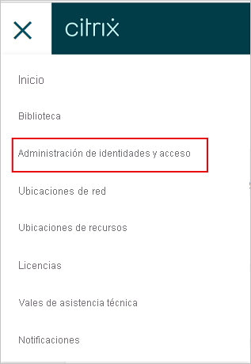
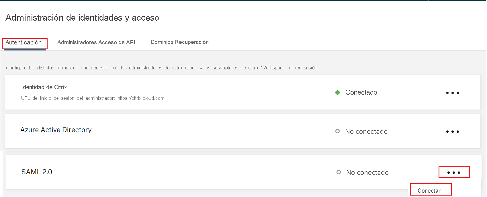
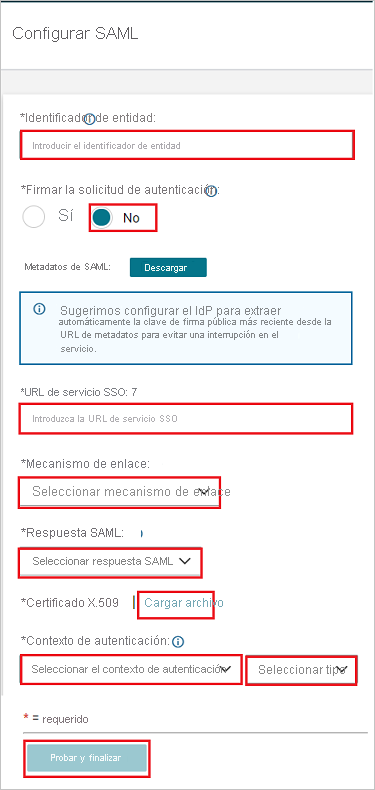

# Tutorial: Integración del inicio de sesión único (SSO) de Azure Active Directory con Citrix Cloud SAML SSO

En este tutorial va a aprender a integrar Citrix Cloud SAML SSO con Azure Active Directory (Azure AD). Al integrar Citrix Cloud SAML SSO con Azure AD, puede hacer lo siguiente:

* Controlar en Azure AD quién tiene acceso a Citrix Cloud SAML SSO.
* Permitir que los usuarios inicien sesión automáticamente en Citrix Cloud SAML SSO con sus cuentas de Azure AD.
* Administrar las cuentas desde una ubicación central (Azure Portal).

## Requisitos previos

Para empezar, necesita los siguientes elementos:

* Una suscripción de Azure AD. Si no tiene una suscripción, puede crear una [cuenta gratuita](https://azure.microsoft.com/free/).
* Una suscripción de Citrix Cloud. Si aún no tiene una suscripción, regístrese para obtener una. 

## Descripción del escenario

En este tutorial, va a configurar y probar el inicio de sesión único de Azure AD en un entorno de prueba.

* Citrix Cloud SAML SSO admite el SSO iniciado por **SP**.

> [!NOTE]
> El identificador de esta aplicación es un valor de cadena fijo, por lo que solo se puede configurar una instancia en un inquilino.

## Incorporación de Citrix Cloud SAML SSO desde la galería

Para configurar la integración de Citrix Cloud SAML SSO en Azure AD, tiene que agregar Citrix Cloud SAML SSO desde la galería a la lista de aplicaciones SaaS administradas.

1. Inicie sesión en Azure Portal con una cuenta personal, profesional o educativa de Microsoft.
1. En el panel de navegación de la izquierda, seleccione el servicio **Azure Active Directory**.
1. Vaya a **Aplicaciones empresariales** y seleccione **Todas las aplicaciones**.
1. Para agregar una nueva aplicación, seleccione **Nueva aplicación**.
1. En la sección **Agregar desde la galería**, escriba **Citrix Cloud SAML SSO** en el cuadro de búsqueda.
1. Seleccione **Citrix Cloud SAML SSO** en el panel de resultados y agregue la aplicación. Espere unos segundos mientras la aplicación se agrega al inquilino.

## Configuración y prueba del inicio de sesión único de Azure AD para Citrix Cloud SAML SSO

Configure y pruebe el SSO de Azure AD con Citrix Cloud SAML SSO mediante un usuario de prueba de nombre **B.Simon**. Para que el SSO funcione, es necesario establecer una relación de vinculación entre un usuario de Azure AD y el usuario correspondiente de Citrix Cloud SAML SSO. Este usuario también debe existir en la instancia de Active Directory que se sincroniza con Azure AD Connect para la suscripción de Azure AD.

Para configurar y probar el SSO de Azure AD con Citrix Cloud SAML SSO, siga estos pasos:

1. **[Configuración del inicio de sesión único de Azure AD](#configure-azure-ad-sso)** , para permitir que los usuarios puedan utilizar esta característica.
    1. **[Creación de un usuario de prueba de Azure AD](#create-an-azure-ad-test-user)** , para probar el inicio de sesión único de Azure AD con B.Simon.
    1. **[Asignación del usuario de prueba de Azure AD](#assign-the-azure-ad-test-user)** , para habilitar a B.Simon para que use el inicio de sesión único de Azure AD.
1. **[Configuración del inicio de sesión único de Citrix Cloud SAML SSO](#configure-citrix-cloud-saml-sso)** , para configurar los valores de inicio de sesión único en la aplicación.
1. **[Prueba del inicio de sesión único](#test-sso)** : para comprobar si la configuración funciona.

## Configuración del inicio de sesión único de Azure AD

Siga estos pasos para habilitar el inicio de sesión único de Azure AD en Azure Portal.

1. En Azure Portal, en la página de integración de la aplicación **Citrix Cloud SAML SSO**, busque la sección **Administrar** y seleccione **Inicio de sesión único**.
1. En la página **Seleccione un método de inicio de sesión único**, elija **SAML**.
1. En la página **Configuración del inicio de sesión único con SAML**, haga clic en el icono de lápiz de **Configuración básica de SAML** para editar la configuración.

   

1. En la sección **Configuración básica de SAML**, siga estos pasos:

    En el cuadro de texto **URL de inicio de sesión**, escriba una dirección URL con el siguiente patrón: `https://<SUBDOMAIN>.cloud.com`

    > [!NOTE]
    > Este valor no es real. Actualice el valor con la dirección URL de Citrix Workspace. Acceda a la cuenta de Citrix Cloud para obtener el valor. También puede hacer referencia a los patrones que se muestran en la sección **Configuración básica de SAML** de Azure Portal.

1. La aplicación Citrix Cloud SAML SSO espera las aserciones de SAML en un formato determinado, lo cual requiere que se agreguen asignaciones de atributos personalizados a la configuración de los atributos del token SAML. La siguiente captura de muestra la lista de atributos predeterminados.

    

1. Además de lo anterior, la aplicación Citrix Cloud SAML SSO espera que se devuelvan algunos atributos más, que se muestran a continuación, en la respuesta SAML. Estos atributos también están rellenos de antemano, pero puede revisarlos según sus requisitos. Los valores devueltos en la respuesta SAML deben asignarse a los atributos del usuario de Active Directory.
    
    | Nombre | Atributo de origen |
    | -----|-----|
    | cip_sid | user.onpremisesecurityidentifier |
    | cip_upn | user.userprincipalname |
    | cip_oid | ObjectGUID (atributo de extensión) |
    | cip_email | user.mail |
    | DisplayName | user.displayname |

    > [!NOTE]
    > ObjectGUID debe configurarse manualmente según los requisitos.

1. En la página **Configurar el inicio de sesión único con SAML**, en la sección **Certificado de firma de SAML**, busque **Certificado (PEM)** y seleccione **Descargar** para descargarlo y guardarlo en el equipo.

    

1. En la sección **Configurar Citrix Cloud SAML SSO**, copie las direcciones URL correspondientes según sus requisitos.

    

### Creación de un usuario de prueba de Azure AD

En esta sección, va a crear un usuario de prueba llamado B.Simon en Azure Portal.

1. En el panel izquierdo de Azure Portal, seleccione **Azure Active Directory**, **Usuarios** y **Todos los usuarios**.
1. Seleccione **Nuevo usuario** en la parte superior de la pantalla.
1. En las propiedades del **usuario**, siga estos pasos:
   1. En el campo **Nombre**, escriba `B.Simon`.  
   1. En el campo **Nombre de usuario**, escriba username@companydomain.extension. Por ejemplo, `B.Simon@contoso.com`.
   1. Active la casilla **Show password** (Mostrar contraseña) y, después, anote el valor que se muestra en el cuadro **Contraseña**.
   1. Haga clic en **Crear**.

    > [!NOTE]
    > Este usuario debe sincronizarse desde una instancia de Active Directory. Para que el SSO funcione, es preciso establecer una relación de vinculación entre un usuario de Azure AD y el usuario correspondiente de Citrix Cloud SAML SSO.
    
### Asignación del usuario de prueba de Azure AD

En esta sección va a permitir que B.Simon use el inicio de sesión único de Azure al concederle acceso a Citrix Cloud SAML SSO.

1. En Azure Portal, seleccione sucesivamente **Aplicaciones empresariales** y **Todas las aplicaciones**.
1. En la lista de aplicaciones, seleccione **Citrix Cloud SAML SSO**.
1. En la página de información general de la aplicación, busque la sección **Administrar** y seleccione **Usuarios y grupos**.
1. Seleccione **Agregar usuario**. A continuación, en el cuadro de diálogo **Agregar asignación**, seleccione **Usuarios y grupos**.
1. En el cuadro de diálogo **Usuarios y grupos**, seleccione **B.Simon** de la lista de usuarios y haga clic en el botón **Seleccionar** de la parte inferior de la pantalla.
1. Si espera que se asigne un rol a los usuarios, puede seleccionarlo en la lista desplegable **Seleccionar un rol**. Si no se ha configurado ningún rol para esta aplicación, verá seleccionado el rol "Acceso predeterminado".
1. En el cuadro de diálogo **Agregar asignación**, haga clic en el botón **Asignar**.

## Configuración del inicio de sesión único de Citrix Cloud SAML SSO

1. Inicie sesión como administrador en el sitio de empresa de Citrix Cloud SAML SSO.

1. Vaya al menú de Citrix Cloud y seleccione **Administración de identidad y acceso**.

     

1. En **Autenticación**, busque **SAML 2.0** y seleccione **Conectar** en el menú de puntos suspensivos.

    

1. En la página **Configurar SAML**, siga estos pasos.

    

    a. En el cuadro de texto **Identificador de entidad**, pegue el valor de **Identificador de Azure AD** que copió de Azure Portal.

    b. En **Authentication Request Security** (Seguridad de solicitud de autenticación), seleccione **No**.

    c. En el cuadro de texto **SSO Service URL** (URL de servicio de SSO), pegue el valor de **URL de inicio de sesión** que ha copiado de Azure Portal.

    d. Seleccione **Binding Mechanism** (Mecanismo de enlace) en la lista desplegable. Puede seleccionar enlace **HTTP-POST** o **HTTP-Redirect**.

    e. En **SAML Response** (Respuesta SAML), seleccione **Sign Either Response or Assertion** (Firmar respuesta o aserción) en la lista desplegable.

    f. Descargue el **Certificado (PEM)** desde Azure Portal en la sección **Certificado X.509**.

    g. En **Contexto de autenticación**, seleccione **Sin especificar** y **Exacto** en la lista desplegable.

    h. Haga clic en **Probar y finalizar**.

## Prueba de SSO 

En esta sección, probará la configuración de inicio de sesión único de Azure AD con las siguientes opciones. 

* Acceda directamente a la dirección URL de Citrix Workspace e inicie el flujo de inicio de sesión desde ahí.

* Inicie sesión con el usuario de Active Directory sincronizado con AD en Citrix Workspace para realizar la prueba.

## Pasos siguientes

Una vez que haya configurado Citrix Cloud SAML SSO, puede aplicar el control de sesión, que protege a la organización, en tiempo real, frente a la filtración e infiltración de información confidencial. El control de sesión procede del acceso condicional. [Aprenda a aplicar el control de sesión con Microsoft Cloud App Security](/cloud-app-security/proxy-deployment-aad).