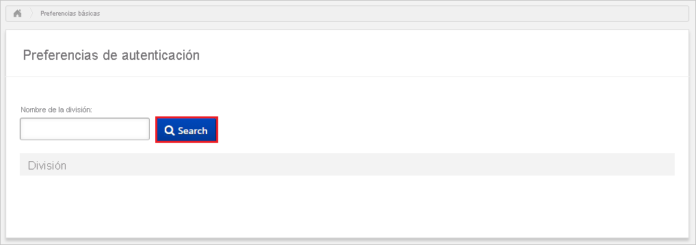
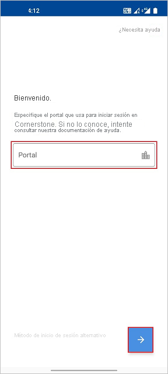
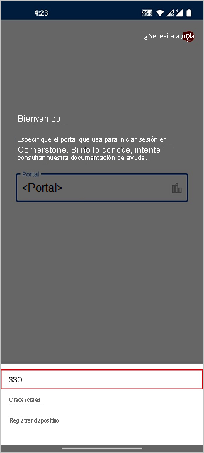

# Tutorial: Integración del inicio de sesión único (SSO) de Azure Active Directory con Cornerstone

En este tutorial, aprenderá a configurar la integración del inicio de sesión único entre Cornerstone y Azure Active Directory (Azure AD). Al integrar Cornerstone con Azure AD, puede hacer lo siguiente:

* Controlar en Azure AD quién tiene acceso de inicio de sesión único a Cornerstone.
* Permitir que los usuarios inicien sesión automáticamente en Cornerstone con sus cuentas de Azure AD.
* Administrar las cuentas desde una ubicación central (Azure Portal).

## Requisitos previos

Para empezar, necesita los siguientes elementos:

* Una suscripción de Azure AD. Si no tiene una suscripción, puede crear una [cuenta gratuita](https://azure.microsoft.com/free/).
* Inicio de sesión único habilitado en Cornerstone.

> [!NOTE]
> Esta integración también está disponible para usarse desde el entorno de la nube del gobierno de EE. UU de Azure AD. Puede encontrar esta aplicación en la galería de aplicaciones de la nube del gobierno de EE. UU. de Azure AD y configurarla de la misma manera que en la nube pública.

## Descripción del escenario

En este tutorial, va a configurar y probar el inicio de sesión único de Azure AD en un entorno de prueba.

* Cornerstone admite el inicio de sesión único iniciado por **SP**.

* Cornerstone admite el [aprovisionamiento de usuarios automático](cornerstone-ondemand-provisioning-tutorial.md).

* Si va a integrar uno o varios productos de esta lista en particular, debe usar la aplicación Cornerstone Single Sign-On de la galería.

    Ofrecemos soluciones para:

    1. Contratación
    2. Aprendizaje
    3. Desarrollo
    4. Contenido
    5. Rendimiento
    6. Trayectoria profesional
    7. HR

## Incorporación de Cornerstone Single Sign-On desde la galería

Para configurar la integración del inicio de sesión único de Azure AD con Cornerstone, es necesario...

1. Inicie sesión en Azure Portal con una cuenta personal, profesional o educativa de Microsoft.
1. En el panel de navegación de la izquierda, seleccione el servicio **Azure Active Directory**.
1. Vaya a **Aplicaciones empresariales** y seleccione **Todas las aplicaciones**.
1. Para agregar una nueva aplicación, seleccione **Nueva aplicación**.
1. En la sección **Agregar desde la galería**, escriba **Cornerstone Single Sign-On** en el cuadro de búsqueda.
1. Seleccione **Cornerstone Single Sign-On** en el panel de resultados y agregue la aplicación. Espere unos segundos mientras la aplicación se agrega al inquilino.

## Configuración y prueba del inicio de sesión único de Azure AD para Cornerstone

Configure y pruebe el inicio de sesión único de Azure AD con Cornerstone mediante un usuario de prueba llamado **B.Simon**. Para que el inicio de sesión único funcione, es necesario establecer una relación de vínculo entre un usuario de Azure AD y el usuario relacionado de Cornerstone.

Para configurar y probar el inicio de sesión único de Azure AD con Cornerstone, siga estos pasos:

1. **[Configuración del inicio de sesión único de Azure AD](#configure-azure-ad-sso)** , para permitir que los usuarios puedan utilizar esta característica.
    1. **[Creación de un usuario de prueba de Azure AD](#create-an-azure-ad-test-user)** , para probar el inicio de sesión único de Azure AD con B.Simon.
    1. **[Asignación del usuario de prueba de Azure AD](#assign-the-azure-ad-test-user)** , para habilitar a B.Simon para que use el inicio de sesión único de Azure AD.
2. **[Configuración del inicio de sesión único de Cornerstone](#configure-cornerstone-single-sign-on)** : para configurar el inicio de sesión único en Cornerstone.
    1. **[Creación de un usuario de prueba del inicio de sesión único de Cornerstone](#create-cornerstone-single-sign-on-test-user)** : para tener un homólogo de B. Simon en Cornerstone vinculado a la representación del usuario en Azure AD.
3. **[Prueba del inicio de sesión único](#test-sso)** : para comprobar si la configuración funciona.
4. **[Prueba del inicio de sesión único para Cornerstone (móvil)](#test-sso-for-cornerstone-mobile)** : para comprobar si la configuración funciona.

## Configuración del inicio de sesión único de Azure AD

Siga estos pasos para habilitar el inicio de sesión único de Azure AD en Azure Portal.

1. En Azure Portal, en la página de integración de la aplicación **Cornerstone Single Sign-On**, busque la sección **Administrar** y seleccione **Inicio de sesión único**.
1. En la página **Seleccione un método de inicio de sesión único**, seleccione **SAML**.
1. En la página **Configuración del inicio de sesión único con SAML**, haga clic en el icono de lápiz de **Configuración básica de SAML** para editar la configuración.

   

1. En la sección **Configuración básica de SAML**, siga estos pasos:

    a. En el cuadro de texto **Identificador**, escriba una dirección URL con el patrón siguiente: `https://<PORTAL_NAME>.csod.com`

    b. En el cuadro de texto **URL de respuesta**, escriba una dirección URL con el siguiente patrón: `https://<PORTAL_NAME>.csod.com/samldefault.aspx?ouid=<OUID>`

    c. En el cuadro de texto **URL de inicio de sesión**, escriba una dirección URL con el siguiente patrón: `https://<PORTAL_NAME>.csod.com/samldefault.aspx?ouid=<OUID>`

    > [!NOTE]
    > Estos valores no son reales. Actualícelos con la URL de respuesta, el identificador y la URL de inicio de sesión reales. Póngase en contacto con el equipo del proyecto de implementación de Cornerstone para obtener estos valores. También puede hacer referencia a los patrones que se muestran en la sección **Configuración básica de SAML** de Azure Portal.

4. En la página **Configurar el inicio de sesión único con SAML**, en la sección **Certificado de firma de SAML**, busque **Certificado (Base64)** y seleccione **Descargar** para descargarlo y guardarlo en el equipo.

    

6. En la sección **Configurar Cornerstone AWS Single Sign-On**, copie las URL adecuadas según sus necesidades.

    

### Creación de un usuario de prueba de Azure AD

En esta sección, va a crear un usuario de prueba llamado B.Simon en Azure Portal.

1. En el panel izquierdo de Azure Portal, seleccione **Azure Active Directory**, **Usuarios** y **Todos los usuarios**.
1. Seleccione **Nuevo usuario** en la parte superior de la pantalla.
1. En las propiedades del **usuario**, siga estos pasos:
    1. En el campo **Nombre**, escriba `B.Simon`.  
    1. En el campo **Nombre de usuario**, escriba username@companydomain.extension. Por ejemplo, `B.Simon@contoso.com`.
    1. Active la casilla **Show password** (Mostrar contraseña) y, después, anote el valor que se muestra en el cuadro **Contraseña**.
    1. Haga clic en **Crear**.

### Asignación del usuario de prueba de Azure AD

En esta sección, va a permitir que B.Simon acceda a Cornerstone mediante el inicio de sesión único de Azure.

1. En Azure Portal, seleccione sucesivamente **Aplicaciones empresariales** y **Todas las aplicaciones**.
1. En la lista de aplicaciones, seleccione **Cornerstone Single Sign-On**.
1. En la página de información general de la aplicación, busque la sección **Administrar** y seleccione **Usuarios y grupos**.
1. Seleccione **Agregar usuario**. A continuación, en el cuadro de diálogo **Agregar asignación**, seleccione **Usuarios y grupos**.
1. En el cuadro de diálogo **Usuarios y grupos**, seleccione **B.Simon** de la lista de usuarios y haga clic en el botón **Seleccionar** de la parte inferior de la pantalla.
1. Si espera que se asigne un rol a los usuarios, puede seleccionarlo en la lista desplegable **Seleccionar un rol**. Si no se ha configurado ningún rol para esta aplicación, verá seleccionado el rol "Acceso predeterminado".
1. En el cuadro de diálogo **Agregar asignación**, haga clic en el botón **Asignar**.

## Configuración del inicio de sesión único de Cornerstone

Para configurar el inicio de sesión único en Cornerstone, tendrá que ponerse en contacto con el equipo del proyecto de implementación de Cornerstone. Dicho equipo lo configura para establecer la conexión de SSO de SAML correctamente en ambos lados.

### Creación de un usuario de prueba de Cornerstone Single Sign-On

En esta sección, creará un usuario llamado Britta Simon en Cornerstone. Trabaje con el equipo del proyecto de implementación de Cornerstone para agregar los usuarios a Cornerstone. Los usuarios se tienen que crear y activar antes de usar el inicio de sesión único.

El inicio de sesión único de Cornerstone también admite el aprovisionamiento automático de usuarios. [Aquí](./cornerstone-ondemand-provisioning-tutorial.md) puede encontrar más detalles sobre cómo configurar el aprovisionamiento automático de usuarios.

## Prueba de SSO 

En esta sección, probará la configuración de inicio de sesión único de Azure AD con las siguientes opciones. 

* Haga clic en **Probar esta aplicación** en Azure Portal. Esto le redirigirá a la dirección URL de inicio de sesión de Cornerstone, donde puede iniciar el flujo de inicio de sesión. 

* Vaya directamente a la dirección URL de inicio de sesión de Cornerstone e inicie el flujo de inicio de sesión desde allí.

* Puede usar Mis aplicaciones de Microsoft. Al hacer clic en el icono de Cornerstone Single en Mis aplicaciones, se le redirigirá a la URL de inicio de sesión de la aplicación. Para más información acerca de Aplicaciones, consulte [Inicio de sesión e inicio de aplicaciones desde el portal Aplicaciones](../user-help/my-apps-portal-end-user-access.md).

## Prueba del inicio de sesión único para Cornerstone (Mobile)

1. En otra ventana del explorador, inicie sesión en el sitio web de Cornerstone como administrador y siga estos pasos.

    a. Vaya a **Admin -> Tools -> CORE FUNCTIONS -> Core Preferences -> Authentication Preferences** (Administración > Herramientas > FUNCIONES PRINCIPALES > Preferencias principales > Preferencias de autenticación).

    

    b. Escriba el nombre de la división en el cuadro de búsqueda para buscar **Division Name** (Nombre de la división).

    c. Haga clic en **Division Name** (Nombre de la división) en los resultados.

    d. En la lista desplegable SAML/IDP server URL (Dirección URL del servidor SAML/IDP), seleccione el servidor SAML/IDP adecuado que se debe usar para la autenticación de usuarios.

    

    e. Haga clic en **Save**(Guardar).

1. Vaya a **Admin > Tools > Core Functions > Core Preferences > Mobile** (Administración > Herramientas > Funciones principales > Preferencias principales > Dispositivos móviles).

    a. Seleccione el valor **Division OU** (UO de división) apropiado.

    b. Seleccione **Allow users in this OU to access the Cornerstone Learn app on their mobile and tablet device** (Permitir que los usuarios de esta unidad organizativa accedan a la aplicación Cornerstone Learn en su dispositivo móvil y tableta) y active la casilla Enable Mobile Access (Habilitar acceso móvil).

    c. Haga clic en **Save**(Guardar).

2. Abra la aplicación móvil **Cornerstone Learn**. En la página de inicio de sesión, escriba el nombre del portal.

    

3. Haga clic en **Alternative Login** (Inicio de sesión alternativo) y después en **SSO**.

    

4. .  Escriba las **credenciales de Azure AD** para iniciar sesión en la aplicación Cornerstone y haga clic en **Next** (Siguiente).

    

5. Por último, después de iniciar sesión correctamente, aparecerá la página principal de la aplicación, como se muestra a continuación.

    

## Pasos siguientes

Una vez que haya configurado Cornerstone Single Sign-On, puede aplicar el control de sesión, que protege su organización en tiempo real frente a la filtración e infiltración de información confidencial. El control de sesión procede del acceso condicional. [Aprenda a aplicar el control de sesión con Microsoft Cloud App Security](/cloud-app-security/proxy-deployment-aad).
