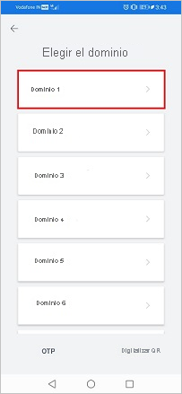

# Tutorial: Integración del inicio de sesión único (SSO) de Azure Active Directory con Darwinbox

En este tutorial, aprenderá a integrar Darwinbox con Azure Active Directory (Azure AD). Al integrar Darwinbox con Azure AD, se puede:

* Controlar en Azure AD quién tiene acceso a Darwinbox.
* Permitir que los usuarios puedan iniciar sesión automáticamente en Darwinbox con sus cuentas de Azure AD.
* Administrar las cuentas desde una ubicación central (Azure Portal).

## Requisitos previos

Para empezar, necesita los siguientes elementos:

* Una suscripción de Azure AD. Si no tiene una suscripción, puede crear una [cuenta gratuita](https://azure.microsoft.com/free/).
* Una suscripción habilitada para el inicio de sesión único (SSO) en Darwinbox.
> [!NOTE]
> Esta integración también está disponible para usarse desde el entorno de la nube del gobierno de EE. UU de Azure AD. Puede encontrar esta aplicación en la galería de aplicaciones de la nube del gobierno de EE. UU. de Azure AD y configurarla de la misma manera que en la nube pública.

## Descripción del escenario

En este tutorial, va a configurar y probar el inicio de sesión único de Azure AD en un entorno de prueba.

* Darwinbox admite el inicio de sesión único iniciado por **SP**.

## Incorporación de Darwinbox desde la galería

Para configurar la integración de Darwinbox en Azure AD, será preciso que agregue Darwinbox desde la galería a la lista de aplicaciones SaaS administradas.

1. Inicie sesión en Azure Portal con una cuenta personal, profesional o educativa de Microsoft.
1. En el panel de navegación de la izquierda, seleccione el servicio **Azure Active Directory**.
1. Vaya a **Aplicaciones empresariales** y seleccione **Todas las aplicaciones**.
1. Para agregar una nueva aplicación, seleccione **Nueva aplicación**.
1. En la sección **Agregar desde la galería**, escriba **Darwinbox** en el cuadro de búsqueda.
1. Seleccione **Darwinbox** en el panel de resultados y agregue la aplicación. Espere unos segundos mientras la aplicación se agrega al inquilino.

## Configuración y prueba del inicio de sesión único de Azure AD SSO para Darwinbox

Configure y pruebe el inicio de sesión único de Azure AD con Darwinbox mediante un usuario de prueba llamado **B. Simon**. Para que el inicio de sesión único funcione, es preciso establecer una relación de vinculación entre un usuario de Azure AD y el usuario relacionado de Darwinbox.

Para configurar y probar el inicio de sesión único de Azure AD con Darwinbox, siga estos pasos:

1. **[Configuración del inicio de sesión único de Azure AD](#configure-azure-ad-sso)** , para permitir que los usuarios puedan utilizar esta característica.
    1. **[Creación de un usuario de prueba de Azure AD](#create-an-azure-ad-test-user)** , para probar el inicio de sesión único de Azure AD con B.Simon.
    1. **[Asignación del usuario de prueba de Azure AD](#assign-the-azure-ad-test-user)** , para habilitar a B.Simon para que use el inicio de sesión único de Azure AD.
1. **[Configuración del inicio de sesión único en Darwinbox](#configure-darwinbox-sso)**, para configurar los valores de Inicio de sesión único en la aplicación.
    1. **[Creación de un usuario de prueba de Darwinbox](#create-darwinbox-test-user)**, para tener un homólogo de B. Simon en Darwinbox que esté vinculado a la representación del usuario en Azure AD.
1. **[Prueba del inicio de sesión único](#test-sso)** : para comprobar si la configuración funciona.

## Configuración del inicio de sesión único de Azure AD

Siga estos pasos para habilitar el inicio de sesión único de Azure AD en Azure Portal.

1. En Azure Portal, en la página de integración de aplicaciones de **Darwinbox**, busque la sección **Administrar** y seleccione **Inicio de sesión único**.
1. En la página **Seleccione un método de inicio de sesión único**, elija **SAML**.
1. En la página **Configuración del inicio de sesión único con SAML**, haga clic en el icono de lápiz de **Configuración básica de SAML** para editar la configuración.

   

1. En la sección **Configuración básica de SAML**, siga estos pasos:

   1. En el cuadro de texto **Identificador (id. de entidad)** , escriba una dirección URL con el siguiente patrón: `https://<SUBDOMAIN>.darwinbox.in/adfs/module.php/saml/sp/metadata.php/<CUSTOM_ID>`

    1. En el cuadro de texto **URL de inicio de sesión**, escriba una dirección URL con el siguiente patrón: `https://<SUBDOMAIN>.darwinbox.in/`

      > [!NOTE]
      > Estos valores no son reales. Actualice estos valores con el identificador y la dirección URL de inicio de sesión reales. Póngase en contacto con el [equipo de soporte técnico de Darwinbox](https://darwinbox.com/contact-us.php) para obtener estos valores. También puede hacer referencia a los patrones que se muestran en la sección **Configuración básica de SAML** de Azure Portal.

1. En la página **Configurar el inicio de sesión único con SAML**, en la sección **Certificado de firma de SAML**, busque **XML de metadatos de federación** y seleccione **Descargar** para descargar el certificado y guardarlo en su equipo.

    

1. En la sección **Set up Darwinbox** (Configurar Darwinbox), copie las direcciones URL adecuadas según sus necesidades.

    

### Creación de un usuario de prueba de Azure AD

En esta sección, va a crear un usuario de prueba llamado B.Simon en Azure Portal.

1. En el panel izquierdo de Azure Portal, seleccione **Azure Active Directory**, **Usuarios** y **Todos los usuarios**.
1. Seleccione **Nuevo usuario** en la parte superior de la pantalla.
1. En las propiedades del **usuario**, siga estos pasos:
   1. En el campo **Nombre**, escriba `B.Simon`.  
   1. En el campo **Nombre de usuario**, escriba username@companydomain.extension. Por ejemplo, `B.Simon@contoso.com`.
   1. Active la casilla **Show password** (Mostrar contraseña) y, después, anote el valor que se muestra en el cuadro **Contraseña**.
   1. Haga clic en **Crear**.

### Asignación del usuario de prueba de Azure AD

En esta sección, va a permitir que B. Simon acceda a Darwinbox mediante el inicio de sesión único de Azure.

1. En Azure Portal, seleccione sucesivamente **Aplicaciones empresariales** y **Todas las aplicaciones**.
1. En la lista de aplicaciones, seleccione **Darwinbox**.
1. En la página de información general de la aplicación, busque la sección **Administrar** y seleccione **Usuarios y grupos**.
1. Seleccione **Agregar usuario**. A continuación, en el cuadro de diálogo **Agregar asignación**, seleccione **Usuarios y grupos**.
1. En el cuadro de diálogo **Usuarios y grupos**, seleccione **B.Simon** de la lista de usuarios y haga clic en el botón **Seleccionar** de la parte inferior de la pantalla.
1. Si espera que haya un valor de rol en la aserción de SAML, en el cuadro de diálogo **Seleccionar rol**, seleccione en la lista el rol adecuado para el usuario y haga clic en el botón **Seleccionar** en la parte inferior de la pantalla.
1. En el cuadro de diálogo **Agregar asignación**, haga clic en el botón **Asignar**.

## Configuración del inicio de sesión único de Darwinbox

Para configurar el inicio de sesión único en **Darwinbox**, es preciso enviar el **XML de metadatos de federación** descargado y las direcciones URL apropiadas copiadas de Azure Portal al [equipo de soporte técnico de Darwinbox](https://darwinbox.com/contact-us.php). Dicho equipo lo configura para establecer la conexión de SSO de SAML correctamente en ambos lados.

### Creación de un usuario de prueba de Darwinbox

En esta sección, creará un usuario llamado B. Simon en Darwinbox. Trabaje con el [equipo de soporte técnico de Darwinbox](https://darwinbox.com/contact-us.php) para agregar los usuarios a la plataforma de Darwinbox. Los usuarios se tienen que crear y activar antes de usar el inicio de sesión único.

## Prueba de SSO 

En esta sección, probará la configuración de inicio de sesión único de Azure AD con las siguientes opciones. 

* Haga clic en **Probar esta aplicación** en Azure Portal. De este modo, accederá automáticamente a la dirección URL de inicio de sesión de Darwinbox, donde podrá comenzar el flujo de inicio de sesión. 

* Vaya directamente a la dirección URL de inicio de sesión de Darwinbox e inicie el flujo de inicio de sesión desde allí.

* Puede usar Mis aplicaciones de Microsoft. Al hacer clic en el icono de Darwinbox en Mis aplicaciones, se le redirigirá a la dirección URL de inicio de sesión de dicha aplicación. Para más información acerca de Aplicaciones, consulte [Inicio de sesión e inicio de aplicaciones desde el portal Aplicaciones](../user-help/my-apps-portal-end-user-access.md).

## Prueba del inicio de sesión único para Darwinbox (para dispositivos móviles)

1. Abra la aplicación para dispositivos móviles Darwinbox. Haga clic en **Enter Organization URL** (Escribir URL de la organización) y escriba la dirección URL de la organización en el cuadro de texto y haga clic en el botón de flecha.

    

1. Si tiene varios dominios, haga clic en el suyo.

    

1. Escriba el correo electrónico de Azure AD en la aplicación Darwinbox y haga clic en **Next** (Siguiente).

    

1. Escriba la contraseña de Azure AD en la aplicación Darwinbox y haga clic en **Sign in** (Iniciar sesión).

    

1. Finalmente, después de iniciar sesión correctamente, aparecerá la página principal de la aplicación.

    

## Pasos siguientes

Una vez configurado Darwinbox, puede aplicar el control de sesión, que protege la filtración y la infiltración de la información confidencial de la organización en tiempo real. El control de sesión procede del acceso condicional. [Aprenda a aplicar el control de sesión con Microsoft Cloud App Security](/cloud-app-security/proxy-deployment-aad).
