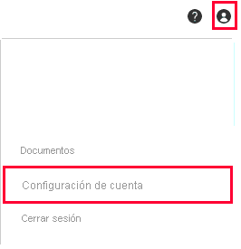

# Tutorial: Integración de Displayr con Azure Active Directory

En este tutorial, aprenderá a integrar Displayr con Azure Active Directory (Azure AD). Al integrar Displayr con Azure AD, puede hacer lo siguiente:

* Controlar en Azure AD quién tiene acceso a Displayr.
* Permitir que los usuarios puedan iniciar sesión automáticamente en Displayr con sus cuentas de Azure AD.
* Administrar las cuentas desde una ubicación central (Azure Portal).

## Requisitos previos

Para empezar, necesita los siguientes elementos:

* Una suscripción de Azure AD. Si no tiene una suscripción, puede crear una [cuenta gratuita](https://azure.microsoft.com/free/).
* Una empresa con el inicio de sesión único (SSO) habilitado en Displayr.

## Descripción del escenario

En este tutorial, aprenderá a configurar el inicio de sesión único de Azure AD en la empresa Displayr.

* Displayr admite el inicio de sesión único iniciado por **SP**.

## Adición de Displayr desde la galería

Para configurar la integración de Displayr en Azure AD, será preciso que agregue Displayr desde la galería a la lista de aplicaciones SaaS administradas.

1. Inicie sesión en Azure Portal con una cuenta personal, profesional o educativa de Microsoft.
1. En el panel de navegación de la izquierda, seleccione el servicio **Azure Active Directory**.
1. Vaya a **Aplicaciones empresariales** y seleccione **Todas las aplicaciones**.
1. Para agregar una nueva aplicación, seleccione **Nueva aplicación**.
1. En la sección **Agregar desde la galería**, escriba **Displayr** en el cuadro de búsqueda.
1. Seleccione **Displayr** en el panel de resultados y agregue la aplicación. Espere unos segundos mientras la aplicación se agrega al inquilino.

## Configurar el inicio de sesión único de Azure AD para Displayr.

Para configurar el inicio de sesión único de Azure AD con Displayr, realice los pasos siguientes:

1. **[Configuración del inicio de sesión único de Azure AD](#configure-azure-ad-sso)** , para permitir que los usuarios puedan utilizar esta característica.
1. **[Configuración del inicio de sesión único en Displayr](#configure-displayr-sso)** , para configurar los valores de inicio de sesión único en la aplicación.
1. **[Restrinja el acceso a usuarios específicos](#restrict-access-to-specific-users)** para limitar cuáles de sus usuarios de Azure AD pueden iniciar sesión en Displayr.
1. **[Comprobación del inicio de sesión único](#test-sso)** , para verificar que la configuración funciona correctamente.

## Configuración del inicio de sesión único de Azure AD

Siga estos pasos para habilitar el inicio de sesión único de Azure AD en Azure Portal.

1. En Azure Portal, en la página de integración de la aplicación **Displayr**, busque la sección **Administrar** y seleccione **Inicio de sesión único**.
1. En la página **Seleccione un método de inicio de sesión único**, seleccione **SAML**.
1. En la página **Configuración del inicio de sesión único con SAML**, haga clic en el icono de lápiz para **Configuración básica de SAML** y edite la configuración.

   

1. En la sección **Configuración básica de SAML**, siga estos pasos:

    a. En el cuadro de texto **Identificador (id. de entidad)** , escriba un valor con el siguiente patrón: `<YOURDOMAIN>.displayr.com`
    
    b. En el cuadro de texto **URL de respuesta**, escriba la dirección URL: `https://app.displayr.com/Login/ProcessSamlResponse`.
    
    c. En el cuadro de texto **URL de inicio de sesión**, escriba una dirección URL con el siguiente patrón: `https://<YOURDOMAIN>.displayr.com`

    d. Haga clic en **Save**(Guardar).

    >[!NOTE]
    >Estos valores no son reales. Actualice estos valores con el identificador y la dirección URL de inicio de sesión reales. Póngase en contacto con el [equipo de soporte técnico de Displayr](mailto:support@displayr.com) para obtener estos valores. También puede consultar los patrones que se muestran en la sección Configuración básica de SAML de Azure Portal.

1. En la página **Configurar el inicio de sesión único con SAML**, en la sección **Certificado de firma de SAML**, busque **Certificado (Base64)** y seleccione **Descargar** para descargarlo y guardarlo en el equipo.

   

1. La aplicación Displayr espera las aserciones de SAML en un formato específico, que requiere que se agreguen asignaciones de atributos personalizados a la configuración de los atributos del token de SAML. La siguiente captura de muestra la lista de atributos predeterminados. Haga clic en el icono **Editar** para abrir el cuadro de diálogo Atributos de usuario.

   

1. Además de lo anterior, la aplicación Displayr espera que se usen algunos atributos más en la respuesta de SAML. En la sección **User Attributes & Claims** (Atributos y notificaciones del usuario) del cuadro de diálogo **Group Claims (Preview)** (Notificaciones de grupo [versión preliminar]), siga estos pasos:

   a. Haga clic en **Agregar una notificación de grupo**.

      ![Captura de pantalla que muestra la ventana "Group Claims (Preview)" (Notificaciones de grupo [versión preliminar]) con la configuración seleccionada.](./media/displayr-tutorial/claims.png)

   b. Seleccione **Todos los grupos** en la lista de selección.

   c. Seleccione **Atributo de origen** de **Id. de grupo**.

   f. Haga clic en **Save**(Guardar).

1. En la sección **Configurar Displayr**, copie las direcciones URL adecuadas según sus necesidades.

   

## Configuración del inicio de sesión único de Displayr

1. Para automatizar la configuración en Displayr, es preciso instalar la **extensión del explorador de inicio de sesión seguro de Mis aplicaciones**. Para ello, haga clic en **Instalar la extensión**.

    

2. Después de agregar la extensión al explorador, haga clic en **Configurar Displayr** para ir a la aplicación Displayr. En ella, escriba las credenciales de administrador para iniciar sesión en Displayr. La extensión de explorador configurará automáticamente la aplicación y automatizará los pasos 3 a 6.

    

3. Si desea configurar Displayr manualmente, abra una nueva ventana del explorador web, inicie sesión en el sitio de empresa de Displayr como administrador y haga lo siguiente:

4. Haga clic en el icono **Usuario** y, a continuación, vaya a **Configuración de la cuenta**.

    

5. Cambie a **Configuración** en el menú superior y desplácese hacia abajo en la página para hacer clic en **Configurar inicio de sesión único (SAML)** .

    ![Captura de pantalla que muestra la pestaña "Settings" (Configuración) seleccionada y la acción "Configure Single Sign On (S A M L)" [Configurar inicio de sesión único (S A M L)] seleccionada.](./media/displayr-tutorial/settings.png)

6. Siga estos pasos en la página **Single Sign On (SAML)** [Inicio de sesión único (SAML)]:

    

    a. Seleccione la casilla **Enable Single Sign On (SAML)** [Habilitar inicio de sesión único (SAML)].

    b. Copie el valor real de **Identificador** de la sección **Configuración básica de SAML** de Azure AD y péguelo en el cuadro de texto **Issuer** (Emisor).

    c. En el cuadro de texto **Login URL** (Dirección URL de inicio de sesión), pegue el valor de la **dirección URL de inicio de sesión** que ha copiado de Azure Portal.

    d. En el cuadro de texto **Logout URL** (Dirección URL de cierre de sesión), pegue el valor de la **dirección URL de cierre de sesión** que ha copiado de Azure Portal.

    e. Abra el certificado (Base64) en el Bloc de notas, copie su contenido y péguelo en el cuadro de texto **Certificate** (Certificado).

    f. El campo **Group mappings** (Asignaciones de grupo) es opcional.

    g. Haga clic en **Save**(Guardar).  

### Restringir el acceso a usuarios específicos

De forma predeterminada, todos los usuarios del inquilino en el que agregó la aplicación Displayr pueden iniciar sesión en Displayr mediante SSO. Si quiere restringir el acceso a usuarios o grupos específicos, consulte [Restringir la aplicación Azure AD a un conjunto de usuarios de un inquilino de Azure AD](../develop/howto-restrict-your-app-to-a-set-of-users.md).

## Prueba de SSO

En esta sección, probará la configuración de inicio de sesión único de Azure AD con las siguientes opciones. 

* Haga clic en **Probar esta aplicación** en Azure Portal. Esta acción le redirigirá a la dirección URL de inicio de sesión de Displayr, donde puede poner en marcha el flujo de inicio de sesión. 

* Vaya directamente a la dirección URL de inicio de sesión de Displayr e inicie el flujo de inicio de sesión desde allí.

* Puede usar Mis aplicaciones de Microsoft. Al hacer clic en el icono de Displayr en Aplicaciones, se le redirigirá a la URL de inicio de sesión de esa plataforma. Para más información acerca de Aplicaciones, consulte [Inicio de sesión e inicio de aplicaciones desde el portal Aplicaciones](https://support.microsoft.com/account-billing/sign-in-and-start-apps-from-the-my-apps-portal-2f3b1bae-0e5a-4a86-a33e-876fbd2a4510).

## Pasos siguientes

Una vez que ha configurado Displayr, puede aplicar el control de sesión, que protege la información confidencial de la organización en tiempo real de posibles filtraciones e infiltraciones. El control de sesión procede del acceso condicional. [Aprenda a aplicar el control de sesión con Microsoft Cloud App Security](/cloud-app-security/proxy-deployment-aad).