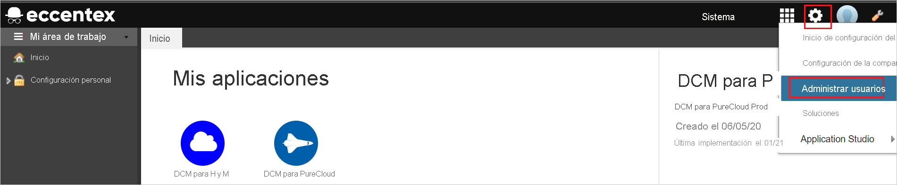

# Tutorial: Integración del inicio de sesión único (SSO) de Azure Active Directory con Eccentex AppBase para Azure

En este tutorial aprenderá a integrar Eccentex AppBase para Azure con Azure Active Directory (Azure AD). Al integrar Eccentex AppBase para Azure con Azure AD, puede hacer lo siguiente:

* Controlar en Azure AD quién tiene acceso a Eccentex AppBase para Azure.
* Permitir que los usuarios inicien sesión automáticamente en Eccentex AppBase para Azure con sus cuentas de Azure AD.
* Administrar las cuentas desde una ubicación central (Azure Portal).

## Requisitos previos

Para empezar, necesita los siguientes elementos:

* Una suscripción de Azure AD. Si no tiene una suscripción, puede crear una [cuenta gratuita](https://azure.microsoft.com/free/).
* Una suscripción habilitada para el inicio de sesión único (SSO) en Eccentex AppBase para Azure.

## Descripción del escenario

En este tutorial, va a configurar y probar el inicio de sesión único de Azure AD en un entorno de prueba.

* Eccentex AppBase para Azure admite el inicio de sesión único iniciado por **SP**.

* Eccentex AppBase para Azure admite el aprovisionamiento de usuarios **Just-in-Time**.

## Adición de Eccentex AppBase para Azure desde la galería

Para configurar la integración de Eccentex AppBase para Azure en Azure AD, es preciso que agregue Eccentex AppBase para Azure desde la galería a la lista de aplicaciones de SaaS administradas.

1. Inicie sesión en Azure Portal con una cuenta personal, profesional o educativa de Microsoft.
1. En el panel de navegación de la izquierda, seleccione el servicio **Azure Active Directory**.
1. Vaya a **Aplicaciones empresariales** y seleccione **Todas las aplicaciones**.
1. Para agregar una nueva aplicación, seleccione **Nueva aplicación**.
1. En la sección **Agregar desde la galería**, escriba **Eccentex AppBase para Azure** en el cuadro de búsqueda.
1. Seleccione **Eccentex AppBase para Azure** en el panel de resultados y, a continuación, agregue la aplicación. Espere unos segundos mientras la aplicación se agrega al inquilino.

## Configuración y prueba del inicio de sesión único de Azure AD para Eccentex AppBase para Azure

Configure y pruebe el inicio de sesión único de Azure AD con Eccentex AppBase para Azure mediante un usuario de prueba llamado **B.Simon**. Para que el inicio de sesión único funcione, es preciso establecer una relación de vinculación entre un usuario de Azure AD y el usuario relacionado de Eccentex AppBase para Azure.

Para configurar y probar el inicio de sesión único de Azure AD con Eccentex AppBase para Azure AD, lleve a cabo los siguientes pasos:

1. **[Configuración del inicio de sesión único de Azure AD](#configure-azure-ad-sso)** , para permitir que los usuarios puedan utilizar esta característica.
    1. **[Creación de un usuario de prueba de Azure AD](#create-an-azure-ad-test-user)** , para probar el inicio de sesión único de Azure AD con B.Simon.
    1. **[Asignación del usuario de prueba de Azure AD](#assign-the-azure-ad-test-user)** , para habilitar a B.Simon para que use el inicio de sesión único de Azure AD.
1. **[Configuración del inicio de sesión único en Eccentex AppBase para Azure](#configure-eccentex-appbase-for-azure-sso)** : para configurar los valores de inicio de sesión único en la aplicación.
    1. **[Creación de un usuario de prueba de Eccentex AppBase para Azure](#create-eccentex-appbase-for-azure-test-user)** : para tener un homólogo de B.Simon en Eccentex AppBase para Azure que esté vinculado a la representación de Azure AD del usuario.
1. **[Prueba del inicio de sesión único](#test-sso)** : para comprobar si la configuración funciona.

## Configuración del inicio de sesión único de Azure AD

Siga estos pasos para habilitar el inicio de sesión único de Azure AD en Azure Portal.

1. En Azure Portal, en la página de integración de la aplicación **Eccentex AppBase para Azure**, busque la sección **Administrar** y seleccione **inicio de sesión único**.
1. En la página **Seleccione un método de inicio de sesión único**, elija **SAML**.
1. En la página **Configuración del inicio de sesión único con SAML**, haga clic en el icono de lápiz de **Configuración básica de SAML** para editar la configuración.

   

1. En la sección **Configuración básica de SAML**, siga estos pasos:

    a. En el cuadro de texto **Identificador (id. de entidad)** , escriba una dirección URL con uno de los patrones siguientes:

    | **Identificador** |
    |--------|
    | `https://<CustomerName>.appbase.com/Ecx.Web` |
    | `https://<CustomerName>.eccentex.com:<PortNumber>/Ecx.Web` |

    b. En el cuadro de texto **URL de inicio de sesión**, escriba una dirección URL con el siguiente patrón:

    | **Dirección URL de inicio de sesión** |
    |---------|
    | `https://<CustomerName>.appbase.com/Ecx.Web/Account/sso?tenantCode=<TenantCode>&authCode=<AuthConfigurationCode>`|
    | `https://<CustomerName>.eccentex.com:<PortNumber>/Ecx.Web/Account/sso?tenantCode=<TenantCode>&authCode=<AuthConfigurationCode>` |

    > [!NOTE]
    > Estos valores no son reales. Actualice estos valores con el identificador y la dirección URL de inicio de sesión reales. Póngase en contacto con el [equipo de atención al cliente de Eccentex AppBase para Azure](mailto:eccentex.support@eccentex.com) para obtener estos valores. También puede hacer referencia a los patrones que se muestran en la sección **Configuración básica de SAML** de Azure Portal.

1. En la página **Configurar el inicio de sesión único con SAML**, en la sección **Certificado de firma de SAML**, busque **Certificado (sin procesar)** y seleccione **Descargar** para descargarlo y guardarlo en el equipo.

    

1. En la sección **Configurar Eccentex AppBase para Azure**, copie las direcciones URL adecuadas según sus necesidades.

    

### Creación de un usuario de prueba de Azure AD

En esta sección, va a crear un usuario de prueba llamado B.Simon en Azure Portal.

1. En el panel izquierdo de Azure Portal, seleccione **Azure Active Directory**, **Usuarios** y **Todos los usuarios**.
1. Seleccione **Nuevo usuario** en la parte superior de la pantalla.
1. En las propiedades del **usuario**, siga estos pasos:
   1. En el campo **Nombre**, escriba `B.Simon`.  
   1. En el campo **Nombre de usuario**, escriba username@companydomain.extension. Por ejemplo, `B.Simon@contoso.com`.
   1. Active la casilla **Show password** (Mostrar contraseña) y, después, anote el valor que se muestra en el cuadro **Contraseña**.
   1. Haga clic en **Crear**.

### Asignación del usuario de prueba de Azure AD

En esta sección, concederá acceso a B.Simon para Eccentex AppBase para Azure a fin de que pueda usar el inicio de sesión único de Azure.

1. En Azure Portal, seleccione sucesivamente **Aplicaciones empresariales** y **Todas las aplicaciones**.
1. En la lista de aplicaciones, seleccione **Eccentex AppBase para Azure**.
1. En la página de información general de la aplicación, busque la sección **Administrar** y seleccione **Usuarios y grupos**.
1. Seleccione **Agregar usuario**. A continuación, en el cuadro de diálogo **Agregar asignación**, seleccione **Usuarios y grupos**.
1. En el cuadro de diálogo **Usuarios y grupos**, seleccione **B.Simon** de la lista de usuarios y haga clic en el botón **Seleccionar** de la parte inferior de la pantalla.
1. Si espera que se asigne un rol a los usuarios, puede seleccionarlo en la lista desplegable **Seleccionar un rol**. Si no se ha configurado ningún rol para esta aplicación, verá seleccionado el rol "Acceso predeterminado".
1. En el cuadro de diálogo **Agregar asignación**, haga clic en el botón **Asignar**.

## Configuración del inicio de sesión único de Eccentex AppBase para Azure

1. Inicie sesión en el sitio de la compañía de Eccentex AppBase para Azure como administrador.

1. Vaya al icono de **engranaje** y haga clic en **Administrar usuarios**.

    

1. Vaya a **Administración de usuarios** > **Configuraciones de autenticación** y haga clic en el botón **Agregar SAML**.

    

1. En la página **New SAML Configuration** (Nueva configuración de SAML), siga los pasos que se describen a continuación.

    

    1. En el cuadro de texto **Nombre**, escriba un nombre breve para la configuración. 

    1. En el cuadro de texto **URL del emisor**, especifique el **Id. de aplicación** que copió en Azure Portal.

    1. Copie el valor de **Dirección URL de la aplicación** y péguelo en el cuadro de texto **Identificador (id. de entidad)** de la sección **Configuración básica de SAML** en Azure Portal.

    1. En **Incorporación de nuevos usuarios de AppBase**, seleccione **Solo invitación** en el menú desplegable.

    1. En **Comportamiento de error de autenticación de AppBase**, seleccione **Mostrar página de error** en la lista desplegable.

    1. Seleccione el valor de **Signature Digest Method** (Método de síntesis de firma) y **Método de firma** en función de su certificado de cifrado.

    1. En **Usar certificado**, seleccione **Manual Uploading** (Carga manual) en la lista desplegable.

    1. En **Authentication Context Class Name** (Nombre de clase de contexto de autenticación), seleccione **Contraseña** en la lista desplegable.

    1. En **Service Provider to Identity Provider Binding** (Enlace del proveedor de servicio con el proveedor de identidades), seleccione **HTTP-Redirect** en la lista desplegable.

        > [!NOTE]
        > Compruebe que la opción **Sign Outbound Requests** (Firmar solicitudes salientes) no esté activada.

    1. Copie el valor de **URL del Servicio de consumidor de aserciones** y péguelo en el cuadro de texto **URL de respuesta** en la sección **Configuración básica de SAML** de Azure Portal.

    1. En el cuadro de texto **Auth Request Destination Url** (Dirección URL de destino de solicitud de autenticación), pegue el valor de la **URL de inicio de sesión** que ha copiado de Azure Portal.

    1. En el cuadro de texto **Service Provider Resource URL** (URL de recursos del proveedor de servicio), pegue el valor de **URL de inicio de sesión** que ha copiado de Azure Portal.

    1. En el cuadro de texto **Artifact Identification Url** (Dirección URL de identificación de artefacto), pegue el valor de **Dirección URL de inicio de sesión**  que ha copiado de Azure Portal.

    1. En **Auth Request Protocol Binding** (Enlace de protocolo de solicitud de autenticación), seleccione **HTTP-POST** en la lista desplegable.

    1. En **Auth Request Name ID Policy** (Directiva de id. de nombre de solicitud de autenticación), seleccione **Persistente** en la lista desplegable.

    1. En el cuadro de texto **Artifact Responder URL** (Dirección URL del respondedor del artefacto), pegue el valor de **Dirección URL de inicio de sesión** que ha copiado de Azure Portal.

    1. Habilite la casilla **Enforce Response Signature Verification** (Activar verificación de firma de respuesta).

    1. Abra en el Bloc de notas el archivo de **Certificado (sin procesar)** que descargó de Azure Portal, copie el contenido y, luego, péguelo en el cuadro de texto **SAML Mutual Certificate Upload** (Carga de certificado mutuo SAML).

    1. En **Logout Response Protocol Binding** (Enlace de protocolo de respuesta de cierre de sesión), seleccione **HTTP-POST** en la lista desplegable.

    1. En el cuadro de texto **AppBase Custom Logout URL** (URL de cierre de sesión personalizada de AppBase), pegue la **URL de cierre de sesión** que ha copiado de Azure Portal.
    
    1. Haga clic en **Guardar**.

### Creación de un usuario de prueba de Eccentex AppBase para Azure

En esta sección, se crea un usuario llamado Britta Simon en Eccentex AppBase para Azure. Eccentex AppBase para Azure admite el aprovisionamiento de usuarios Just-In-Time, que está habilitado de forma predeterminada. No hay ningún elemento de acción para usted en esta sección. Si un usuario no existe en Eccentex AppBase para Azure, se crea uno después de la autenticación.

## Prueba de SSO 

En esta sección, probará la configuración de inicio de sesión único de Azure AD con las siguientes opciones. 

* Haga clic en **Probar esta aplicación** en Azure Portal. Esta acción le redirigirá a la dirección URL de inicio de sesión de Eccentex AppBase para Azure, donde puede comenzar el flujo de inicio de sesión. 

* Vaya directamente a la dirección URL de inicio de sesión de Eccentex AppBase para Azure e inicie el flujo de inicio de sesión desde allí.

* Puede usar Mis aplicaciones de Microsoft. Al hacer clic en el icono de Eccentex AppBase para Azure en Aplicaciones, se le redirigirá a la dirección URL de inicio de sesión de Eccentex AppBase para Azure. Para más información acerca de Aplicaciones, consulte [Inicio de sesión e inicio de aplicaciones desde el portal Aplicaciones](../user-help/my-apps-portal-end-user-access.md).

## Pasos siguientes

Una vez configurado Eccentex AppBase para Azure, podrá aplicar el control de sesión, que protege la información confidencial de su organización de la exfiltración y la infiltración en tiempo real. El control de sesión procede del acceso condicional. [Aprenda a aplicar el control de sesión con Microsoft Cloud App Security](/cloud-app-security/proxy-deployment-aad).