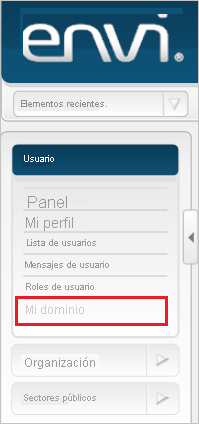
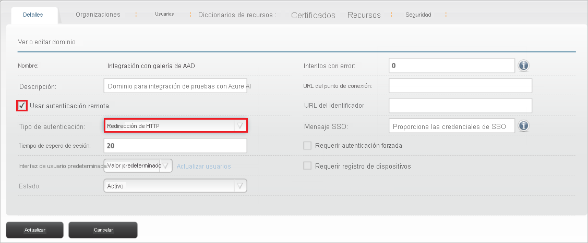
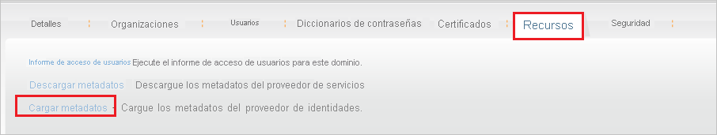
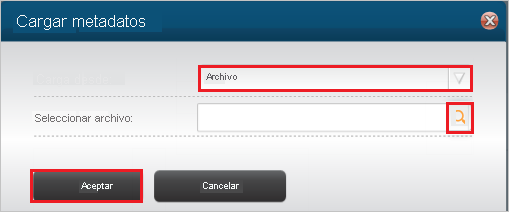
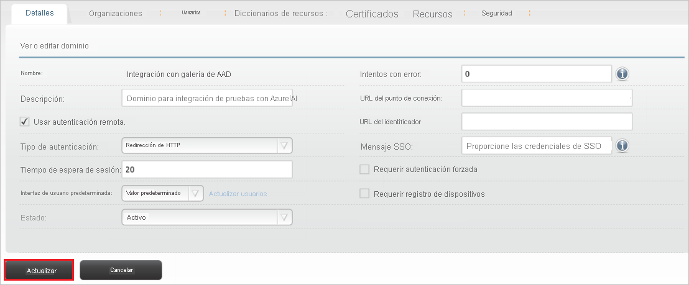
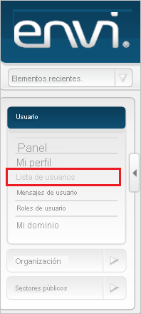
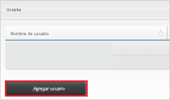
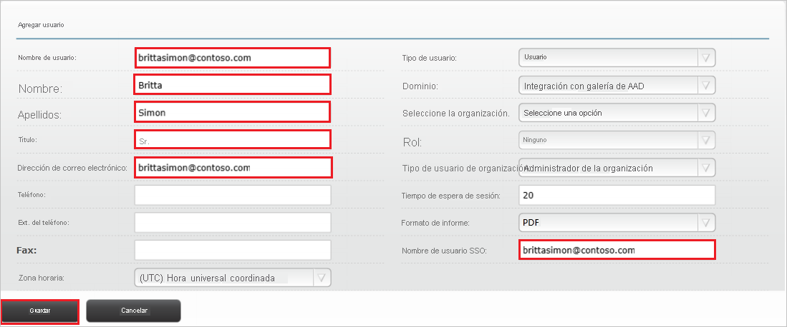

# Tutorial: integrar Azure Active Directory con Envi MMIS

En este tutorial, obtendrá información sobre cómo integrar Envi MMIS en Azure Active Directory (Azure AD). Al integrar Envi MMIS con Azure AD, puede hacer lo siguiente:

* Controlar en Azure AD quién tiene acceso a Envi MMIS.
* Permitir que los usuarios puedan iniciar sesión automáticamente en Envi MMIS con sus cuentas de Azure AD.
* Administrar las cuentas desde una ubicación central (Azure Portal).

## Requisitos previos

Para empezar, necesita los siguientes elementos:

* Una suscripción de Azure AD. Si no tiene una suscripción, puede crear una [cuenta gratuita](https://azure.microsoft.com/free/).
* Una suscripción habilitada para el inicio de sesión único (SSO) en Envi MMIS.

## Descripción del escenario

En este tutorial, puede configurar y probar el inicio de sesión único de Azure AD en un entorno de prueba.

* Envi MMIS admite el inicio de sesión único iniciado por **SP** e **IDP**.

## Adición de Envi MMIS desde la galería

Para configurar la integración de Envi MMIS en Azure AD, será preciso que agregue Envi MMIS desde la galería a la lista de aplicaciones SaaS administradas.

1. Inicie sesión en Azure Portal con una cuenta personal, profesional o educativa de Microsoft.
1. En el panel de navegación de la izquierda, seleccione el servicio **Azure Active Directory**.
1. Vaya a **Aplicaciones empresariales** y seleccione **Todas las aplicaciones**.
1. Para agregar una nueva aplicación, seleccione **Nueva aplicación**.
1. En la sección **Agregar desde la galería**, escriba **Envi MMIS** en el cuadro de búsqueda.
1. Seleccione **Envi MMIS** en el panel de resultados y, a continuación, agregue la aplicación. Espere unos segundos mientras la aplicación se agrega al inquilino.

## Configuración y prueba del inicio de sesión único de Azure AD para Envi MMIS

Configure y pruebe el inicio de sesión único de Azure AD con Envi MMIS mediante un usuario de prueba llamado **B.Simon**. Para que el inicio de sesión único funcione, es necesario establecer una relación de vinculación entre un usuario de Azure AD y el usuario relacionado de Envi MMIS.

Para configurar y probar el inicio de sesión único de Azure AD con Envi MMIS, lleve a cabo los siguientes pasos:

1. **[Configuración del inicio de sesión único de Azure AD](#configure-azure-ad-sso)** , para permitir que los usuarios puedan utilizar esta característica.
    1. **[Creación de un usuario de prueba de Azure AD](#create-an-azure-ad-test-user)** , para probar el inicio de sesión único de Azure AD con B.Simon.
    1. **[Asignación del usuario de prueba de Azure AD](#assign-the-azure-ad-test-user)** , para habilitar a B.Simon para que use el inicio de sesión único de Azure AD.
1. **[Configuración del inicio de sesión único en Envi MMIS](#configure-envi-mmis-sso)** : para configurar los valores de inicio de sesión único en la aplicación.
    1. **[Creación de un usuario de prueba de Envi MMIS](#create-envi-mmis-test-user)** : para tener un homólogo de B.Simon en Envi MMIS que esté vinculado a la representación del usuario en Azure AD.
1. **[Prueba del inicio de sesión único](#test-sso)** : para comprobar si la configuración funciona.

## Configuración del inicio de sesión único de Azure AD

Siga estos pasos para habilitar el inicio de sesión único de Azure AD en Azure Portal.

1. En Azure Portal, en la página de integración de la aplicación **Envi MMIS**, busque la sección **Administrar** y seleccione **Inicio de sesión único**.
1. En la página **Seleccione un método de inicio de sesión único**, elija **SAML**.
1. En la página **Configuración del inicio de sesión único con SAML**, haga clic en el icono de lápiz de **Configuración básica de SAML** para editar la configuración.

   

4. En la sección **Configuración básica de SAML**, si desea configurar la aplicación en el modo iniciado por **IDP** siga estos pasos:

    a. En el cuadro de texto **Identificador**, escriba una dirección URL con el patrón siguiente: `https://www.<CUSTOMER DOMAIN>.com/Account`

    b. En el cuadro de texto **URL de respuesta**, escriba una dirección URL con el siguiente patrón: `https://www.<CUSTOMER DOMAIN>.com/Account/Acs`

5. Haga clic en **Establecer direcciones URL adicionales** y siga este paso si desea configurar la aplicación en el modo iniciado por **SP**:

    En el cuadro de texto **URL de inicio de sesión**, escriba una dirección URL con el siguiente patrón: `https://www.<CUSTOMER DOMAIN>.com/Account`

    > [!NOTE]
    > Estos valores no son reales. Actualice estos valores con los valores reales de Identificador, URL de respuesta y URL de inicio de sesión. Póngase en contacto con el [equipo de soporte técnico de cliente de Envi MMIS](mailto:support@ioscorp.com) para obtener estos valores. También puede hacer referencia a los patrones que se muestran en la sección **Configuración básica de SAML** de Azure Portal.

6. En la página **Configurar el inicio de sesión único con SAML**, en la sección **Certificado de firma de SAML**, haga clic en **Descargar** para descargar el **XML de metadatos de federación** de las opciones proporcionadas según sus requisitos y guárdelo en el equipo.

    

7. En la sección **Set up Envi MMIS** (Configurar Envi MMIS), copie las direcciones URL adecuadas según sus necesidades.

    

### Creación de un usuario de prueba de Azure AD 

En esta sección, va a crear un usuario de prueba llamado B.Simon en Azure Portal.

1. En el panel izquierdo de Azure Portal, seleccione **Azure Active Directory**, **Usuarios** y **Todos los usuarios**.
1. Seleccione **Nuevo usuario** en la parte superior de la pantalla.
1. En las propiedades del **usuario**, siga estos pasos:
   1. En el campo **Nombre**, escriba `B.Simon`.  
   1. En el campo **Nombre de usuario**, escriba username@companydomain.extension. Por ejemplo, `B.Simon@contoso.com`.
   1. Active la casilla **Show password** (Mostrar contraseña) y, después, anote el valor que se muestra en el cuadro **Contraseña**.
   1. Haga clic en **Crear**.

### Asignación del usuario de prueba de Azure AD

En esta sección, va a permitir que B.Simon acceda a Envi MMIS mediante el inicio de sesión único de Azure.

1. En Azure Portal, seleccione sucesivamente **Aplicaciones empresariales** y **Todas las aplicaciones**.
1. En la lista de aplicaciones, seleccione **Envi MMIS**.
1. En la página de información general de la aplicación, busque la sección **Administrar** y seleccione **Usuarios y grupos**.
1. Seleccione **Agregar usuario**. A continuación, en el cuadro de diálogo **Agregar asignación**, seleccione **Usuarios y grupos**.
1. En el cuadro de diálogo **Usuarios y grupos**, seleccione **B.Simon** de la lista de usuarios y haga clic en el botón **Seleccionar** de la parte inferior de la pantalla.
1. Si espera que se asigne un rol a los usuarios, puede seleccionarlo en la lista desplegable **Seleccionar un rol**. Si no se ha configurado ningún rol para esta aplicación, verá seleccionado el rol "Acceso predeterminado".
1. En el cuadro de diálogo **Agregar asignación**, haga clic en el botón **Asignar**.

## Configuración del inicio de sesión único de Envi MMIS

1. En otra ventana del explorador web, inicie sesión como administrador en el sitio de Envi MMIS.

2. Haga clic en la pestaña **My Domain** (Mi dominio).

    

3. Haga clic en **Editar**.

    

4. Seleccione la casilla **Use remote authentication** (Usar autenticación remota) y, a continuación, seleccione **Redirección HTTP** (Redirección HTTP) desde la lista desplegable **Tipo de autenticación**.

    

5. Seleccione la pestaña **Recursos** y, a continuación, haga clic en **Cargar metadatos**.

    

6. En la ventana emergente **Cargar metadatos**, realice los siguientes pasos:

    

    a. Seleccione la opción **Archivo** desde la lista desplegable **Upload From** (Cargar desde).

    b. Para cargar el archivo de metadatos descargado de Azure Portal, seleccione el **icono para elegir archivo**.

    c. Haga clic en **Aceptar**.

7. Después de cargar el archivo de metadatos descargado, los campos se rellenarán automáticamente. Haga clic en **Update**(Actualizar).

    

### Creación de un usuario de prueba de Envi MMIS

Para permitir que los usuarios de Azure AD inicien sesión en Envi MMIS, deben aprovisionarse en Envi MMIS. En el caso de Envi MMIS, el aprovisionamiento es una tarea manual.

**Para aprovisionar una cuenta de usuario, realice estos pasos:**

1. Inicie sesión como administrador en el sitio de la compañía de Envi MMIS.

2. Haga clic en la pestaña **Lista de usuarios**.

    

3. Haga clic en el botón **Agregar usuario**.

    

4. En la sección **Add User** (Agregar usuario), realice estos pasos:

    

    a. En el cuadro de texto **Nombre de usuario**, escriba el nombre del usuario de la cuenta de Britta Simon, como **brittasimon\@contoso.com**.
    
    b. En el cuadro de texto **Nombre**, escriba el nombre del usuario de BrittaSimon, como **Britta**.

    c. En el cuadro de texto **Apellido**, escriba el nombre del usuario de Britta Simon, como **Simon**.

    d. Escriba el tratamiento del usuario en el cuadro de texto **Título**.
    
    e. En el cuadro de texto **Dirección de correo electrónico**, escriba la dirección de correo electrónico de la cuenta de Britta Simon, como **brittasimon\@contoso.com**.

    f. En el cuadro de texto **SSO User Name** (Nombre de usuario de SSO), escriba el nombre del usuario de la cuenta de Britta Simon, como **brittasimon\@contoso.com**.

    g. Haga clic en **Save**(Guardar).

## Prueba de SSO

En esta sección, probará la configuración de inicio de sesión único de Azure AD con las siguientes opciones. 

#### Iniciado por SP:

* Haga clic en **Probar esta aplicación** en Azure Portal. Esto le redirigirá a la dirección URL de inicio de sesión de Envi MMIS, donde puede iniciar el flujo de inicio de sesión.  

* Vaya directamente a la dirección URL de inicio de sesión de Envi MMIS e inicie el flujo de inicio de sesión desde allí.

#### Iniciado por IDP:

* Haga clic en **Probar esta aplicación** en Azure Portal y debería iniciar sesión automáticamente en la instancia de Envi MMIS para la que configuró el inicio de sesión único. 

También puede usar Aplicaciones de Microsoft para probar la aplicación en cualquier modo. Al hacer clic en el icono de Envi MMIS en Aplicaciones, si se ha configurado en modo SP, se le redirigirá a la página de inicio de sesión de la aplicación para comenzar el flujo de inicio de sesión; y si se ha configurado en modo IDP, se debería iniciar sesión automáticamente en la instancia de Envi MMIS para la que ha configurado el inicio de sesión único. Para más información acerca de Aplicaciones, consulte [Inicio de sesión e inicio de aplicaciones desde el portal Aplicaciones](../user-help/my-apps-portal-end-user-access.md).

## Pasos siguientes

Una vez configurado Envi MMIS, puede aplicar el control de sesión, que protege a la organización en tiempo real frente a la filtración e infiltración de información confidencial. El control de sesión procede del acceso condicional. [Aprenda a aplicar el control de sesión con Microsoft Cloud App Security](/cloud-app-security/proxy-deployment-aad).