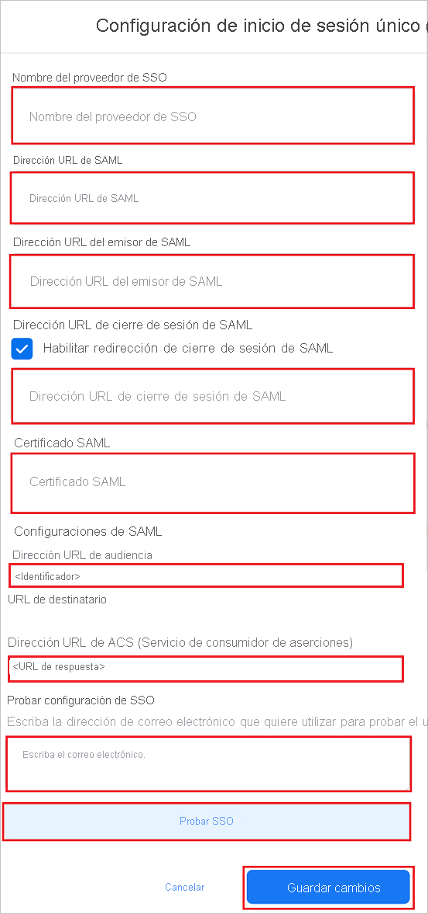

# Tutorial: Integración del inicio de sesión único (SSO) de Azure Active Directory con Facebook Work Accounts

En este tutorial, obtendrá información sobre cómo integrar Facebook Work Accounts con Azure Active Directory (Azure AD). Al integrar Facebook Work Accounts con Azure AD, puede hacer lo siguiente:

* Controlar en Azure AD quién tiene acceso a Facebook Work Accounts.
* Permitir que los usuarios inicien sesión automáticamente en Facebook Work Accounts con sus cuentas de Azure AD.
* Administrar las cuentas desde una ubicación central (Azure Portal).

## Requisitos previos

Para empezar, necesita los siguientes elementos:

* Una suscripción de Azure AD. Si no tiene una suscripción, puede crear una [cuenta gratuita](https://azure.microsoft.com/free/).
* Una suscripción habilitada para inicio de sesión único (SSO) en Facebook Work Accounts.

## Descripción del escenario

En este tutorial, va a configurar y probar el inicio de sesión único de Azure AD en un entorno de prueba.

* Facebook Work Accounts admite el inicio de sesión único iniciado por **SP e IDP**.

## Adición de Facebook Work Accounts desde la galería

Para configurar la integración de Facebook Work Accounts en Azure AD, deberá agregar Facebook Work Accounts desde la galería a la lista de aplicaciones SaaS administradas.

1. Inicie sesión en Azure Portal con una cuenta personal, profesional o educativa de Microsoft.
1. En el panel de navegación de la izquierda, seleccione el servicio **Azure Active Directory**.
1. Vaya a **Aplicaciones empresariales** y seleccione **Todas las aplicaciones**.
1. Para agregar una nueva aplicación, seleccione **Nueva aplicación**.
1. En la sección **Agregar desde la galería**, escriba **Facebook Work Accounts** en el cuadro de búsqueda.
1. Seleccione **Facebook Work Accounts** en el panel de resultados y, a continuación, agregue la aplicación. Espere unos segundos mientras la aplicación se agrega al inquilino.

## Configuración y prueba del inicio de sesión único de Azure AD para Facebook Work Accounts

Configure y pruebe el inicio de sesión único de Azure AD con Facebook Work Accounts mediante un usuario de prueba llamado **B.Simon**. Para que el inicio de sesión único funcione, es necesario establecer una relación de vinculación entre un usuario de Azure AD y el usuario relacionado de Facebook Work Accounts.

Para configurar y probar el inicio de sesión único de Azure AD con Facebook Work Accounts, lleve a cabo los siguientes pasos:

1. **[Configuración del inicio de sesión único de Azure AD](#configure-azure-ad-sso)** , para permitir que los usuarios puedan utilizar esta característica.
    1. **[Creación de un usuario de prueba de Azure AD](#create-an-azure-ad-test-user)** , para probar el inicio de sesión único de Azure AD con B.Simon.
    1. **[Asignación del usuario de prueba de Azure AD](#assign-the-azure-ad-test-user)** , para habilitar a B.Simon para que use el inicio de sesión único de Azure AD.
1. **[Configuración del inicio de sesión único en Facebook Work Accounts](#configure-facebook-work-accounts-sso)** : para configurar los valores de inicio de sesión único en la aplicación.
    1. **[Creación de un usuario de prueba de Facebook Work Accounts](#create-facebook-work-accounts-test-user)** : para tener un homólogo de B.Simon en Facebook Work Accounts que esté vinculado a la representación del usuario en Azure AD.
1. **[Prueba del inicio de sesión único](#test-sso)** : para comprobar si la configuración funciona.

## Configuración del inicio de sesión único de Azure AD

Siga estos pasos para habilitar el inicio de sesión único de Azure AD en Azure Portal.

1. En Azure Portal, en la página de integración de la aplicación **Facebook Work Accounts**, busque la sección **Administrar** y seleccione **Inicio de sesión único**.
1. En la página **Seleccione un método de inicio de sesión único**, elija **SAML**.
1. En la página **Configuración del inicio de sesión único con SAML**, haga clic en el icono de lápiz de **Configuración básica de SAML** para editar la configuración.

   

1. En la sección **Configuración básica de SAML**, si desea configurar la aplicación en modo iniciado por **IDP**, realice los siguientes pasos:

    a. En el cuadro de texto **Identificador**, escriba una dirección URL con el patrón siguiente: `https://work.facebook.com/company/<ID>`

    b. En el cuadro de texto **URL de respuesta**, escriba una dirección URL con el siguiente patrón: ` https://work.facebook.com/work/saml.php?__cid=<ID>`

1. Haga clic en **Establecer direcciones URL adicionales** y siga este paso si desea configurar la aplicación en el modo iniciado por **SP**:

    En el cuadro de texto **URL de inicio de sesión**, escriba la dirección URL: `https://work.facebook.com`

    > [!NOTE]
    > Estos valores no son reales. Actualice estos valores con el identificador y la URL de respuesta reales. Póngase en contacto con el [equipo de soporte técnico al cliente de Facebook Work Accounts](mailto:WorkplaceSupportPartnerships@fb.com) para obtener estos valores. También puede hacer referencia a los patrones que se muestran en la sección **Configuración básica de SAML** de Azure Portal.

1. En la página **Configurar el inicio de sesión único con SAML**, en la sección **Certificado de firma de SAML**, busque **Certificado (Base64)** y seleccione **Descargar** para descargarlo y guardarlo en el equipo.

    

1. En la sección **Configurar Facebook Work Accounts**, copie las direcciones URL adecuadas según sus necesidades.

    

### Creación de un usuario de prueba de Azure AD

En esta sección, va a crear un usuario de prueba llamado B.Simon en Azure Portal.

1. En el panel izquierdo de Azure Portal, seleccione **Azure Active Directory**, **Usuarios** y **Todos los usuarios**.
1. Seleccione **Nuevo usuario** en la parte superior de la pantalla.
1. En las propiedades del **usuario**, siga estos pasos:
   1. En el campo **Nombre**, escriba `B.Simon`.  
   1. En el campo **Nombre de usuario**, escriba username@companydomain.extension. Por ejemplo, `B.Simon@contoso.com`.
   1. Active la casilla **Show password** (Mostrar contraseña) y, después, anote el valor que se muestra en el cuadro **Contraseña**.
   1. Haga clic en **Crear**.

### Asignación del usuario de prueba de Azure AD

En esta sección, va a permitir que B.Simon acceda a Facebook Work Accounts mediante el inicio de sesión único de Azure.

1. En Azure Portal, seleccione sucesivamente **Aplicaciones empresariales** y **Todas las aplicaciones**.
1. En la lista de aplicaciones, seleccione **Facebook Work Accounts**.
1. En la página de información general de la aplicación, busque la sección **Administrar** y seleccione **Usuarios y grupos**.
1. Seleccione **Agregar usuario**. A continuación, en el cuadro de diálogo **Agregar asignación**, seleccione **Usuarios y grupos**.
1. En el cuadro de diálogo **Usuarios y grupos**, seleccione **B.Simon** de la lista de usuarios y haga clic en el botón **Seleccionar** de la parte inferior de la pantalla.
1. Si espera que se asigne un rol a los usuarios, puede seleccionarlo en la lista desplegable **Seleccionar un rol**. Si no se ha configurado ningún rol para esta aplicación, verá seleccionado el rol "Acceso predeterminado".
1. En el cuadro de diálogo **Agregar asignación**, haga clic en el botón **Asignar**.

## Configuración del inicio de sesión único de Facebook Work Accounts

1. Inicie sesión como administrador en el sitio de Facebook Work Accounts de la compañía.

1. Vaya a **Security** > **Single Sign-On** (Seguridad > Inicio de sesión único).

1. Habilite la casilla **Single-sign on(SSO)** (Inicio de sesión único [SSO]) y haga clic en **+Add new SSO Provider** (+ Agregar nuevo proveedor de SSO).

    

1. En la página **Single Sign-On (SSO) Setup** (Configuración de inicio de sesión único [SSO]), siga estos pasos:

    

    1. Escriba un valor válido para el campo **Name of the SSO Provider** (Nombre del proveedor de SSO).

    1. En el cuadro de texto **SAML URL** (Dirección URL de SAML), pegue el valor de **Dirección URL de inicio de sesión** que ha copiado de Azure Portal.

    1. En el cuadro de texto **SAML Issuer URL** (Dirección URL del emisor de SAML), pegue el valor del **Identificador de Azure AD** que ha copiado de Azure Portal.

    1. Habilite la casilla **SAML logout redirection** (Redireccionamiento del cierre de sesión de SAML) y, en el cuadro de texto **SAML Logout URL** (Dirección URL de cierre de sesión de SAML), pegue el valor de **URL de cierre de sesión** que ha copiado de Azure Portal.

    1. Abra el **Certificado (Base 64)** que descargó de Azure Portal en el Bloc de notas, copie el contenido y péguelo en el cuadro de texto **SAML Certificate** (Certificado SAML).

    1. Copie el valor de **Audience URL** (Dirección URL de audiencia) y péguelo en el cuadro de texto **Identificador** de la sección **Configuración básica de SAML** en Azure Portal.

    1. Copie el valor de **ACS (Assertion Consumer Service) URL** (URL del Servicio de consumidor de aserciones [ACS]) y péguelo en el cuadro de texto **URL de respuesta** en la sección **Configuración básica de SAML** de Azure Portal.

    1. En la sección **Test SSO Setup** (Probar configuración de SSO), escriba un correo electrónico válido en el cuadro de texto y haga clic en **Test SSO** (Probar SSO).

    1. Haga clic en **Guardar cambios**.

### Creación de un usuario de prueba de Facebook Work Accounts

En esta sección, creará un usuario llamado Britta Simon en Facebook Work Accounts. Colabore con el [equipo de soporte técnico de Facebook Work Accounts](mailto:WorkplaceSupportPartnerships@fb.com) para agregar los usuarios a la plataforma de Facebook Work Accounts. Los usuarios se tienen que crear y activar antes de usar el inicio de sesión único.

## Prueba de SSO 

En esta sección, probará la configuración de inicio de sesión único de Azure AD con las siguientes opciones. 

#### Iniciado por SP:

* Haga clic en **Probar esta aplicación** en Azure Portal. Esto le redirigirá a la dirección URL de inicio de sesión de Facebook Work Accounts, donde puede iniciar el flujo de inicio de sesión.  

* Vaya directamente a la dirección URL de inicio de sesión de Facebook Work Accounts e inicie el flujo de inicio de sesión desde allí.

#### Iniciado por IDP:

* Haga clic en **Probar esta aplicación** en Azure Portal; debería iniciar sesión automáticamente en la instancia de Facebook Work Accounts para la que ha configurado el inicio de sesión único. 

También puede usar Aplicaciones de Microsoft para probar la aplicación en cualquier modo. Si hace clic en el icono de Facebook Work Accounts de Aplicaciones y seleccionó el modo SP en la configuración, accederá automáticamente a la página de inicio de sesión de la aplicación para comenzar el flujo de inicio de sesión. Por el contrario, si seleccionó el modo IDP, debería iniciar sesión automáticamente en la instancia de Facebook Work Accounts en la que ha configurado el inicio de sesión único. Para más información acerca de Aplicaciones, consulte [Inicio de sesión e inicio de aplicaciones desde el portal Aplicaciones](../user-help/my-apps-portal-end-user-access.md).

## Pasos siguientes

Una vez configurado Facebook Work Accounts, puede aplicar el control de sesión, que protege a la organización en tiempo real frente a la filtración e infiltración de información confidencial. El control de sesión procede del acceso condicional. [Aprenda a aplicar el control de sesión con Microsoft Cloud App Security](/cloud-app-security/proxy-deployment-aad).