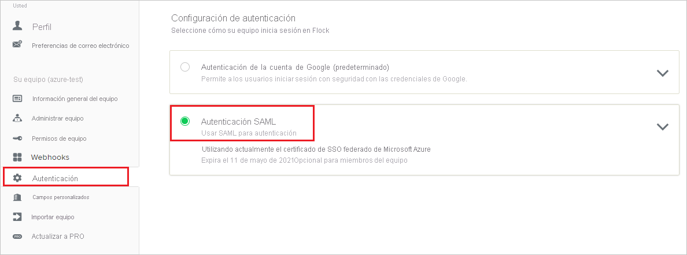
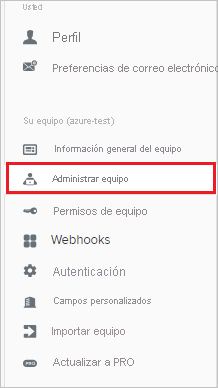
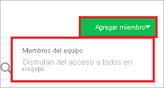
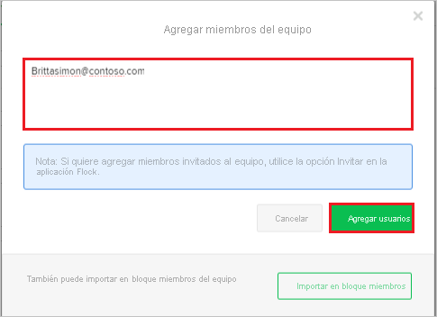

# Tutorial: Integración de Azure Active Directory con Flock

En este tutorial, aprenderá a integrar Flock con Azure Active Directory (Azure AD). Al integrar Flock con Azure AD, puede hacer lo siguiente:

* Controlar en Azure AD quién tiene acceso a Flock.
* Permitir que los usuarios inicien sesión automáticamente en Flock con sus cuentas de Azure AD.
* Administrar las cuentas desde una ubicación central (Azure Portal).

## Requisitos previos

Para empezar, necesita los siguientes elementos:

* Una suscripción de Azure AD. Si no tiene una suscripción, puede crear una [cuenta gratuita](https://azure.microsoft.com/free/).
* Suscripción habilitada para el inicio de sesión único (SSO) en Flock.

## Descripción del escenario

En este tutorial, puede configurar y probar el inicio de sesión único de Azure AD en un entorno de prueba.

* Flock admite el inicio de sesión único iniciado por **SP**.
* Flock admite el [aprovisionamiento automatizado de usuarios](flock-provisioning-tutorial.md).

## Incorporación de Flock desde la galería

Para configurar la integración de Flock en Azure AD, será preciso agregar Flock desde la galería a la lista de aplicaciones SaaS administradas.

1. Inicie sesión en Azure Portal con una cuenta personal, profesional o educativa de Microsoft.
1. En el panel de navegación de la izquierda, seleccione el servicio **Azure Active Directory**.
1. Vaya a **Aplicaciones empresariales** y seleccione **Todas las aplicaciones**.
1. Para agregar una nueva aplicación, seleccione **Nueva aplicación**.
1. En la sección **Agregar desde la galería**, escriba **Flock** en el cuadro de búsqueda.
1. Seleccione **Flock** en el panel de resultados y agregue la aplicación. Espere unos segundos mientras la aplicación se agrega al inquilino.

## Configuración y prueba del inicio de sesión único de Azure AD en Flock

Configure y pruebe el inicio de sesión único de Azure AD con Flock mediante un usuario de prueba llamado **B.Simon**. Para que el inicio de sesión único funcione, es preciso establecer una relación de vinculación entre un usuario de Azure AD y el usuario relacionado de Flock.

Para configurar y probar el inicio de sesión único de Azure AD con Flock, haga lo siguiente:

1. **[Configuración del inicio de sesión único de Azure AD](#configure-azure-ad-sso)** , para permitir que los usuarios puedan utilizar esta característica.
    1. **[Creación de un usuario de prueba de Azure AD](#create-an-azure-ad-test-user)** , para probar el inicio de sesión único de Azure AD con Britta Simon.
    1. **[Asignación del usuario de prueba de Azure AD](#assign-the-azure-ad-test-user)** , para permitir que Britta Simon use el inicio de sesión único de Azure AD.
2. **[Configuración del inicio de sesión único en Flock](#configure-flock-sso)** : para configurar los valores de inicio de sesión único en la aplicación.
    1. **[Creación de un usuario de prueba de Flock](#create-flock-test-user)** : para tener un homólogo de Britta Simon en Flock que esté vinculado a la representación del usuario en Azure AD.
1. **[Prueba del inicio de sesión único](#test-sso)** : para comprobar si la configuración funciona.

## Configuración del inicio de sesión único de Azure AD

Siga estos pasos para habilitar el inicio de sesión único de Azure AD en Azure Portal.

1. En Azure Portal, en la página de integración de aplicaciones de **Flock**, busque la sección **Administrar** y seleccione **Inicio de sesión único**.
1. En la página **Seleccione un método de inicio de sesión único**, elija **SAML**.
1. En la página **Configuración del inicio de sesión único con SAML**, haga clic en el icono de lápiz de **Configuración básica de SAML** para editar la configuración.

   

4. En la sección **Configuración básica de SAML**, siga estos pasos:

    a. En el cuadro de texto **URL de inicio de sesión**, escriba una dirección URL con el siguiente patrón: `https://<subdomain>.flock.com/`

    b. En el cuadro de texto **Identificador (id. de entidad)** , escriba una dirección URL con el siguiente patrón: `https://<subdomain>.flock.com/`

    > [!NOTE]
    > Estos valores no son reales. Actualice estos valores con la dirección URL y el identificador reales de inicio de sesión. Póngase en contacto con el [equipo de soporte técnico de Flock](mailto:support@flock.com) para obtener estos valores. También puede hacer referencia a los patrones que se muestran en la sección **Configuración básica de SAML** de Azure Portal.

4. En la página **Configurar el inicio de sesión único con SAML**, en la sección **Certificado de firma de SAML**, haga clic en **Descargar** para descargar el **certificado (Base64)** de las opciones proporcionadas según sus requisitos y guárdelo en el equipo.

    

6. En la sección **Set up Flock** (Configurar Flock), copie las direcciones URL adecuada según sus necesidades.

    

### Creación de un usuario de prueba de Azure AD

En esta sección, va a crear un usuario de prueba llamado B.Simon en Azure Portal.

1. En el panel izquierdo de Azure Portal, seleccione **Azure Active Directory**, **Usuarios** y **Todos los usuarios**.
1. Seleccione **Nuevo usuario** en la parte superior de la pantalla.
1. En las propiedades del **usuario**, siga estos pasos:
   1. En el campo **Nombre**, escriba `B.Simon`.  
   1. En el campo **Nombre de usuario**, escriba username@companydomain.extension. Por ejemplo, `B.Simon@contoso.com`.
   1. Active la casilla **Show password** (Mostrar contraseña) y, después, anote el valor que se muestra en el cuadro **Contraseña**.
   1. Haga clic en **Crear**.

### Asignación del usuario de prueba de Azure AD

En esta sección, va a permitir que B.Simon acceda a Flock mediante el inicio de sesión único de Azure.

1. En Azure Portal, seleccione sucesivamente **Aplicaciones empresariales** y **Todas las aplicaciones**.
1. En la lista de aplicaciones, seleccione **Flock**.
1. En la página de información general de la aplicación, busque la sección **Administrar** y seleccione **Usuarios y grupos**.
1. Seleccione **Agregar usuario**. A continuación, en el cuadro de diálogo **Agregar asignación**, seleccione **Usuarios y grupos**.
1. En el cuadro de diálogo **Usuarios y grupos**, seleccione **B.Simon** de la lista de usuarios y haga clic en el botón **Seleccionar** de la parte inferior de la pantalla.
1. Si espera que se asigne un rol a los usuarios, puede seleccionarlo en la lista desplegable **Seleccionar un rol**. Si no se ha configurado ningún rol para esta aplicación, verá seleccionado el rol "Acceso predeterminado".
1. En el cuadro de diálogo **Agregar asignación**, haga clic en el botón **Asignar**.

## Configuración del inicio de sesión único de Flock

1. En otra ventana del explorador web, inicie sesión en su sitio de la compañía de Flock como administrador.

2. Seleccione la pestaña **Autenticación** en el panel de navegación izquierdo y, después, seleccione **Autenticación SAML**.

    

3. En la sección **Autenticación SAML** , realice los pasos siguientes:

    

    a. En el cuadro de texto **SAML 2.0 Endpoint(HTTP)** (Punto de conexión SAML 2.0 [HTTP]), pegue el valor de **Dirección URL de inicio de sesión** que ha copiado de Azure Portal.

    b. En el cuadro de texto **Emisor de proveedor de identidades**, pegue el valor del **identificador Azure AD** que ha copiado de Azure Portal.

    c. Abra el **Certificado (Base64)** descargado de Azure Portal en el Bloc de notas y pegue el contenido en el cuadro de texto **Certificado público**.

    d. Haga clic en **Save**(Guardar).

### Creación de un usuario de prueba de Flock

Para permitir que los usuarios de Azure AD inicien sesión en Flock, tienen que aprovisionarse en Flock. En el caso de Flock, el aprovisionamiento es una tarea manual.

**Para aprovisionar una cuenta de usuario, realice estos pasos:**

1. Inicie sesión en su sitio de la compañía de Flock como administrador.

2. Haga clic en **Administrar equipo** en el panel de navegación de la izquierda.

    

3. Haga clic en las pestaña **Agregar miembro** y, después, seleccione **Miembros del equipo**.

    

4. Escriba la dirección de correo electrónico del usuario en formato **Brittasimon\@contoso.com** y después seleccione **Agregar usuarios**.

    

> [!NOTE]
>Flock también admite el aprovisionamiento automático de usuarios. [Aquí](./flock-provisioning-tutorial.md) puede encontrar más detalles sobre cómo configurarlo.

## Prueba de SSO 

En esta sección, probará la configuración de inicio de sesión único de Azure AD con las siguientes opciones. 

* Haga clic en **Probar esta aplicación** en Azure Portal. Esta acción le redirigirá a la dirección URL de inicio de sesión de Flock, donde puede comenzar el flujo de inicio de sesión. 

* Vaya a directamente a la dirección URL de inicio de sesión de Flock y comience el flujo de inicio de sesión desde allí.

* Puede usar Mis aplicaciones de Microsoft. Al hacer clic en el icono de Flock en Aplicaciones, se le redirigirá a la dirección URL de inicio de sesión de dicha aplicación. Para más información acerca de Aplicaciones, consulte [Inicio de sesión e inicio de aplicaciones desde el portal Aplicaciones](../user-help/my-apps-portal-end-user-access.md).

## Pasos siguientes

Una vez que ha configurado Flock, puede aplicar el control de sesión, que protege a su organización en tiempo real frente a la filtración e infiltración de información confidencial. El control de sesión procede del acceso condicional. [Aprenda a aplicar el control de sesión con Microsoft Cloud App Security](/cloud-app-security/proxy-deployment-any-app).