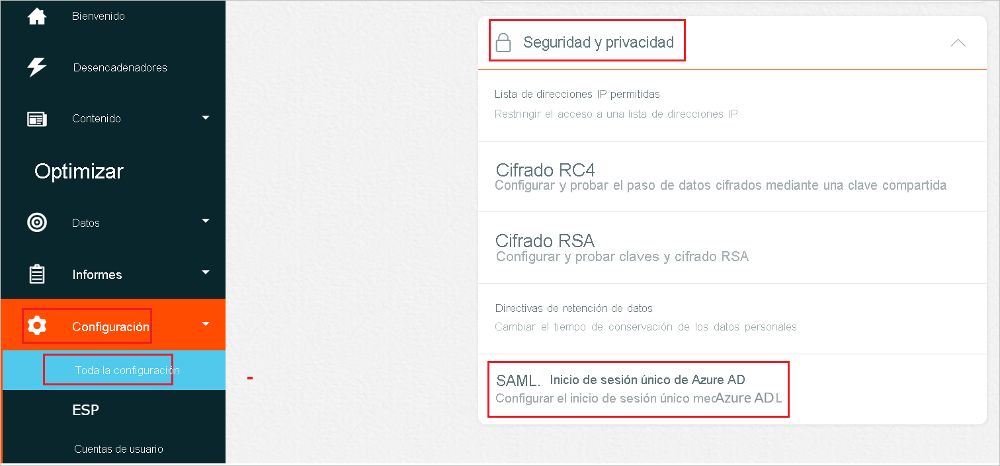
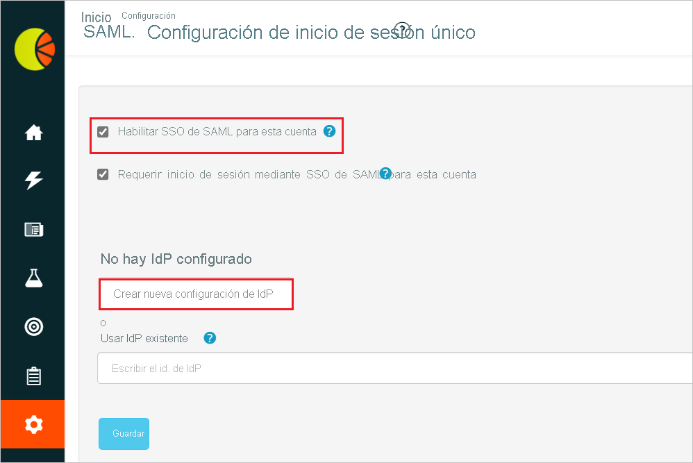

# Tutorial: Integración del inicio de sesión único (SSO) de Azure Active Directory con Fresh Relevance

En este tutorial, aprenderá a integrar Fresh Relevance con Azure Active Directory (Azure AD). Al integrar Fresh Relevance con Azure AD, puede hacer lo siguiente:

* Controlar en Azure AD quién tiene acceso a Fresh Relevance.
* Permitir que los usuarios inicien sesión automáticamente en Fresh Relevance con sus cuentas de Azure AD.
* Administrar las cuentas desde una ubicación central (Azure Portal).

## Requisitos previos

Para empezar, necesita los siguientes elementos:

* Una suscripción de Azure AD. Si no tiene una suscripción, puede crear una [cuenta gratuita](https://azure.microsoft.com/free/).
* Una suscripción habilitada para el inicio de sesión único (SSO) en Fresh Relevance.

## Descripción del escenario

En este tutorial, va a configurar y probar el inicio de sesión único de Azure AD en un entorno de prueba.

* Fresh Relevance admite el inicio de sesión único iniciado por **IDP**.

* Fresh Relevance admite el aprovisionamiento de usuarios **Just-In-Time**.

## Adición de Fresh Relevance desde la galería

Para configurar la integración de Fresh Relevance en Azure AD, deberá agregar Fresh Relevance desde la galería a la lista de aplicaciones SaaS administradas.

1. Inicie sesión en Azure Portal con una cuenta personal, profesional o educativa de Microsoft.
1. En el panel de navegación de la izquierda, seleccione el servicio **Azure Active Directory**.
1. Vaya a **Aplicaciones empresariales** y seleccione **Todas las aplicaciones**.
1. Para agregar una nueva aplicación, seleccione **Nueva aplicación**.
1. En la sección **Agregar desde la galería**, escriba **Fresh Relevance** en el cuadro de búsqueda.
1. Seleccione **Fresh Relevance** en el panel de resultados y, a continuación, agregue la aplicación. Espere unos segundos mientras la aplicación se agrega al inquilino.

## Configuración y prueba del inicio de sesión único de Azure AD para Fresh Relevance

Configure y pruebe el inicio de sesión único de Azure AD con Fresh Relevance mediante un usuario de prueba llamado **B.Simon**. Para que el inicio de sesión único funcione, es preciso establecer una relación de vinculación entre un usuario de Azure AD y el usuario relacionado de Fresh Relevance.

Para configurar y probar el inicio de sesión único de Azure AD con Fresh Relevance, lleve a cabo los siguientes pasos:

1. **[Configuración del inicio de sesión único de Azure AD](#configure-azure-ad-sso)** , para permitir que los usuarios puedan utilizar esta característica.
    1. **[Creación de un usuario de prueba de Azure AD](#create-an-azure-ad-test-user)** , para probar el inicio de sesión único de Azure AD con B.Simon.
    1. **[Asignación del usuario de prueba de Azure AD](#assign-the-azure-ad-test-user)** , para habilitar a B.Simon para que use el inicio de sesión único de Azure AD.
1. **[Configuración del inicio de sesión único en Fresh Relevance](#configure-fresh-relevance-sso)** : para configurar los valores de inicio de sesión único en la aplicación.
    1. **[Creación de un usuario de prueba de Fresh Relevance](#create-fresh-relevance-test-user)** : para tener un homólogo de B.Simon en Fresh Relevance que esté vinculado a la representación del usuario en Azure AD.
1. **[Prueba del inicio de sesión único](#test-sso)** : para comprobar si la configuración funciona.

## Configuración del inicio de sesión único de Azure AD

Siga estos pasos para habilitar el inicio de sesión único de Azure AD en Azure Portal.

1. En Azure Portal, en la página de integración de la aplicación **Fresh Relevance**, busque la sección **Administrar** y seleccione **Inicio de sesión único**.
1. En la página **Seleccione un método de inicio de sesión único**, elija **SAML**.
1. En la página **Configuración del inicio de sesión único con SAML**, haga clic en el icono de lápiz de **Configuración básica de SAML** para editar la configuración.

   

1. En la sección **Configuración básica de SAML**, si tiene el **archivo de metadatos del proveedor de servicios**, lleve a cabo los siguientes pasos:

    a. Haga clic en **Cargar el archivo de metadatos**.

    

    b. Haga clic en el **logotipo de la carpeta** para seleccionar el archivo de metadatos y luego en **Cargar**.

    

    c. Una vez que se haya cargado correctamente el archivo de metadatos, los valores de **Identificador** y **URL de respuesta** se rellenan automáticamente en la sección Configuración básica de SAML:

    > [!Note]
    > Si los valores de **Identificador** y **URL de respuesta** no se rellenan automáticamente, hágalo manualmente a medida que lo necesite.

    d. En el cuadro de texto **Estado de la retransmisión**, escriba un valor con el siguiente patrón: `<ID>`

1. En la página **Configurar el inicio de sesión único con SAML**, en la sección **Certificado de firma de SAML**, haga clic en el botón de copia para copiar la **Dirección URL de metadatos de federación de aplicación** y guárdela en su equipo.

    

### Creación de un usuario de prueba de Azure AD

En esta sección, va a crear un usuario de prueba llamado B.Simon en Azure Portal.

1. En el panel izquierdo de Azure Portal, seleccione **Azure Active Directory**, **Usuarios** y **Todos los usuarios**.
1. Seleccione **Nuevo usuario** en la parte superior de la pantalla.
1. En las propiedades del **usuario**, siga estos pasos:
   1. En el campo **Nombre**, escriba `B.Simon`.  
   1. En el campo **Nombre de usuario**, escriba username@companydomain.extension. Por ejemplo, `B.Simon@contoso.com`.
   1. Active la casilla **Show password** (Mostrar contraseña) y, después, anote el valor que se muestra en el cuadro **Contraseña**.
   1. Haga clic en **Crear**.

### Asignación del usuario de prueba de Azure AD

En esta sección, va a conceder a B.Simon acceso a Fresh Relevance mediante el inicio de sesión único de Azure.

1. En Azure Portal, seleccione sucesivamente **Aplicaciones empresariales** y **Todas las aplicaciones**.
1. En la lista de aplicaciones, seleccione **Fresh Relevance**.
1. En la página de información general de la aplicación, busque la sección **Administrar** y seleccione **Usuarios y grupos**.
1. Seleccione **Agregar usuario**. A continuación, en el cuadro de diálogo **Agregar asignación**, seleccione **Usuarios y grupos**.
1. En el cuadro de diálogo **Usuarios y grupos**, seleccione **B.Simon** de la lista de usuarios y haga clic en el botón **Seleccionar** de la parte inferior de la pantalla.
1. Si espera que se asigne un rol a los usuarios, puede seleccionarlo en la lista desplegable **Seleccionar un rol**. Si no se ha configurado ningún rol para esta aplicación, verá seleccionado el rol "Acceso predeterminado".
1. En el cuadro de diálogo **Agregar asignación**, haga clic en el botón **Asignar**.

## Configuración del inicio de sesión único de Fresh Relevance

1. Inicie sesión en el sitio de la empresa de Fresh Relevance como administrador.

1. Vaya a **Settings** > **All Settings** > **Security and Privacy** (Configuración > Todas las configuraciones > Seguridad y privacidad) y haga clic en **SAML/Azure AD Single Sign-On** (SAML/Inicio de sesión único de Azure AD).

    

1. En la página **SAML/Single Sign-On Configuration** (Configuración de SAML/Inicio de sesión único), active la casilla **Enable SAML SSO for this account** (Habilitar SSO de SAML para esta cuenta) y haga clic en el botón **Create new IdP Configuration** (Crear nueva configuración de IdP). 

    

1. En la página **SAML IdP Configuration** (Configuración de Idp de SAML), realice los siguientes pasos:

    

    

    a. Copie el valor de **Entity ID** (Id. de entidad) y péguelo en el cuadro de texto **Identificador (id. de entidad)** de la sección **Configuración básica de SAML** en Azure Portal.

    b. Copie el valor de **Assertion Consumer Service(ACS) URL** (URL del Servicio de consumidor de aserciones [ACS]) y péguelo en el cuadro de texto **URL de respuesta** en la sección **Configuración básica de SAML** de Azure Portal.

    c. Copie el valor de **Relay State** (Estado de la retransmisión) y péguelo en el cuadro de texto **Estado de la retransmisión** en la sección **Configuración básica de SAML** de Azure Portal.

    d. Haga clic en **Download SP Metadata XML** (Descargar archivo XML de metadatos del SP) y cargue el archivo de metadatos en la sección **Configuración básica de SAML** de Azure Portal.

    e. Copie el valor de **Dirección URL de metadatos de federación de aplicación** de Azure Portal en el Bloc de notas, pegue el contenido en el cuadro de texto **IdP MetaData XML** (XML de metadatos de IdP) y haga clic en el botón **Save** (Guardar).

    f. Si se realiza correctamente, se mostrará información como el **identificador de entidad** del IdP en el cuadro de texto **IdP Entity ID** (Identificador de la entidad de IdP).

    g. Rellene manualmente los campos necesarios que ha copiado de Azure Portal en la sección **Attribute Mapping** (Asignación de atributos).

    h. En la sección **General Configuration** (Configuración general), habilite **Allow Just In Time(JIT)Account Creation** (Permitir la creación de cuentas Just-In-Time [JIT]) y haga clic en **Save** (Guardar).

    > [!NOTE]
    > Si estos parámetros no se asignan correctamente, la creación de la cuenta y el inicio de sesión no se realizarán correctamente y se mostrará un error. Para mostrar temporalmente información de depuración de atributos mejorada en caso de error de inicio de sesión, active la casilla **Show Debugging Information** (Mostrar información de depuración).

### Creación de un usuario de prueba de Fresh Relevance

En esta sección, se crea un usuario llamado Britta Simon en Fresh Relevance. Fresh Relevance admite el aprovisionamiento de usuarios Just-In-Time, que está habilitado de manera predeterminada. No hay ningún elemento de acción para usted en esta sección. Si aún no existe un usuario en Fresh Relevance, se crea uno después de la autenticación.

## Prueba de SSO 

En esta sección, probará la configuración de inicio de sesión único de Azure AD con las siguientes opciones.

* Haga clic en Probar esta aplicación en Azure Portal; debería iniciar sesión automáticamente en la instancia de Fresh Relevance para la que ha configurado el inicio de sesión único.

* Puede usar Mis aplicaciones de Microsoft. Al hacer clic en el icono de Fresh Relevance en Aplicaciones, debería iniciar sesión automáticamente en la instancia de Fresh Relevance para la que configuró el inicio de sesión único. Para más información acerca de Aplicaciones, consulte [Inicio de sesión e inicio de aplicaciones desde el portal Aplicaciones](https://support.microsoft.com/account-billing/sign-in-and-start-apps-from-the-my-apps-portal-2f3b1bae-0e5a-4a86-a33e-876fbd2a4510).

## Pasos siguientes

Una vez configurado Fresh Relevance, puede aplicar el control de sesión, que protege contra la filtración y la infiltración de la información confidencial de la organización en tiempo real. El control de sesión procede del acceso condicional. [Aprenda a aplicar el control de sesión con Microsoft Cloud App Security](/cloud-app-security/proxy-deployment-aad).