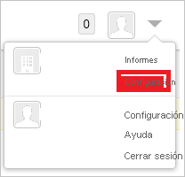
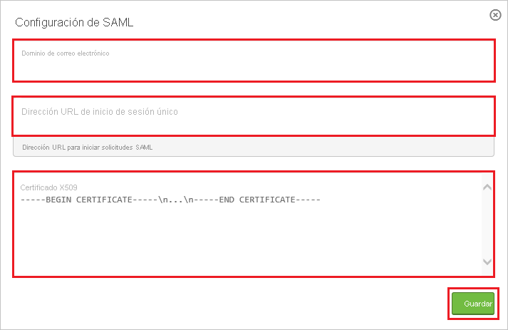
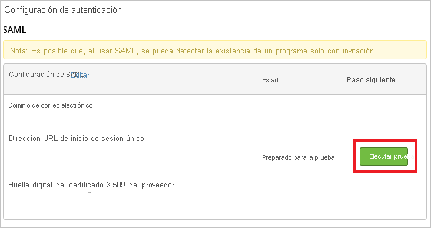
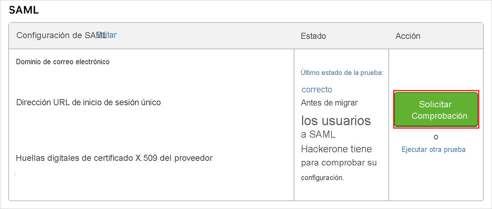
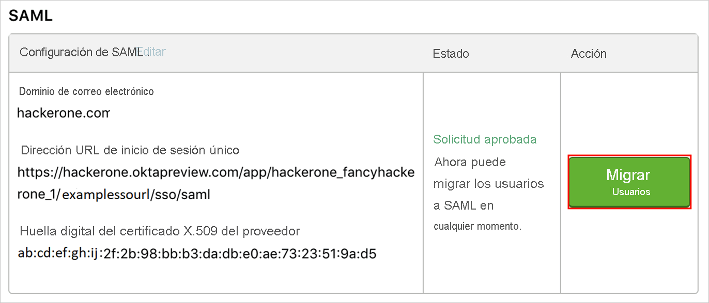

# Tutorial: Integración de Azure Active Directory con HackerOne

En este tutorial aprenderá a integrar HackerOne en Azure Active Directory (Azure AD). Si integra HackerOne con Azure AD, puede:

* Controlar en Azure AD quién tiene acceso a HackerOne.
* Permitir que los usuarios inicien sesión automáticamente en HackerOne con sus cuentas de Azure AD.
* Administrar las cuentas desde una ubicación central (Azure Portal).

## Requisitos previos

Para empezar, necesita los siguientes elementos:

* Una suscripción de Azure AD. Si no tiene una suscripción, puede crear una [cuenta gratuita](https://azure.microsoft.com/free/).
* Una suscripción habilitada para el inicio de sesión único (SSO) en HackerOne.

## Descripción del escenario

En este tutorial, puede configurar y probar el inicio de sesión único de Azure AD en un entorno de prueba.

* HackerOne admite el inicio de sesión único iniciado por **SP**.
* HackerOne admite el aprovisionamiento de usuarios **Just-In-Time**.

> [!NOTE]
> El identificador de esta aplicación es un valor de cadena fijo, por lo que solo se puede configurar una instancia en un inquilino.

## Adición de HackerOne desde la galería

Para configurar la integración de HackerOne en Azure AD, será preciso que agregue HackerOne desde la galería a la lista de aplicaciones SaaS administradas.

1. Inicie sesión en Azure Portal con una cuenta personal, profesional o educativa de Microsoft.
1. En el panel de navegación de la izquierda, seleccione el servicio **Azure Active Directory**.
1. Vaya a **Aplicaciones empresariales** y seleccione **Todas las aplicaciones**.
1. Para agregar una nueva aplicación, seleccione **Nueva aplicación**.
1. En la sección **Agregar desde la galería**, escriba **HackerOne** en el cuadro de búsqueda.
1. Seleccione **HackerOne** en el panel de resultados y agregue la aplicación. Espere unos segundos mientras la aplicación se agrega al inquilino.

## Configuración y prueba del SSO de Azure AD para HackerOne

Configure y pruebe el inicio de sesión único de Azure AD con HackerOne utilizando una usuaria de prueba llamada **B.Simon**. Para que el inicio de sesión único funcione, es preciso establecer una relación de vínculo entre un usuario de Azure AD y el usuario correspondiente de HackerOne.

Para configurar y probar el inicio de sesión único de Azure AD con HackerOne, siga estos pasos:

1. **[Configuración del inicio de sesión único de Azure AD](#configure-azure-ad-sso)** , para permitir que los usuarios puedan utilizar esta característica.
    1. **[Creación de un usuario de prueba de Azure AD](#create-an-azure-ad-test-user)** , para probar el inicio de sesión único de Azure AD con B.Simon.
    1. **[Asignación del usuario de prueba de Azure AD](#assign-the-azure-ad-test-user)** , para habilitar a B.Simon para que use el inicio de sesión único de Azure AD.
1. **[Configuración del inicio de sesión único en HackerOne](#configure-hackerone-sso)** , para configurar los valores de Inicio de sesión único en la aplicación.
    1. **[Creación del usuario de prueba de HackerOne](#create-hackerone-test-user)** : para tener un homólogo de B.Simon en HackerOne vinculado a la representación del usuario en Azure AD.
1. **[Prueba del inicio de sesión único](#test-sso)** : para comprobar si la configuración funciona.

## Configuración del inicio de sesión único de Azure AD

Siga estos pasos para habilitar el inicio de sesión único de Azure AD en Azure Portal.

1. En Azure Portal, en la página de integración de aplicaciones de **HackerOne**, busque la sección **Administrar** y seleccione **Inicio de sesión único**.
1. En la página **Seleccione un método de inicio de sesión único**, elija **SAML**.
1. En la página **Configuración del inicio de sesión único con SAML**, haga clic en el icono de lápiz de **Configuración básica de SAML** para editar la configuración.

   

4. En la sección **Configuración básica de SAML**, siga estos pasos:

    a. En el cuadro de texto **Identificador (id. de entidad)** , escriba el valor: `hackerone.com`

    b. En el cuadro de texto **URL de inicio de sesión**, escriba una dirección URL con el siguiente patrón: `https://hackerone.com/users/saml/sign_in?email=<CONFIGURED_DOMAIN>`

    > [!Note]
    > El valor de la dirección URL de inicio de sesión no es real. Actualícelo con la dirección URL de inicio de sesión real. También puede consultar los patrones que se muestran en la sección **Configuración básica de SAML** de Azure Portal.

5. En la página **Configurar el inicio de sesión único con SAML**, en la sección **Certificado de firma de SAML**, haga clic en **Descargar** para descargar el **certificado (Base64)** de las opciones proporcionadas según sus requisitos y guárdelo en el equipo.

    

6. En la sección **Set up HackerOne** (Configurar HackerOne), copie las direcciones URL que necesite.

    

### Creación de un usuario de prueba de Azure AD

En esta sección, va a crear un usuario de prueba llamado B.Simon en Azure Portal.

1. En el panel izquierdo de Azure Portal, seleccione **Azure Active Directory**, **Usuarios** y **Todos los usuarios**.
1. Seleccione **Nuevo usuario** en la parte superior de la pantalla.
1. En las propiedades del **usuario**, siga estos pasos:
   1. En el campo **Nombre**, escriba `B.Simon`.  
   1. En el campo **Nombre de usuario**, escriba username@companydomain.extension. Por ejemplo, `B.Simon@contoso.com`.
   1. Active la casilla **Show password** (Mostrar contraseña) y, después, anote el valor que se muestra en el cuadro **Contraseña**.
   1. Haga clic en **Crear**.

### Asignación del usuario de prueba de Azure AD

En esta sección, va a permitir que B.Simon acceda a HackerOne mediante el inicio de sesión único de Azure.

1. En Azure Portal, seleccione sucesivamente **Aplicaciones empresariales** y **Todas las aplicaciones**.
1. En la lista de aplicaciones, seleccione **HackerOne**.
1. En la página de información general de la aplicación, busque la sección **Administrar** y seleccione **Usuarios y grupos**.
1. Seleccione **Agregar usuario**. A continuación, en el cuadro de diálogo **Agregar asignación**, seleccione **Usuarios y grupos**.
1. En el cuadro de diálogo **Usuarios y grupos**, seleccione **B.Simon** de la lista de usuarios y haga clic en el botón **Seleccionar** de la parte inferior de la pantalla.
1. Si espera que se asigne un rol a los usuarios, puede seleccionarlo en la lista desplegable **Seleccionar un rol**. Si no se ha configurado ningún rol para esta aplicación, verá seleccionado el rol "Acceso predeterminado".
1. En el cuadro de diálogo **Agregar asignación**, haga clic en el botón **Asignar**.

## Configuración del inicio de sesión único en HackerOne

1. Inicie sesión en el inquilino de HackerOne como administrador.

2. En el menú de la parte superior, haga clic en **Configuración**.

    

3. Vaya a **Authentication** (Autenticación) y haga clic en el botón **Add SAML settings** (Agregar configuración de SAML).

    

4. En el cuadro de diálogo **SAML Settings** (Configuración de SAML), siga estos pasos:

    

    a. En el cuadro de texto **Dominio de correo electrónico** , escriba un dominio registrado.

    b. En el cuadro de texto **Single Sign-On URL** (Dirección URL de inicio de sesión único), pegue el valor de **Dirección URL de inicio de sesión** que ha copiado de Azure Portal.

    c. Abra el **archivo de certificado** que descargó de Azure Portal en el bloc de notas, copie su contenido en el portapapeles y péguelo en el cuadro de texto **Certificado X509**.

    d. Haga clic en **Save**(Guardar).

5. En el diálogo Configuración de autenticación, realice los pasos siguientes:

    

    a. Haga clic en **Ejecutar prueba**.

6. Cuando la prueba finalice correctamente y el campo **Status** (Estado) muestre **Last test status: success** (Último estado de la prueba: correcto), seleccione el botón **Request Verification** (Solicitar comprobación) para enviar a HackerOne para su aprobación.

    

7. Una vez que HackerOne aprueba la configuración, puede seleccionar el botón **Migrate Users** (Migrar usuarios) para requerir la autenticación de inicio de sesión único para todos los usuarios.

    

### Creación del usuario de prueba de HackerOne

En esta sección, se crea un usuario llamado Britta Simon en HackerOne. HackerOne admite el aprovisionamiento de usuarios Just-In-Time, habilitado de forma predeterminada. No hay ningún elemento de acción para usted en esta sección. Si un usuario aún no existe en HackerOne, se crea uno después de la autenticación.

## Prueba de SSO

En esta sección, probará la configuración de inicio de sesión único de Azure AD con las siguientes opciones. 

* Haga clic en **Probar esta aplicación** en Azure Portal. De este modo, accederá automáticamente a la dirección URL de inicio de sesión de HackerOne, donde podrá comenzar el flujo de inicio de sesión. 

* Vaya directamente a la dirección URL de inicio de sesión de HackerOne e inicie el flujo de inicio de sesión desde allí.

* Puede usar Mis aplicaciones de Microsoft. Al hacer clic en el mosaico de HackerOne en Aplicaciones, se le redirigirá a la dirección URL de inicio de sesión de dicha aplicación. Para más información acerca de Aplicaciones, consulte [Inicio de sesión e inicio de aplicaciones desde el portal Aplicaciones](https://support.microsoft.com/account-billing/sign-in-and-start-apps-from-the-my-apps-portal-2f3b1bae-0e5a-4a86-a33e-876fbd2a4510).

## Pasos siguientes

Una vez configurado HackerOne, puede aplicar el control de sesión, que protege a la organización en tiempo real frente a la filtración e infiltración de información confidencial. El control de sesión procede del acceso condicional. [Aprenda a aplicar el control de sesión con Microsoft Cloud App Security](/cloud-app-security/proxy-deployment-aad).