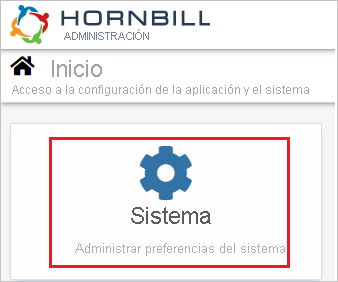
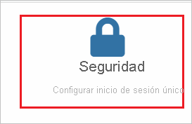
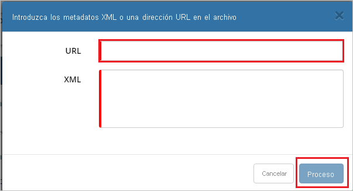
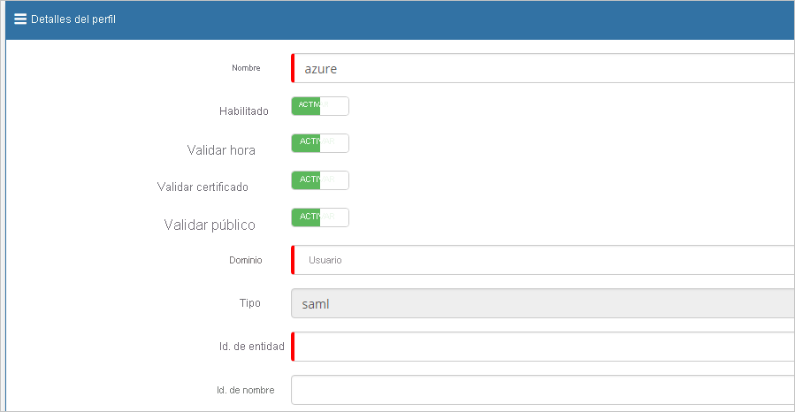
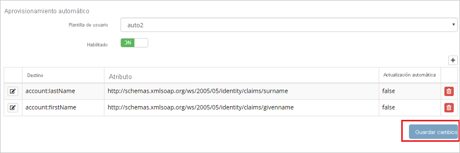
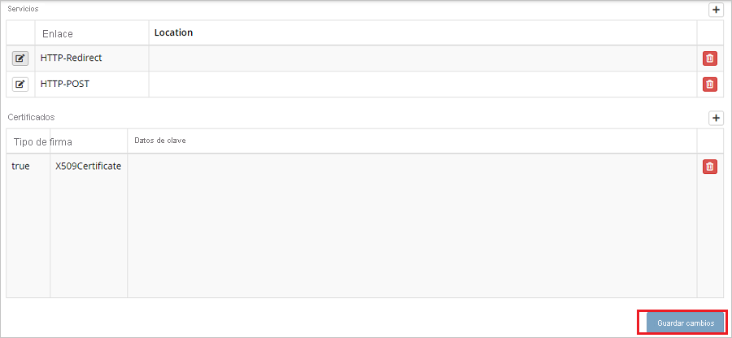

# Tutorial: Integración de Azure Active Directory con Hornbill

En este tutorial, aprenderá a integrar Hornbill con Azure Active Directory (Azure AD). Al integrar Hornbill con Azure AD, podrá hacer lo siguiente:

* Controlar en Azure AD quién tiene acceso a Hornbill.
* Permitir que los usuarios inicien sesión automáticamente en Hornbill con sus cuentas de Azure AD.
* Administrar las cuentas desde una ubicación central (Azure Portal).

## Requisitos previos

Para empezar, necesita los siguientes elementos:

* Una suscripción de Azure AD. Si no tiene una suscripción, puede crear una [cuenta gratuita](https://azure.microsoft.com/free/).
* Una suscripción habilitada para el inicio de sesión único (SSO) en Hornbill.

> [!NOTE]
> Esta integración también está disponible para usarse desde el entorno de la nube del gobierno de EE. UU de Azure AD. Puede encontrar esta aplicación en la galería de aplicaciones de la nube del gobierno de EE. UU. de Azure AD y configurarla de la misma manera que en la nube pública.

## Descripción del escenario

En este tutorial, puede configurar y probar el inicio de sesión único de Azure AD en un entorno de prueba.

* Hornbill admite el inicio de sesión único iniciado por **SP**.
* Hornbill admite el aprovisionamiento de usuarios **Just-In-Time**.

## Incorporación de Hornbill desde la galería

Para configurar la integración de Hornbill en Azure AD, deberá agregar Hornbill desde la galería a la lista de aplicaciones SaaS administradas.

1. Inicie sesión en Azure Portal con una cuenta personal, profesional o educativa de Microsoft.
1. En el panel de navegación de la izquierda, seleccione el servicio **Azure Active Directory**.
1. Vaya a **Aplicaciones empresariales** y seleccione **Todas las aplicaciones**.
1. Para agregar una nueva aplicación, seleccione **Nueva aplicación**.
1. En la sección **Agregar desde la galería**, escriba **Hornbill** en el cuadro de búsqueda.
1. Seleccione **Hornbill** en el panel de resultados y agregue la aplicación. Espere unos segundos mientras la aplicación se agrega al inquilino.

## Configuración y prueba del SSO de Azure AD para Hornbill

Configure y pruebe el inicio de sesión único de Azure AD con Hornbill mediante un usuario de prueba llamado **B.Simon**. Para que el inicio de sesión único funcione, es preciso establecer una relación de vínculo entre un usuario de Azure AD y el usuario correspondiente de Hornbill.

Para configurar y probar el inicio de sesión único de Azure AD con Hornbill, lleve a cabo los siguientes pasos:

1. **[Configuración del inicio de sesión único de Azure AD](#configure-azure-ad-sso)** , para permitir que los usuarios puedan utilizar esta característica.
    1. **[Creación de un usuario de prueba de Azure AD](#create-an-azure-ad-test-user)** , para probar el inicio de sesión único de Azure AD con B.Simon.
    1. **[Asignación del usuario de prueba de Azure AD](#assign-the-azure-ad-test-user)** , para habilitar a B.Simon para que use el inicio de sesión único de Azure AD.
1. **[Configuración del inicio de sesión único en Hornbill](#configure-hornbill-sso)** , para configurar los valores de Inicio de sesión único en la aplicación.
    1. **[Creación de un usuario de prueba de Hornbill](#create-hornbill-test-user)** : para tener un homólogo de B.Simon en Hornbill que esté vinculado a la representación del usuario en Azure AD.
1. **[Prueba del inicio de sesión único](#test-sso)** : para comprobar si la configuración funciona.

## Configuración del inicio de sesión único de Azure AD

Siga estos pasos para habilitar el inicio de sesión único de Azure AD en Azure Portal.

1. En Azure Portal, en la página de integración de la aplicación **Hornbill**, busque la sección **Administrar** y seleccione **Inicio de sesión único**.
1. En la página **Seleccione un método de inicio de sesión único**, elija **SAML**.
1. En la página **Configuración del inicio de sesión único con SAML**, haga clic en el icono de lápiz de **Configuración básica de SAML** para editar la configuración.

   

4. En la sección **Configuración básica de SAML**, siga estos pasos:

    a. En el cuadro de texto **Identificador (id. de entidad)** , escriba una dirección URL con el siguiente patrón: `https://<SUBDOMAIN>.hornbill.com/<INSTANCE_NAME>/lib/saml/auth/simplesaml/module.php/saml/sp/metadata.php/saml`

    b. En el cuadro de texto **URL de inicio de sesión**, escriba una dirección URL con el siguiente patrón: `https://<SUBDOMAIN>.hornbill.com/<INSTANCE_NAME>/`

    > [!NOTE]
    > Estos valores no son reales. Actualice estos valores con el identificador y la dirección URL de inicio de sesión reales. Póngase en contacto con el [equipo de soporte técnico de Hornbill](https://www.hornbill.com/support/?request/) para obtener estos valores. También puede hacer referencia a los patrones que se muestran en la sección **Configuración básica de SAML** de Azure Portal.

5. En la página **Configurar el inicio de sesión único con SAML**, en la sección **Certificado de firma de SAML**, haga clic en el botón de copia para copiar **Dirección URL de metadatos de federación de aplicación** y guárdela en su equipo.

    

### Creación de un usuario de prueba de Azure AD

En esta sección, va a crear un usuario de prueba llamado B.Simon en Azure Portal.

1. En el panel izquierdo de Azure Portal, seleccione **Azure Active Directory**, **Usuarios** y **Todos los usuarios**.
1. Seleccione **Nuevo usuario** en la parte superior de la pantalla.
1. En las propiedades del **usuario**, siga estos pasos:
   1. En el campo **Nombre**, escriba `B.Simon`.  
   1. En el campo **Nombre de usuario**, escriba username@companydomain.extension. Por ejemplo, `B.Simon@contoso.com`.
   1. Active la casilla **Show password** (Mostrar contraseña) y, después, anote el valor que se muestra en el cuadro **Contraseña**.
   1. Haga clic en **Crear**.

### Asignación del usuario de prueba de Azure AD

En esta sección va a conceder a B.Simon acceso a Hornbill mediante el inicio de sesión único de Azure.

1. En Azure Portal, seleccione sucesivamente **Aplicaciones empresariales** y **Todas las aplicaciones**.
1. En la lista de aplicaciones, seleccione **Hornbill**.
1. En la página de información general de la aplicación, busque la sección **Administrar** y seleccione **Usuarios y grupos**.
1. Seleccione **Agregar usuario**. A continuación, en el cuadro de diálogo **Agregar asignación**, seleccione **Usuarios y grupos**.
1. En el cuadro de diálogo **Usuarios y grupos**, seleccione **B.Simon** de la lista de usuarios y haga clic en el botón **Seleccionar** de la parte inferior de la pantalla.
1. Si espera que se asigne un rol a los usuarios, puede seleccionarlo en la lista desplegable **Seleccionar un rol**. Si no se ha configurado ningún rol para esta aplicación, verá seleccionado el rol "Acceso predeterminado".
1. En el cuadro de diálogo **Agregar asignación**, haga clic en el botón **Asignar**.

## Configuración del inicio de sesión único en Hornbill

1. En otra ventana del explorador web, inicie sesión en Hornbill como administrador de seguridad.

2. En la página principal, haga clic en **System** (Sistema).

    

3. Navegue hasta **Seguridad**.

    

4. Haga clic en **SSO Profiles** (Perfiles de SSO).

    

5. En el lado derecho de la página, haga clic en **Add logo** (Agregar logotipo).

    

6. En la barra **Profile Details** (Detalles del perfil), haga clic en **Import SAML Meta logo** (Importar logotipo de metadatos SAML).

    

7. En la página emergente del cuadro de texto **URL** (Dirección URL), pegue la **dirección URL de metadatos de federación de aplicaciones**, que ha copiado de Azure Portal y haga clic en **Process** (Procesar).

    

8. Tras realizar esta acción, los valores se rellenan automáticamente en la sección **Profile Details** (Detalles del perfil).

    

    

    

9. Haga clic en **Guardar cambios**.

### Creación de un usuario de prueba de Hornbill

En esta sección, se crea un usuario llamado Britta Simon en Hornbill. Hornbill admite el aprovisionamiento de usuarios Just-In-Time, que está habilitado de forma predeterminada. No hay ningún elemento de acción para usted en esta sección. Si un usuario deja de existir en Hornbill, se crea otro después de la autenticación.

> [!Note]
> Si necesita crear manualmente un usuario, es preciso que se ponga contacto con el [equipo de soporte técnico de Hornbill](https://www.hornbill.com/support/?request/).

## Prueba de SSO

En esta sección, probará la configuración de inicio de sesión único de Azure AD con las siguientes opciones. 

* Haga clic en **Probar esta aplicación** en Azure Portal. Esta acción le redirigirá a la URL de inicio de sesión de Hornbill, desde donde podrá comenzar el flujo de inicio de sesión. 

* Vaya directamente a la dirección URL de inicio de sesión de Hornbill e inicie el flujo de inicio de sesión desde allí.

* Puede usar Mis aplicaciones de Microsoft. Al hacer clic en el icono de Hornbill en Aplicaciones, se le redirigirá a la dirección URL de inicio de sesión de dicha aplicación. Para más información acerca de Aplicaciones, consulte [Inicio de sesión e inicio de aplicaciones desde el portal Aplicaciones](https://support.microsoft.com/account-billing/sign-in-and-start-apps-from-the-my-apps-portal-2f3b1bae-0e5a-4a86-a33e-876fbd2a4510).

## Pasos siguientes

Una vez configurado Hornbill, puede aplicar el control de sesión, que protege a la organización en tiempo real frente a la filtración e infiltración de información confidencial. El control de sesión procede del acceso condicional. [Aprenda a aplicar el control de sesión con Microsoft Cloud App Security](/cloud-app-security/proxy-deployment-aad).