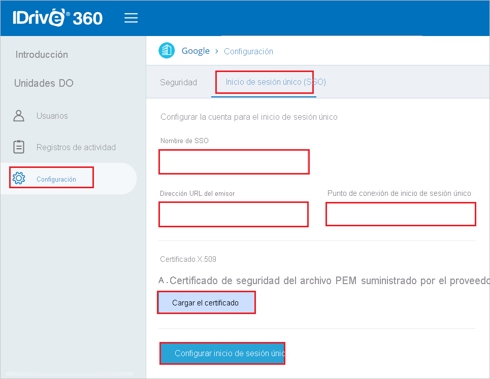
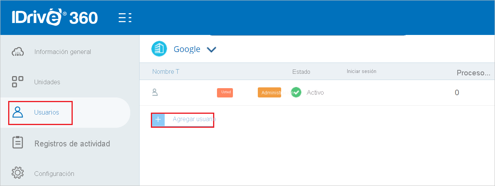

# Tutorial: Integración del inicio de sesión único (SSO) de Azure Active Directory con IDrive360

En este tutorial, aprenderá a integrar IDrive360 con Azure Active Directory (Azure AD). Al integrar IDrive360 con Azure AD, podrá hacer lo siguiente:

* Controlar en Azure AD quién tiene acceso a IDrive360.
* Permitir que los usuarios inicien sesión automáticamente en IDrive360 con sus cuentas de Azure AD.
* Administrar las cuentas desde una ubicación central (Azure Portal).

## Requisitos previos

Para empezar, necesita los siguientes elementos:

* Una suscripción de Azure AD. Si no tiene una suscripción, puede crear una [cuenta gratuita](https://azure.microsoft.com/free/).
* Una suscripción habilitada para el inicio de sesión único (SSO) en IDrive360.

## Descripción del escenario

En este tutorial, va a configurar y probar el inicio de sesión único de Azure AD en un entorno de prueba.

* IDrive360 admite el inicio de sesión único iniciado por **SP e IDP**.

> [!NOTE]
> El identificador de esta aplicación es un valor de cadena fijo, por lo que solo se puede configurar una instancia en un inquilino.

## Adición de IDrive360 desde la galería

Para configurar la integración de IDrive360 en Azure AD, tendrá que agregarlo desde la galería a la lista de aplicaciones SaaS administradas.

1. Inicie sesión en Azure Portal con una cuenta personal, profesional o educativa de Microsoft.
1. En el panel de navegación de la izquierda, seleccione el servicio **Azure Active Directory**.
1. Vaya a **Aplicaciones empresariales** y seleccione **Todas las aplicaciones**.
1. Para agregar una nueva aplicación, seleccione **Nueva aplicación**.
1. En la sección **Agregar desde la galería**, escriba **IDrive360** en el cuadro de búsqueda.
1. Seleccione **IDrive360** en el panel de resultados y agregue la aplicación. Espere unos segundos mientras la aplicación se agrega al inquilino.

## Configuración y prueba del inicio de sesión único de Azure AD para IDrive360

Configure y pruebe el inicio de sesión único de Azure AD con IDrive360 mediante un usuario de prueba llamado **B.Simon**. Para que el inicio de sesión único funcione, es necesario establecer una relación de vínculo entre un usuario de Azure AD y el usuario relacionado de IDrive360.

Para configurar y probar el inicio de sesión único de Azure AD con IDrive360, siga estos pasos:

1. **[Configuración del inicio de sesión único de Azure AD](#configure-azure-ad-sso)** , para permitir que los usuarios puedan utilizar esta característica.
    1. **[Creación de un usuario de prueba de Azure AD](#create-an-azure-ad-test-user)** , para probar el inicio de sesión único de Azure AD con B.Simon.
    1. **[Asignación del usuario de prueba de Azure AD](#assign-the-azure-ad-test-user)** , para habilitar a B.Simon para que use el inicio de sesión único de Azure AD.
1. **[Configuración del inicio de sesión único en IDrive360](#configure-idrive360-sso)** : para configurar los valores de inicio de sesión único en la aplicación.
    1. **[Creación de un usuario de prueba de IDrive360](#create-idrive360-test-user)** : para tener un homólogo de B.Simon en IDrive360 que esté vinculado a la representación del usuario en Azure AD.
1. **[Prueba del inicio de sesión único](#test-sso)** : para comprobar si la configuración funciona.

## Configuración del inicio de sesión único de Azure AD

Siga estos pasos para habilitar el inicio de sesión único de Azure AD en Azure Portal.

1. En Azure Portal, en la página de integración de la aplicación **IDrive360**, busque la sección **Administrar** y seleccione **Inicio de sesión único**.
1. En la página **Seleccione un método de inicio de sesión único**, elija **SAML**.
1. En la página **Configuración del inicio de sesión único con SAML**, haga clic en el icono de lápiz de **Configuración básica de SAML** para editar la configuración.

   

1. En la sección **Configuración básica de SAML**, el usuario no tiene que realizar ningún paso porque la aplicación ya se ha integrado previamente con Azure.

1. Haga clic en **Establecer direcciones URL adicionales** y siga este paso si desea configurar la aplicación en el modo iniciado por **SP**:

    En el cuadro de texto **URL de inicio de sesión**, escriba la dirección URL: `https://www.idrive360.com/enterprise/sso`

1. En la página **Configurar el inicio de sesión único con SAML**, en la sección **Certificado de firma de SAML**, busque **Certificado (PEM)** y seleccione **Descargar** para descargarlo y guardarlo en el equipo.

    

1. En la sección **Configurar IDrive360**, copie las direcciones URL que necesite.

    

### Creación de un usuario de prueba de Azure AD

En esta sección, va a crear un usuario de prueba llamado B.Simon en Azure Portal.

1. En el panel izquierdo de Azure Portal, seleccione **Azure Active Directory**, **Usuarios** y **Todos los usuarios**.
1. Seleccione **Nuevo usuario** en la parte superior de la pantalla.
1. En las propiedades del **usuario**, siga estos pasos:
   1. En el campo **Nombre**, escriba `B.Simon`.  
   1. En el campo **Nombre de usuario**, escriba username@companydomain.extension. Por ejemplo, `B.Simon@contoso.com`.
   1. Active la casilla **Show password** (Mostrar contraseña) y, después, anote el valor que se muestra en el cuadro **Contraseña**.
   1. Haga clic en **Crear**.

### Asignación del usuario de prueba de Azure AD

En esta sección, va a permitir que B.Simon acceda a IDrive360 mediante el inicio de sesión único de Azure.

1. En Azure Portal, seleccione sucesivamente **Aplicaciones empresariales** y **Todas las aplicaciones**.
1. En la lista de aplicaciones, seleccione **IDrive360**.
1. En la página de información general de la aplicación, busque la sección **Administrar** y seleccione **Usuarios y grupos**.
1. Seleccione **Agregar usuario**. A continuación, en el cuadro de diálogo **Agregar asignación**, seleccione **Usuarios y grupos**.
1. En el cuadro de diálogo **Usuarios y grupos**, seleccione **B.Simon** de la lista de usuarios y haga clic en el botón **Seleccionar** de la parte inferior de la pantalla.
1. Si espera que se asigne un rol a los usuarios, puede seleccionarlo en la lista desplegable **Seleccionar un rol**. Si no se ha configurado ningún rol para esta aplicación, verá seleccionado el rol "Acceso predeterminado".
1. En el cuadro de diálogo **Agregar asignación**, haga clic en el botón **Asignar**.

## Configuración del inicio de sesión único de IDrive360

1. Inicie sesión en el sitio de la empresa de IDrive360 como administrador.

2. Vaya a **Settings** > **Single Sign-on(SSO)** (Configuración>Inicio de sesión único) y siga estos pasos.

     (Inicio de sesión único)

    a. En el cuadro de texto **SSO name** (Nombre de SSO), escriba un nombre válido.
    
    b. En el cuadro de texto **URL del emisor**, pegue el valor del **identificador de Azure AD** que ha copiado de Azure Portal.

    c. En el cuadro de texto **SSO Endpoint** (Punto de conexión de inicio de sesión único), pegue el valor de la **URL de inicio de sesión** que ha copiado de Azure Portal.

    d. Haga clic en **Upload Certificate** (Cargar certificado) para cargar el **Certificado (PEM)** que ha descargado de Azure Portal.

    e. Haga clic en **Configure Single Sign-On** (Configurar inicio de sesión único).

### Creación de un usuario de prueba de IDrive360

1. En otra ventana del explorador web, inicie sesión como administrador en el sitio de la compañía de IDrive360.

2. Vaya a la pestaña **Users** (Usuarios) y haga clic en **Add a user** (Agregar usuario).

    

3. En la sección **Create new user(s)** (Crear usuario), siga estos pasos.

    
     
    a. En el cuadro de texto **Email** (Correo electrónico), escriba una **dirección de correo electrónico** válida.

    b. Haga clic en **Crear**.

## Prueba de SSO 

En esta sección, probará la configuración de inicio de sesión único de Azure AD con las siguientes opciones. 

#### Iniciado por SP:

* Haga clic en **Probar esta aplicación** en Azure Portal. Esto le redirigirá a la dirección URL de inicio de sesión de IDrive360, donde puede iniciar el flujo de inicio de sesión.  

* Vaya directamente a la dirección URL de inicio de sesión de IDrive360 e inicie el flujo de inicio de sesión desde allí.

#### Iniciado por IDP:

* Haga clic en **Probar esta aplicación** en Azure Portal; debería iniciar sesión automáticamente en la instancia de IDrive360 para la que ha configurado el inicio de sesión único. 

También puede usar Aplicaciones de Microsoft para probar la aplicación en cualquier modo. Al hacer clic en el icono de IDrive360 en Mis aplicaciones, si ha realizado la configuración en modo SP, se le redirigirá a la página de inicio de sesión de la aplicación para comenzar el flujo de inicio de sesión. Si ha realizado la configuración en modo IDP, debería iniciar sesión automáticamente en la instancia de IDrive360 para la que ha configurado el inicio de sesión único. Para más información acerca de Aplicaciones, consulte [Inicio de sesión e inicio de aplicaciones desde el portal Aplicaciones](https://support.microsoft.com/account-billing/sign-in-and-start-apps-from-the-my-apps-portal-2f3b1bae-0e5a-4a86-a33e-876fbd2a4510).

## Pasos siguientes

Una vez que haya configurado IDrive360, podrá aplicar el control de sesión, que protege a la organización en tiempo real frente a la filtración e infiltración de información confidencial. El control de sesión procede del acceso condicional. [Aprenda a aplicar el control de sesión con Microsoft Cloud App Security](/cloud-app-security/proxy-deployment-aad).