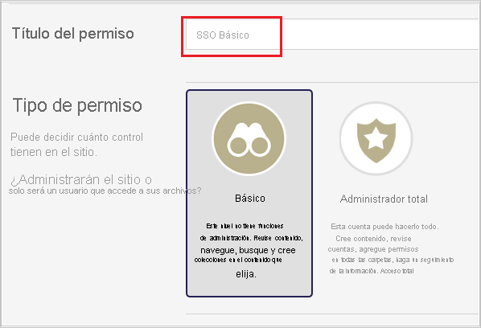
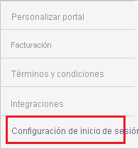
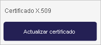
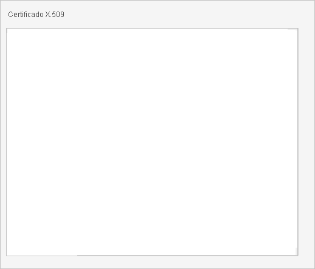
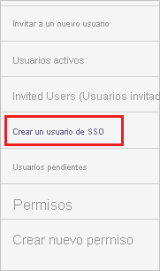
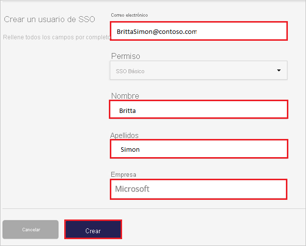

# Tutorial: Integración de Azure Active Directory con Image Relay

En este tutorial, obtendrá información sobre cómo integrar Image Relay con Azure Active Directory (Azure AD). Al integrar Image Relay con Azure AD, puede hacer lo siguiente:

* Controlar en Azure AD quién tiene acceso a Image Relay.
* Permitir que los usuarios inicien sesión automáticamente en Image Relay con sus cuentas de Azure AD.
* Administrar las cuentas desde una ubicación central (Azure Portal).

## Requisitos previos

Para empezar, necesita los siguientes elementos:

* Una suscripción de Azure AD. Si no tiene una suscripción, puede crear una [cuenta gratuita](https://azure.microsoft.com/free/).
* Una suscripción habilitada para el inicio de sesión único (SSO) en Image Relay.

## Descripción del escenario

En este tutorial, puede configurar y probar el inicio de sesión único de Azure AD en un entorno de prueba.

* Image Relay admite el inicio de sesión único iniciado por **SP**.

## Adición de Image Relay desde la galería

Para configurar la integración de Image Relay en Azure AD, es preciso agregar Image Relay desde la galería a la lista de aplicaciones SaaS administradas.

1. Inicie sesión en Azure Portal con una cuenta personal, profesional o educativa de Microsoft.
1. En el panel de navegación de la izquierda, seleccione el servicio **Azure Active Directory**.
1. Vaya a **Aplicaciones empresariales** y seleccione **Todas las aplicaciones**.
1. Para agregar una nueva aplicación, seleccione **Nueva aplicación**.
1. En la sección **Agregar desde la galería**, escriba **Image Relay** en el cuadro de búsqueda.
1. Seleccione **Image Relay** en el panel de resultados y agregue la aplicación. Espere unos segundos mientras la aplicación se agrega al inquilino.

## Configuración y prueba del inicio de sesión único de Azure AD para Image Relay

Configure y pruebe el inicio de sesión único de Azure AD con Image Relay mediante un usuario de prueba llamado **B.Simon**. Para que el inicio de sesión único funcione, es necesario establecer una relación de vínculo entre un usuario de Azure AD y el usuario relacionado de Image Relay.

Para configurar y probar el inicio de sesión único de Azure AD con Image Relay, siga estos pasos:

1. **[Configuración del inicio de sesión único de Azure AD](#configure-azure-ad-sso)** , para permitir que los usuarios puedan utilizar esta característica.
    1. **[Creación de un usuario de prueba de Azure AD](#create-an-azure-ad-test-user)** , para probar el inicio de sesión único de Azure AD con B.Simon.
    1. **[Asignación del usuario de prueba de Azure AD](#assign-the-azure-ad-test-user)** , para habilitar a B.Simon para que use el inicio de sesión único de Azure AD.
1. **[Configuración del inicio de sesión único en Image Relay](#configure-image-relay-sso)** : para configurar los valores de inicio de sesión único en la aplicación.
    1. **[Creación de un usuario de prueba en Image Relay](#create-image-relay-test-user)** : para tener un homólogo de B.Simon en Image Relay que esté vinculado a la representación del usuario en Azure AD.
1. **[Prueba del inicio de sesión único](#test-sso)** : para comprobar si la configuración funciona.

## Configuración del inicio de sesión único de Azure AD

Siga estos pasos para habilitar el inicio de sesión único de Azure AD en Azure Portal.

1. En Azure Portal, en la página de integración de la aplicación **Image Relay**, busque la sección **Administrar** y seleccione **Inicio de sesión único**.
1. En la página **Seleccione un método de inicio de sesión único**, elija **SAML**.
1. En la página **Configuración del inicio de sesión único con SAML**, haga clic en el icono de lápiz de **Configuración básica de SAML** para editar la configuración.

   

4. En la sección **Configuración básica de SAML**, siga estos pasos:

    a. En el cuadro de texto **Identificador (id. de entidad)** , escriba una dirección URL con el siguiente patrón: `https://<COMPANYNAME>.imagerelay.com/sso/metadata`

    b. En el cuadro de texto **URL de inicio de sesión**, escriba una dirección URL con el siguiente patrón: `https://<COMPANYNAME>.imagerelay.com/`

    > [!NOTE]
    > Estos valores no son reales. Actualice estos valores con el identificador y la dirección URL de inicio de sesión reales. Póngase en contacto con el [equipo de soporte de cliente de Image Relay](http://support.imagerelay.com/) para obtener estos valores. También puede hacer referencia a los patrones que se muestran en la sección **Configuración básica de SAML** de Azure Portal.

4. En la página **Configurar el inicio de sesión único con SAML**, en la sección **Certificado de firma de SAML**, haga clic en **Descargar** para descargar el **certificado (Base64)** de las opciones proporcionadas según sus requisitos y guárdelo en el equipo.

    

6. En la sección **Set up Image Relay** (Configurar Image Relay), copie las direcciones URL adecuada según sus necesidades.

    

### Creación de un usuario de prueba de Azure AD

En esta sección, va a crear un usuario de prueba llamado B.Simon en Azure Portal.

1. En el panel izquierdo de Azure Portal, seleccione **Azure Active Directory**, **Usuarios** y **Todos los usuarios**.
1. Seleccione **Nuevo usuario** en la parte superior de la pantalla.
1. En las propiedades del **usuario**, siga estos pasos:
   1. En el campo **Nombre**, escriba `B.Simon`.  
   1. En el campo **Nombre de usuario**, escriba username@companydomain.extension. Por ejemplo, `B.Simon@contoso.com`.
   1. Active la casilla **Show password** (Mostrar contraseña) y, después, anote el valor que se muestra en el cuadro **Contraseña**.
   1. Haga clic en **Crear**.

### Asignación del usuario de prueba de Azure AD

En esta sección, va a permitir que B.Simon acceda a Image Relay mediante el inicio de sesión único de Azure.

1. En Azure Portal, seleccione sucesivamente **Aplicaciones empresariales** y **Todas las aplicaciones**.
1. En la lista de aplicaciones, seleccione **Image Relay**.
1. En la página de información general de la aplicación, busque la sección **Administrar** y seleccione **Usuarios y grupos**.
1. Seleccione **Agregar usuario**. A continuación, en el cuadro de diálogo **Agregar asignación**, seleccione **Usuarios y grupos**.
1. En el cuadro de diálogo **Usuarios y grupos**, seleccione **B.Simon** de la lista de usuarios y haga clic en el botón **Seleccionar** de la parte inferior de la pantalla.
1. Si espera que se asigne un rol a los usuarios, puede seleccionarlo en la lista desplegable **Seleccionar un rol**. Si no se ha configurado ningún rol para esta aplicación, verá seleccionado el rol "Acceso predeterminado".
1. En el cuadro de diálogo **Agregar asignación**, haga clic en el botón **Asignar**.

## Configuración del inicio de sesión único de Image Relay

1. En otra ventana del explorador, inicie sesión en su sitio de empresa de Image Relay como administrador.

2. En la barra de herramientas de la parte superior, haga clic en la carga de trabajo **Users & Permissions** (Usuarios y permisos).

     

3. Haga clic en **Create New Permission**(Crear permiso nuevo).

    

4. En la carga de trabajo **Single Sign On Settings** (Configuración de inicio de sesión único), active la casilla **This Group can only sign-in via Single Sign On** (Este grupo solo puede iniciar sesión mediante inicio de sesión único) y haga clic en **Save** (Guardar).

     

5. Vaya a **Account Settings**(Configuración de cuenta).

     

6. Vaya a la carga de trabajo **Single Sign On Settings** (Configuración de inicio de sesión único).

    

7. En el cuadro de diálogo **SAML Settings** (Configuración de SAML), siga estos pasos:

    

    a. En el cuadro de texto **Dirección URL de inicio de sesión**, pegue el valor de la **dirección URL de inicio de sesión** que ha copiado de Azure Portal.

    b. En el cuadro de texto **Logout URL** (Dirección URL de cierre de sesión), pegue el valor de **Dirección URL de cierre de sesión** que ha copiado de Azure Portal.

    c. En **Name Id Format** (Formato de id. de nombre), seleccione **urn:oasis:names:tc:SAML:1.1:nameid-format:emailAddress**.

    d. En **Binding Options for Requests from the Service Provider (Image Relay)** [Opciones de enlace para solicitudes del proveedor de servicio (Image Relay)], seleccione **POST Binding** (Enlace POST).

    e. En **x.509 Certificate** (Certificado x.509), haga clic en **Update Certificate** (Actualizar certificado).

    

    f. Abra el certificado descargado en el Bloc de notas, copie el contenido y péguelo en el cuadro de texto **x.509 Certificate** (Certificado X.509).

    

    g. En **Just-In-Time User Provisioning** (Aprovisionamiento de usuarios Just-In-Time), active la casilla **Enable Just-In-Time User Provisioning** (Habilitar aprovisionamiento de usuarios Just-In-Time).

    

    h. Seleccione el grupo de permisos, por ejemplo, **SSO Basic**(SSO básico), que puede iniciar sesión solo mediante inicio de sesión único.

    

    i. Haga clic en **Save**(Guardar).

### Creación de un usuario de prueba en Image Relay

El objetivo de esta sección es crear un usuario de prueba llamado Britta Simon en Image Relay.

**Para crear un usuario llamado Britta Simon en Image Relay, realice los pasos siguientes:**

1. Inicie sesión en su sitio de empresa de Image Relay como administrador.

2. Vaya a **Users & Permissions** (Usuarios y permisos) y seleccione **Create SSO User** (Crear usuario de SSO).

     

3. Escriba los valores de los campos **Email** (Correo electrónico), **First Name** (Nombre), **Last Name** (Apellidos) y **Company** (Empresa) del usuario que desea aprovisionar y seleccione el grupo de permisos, por ejemplo, SSO Basic (SSO básico), que es el grupo que solo puede iniciar sesión mediante inicio de sesión único.

    

4. Haga clic en **Crear**.

## Prueba de SSO

En esta sección, probará la configuración de inicio de sesión único de Azure AD con las siguientes opciones. 

* Haga clic en **Probar esta aplicación** en Azure Portal. Esta acción le redirigirá a la dirección URL de inicio de sesión de Image Relay, donde puede iniciar el flujo de inicio de sesión. 

* Vaya directamente a la dirección URL de inicio de sesión de Image Relay e inicie el flujo de inicio de sesión desde allí.

* Puede usar Mis aplicaciones de Microsoft. Al hacer clic en el icono de Image Relay en Mis aplicaciones, se le redirigirá a la URL de inicio de sesión de la aplicación. Para más información acerca de Aplicaciones, consulte [Inicio de sesión e inicio de aplicaciones desde el portal Aplicaciones](https://support.microsoft.com/account-billing/sign-in-and-start-apps-from-the-my-apps-portal-2f3b1bae-0e5a-4a86-a33e-876fbd2a4510).

## Pasos siguientes

Una vez que haya configurado Image Relay, podrá aplicar el control de sesión, que protege a la organización en tiempo real frente a la filtración e infiltración de información confidencial. El control de sesión procede del acceso condicional. [Aprenda a aplicar el control de sesión con Microsoft Cloud App Security](/cloud-app-security/proxy-deployment-aad).