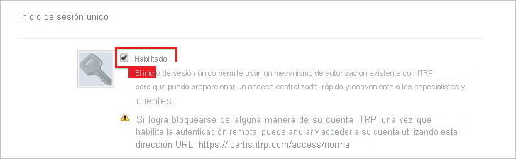
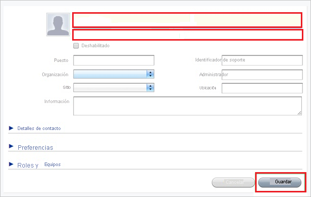

# Tutorial: Integración del inicio de sesión único de Azure AD con ITRP

En este tutorial, obtendrá información sobre cómo integrar ITRP con Azure Active Directory (Azure AD). La integración de ITRP con Azure AD permite:

* Controlar en Azure AD quién tiene acceso a ITRP.
* Que los usuarios inicien sesión automáticamente en ITRP con sus cuentas de Azure AD.
* Administrar las cuentas desde una ubicación central (Azure Portal).

## Prerrequisitos

Para configurar la integración de Azure AD con ITRP, necesita los siguientes elementos:

* Una suscripción de Azure AD. Si no dispone de un entorno de Azure AD, puede obtener [una cuenta gratuita](https://azure.microsoft.com/free/).
* Una suscripción de ITRP que tenga habilitado el inicio de sesión único.

## Descripción del escenario

En este tutorial configurará y probará el inicio de sesión único de Azure AD en un entorno de prueba.

* ITRP admite el inicio de sesión único iniciado por SP.

## Incorporación de ITRP desde la galería

Para configurar la integración de ITRP en Azure AD, tiene que agregar ITRP desde la galería a la lista de aplicaciones SaaS administradas.

1. Inicie sesión en Azure Portal con una cuenta personal, profesional o educativa de Microsoft.
1. En el panel de navegación de la izquierda, seleccione el servicio **Azure Active Directory**.
1. Vaya a **Aplicaciones empresariales** y seleccione **Todas las aplicaciones**.
1. Para agregar una nueva aplicación, seleccione **Nueva aplicación**.
1. En la sección **Agregar desde la galería**, escriba **ITRP** en el cuadro de búsqueda.
1. Seleccione **ITRP** en el panel de resultados y agregue la aplicación. Espere unos segundos mientras la aplicación se agrega al inquilino.

## Configuración y prueba del inicio de sesión único de Azure AD para ITRP

Configure y pruebe el inicio de sesión único de Azure AD con ITRP mediante un usuario de prueba llamado **B.Simon**. Para que el inicio de sesión único funcione, es preciso establecer una relación de vinculación entre un usuario de Azure AD y el usuario relacionado de ITRP.

Para configurar y probar el inicio de sesión único de Azure AD con ITRP, siga estos pasos:

1. **[Configuración del inicio de sesión único de Azure AD](#configure-azure-ad-sso)**, para permitir que los usuarios puedan utilizar esta característica.
    1. **[Creación de un usuario de prueba de Azure AD](#create-an-azure-ad-test-user)**, para probar el inicio de sesión único de Azure AD con B.Simon.
    1. **[Asignación del usuario de prueba de Azure AD](#assign-the-azure-ad-test-user)**, para habilitar a B.Simon para que use el inicio de sesión único de Azure AD.
1. **[Configuración del inicio de sesión único en ITRP](#configure-itrp-sso)** , para configurar los valores del inicio de sesión único en la aplicación.
    1. **[Creación de un usuario de prueba en ITRP](#create-an-itrp-test-user)** : para tener un homólogo de B.Simon en ITRP vinculado a la representación de usuario en Azure AD.
1. **[Prueba del inicio de sesión único](#test-sso)**, para comprobar si la configuración funciona.

## Configuración del inicio de sesión único de Azure AD

Siga estos pasos para habilitar el inicio de sesión único de Azure AD en Azure Portal.

1. En Azure Portal, en la página de integración de la aplicación **ITRP**, busque la sección **Administrar** y seleccione **Inicio de sesión único**.
1. En la página **Seleccione un método de inicio de sesión único**, elija **SAML**.
1. En la página **Configuración del inicio de sesión único con SAML**, haga clic en el icono de lápiz de **Configuración básica de SAML** para editar la configuración.

   

4. En el cuadro de diálogo **Configuración básica de SAML**, siga estos pasos.

    1. En el cuadro de texto **Identificador (id. de entidad)**, escriba una dirección URL con el siguiente patrón:

       `https://<tenant-name>.itrp.com`

    1. En el cuadro de texto **URL de inicio de sesión**, escriba la dirección URL con el siguiente patrón:
    
       `https://<tenant-name>.itrp.com`   

    > [!NOTE]
    > Estos valores son marcadores de posición. Tiene que usar los valores reales de Identificador y URL de inicio de sesión. Póngase en contacto con el [equipo de soporte técnico de ITRP](https://www.4me.com/support/) para obtener estos valores. También puede consultar los patrones que se muestran en el cuadro de diálogo **Configuración básica de SAML** de Azure Portal.

5. En la sección **Certificado de firma de SAML**, seleccione el icono **Editar** para abrir el cuadro de diálogo **Certificado de firma de SAML**:

    

6. En el cuadro de diálogo **Certificado de firma de SAML**, copie el valor de **Huella digital** y guárdelo:

    

7. En la sección **Configurar ITRP**, copie las direcciones URL adecuadas según sus necesidades:

    

### Creación de un usuario de prueba de Azure AD

En esta sección, va a crear un usuario de prueba llamado B.Simon en Azure Portal.

1. En el panel izquierdo de Azure Portal, seleccione **Azure Active Directory**, **Usuarios** y **Todos los usuarios**.
1. Seleccione **Nuevo usuario** en la parte superior de la pantalla.
1. En las propiedades del **usuario**, siga estos pasos:
   1. En el campo **Nombre**, escriba `B.Simon`.  
   1. En el campo **Nombre de usuario**, escriba username@companydomain.extension. Por ejemplo, `B.Simon@contoso.com`.
   1. Active la casilla **Show password** (Mostrar contraseña) y, después, anote el valor que se muestra en el cuadro **Contraseña**.
   1. Haga clic en **Crear**.

### Asignación del usuario de prueba de Azure AD

En esta sección, va a permitir que B.Simon acceda a ITRP mediante el inicio de sesión único de Azure.

1. En Azure Portal, seleccione sucesivamente **Aplicaciones empresariales** y **Todas las aplicaciones**.
1. En la lista de aplicaciones, seleccione **ITRP**.
1. En la página de información general de la aplicación, busque la sección **Administrar** y seleccione **Usuarios y grupos**.
1. Seleccione **Agregar usuario**. A continuación, en el cuadro de diálogo **Agregar asignación**, seleccione **Usuarios y grupos**.
1. En el cuadro de diálogo **Usuarios y grupos**, seleccione **B.Simon** de la lista de usuarios y haga clic en el botón **Seleccionar** de la parte inferior de la pantalla.
1. Si espera que se asigne un rol a los usuarios, puede seleccionarlo en la lista desplegable **Seleccionar un rol**. Si no se ha configurado ningún rol para esta aplicación, verá seleccionado el rol "Acceso predeterminado".
1. En el cuadro de diálogo **Agregar asignación**, haga clic en el botón **Asignar**.

## Configuración del inicio de sesión único de ITRP

1. En otra ventana del explorador web, inicie sesión como administrador en el sitio de la compañía de ITRP.

1. En la parte superior de la ventana, seleccione el icono **Settings** (Configuración):

    

1. En el panel izquierdo, haga clic en **Single Sign-On** (Inicio de sesión único):

    

1. Siga estos pasos en la sección de configuración de **Single Sign-On** (Inicio de sesión único).

    

    

    1. Seleccione **Habilitado**.

    1. En el cuadro **Remote Logout URL** (URL de cierre de sesión remota), pegue el valor de la **dirección URL de cierre de sesión** que copió de Azure Portal.

    1. En el cuadro **SAML SSO URL** (URL de inicio de sesión único de SAML), pegue el valor de la **dirección URL de inicio de sesión** que copió de Azure Portal.

    1. En el cuadro de texto **Certificate Fingerprint** (Huella digital de certificado), pegue el valor de **huella digital** del certificado que copió de Azure Portal.

    1. Seleccione **Guardar**.

### Creación de un usuario de prueba de ITRP

Para permitir que los usuarios de Azure AD inicien sesión en ITRP, deberá agregarlos a esta aplicación. Y los debe agregar manualmente.

Para crear una cuenta de usuario, siga estos pasos:

1. Inicie sesión en su inquilino de ITRP.

1. En la parte superior de la ventana, seleccione el icono **Records** (Registros):

    

1. En el menú, seleccione **People** (Personas):

    

1. Seleccione el signo de más ( **+** ) para agregar a una nueva persona:

    

1. En el cuadro de diálogo **Add New Person** (Agregar nueva persona), realice los pasos siguientes.

    

    1. Escriba el nombre y la dirección de correo electrónico de una cuenta de Azure AD válida que quiera agregar.

    1. Seleccione **Guardar**.

> [!NOTE]
> Puede usar cualquier API o herramienta de creación de cuentas de usuario que proporcione ITRP para aprovisionar cuentas de usuario de AAD.

## Prueba de SSO

En esta sección, probará la configuración de inicio de sesión único de Azure AD con las siguientes opciones. 

* Haga clic en **Probar esta aplicación** en Azure Portal. Esto le redirigirá a la dirección URL de inicio de sesión de ITRP, donde puede poner en marcha el flujo de inicio de sesión. 

* Vaya directamente a la dirección URL de inicio de sesión de ITRP y comience inicie el flujo de inicio de sesión desde allí.

* Puede usar Mis aplicaciones de Microsoft. Al hacer clic en el icono de ITRP que se encuentra en Aplicaciones, se le redirigirá a la dirección URL de inicio de sesión de la aplicación. Para más información acerca de Aplicaciones, consulte [Inicio de sesión e inicio de aplicaciones desde el portal Aplicaciones](../user-help/my-apps-portal-end-user-access.md).

## Pasos siguientes

Una vez configurado ITRP, puede aplicar el control de sesión, que protege la filtración y la infiltración de la información confidencial de la organización en tiempo real. El control de sesión procede del acceso condicional. [Aprenda a aplicar el control de sesión con Microsoft Cloud App Security](/cloud-app-security/proxy-deployment-aad).