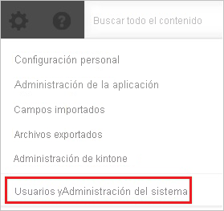
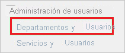

# Tutorial: Integración del inicio de sesión único de Azure AD con Kintone

En este tutorial, aprenderá a integrar Kintone con Azure Active Directory (Azure AD). La integración de Kintone con Azure AD permite:

* Controlar en Azure AD quién tiene acceso a Kintone.
* Permitir que los usuarios puedan iniciar sesión automáticamente en Kintone con sus cuentas de Azure AD.
* Administrar las cuentas desde una ubicación central (Azure Portal).

## Requisitos previos

Para configurar la integración de Azure AD con Kintone, necesita los siguientes elementos:

* Una suscripción de Azure AD. Si no dispone de un entorno de Azure AD, puede obtener [una cuenta gratuita](https://azure.microsoft.com/free/).
* Una suscripción habilitada para el inicio de sesión único en Kintone.

## Descripción del escenario

En este tutorial, puede configurar y probar el inicio de sesión único de Azure AD en un entorno de prueba.

* Kintone admite el inicio de sesión único iniciado por **SP**.

## Adición de Kintone desde la galería

Para configurar la integración de Kintone en Azure AD, deberá agregar Kintone desde la galería a la lista de aplicaciones SaaS administradas.

1. Inicie sesión en Azure Portal con una cuenta personal, profesional o educativa de Microsoft.
1. En el panel de navegación de la izquierda, seleccione el servicio **Azure Active Directory**.
1. Vaya a **Aplicaciones empresariales** y seleccione **Todas las aplicaciones**.
1. Para agregar una nueva aplicación, seleccione **Nueva aplicación**.
1. En la sección **Agregar desde la galería**, escriba **Kintone** en el cuadro de búsqueda.
1. Seleccione **Kintone** en el panel de resultados y agregue la aplicación. Espere unos segundos mientras la aplicación se agrega al inquilino.

## Configuración y prueba del inicio de sesión único de Azure AD para Kintone

Configure y pruebe el inicio de sesión único de Azure AD con Kintone mediante un usuario de prueba llamado **B. Simon**. Para que el inicio de sesión único funcione, es preciso establecer una relación de vinculación entre un usuario de Azure AD y el usuario correspondiente de Kintone.

Para configurar y probar el inicio de sesión único de Azure AD con Kintone, haga lo siguiente:

1. **[Configuración del inicio de sesión único de Azure AD](#configure-azure-ad-sso)**, para permitir que los usuarios puedan utilizar esta característica.
    1. **[Creación de un usuario de prueba de Azure AD](#create-an-azure-ad-test-user)**, para probar el inicio de sesión único de Azure AD con B.Simon.
    1. **[Asignación del usuario de prueba de Azure AD](#assign-the-azure-ad-test-user)**, para habilitar a B.Simon para que use el inicio de sesión único de Azure AD.
1. **[Configuración del inicio de sesión único en Kintone](#configure-kintone-sso)** , para configurar los valores de Inicio de sesión único en la aplicación.
    1. **[Creación del usuario de prueba en Kintone](#create-kintone-test-user)** : para tener un homólogo de B. Simon en Kintone vinculado a la representación del usuario en Azure AD.
1. **[Prueba del inicio de sesión único](#test-sso)** : para comprobar si la configuración funciona.

## Configuración del inicio de sesión único de Azure AD

Siga estos pasos para habilitar el inicio de sesión único de Azure AD en Azure Portal.

1. En Azure Portal, en la página de integración de la aplicación **Kintone**, busque la sección **Administrar** y seleccione **Inicio de sesión único**.
1. En la página **Seleccione un método de inicio de sesión único**, elija **SAML**.
1. En la página **Configuración del inicio de sesión único con SAML**, haga clic en el icono de lápiz de **Configuración básica de SAML** para editar la configuración.

   

4. En la sección **Configuración básica de SAML**, siga estos pasos:

    a. En el cuadro de texto **Identificador (id. de entidad)** , escriba una dirección URL con uno de los patrones siguientes:
    
   | **Identificador** |
   |---|
   | `https://<companyname>.cybozu.com` |
   | `https://<companyname>.kintone.com` |
    
    b. En el cuadro de texto **URL de inicio de sesión**, escriba una dirección URL con el siguiente patrón: `https://<companyname>.kintone.com`

    > [!NOTE]
    > Estos valores no son reales. Actualice estos valores con el identificador y la dirección URL de inicio de sesión reales. Póngase en contacto con el [equipo de soporte de cliente de Kintone](https://www.kintone.com/contact/) para obtener estos valores. También puede hacer referencia a los patrones que se muestran en la sección **Configuración básica de SAML** de Azure Portal.

5. En la página **Configurar el inicio de sesión único con SAML**, en la sección **Certificado de firma de SAML**, haga clic en **Descargar** para descargar el **certificado (Base64)** de las opciones proporcionadas según sus requisitos y guárdelo en el equipo.

    

6. En la sección **Set up Kintone** (Configurar Kintone), copie las direcciones URL que necesite.

    

### Creación de un usuario de prueba de Azure AD

En esta sección, va a crear un usuario de prueba llamado B.Simon en Azure Portal.

1. En el panel izquierdo de Azure Portal, seleccione **Azure Active Directory**, **Usuarios** y **Todos los usuarios**.
1. Seleccione **Nuevo usuario** en la parte superior de la pantalla.
1. En las propiedades del **usuario**, siga estos pasos:
   1. En el campo **Nombre**, escriba `B.Simon`.  
   1. En el campo **Nombre de usuario**, escriba username@companydomain.extension. Por ejemplo, `B.Simon@contoso.com`.
   1. Active la casilla **Show password** (Mostrar contraseña) y, después, anote el valor que se muestra en el cuadro **Contraseña**.
   1. Haga clic en **Crear**.

### Asignación del usuario de prueba de Azure AD

En esta sección, va a permitir que B. Simon acceda a Kintone mediante el inicio de sesión único de Azure.

1. En Azure Portal, seleccione sucesivamente **Aplicaciones empresariales** y **Todas las aplicaciones**.
1. En la lista de aplicaciones, seleccione **Kintone**.
1. En la página de información general de la aplicación, busque la sección **Administrar** y seleccione **Usuarios y grupos**.
1. Seleccione **Agregar usuario**. A continuación, en el cuadro de diálogo **Agregar asignación**, seleccione **Usuarios y grupos**.
1. En el cuadro de diálogo **Usuarios y grupos**, seleccione **B.Simon** de la lista de usuarios y haga clic en el botón **Seleccionar** de la parte inferior de la pantalla.
1. Si espera que se asigne un rol a los usuarios, puede seleccionarlo en la lista desplegable **Seleccionar un rol**. Si no se ha configurado ningún rol para esta aplicación, verá seleccionado el rol "Acceso predeterminado".
1. En el cuadro de diálogo **Agregar asignación**, haga clic en el botón **Asignar**.

## Configuración del inicio de sesión único en Kintone

1. En otra ventana del explorador web, inicie sesión como administrador en el sitio de la compañía **Kintone**.

1. Haga clic en el **icono de configuración**.

    

1. Haga clic en **Users & System Administration** (Administración del sistema y usuarios).

    

1. En **Administración del sistema \> Seguridad**, haga clic en **Inicio de sesión**.

    

1. Haga clic en **Habilitar autenticación SAML**.

    

1. En la sección SAML Authentication (Autenticación SAML), realice los pasos siguientes:

    

    a. En el cuadro de texto **Dirección URL de inicio de sesión**, pegue el valor de la **dirección URL de inicio de sesión** que ha copiado de Azure Portal.

    b. En el cuadro de texto **URL de cierre de sesión**, pegue el valor de **Sign-Out URL** (Dirección URL de cierre de sesión) que copió de Azure Portal.

    c. Para cargar el certificado descargado de Azure Portal, haga clic en **Browse** (Examinar).

    d. Haga clic en **Save**(Guardar).

### Creación del usuario de prueba en Kintone

Para permitir que los usuarios de Azure AD inicien sesión en Kintone, deben aprovisionarse en la aplicación. En el caso de Kintone, el aprovisionamiento es una tarea manual.

### Para aprovisionar una cuenta de usuario, realice estos pasos:

1. Inicie sesión en el sitio de la compañía **Kintone** como administrador.

1. Haga clic en el **icono de configuración**.

    

1. Haga clic en **Users & System Administration** (Administración del sistema y usuarios).

    

1. En **Administración de usuarios** haga clic en **Departamentos y usuarios**.

    

1. Haga clic en **Nuevo usuario**.

    

1. En la sección **Nuevo usuario** , lleve a cabo estos pasos:

    

    a. Escriba valores en **Nombre para mostrar**, **Nombre de inicio de sesión**, **Nueva contraseña**, **Confirmar contraseña**, **Dirección de correo electrónico** y otros detalles de la cuenta válida de Azure AD que quiera aprovisionar en los cuadros de texto relacionados.

    b. Haga clic en **Save**(Guardar).

> [!NOTE]
> Puede usar cualquier otra API o herramienta de creación de cuentas de usuario de Kintone ofrecida por Kintone para aprovisionar cuentas de usuario de Azure AD.

## Prueba de SSO

En esta sección, probará la configuración de inicio de sesión único de Azure AD con las siguientes opciones. 

* Haga clic en **Probar esta aplicación** en Azure Portal. Esto le redirigirá a la dirección URL de inicio de sesión de Kintone, donde puede iniciar el flujo de inicio de sesión. 

* Vaya directamente a la dirección URL de inicio de sesión de Kintone e inicie el flujo de inicio de sesión desde allí.

* Puede usar Mis aplicaciones de Microsoft. Al hacer clic en el icono de Kintone en Aplicaciones, se le redirigirá a la dirección URL de inicio de sesión de dicha aplicación. Para más información acerca de Aplicaciones, consulte [Inicio de sesión e inicio de aplicaciones desde el portal Aplicaciones](../user-help/my-apps-portal-end-user-access.md).

## Pasos siguientes

Una vez que haya configurado Kintone, puede aplicar el control de sesión, que protege a la organización en tiempo real frente a la filtración e infiltración de información confidencial. El control de sesión procede del acceso condicional. [Aprenda a aplicar el control de sesión con Microsoft Cloud App Security](/cloud-app-security/proxy-deployment-aad).