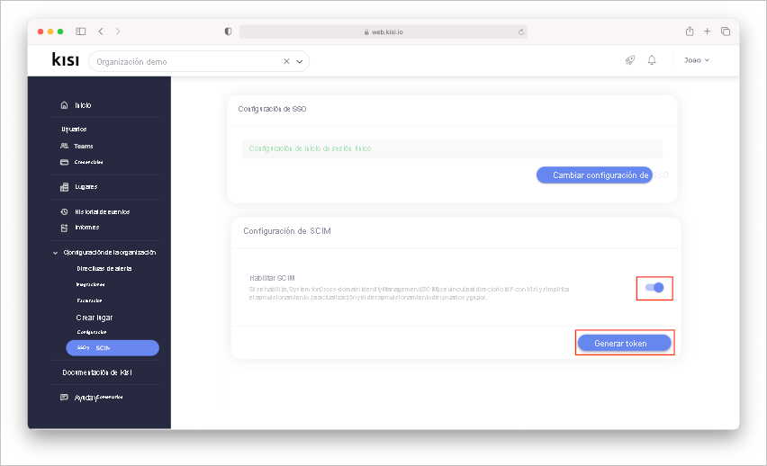

# Tutorial: Configuración de Kisi Physical Security para el aprovisionamiento automático de usuarios

En este tutorial se describen los pasos que debe realizar en Kisi Physical Security y Azure Active Directory (Azure AD) para configurar el aprovisionamiento automático de usuarios. Cuando está configurado, Azure AD aprovisiona y desaprovisiona automáticamente usuarios y grupos en [Kisi Physical Security](https://www.getkisi.com/) mediante el servicio de aprovisionamiento de Azure AD. Para obtener información importante acerca de lo que hace este servicio, cómo funciona y ver preguntas frecuentes al respecto, consulte [Automatización del aprovisionamiento y desaprovisionamiento de usuarios para aplicaciones SaaS con Azure Active Directory](../app-provisioning/user-provisioning.md). 

## Funcionalidades admitidas
> [!div class="checklist"]
> * Creación de usuarios en Kisi Physical Security.
> * Eliminación de usuarios de Kisi Physical Security cuando ya no necesiten acceso.
> * Mantenimiento de la sincronización de atributos de usuario entre Azure AD y Kisi Physical Security.
> * Aprovisionamiento de grupos y pertenencias a grupos en Kisi Physical Security.
> * [Inicio de sesión único](kisi-physical-security-tutorial.md) en Kisi Physical Security (recomendado).

## Prerrequisitos

En el escenario descrito en este tutorial se supone que ya cuenta con los requisitos previos siguientes:

* [Un inquilino de Azure AD](../develop/quickstart-create-new-tenant.md). 
* Una cuenta de usuario en Azure AD con [permiso](../roles/permissions-reference.md) para configurar el aprovisionamiento (por ejemplo, Administrador de aplicaciones, Administrador de aplicaciones en la nube, Propietario de la aplicación o Administrador global). 
* Una [licencia de la organización Kisi](https://www.getkisi.com/enterprise).

## Paso 1. Planeación de la implementación de aprovisionamiento
1. Obtenga información sobre [cómo funciona el servicio de aprovisionamiento](../app-provisioning/user-provisioning.md).
1. Determine quién estará en el [ámbito de aprovisionamiento](../app-provisioning/define-conditional-rules-for-provisioning-user-accounts.md).
1. Determine qué datos se van a [asignar entre Azure AD y Kisi Physical Security](../app-provisioning/customize-application-attributes.md). 

## Paso 2. Configuración de Kisi Physical Security para permitir el aprovisionamiento con Azure AD

### Generación de tokens secretos en Kisi

* Inicie sesión en su cuenta de la organización Kisi.

* En "Organization Setup" (Configuración de la organización), haga clic en "SSO & SCIM" (SSO y SCIM).

* Active "Enable SCIM" (Habilitar SCIM) y haga clic en "Generate Token" (Generar token).

    

* Copie el token (este token solo se muestra una vez).

## Paso 3. Adición de Kisi Physical Security desde la galería de aplicaciones de Azure AD

Agregue Kisi Physical Security desde la galería de aplicaciones de Azure AD para empezar a administrar el aprovisionamiento en Kisi Physical Security. Si previamente ha configurado Kisi Physical Security para el inicio de sesión único, puede usar la misma aplicación. Sin embargo, se recomienda que cree una aplicación independiente al probar la integración inicialmente. Puede encontrar más información sobre cómo agregar una aplicación desde la galería [aquí](../manage-apps/add-application-portal.md). 

## Paso 4. Determinar quién estará en el ámbito de aprovisionamiento 

El servicio de aprovisionamiento de Azure AD le permite definir quién se aprovisionará, en función de la asignación a la aplicación y de los atributos del usuario o grupo. Si elige el ámbito del que se aprovisionará en la aplicación en función de la asignación, puede usar los pasos [siguientes](../manage-apps/assign-user-or-group-access-portal.md) para asignar usuarios y grupos a la aplicación. Si elige el ámbito del que se aprovisionará en función únicamente de los atributos del usuario o grupo, puede usar un filtro de ámbito, tal como se describe [aquí](../app-provisioning/define-conditional-rules-for-provisioning-user-accounts.md).

* Al asignar usuarios y grupos a Kisi Physical Security, debe seleccionar un rol que no sea **Acceso predeterminado**. Los usuarios con el rol de acceso predeterminado se excluyen del aprovisionamiento y se marcarán como no autorizados en los registros de aprovisionamiento. Si el único rol disponible en la aplicación es el rol de acceso predeterminado, puede [actualizar el manifiesto de aplicación](../develop/howto-add-app-roles-in-azure-ad-apps.md) para agregar más roles. 

* Empiece por algo pequeño. Pruebe con un pequeño conjunto de usuarios y grupos antes de implementarlo en todos. Cuando el ámbito del aprovisionamiento se define en los usuarios y grupos asignados, puede controlarlo asignando uno o dos usuarios o grupos a la aplicación. Cuando el ámbito se establece en todos los usuarios y grupos, puede especificar un [filtro de ámbito basado en atributos](../app-provisioning/define-conditional-rules-for-provisioning-user-accounts.md). 

## Paso 5. Configuración del aprovisionamiento automático de usuarios en Kisi Physical Security 

Esta sección le guía por los pasos necesarios para configurar el servicio de aprovisionamiento de Azure AD para crear, actualizar y deshabilitar usuarios y grupos en Kisi Physical Security en función de las asignaciones de grupos o usuarios de Azure AD.

### Para configurar el aprovisionamiento automático de usuarios en Kisi Physical Security en Azure AD:

1. Inicie sesión en [Azure Portal](https://portal.azure.com). Seleccione **Aplicaciones empresariales** y luego **Todas las aplicaciones**.

    

1. En la lista de aplicaciones, seleccione **Kisi Physical Security**.

    

1. Seleccione la pestaña **Aprovisionamiento**.

    

1. Establezca el **modo de aprovisionamiento** en **Automático**.

    

1. En la sección **Admin Credentials** (Credenciales de administrador), escriba la dirección URL del inquilino de Kisi Physical Security y el token secreto proporcionado por Kisi Physical Security. Haga clic en **Probar conexión** para asegurarse de que Azure AD pueda conectarse a Kisi Physical Security. Si se produce un error en la conexión, póngase en contacto con Kisi Physical Security para comprobar la configuración de la cuenta.

    

1. En el campo **Correo electrónico de notificación**, escriba la dirección de correo electrónico de una persona o grupo que deba recibir las notificaciones de error de aprovisionamiento y active la casilla **Enviar una notificación por correo electrónico cuando se produzca un error**.

    

1. Seleccione **Guardar**.

1. En la sección **Asignaciones**, seleccione **Synchronize Azure Active Directory Users to Kisi Physical Security** (Sincronizar usuarios de Azure Active Directory con Kisi Physical Security).

1. Revise los atributos de usuario sincronizados entre Azure AD y Kisi Physical Security en la sección **Asignación de atributos**. Los atributos seleccionados como propiedades **coincidentes** se usan para establecer correspondencia con las cuentas de usuario de Kisi Physical Security para las operaciones de actualización. Si decide cambiar el [atributo de destino coincidente](../app-provisioning/customize-application-attributes.md), deberá asegurarse de que la API de Kisi Physical Security admita el filtrado de usuarios basado en ese atributo. Seleccione el botón **Guardar** para confirmar los cambios.

   |Atributo|Tipo|Compatible con el filtrado|Requerido por Kisi Physical Security|
   |---|---|---|---|
   |userName|String|&check;|&check;|   
   |active|Boolean|||
   |DisplayName|String|||
   |name.givenName|String|||
   |name.familyName|String|||
   |name.formatted|String|||

1. En la sección **Asignaciones**, seleccione **Synchronize Azure Active Directory Groups to Kisi Physical Security** (Sincronizar grupos de Azure Active Directory con Kisi Physical Security).

1. Revise los atributos de grupo sincronizados entre Azure AD y Kisi Physical Security en la sección **Asignación de atributos**. Los atributos seleccionados como propiedades **coincidentes** se usan para establecer correspondencia con los grupos de Kisi Physical Security para las operaciones de actualización. Seleccione el botón **Guardar** para confirmar los cambios.

      |Atributo|Tipo|Compatible con el filtrado|Requerido por Kisi Physical Security|
      |---|---|---|---|
      |DisplayName|String|&check;|&check;      
      |members|Referencia||
      |externalId|String|||
1. Para configurar filtros de ámbito, consulte las siguientes instrucciones, que se proporcionan en el artículo [Aprovisionamiento de aplicaciones basado en atributos con filtros de ámbito](../app-provisioning/define-conditional-rules-for-provisioning-user-accounts.md).

1. Para habilitar el servicio de aprovisionamiento de Azure AD para Kisi Physical Security, cambie el **estado de aprovisionamiento** a **Activado** en la sección **Configuración**.

    

1. Defina los usuarios y los grupos que le gustaría aprovisionar en Kisi Physical Security; para ello, elija los valores adecuados en **Ámbito** en la sección **Configuración**.

    

1. Cuando esté listo para realizar el aprovisionamiento, haga clic en **Guardar**.

    

Esta operación inicia el ciclo de sincronización inicial de todos los usuarios y grupos definidos en **Ámbito** en la sección **Configuración**. El ciclo inicial tarda más tiempo en ejecutarse que los ciclos siguientes, que se producen aproximadamente cada 40 minutos, siempre y cuando el servicio de aprovisionamiento de Azure AD esté en ejecución. 

## Paso 6. Supervisión de la implementación
Una vez configurado el aprovisionamiento, use los recursos siguientes para supervisar la implementación:

* Use los [registros de aprovisionamiento](../reports-monitoring/concept-provisioning-logs.md) para determinar qué usuarios se han aprovisionado correctamente o sin éxito.
* Consulte la [barra de progreso](../app-provisioning/application-provisioning-when-will-provisioning-finish-specific-user.md) para ver el estado del ciclo de aprovisionamiento y cuánto falta para que finalice
* Si la configuración de aprovisionamiento parece estar en mal estado, la aplicación pasará a estar en cuarentena. Más información sobre los estados de cuarentena [aquí](../app-provisioning/application-provisioning-quarantine-status.md).  

## Más recursos

* [Administración del aprovisionamiento de cuentas de usuario para aplicaciones empresariales](../app-provisioning/configure-automatic-user-provisioning-portal.md)
* [¿Qué es el acceso a aplicaciones y el inicio de sesión único con Azure Active Directory?](../manage-apps/what-is-single-sign-on.md)

## Pasos siguientes

* [Aprenda a revisar los registros y a obtener informes sobre la actividad de aprovisionamiento](../app-provisioning/check-status-user-account-provisioning.md)