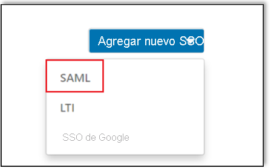

# Tutorial: Integración del inicio de sesión único de Azure AD con LinkedIn Learning

En este tutorial aprenderá a integrar LinkedIn Learning con Azure Active Directory (Azure AD). Al integrar LinkedIn Learning con Azure AD, se puede realizar lo siguiente:

* Controlar en Azure AD quién tiene acceso a LinkedIn Learning.
* Permitir que los usuarios inicien sesión automáticamente en LinkedIn Learning con sus cuentas de Azure AD.
* Administrar las cuentas desde una ubicación central (Azure Portal).

## Requisitos previos

Para empezar, necesita los siguientes elementos:

* Una suscripción de Azure AD. Si no tiene una suscripción, puede crear una [cuenta gratuita](https://azure.microsoft.com/free/).
* Una suscripción habilitada para el inicio de sesión único (SSO) en LinkedIn Learning.

## Descripción del escenario

En este tutorial, va a configurar y probar el inicio de sesión único de Azure AD en un entorno de prueba.

* LinkedIn Learning admite el inicio de sesión único iniciado por **SP e IDP**.
* LinkedIn Learning admite el aprovisionamiento de usuarios **Just-In-Time**.
* LinkedIn Learning admite el [aprovisionamiento automatizado de usuarios](linkedin-learning-provisioning-tutorial.md).

## Adición de LinkedIn Learning desde la galería

Para configurar la integración de LinkedIn Learning en Azure AD, deberá agregar esta solución desde la galería a la lista de aplicaciones SaaS administradas.

1. Inicie sesión en Azure Portal con una cuenta personal, profesional o educativa de Microsoft.
1. En el panel de navegación de la izquierda, seleccione el servicio **Azure Active Directory**.
1. Vaya a **Aplicaciones empresariales** y seleccione **Todas las aplicaciones**.
1. Para agregar una nueva aplicación, seleccione **Nueva aplicación**.
1. En la sección **Agregar desde la galería**, escriba **LinkedIn Learning** en el cuadro de búsqueda.
1. Seleccione **LinkedIn Learning** en el panel de resultados y agregue la aplicación. Espere unos segundos mientras la aplicación se agrega al inquilino.

## Configuración y prueba del inicio de sesión único de Azure AD para LinkedIn Learning

Configure y pruebe el inicio de sesión único de Azure AD con LinkedIn Learning mediante un usuario de prueba llamado **B.Simon**. Para que el inicio de sesión único funcione, es preciso establecer una relación de vinculación entre un usuario de Azure AD y el usuario relacionado de LinkedIn Learning.

Para configurar y probar el inicio de sesión único de Azure AD con LinkedIn Learning, complete los siguientes pasos:

1. **[Configuración del inicio de sesión único de Azure AD](#configure-azure-ad-sso)** , para permitir que los usuarios puedan utilizar esta característica.
    1. **[Creación de un usuario de prueba de Azure AD](#create-an-azure-ad-test-user)** , para probar el inicio de sesión único de Azure AD con B.Simon.
    1. **[Asignación del usuario de prueba de Azure AD](#assign-the-azure-ad-test-user)** , para habilitar a B.Simon para que use el inicio de sesión único de Azure AD.
1. **[Configuración del inicio de sesión único de LinkedIn Learning](#configure-linkedin-learning-sso)** , para configurar los valores del inicio de sesión único en la aplicación.
    1. **[Asignación de licencias](#assign-licenses)** : para tener un homólogo de B.Simon en LinkedIn Learning que esté vinculado a la representación del usuario en Azure AD.
1. **[Prueba del inicio de sesión único](#test-sso)** : para comprobar si la configuración funciona.

## Configuración del inicio de sesión único de Azure AD

Siga estos pasos para habilitar el inicio de sesión único de Azure AD en Azure Portal.

1. En Azure Portal, en la página de integración de la aplicación **LinkedIn Learning**, busque la sección **Administrar** y seleccione **Inicio de sesión único**.
1. En la página **Seleccione un método de inicio de sesión único**, elija **SAML**.
1. En la página **Configuración del inicio de sesión único con SAML**, haga clic en el icono de lápiz de **Configuración básica de SAML** para editar la configuración.

   

1. En la sección **Configuración básica de SAML**, si desea configurar la aplicación en modo iniciado por **IDP**, realice los siguientes pasos:

    a. En el cuadro de texto **Identificador**, escriba el **Id.de entidad** que copió de LinkedIn Portal. 

    b. En el cuadro de texto **URL de respuesta**, escriba la **Assertion Consumer Service (ACS) Url** (URL de Servicio de consumidor de aserciones [ACS]) que copió de LinkedIn Portal.

    c. Si quiere configurar la aplicación en modo **Iniciado por SP**, haga clic en la opción **Establecer direcciones URL adicionales** de la sección **Configuración básica de SAML**, donde especificará su URL de inicio de sesión. Para crear la dirección URL de inicio de sesión, copie la **Assertion Consumer Service (ACS) Url** (URL de Servicio de consumidor de aserciones [ACS]) y reemplace /saml/ por /login/. Una vez realizada esta acción, la dirección URL de inicio de sesión debe tener el siguiente patrón:

    `https://www.linkedin.com/checkpoint/enterprise/login/<AccountId>?application=learning&applicationInstanceId=<InstanceId>`

    > [!NOTE]
    > Estos valores no son reales. Los valores se actualizarán con el identificador, la dirección URL de respuesta y la dirección URL de inicio de sesión reales, lo que se explica más adelante en la sección **Configuración del inicio de sesión único de LinkedIn Learning** del tutorial.

1. La aplicación LinkedIn Learning espera las aserciones de SAML en un formato específico, lo que requiere que se agreguen asignaciones de atributos personalizados a la configuración de los atributos del token SAML. La siguiente captura de pantalla muestra la lista de atributos predeterminados, donde **nameidentifier** se asigna con **user.userprincipalname**. La aplicación LinkedIn Learning espera que **nameidentifier** se asigne con **user.mail**, por lo que debe editar la asignación de atributos haciendo clic en el icono **Editar** y cambiar dicha asignación.

    

1. En la página **Configurar el inicio de sesión único con SAML**, en la sección **Certificado de firma de SAML**, busque **XML de metadatos de federación** y seleccione **Descargar** para descargar el certificado y guardarlo en su equipo.

    

1. En la sección **Configurar LinkedIn Learning**, copie las direcciones URL adecuadas según sus necesidades.

    

### Creación de un usuario de prueba de Azure AD

En esta sección, va a crear un usuario de prueba llamado B.Simon en Azure Portal.

1. En el panel izquierdo de Azure Portal, seleccione **Azure Active Directory**, **Usuarios** y **Todos los usuarios**.
1. Seleccione **Nuevo usuario** en la parte superior de la pantalla.
1. En las propiedades del **usuario**, siga estos pasos:
   1. En el campo **Nombre**, escriba `B.Simon`.  
   1. En el campo **Nombre de usuario**, escriba username@companydomain.extension. Por ejemplo, `B.Simon@contoso.com`.
   1. Active la casilla **Show password** (Mostrar contraseña) y, después, anote el valor que se muestra en el cuadro **Contraseña**.
   1. Haga clic en **Crear**.

### Asignación del usuario de prueba de Azure AD

En esta sección, va a permitir que B.Simon use el inicio de sesión único de Azure concediéndole acceso a LinkedIn Learning.

1. En Azure Portal, seleccione sucesivamente **Aplicaciones empresariales** y **Todas las aplicaciones**.
1. En la lista de aplicaciones, seleccione **LinkedIn Learning**.
1. En la página de información general de la aplicación, busque la sección **Administrar** y seleccione **Usuarios y grupos**.
1. Seleccione **Agregar usuario**. A continuación, en el cuadro de diálogo **Agregar asignación**, seleccione **Usuarios y grupos**.
1. En el cuadro de diálogo **Usuarios y grupos**, seleccione **B.Simon** de la lista de usuarios y haga clic en el botón **Seleccionar** de la parte inferior de la pantalla.
1. Si espera que se asigne un rol a los usuarios, puede seleccionarlo en la lista desplegable **Seleccionar un rol**. Si no se ha configurado ningún rol para esta aplicación, verá seleccionado el rol "Acceso predeterminado".
1. En el cuadro de diálogo **Agregar asignación**, haga clic en el botón **Asignar**.

## Configuración del inicio de sesión único de LinkedIn Learning

1. Inicie sesión en el sitio de la empresa de LinkedIn Learning como administrador.

1. Seleccione **Go to Admin** > **Me** > **Authenticate** (Ir a administración > Yo > Autenticar). 

     

1. Seleccione **Configure single sign-on** (Configurar inicio de sesión único) en **Authenticate** (Autenticar) y haga clic en **Add new SSO** (Agregar nuevo inicio de sesión único).    

    

1. Seleccione **SAML** en la lista desplegable **Add new SSO** (Agregar nuevo inicio de sesión único).

    

1. En la pestaña **Basics** (Datos básicos), escriba **SAML Connection Name** (Nombre de la conexión SAML) y haga clic en **Next** (Siguiente).

    

1. Vaya a la pestaña **Identity provider settings** (Configuración del proveedor de identidades), haga clic en **Download file** (Descargar archivo) para descargar el archivo de metadatos y guardarlo en el equipo. y haga clic en **Next** (Siguiente).

    

    > [!NOTE]    
    > Es posible que no pueda importar este archivo en el proveedor de identidades. Por ejemplo, Okta no tiene esta funcionalidad. Si este caso coincide con los requisitos de configuración, continúe con Trabajo con campos individuales.

1. En la pestaña **Identity provider settings** (Configuración del proveedor de identidades), haga clic en **Load and copy information from fields** (Cargar y copiar información de los campos) para copiar los campos necesarios y pegarlos en la sección **Configuración básica de SAML** de Azure Portal y haga clic en **Siguiente**.

    

1. Vaya a la pestaña **SSO settings** (Configuración de SSO), haga clic en **Upload XML file** (Cargar archivo XML) para cargar el archivo **XML de metadatos de federación** que ha descargado de Azure Portal.

    

1. Rellene manualmente los campos obligatorios que ha copiado de Azure Portal en la pestaña **SSO settings** (Configuración de SSO).

    

1. En **SSO settings** (Configuración de SSO), seleccione las opciones de SSO que necesite y haga clic en **Save** (Guardar).

    

#### Habilitación del inicio de sesión único

Después de completar la configuración, seleccione **Active** (Activar) en la lista desplegable de estado de SSO para habilitar el inicio de sesión único.

  

### Asignar licencias

Una vez que habilite el inicio de sesión único, puede asignar automáticamente licencias a los empleados si cambia **Automatically provision licenses** (Aprovisionamiento automático de licencias) a **On** (Activado) y hace clic en **Save** (Guardar). Al habilitar esta opción, se concede automáticamente una licencia a los usuarios cuando se autentican por primera vez.

   

> [!NOTE]   
> Si no habilita esta opción, un administrador debe agregar usuarios manualmente en la pestaña People (Personas). LinkedIn Learning identifica a los usuarios por su dirección de correo electrónico.

## Prueba de SSO 

En esta sección, probará la configuración de inicio de sesión único de Azure AD con las siguientes opciones. 

#### Iniciado por SP:

* Haga clic en **Probar esta aplicación** en Azure Portal. Esta acción le redirigirá a la dirección URL de inicio de sesión de LinkedIn Learning, donde puede iniciar el flujo de inicio de sesión.  

* Vaya directamente a la dirección URL de inicio de sesión de LinkedIn Learning e inicie el flujo de inicio de sesión desde allí.

#### Iniciado por IDP:

* Haga clic en **Probar esta aplicación** en Azure Portal y debería iniciar sesión automáticamente en la instancia de LinkedIn Learning para la que ha configurado el inicio de sesión único. 

También puede usar Aplicaciones de Microsoft para probar la aplicación en cualquier modo. Al hacer clic en el icono de LinkedIn Learning en Aplicaciones, si se ha configurado en modo SP, se le redirigirá a la página de inicio de sesión de la aplicación para comenzar el flujo de inicio de sesión; y si se ha configurado en modo IDP, se debería iniciar sesión automáticamente en la instancia de LinkedIn Learning para la que haya configurado el inicio de sesión único. Para más información acerca de Aplicaciones, consulte [Inicio de sesión e inicio de aplicaciones desde el portal Aplicaciones](https://support.microsoft.com/account-billing/sign-in-and-start-apps-from-the-my-apps-portal-2f3b1bae-0e5a-4a86-a33e-876fbd2a4510).

## Pasos siguientes

Una vez configurado LinkedIn Learning, puede aplicar el control de sesión, que protege la filtración e infiltración de la información confidencial de la organización en tiempo real. El control de sesión procede del acceso condicional. [Aprenda a aplicar el control de sesión con Microsoft Cloud App Security](/cloud-app-security/proxy-deployment-aad).