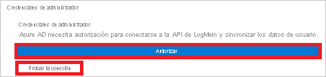
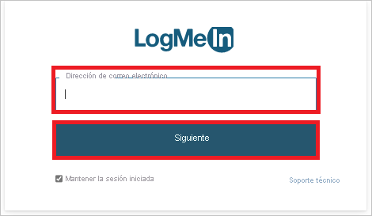
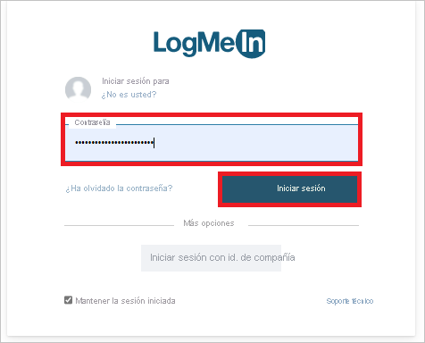

# Tutorial: Configuración de LogMeIn para el aprovisionamiento automático de usuarios

En este tutorial se describen los pasos que debe realizar en LogMeIn y Azure Active Directory (Azure AD) para configurar el aprovisionamiento automático de usuarios. Cuando se configura, Azure AD aprovisiona y desaprovisiona usuarios y grupos de manera automática en [LogMeIn](https://www.logmein.com/) mediante su servicio de aprovisionamiento. Para obtener información importante acerca de lo que hace este servicio, cómo funciona y ver preguntas frecuentes al respecto, consulte [Automatización del aprovisionamiento y desaprovisionamiento de usuarios para aplicaciones SaaS con Azure Active Directory](../app-provisioning/user-provisioning.md). 

## Funcionalidades admitidas
> [!div class="checklist"]
> * Creación de usuarios en LogMeIn
> * Eliminación de usuarios de LogMeIn cuando ya no necesitan acceso
> * Mantenimiento de los atributos de usuario sincronizados entre Azure AD y LogMeIn
> * Aprovisionamiento de grupos y pertenencias a grupos en LogMeIn
> * [Inicio de sesión único](./logmein-tutorial.md) en LogMeIn (recomendado)

## Requisitos previos

En el escenario descrito en este tutorial se supone que ya cuenta con los requisitos previos siguientes:

* [Un inquilino de Azure AD](../develop/quickstart-create-new-tenant.md) 
* Una cuenta de usuario en Azure AD con [permiso](../roles/permissions-reference.md) para configurar el aprovisionamiento (por ejemplo, Administrador de aplicaciones, Administrador de aplicaciones en la nube, Propietario de la aplicación o Administrador global). 
* Una organización creada en el centro de organización de LogMeIn con al menos un dominio comprobado. 
* Una cuenta de usuario en el centro de organización de LogMeIn con [permiso](https://support.goto.com/meeting/help/manage-organization-users-g2m710102) para configurar el aprovisionamiento (por ejemplo, el rol de administrador de la organización con permisos de lectura y escritura), como se muestra en el paso 2.

## Paso 1. Planeación de la implementación de aprovisionamiento
1. Obtenga información sobre [cómo funciona el servicio de aprovisionamiento](../app-provisioning/user-provisioning.md).
2. Determine quién estará en el [ámbito de aprovisionamiento](../app-provisioning/define-conditional-rules-for-provisioning-user-accounts.md).
3. Determine qué datos quiere [asignar entre Azure AD y LogMeIn](../app-provisioning/customize-application-attributes.md). 

## Paso 2. Configuración de LogMeIn para admitir el aprovisionamiento con Azure AD

1. Inicie sesión en el [centro de organización](https://organization.logmeininc.com).

2. El dominio usado en la dirección de correo electrónico de la cuenta es el dominio que se le pedirá que compruebe en un plazo de 10 días.  

3. Puede comprobar la propiedad del dominio mediante cualquiera de los métodos siguientes:

   **Método 1: agregue un registro DNS al archivo de zona de dominio.**  
   Para usar el método DNS, coloque un registro DNS en el nivel del dominio de correo electrónico dentro de la zona DNS.  Los ejemplos que usan "main.com" como dominio se parecerían a: `@ IN TXT "logmein-verification-code=668e156b-f5d3-430e-9944-f1d4385d043e"` O `main.com. IN TXT “logmein-verification-code=668e156b-f5d3-430e-9944-f1d4385d043e”`.

   Estas son las instrucciones detalladas:
     1. Inicie sesión en la cuenta de su dominio en el host de dominio.
     2. Vaya a la página para actualizar los registros DNS del dominio.
     3. Busque los registros TXT del dominio y agregue un registro TXT para el dominio y para cada subdominio.
     4. Guarde todos los cambios.
     5. Para comprobar que el cambio se ha realizado, abra una línea de comandos y escriba uno de los siguientes comandos (en función del sistema operativo, con "main.com" como ejemplo de dominio):
         * Para sistemas Unix y Linux: `$ dig TXT main.com`.
         * Para sistemas Windows: `c:\ > nslookup -type=TXT main.com`.
     6. La respuesta se mostrará en su propia línea.

   **Método 2: cargue un archivo de servidor web al sitio web específico.**
   Cargue un archivo de texto sin formato a la raíz del servidor web que contenga una cadena de comprobación sin espacios en blanco ni caracteres especiales fuera de la cadena.
   
      * Ubicación: `http://<yourdomain>/logmein-verification-code.txt`
      * Contenido: `logmein-verification-code=668e156b-f5d3-430e-9944-f1d4385d043e`

4. Una vez agregado el registro DNS o el archivo TXT, vuelva al [centro de organización](https://organization.logmeininc.com) y haga clic en **Verify** (Verificar).

5. Ahora ha creado una organización en el centro de organización mediante la comprobación del dominio; la cuenta usada durante este proceso de comprobación es ahora el administrador de la organización.

## Paso 3. Incorporación de LogMeIn desde la galería de aplicaciones de Azure AD

Para empezar a administrar el aprovisionamiento de LogMeIn, agregue LogMeIn desde la galería de aplicaciones de Azure AD. Si ha configurado previamente LogMeIn para el inicio de sesión único, puede usar la misma aplicación. Sin embargo, se recomienda que cree una aplicación independiente al probar la integración inicialmente. Puede encontrar más información sobre cómo agregar una aplicación desde la galería [aquí](../manage-apps/add-application-portal.md). 

## Paso 4. Determinar quién estará en el ámbito de aprovisionamiento 

El servicio de aprovisionamiento de Azure AD le permite definir quién se aprovisionará, en función de la asignación a la aplicación y de los atributos del usuario o grupo. Si elige el ámbito del que se aprovisionará en la aplicación en función de la asignación, puede usar los pasos [siguientes](../manage-apps/assign-user-or-group-access-portal.md) para asignar usuarios y grupos a la aplicación. Si elige el ámbito del que se aprovisionará en función únicamente de los atributos del usuario o grupo, puede usar un filtro de ámbito, tal como se describe [aquí](../app-provisioning/define-conditional-rules-for-provisioning-user-accounts.md). 

* Al asignar usuarios y grupos a LogMeIn, debe seleccionar un rol que no sea **Acceso predeterminado**. Los usuarios con el rol de acceso predeterminado se excluyen del aprovisionamiento y se marcarán como no autorizados en los registros de aprovisionamiento. Si el único rol disponible en la aplicación es el rol de acceso predeterminado, puede [actualizar el manifiesto de aplicación](../develop/howto-add-app-roles-in-azure-ad-apps.md) para agregar roles adicionales. 

* Empiece por algo pequeño. Pruebe con un pequeño conjunto de usuarios y grupos antes de implementarlo en todos. Cuando el ámbito del aprovisionamiento se define en los usuarios y grupos asignados, puede controlarlo asignando uno o dos usuarios o grupos a la aplicación. Cuando el ámbito se establece en todos los usuarios y grupos, puede especificar un [filtro de ámbito basado en atributos](../app-provisioning/define-conditional-rules-for-provisioning-user-accounts.md). 

## Paso 5. Configuración del aprovisionamiento automático de usuarios en LogMeIn 

Esta sección le guía por los pasos necesarios para configurar el servicio de aprovisionamiento de Azure AD a fin de crear, actualizar y deshabilitar usuarios o grupos en TestApp en función de las asignaciones de grupos o usuarios de Azure AD.

### Para configurar el aprovisionamiento automático de usuarios para LogMeIn en Azure AD:

1. Inicie sesión en [Azure Portal](https://portal.azure.com). Seleccione **Aplicaciones empresariales** y luego **Todas las aplicaciones**.

    

2. En la lista de aplicaciones, seleccione **LogMeIn**.

    

3. Seleccione la pestaña **Aprovisionamiento**.

    

4. Establezca el **modo de aprovisionamiento** en **Automático**.

    

5. En **Credenciales de administrador**, haga clic en **Autorizar**. Se le redirigirá a la página de autorización de **LogMeIn**. Escriba el nombre de usuario de LogMeIn y haga clic en el botón **Siguiente**. Escriba la contraseña de LogMeIn y haga clic en el botón **Iniciar sesión**. Haga clic en **Prueba de conexión** para asegurarse de que Azure AD puede conectarse a LogMeIn. Si la conexión no se establece, asegúrese de que la cuenta de LogMeIn tiene permisos de administrador e inténtelo de nuevo.

    

      

      

6. En el campo **Correo electrónico de notificación**, escriba la dirección de correo electrónico de una persona o grupo que deba recibir las notificaciones de error de aprovisionamiento y active la casilla **Enviar una notificación por correo electrónico cuando se produzca un error**.

    

7. Seleccione **Guardar**.

8. En la sección **Asignaciones**, seleccione **Synchronize Azure Active Directory Users to LogMeIn** (Sincronizar usuarios de Azure Active Directory con LogMeIn).

9. Revise los atributos de usuario que se sincronizan entre Azure AD y LogMeIn en la sección **Asignación de atributos**. Los atributos seleccionados como propiedades **coincidentes** se usan para establecer coincidencias con las cuentas de usuario de LogMeIn con el objetivo de realizar operaciones de actualización. Si decide cambiar el [atributo de destino coincidente](../app-provisioning/customize-application-attributes.md), deberá asegurarse de que la API de LogMeIn admite el filtrado de usuarios basado en ese atributo. Seleccione el botón **Guardar** para confirmar los cambios.

   |Atributo|Tipo|
   |---|---|
   |userName|String|
   |externalId|String|
   |active|Boolean|
   |name.givenName|String|
   |name.familyName|String|
   |urn:ietf:params:scim:schemas:extension:enterprise:2.0:User:department|String|
   |urn:ietf:params:scim:schemas:extension:enterprise:2.0:User:employeeNumber|String|
   |urn:ietf:params:scim:schemas:extension:enterprise:2.0:User:costCenter|String|
   |urn:ietf:params:scim:schemas:extension:enterprise:2.0:User:division|String|

10. En la sección **Asignaciones**, seleccione **Synchronize Azure Active Directory Groups to LogMeIn** (Sincronizar grupos de Azure Active Directory con LogMeIn).

11. Revise los atributos de grupo que se sincronizan entre Azure AD y LogMeIn en la sección **Asignación de atributos**. Los atributos seleccionados como propiedades **coincidentes** se usan para establecer coincidencias con los grupos de LogMeIn con el objetivo de realizar operaciones de actualización. Seleccione el botón **Guardar** para confirmar los cambios.

      |Atributo|Tipo|
      |---|---|
      |DisplayName|String|
      |externalId|String|
      |members|Referencia|

12. Para configurar filtros de ámbito, consulte las siguientes instrucciones, que se proporcionan en el artículo [Aprovisionamiento de aplicaciones basado en atributos con filtros de ámbito](../app-provisioning/define-conditional-rules-for-provisioning-user-accounts.md).

13. Para habilitar el servicio de aprovisionamiento de Azure AD para LogMeIn, cambie la opción de **Estado del aprovisionamiento** a **Activado** en la sección **Configuración**.

    

14. Seleccione los valores deseados en **Ámbito**, en la sección **Configuración**, para definir los usuarios o grupos que quiere aprovisionar en LogMeIn.

    

15. Cuando esté listo para realizar el aprovisionamiento, haga clic en **Guardar**.

    

Esta operación inicia el ciclo de sincronización inicial de todos los usuarios y grupos definidos en **Ámbito** en la sección **Configuración**. El ciclo de sincronización inicial tarda más tiempo en realizarse que los ciclos posteriores, que se producen aproximadamente cada 40 minutos si el servicio de aprovisionamiento de Azure AD está ejecutándose. 

## Paso 6. Supervisión de la implementación
Una vez configurado el aprovisionamiento, use los recursos siguientes para supervisar la implementación:

1. Use los [registros de aprovisionamiento](../reports-monitoring/concept-provisioning-logs.md) para determinar qué usuarios se han aprovisionado correctamente o sin éxito.
2. Consulte la [barra de progreso](../app-provisioning/application-provisioning-when-will-provisioning-finish-specific-user.md) para ver el estado del ciclo de aprovisionamiento y cuánto falta para que finalice.
3. Si la configuración de aprovisionamiento parece estar en mal estado, la aplicación pasará a estar en cuarentena. Más información sobre los estados de cuarentena [aquí](../app-provisioning/application-provisioning-quarantine-status.md).  

## Recursos adicionales

* [Administración del aprovisionamiento de cuentas de usuario para aplicaciones empresariales](../app-provisioning/configure-automatic-user-provisioning-portal.md)
* [¿Qué es el acceso a aplicaciones y el inicio de sesión único con Azure Active Directory?](../manage-apps/what-is-single-sign-on.md)

## Pasos siguientes

* [Aprenda a revisar los registros y a obtener informes sobre la actividad de aprovisionamiento](../app-provisioning/check-status-user-account-provisioning.md)