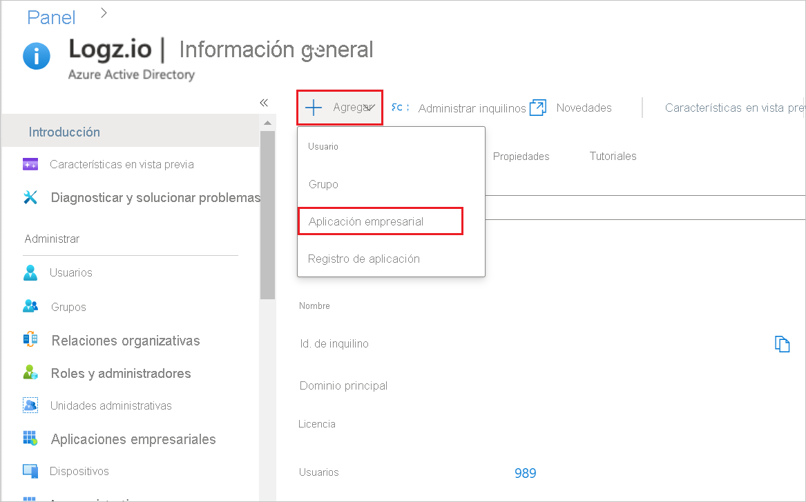
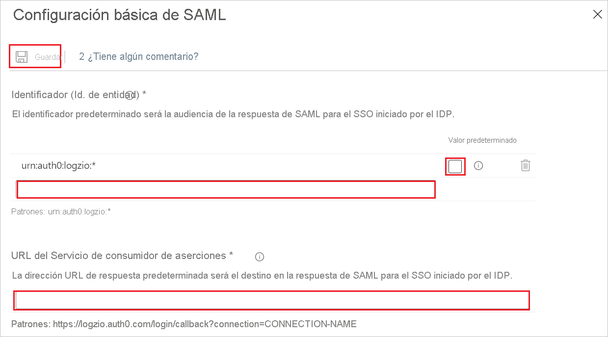
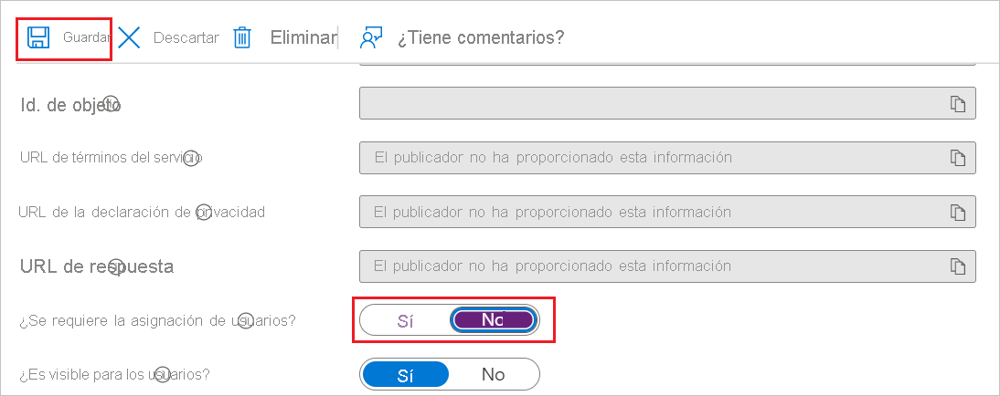

# Tutorial: Configuración del inicio de sesión único (SSO) de Azure Active Directory para la integración de Logz.io y Azure AD

## Inicio de sesión único (SSO) para la integración de Logz.io y Azure Portal

Logz.io ofrece una integración con Azure Marketplace. En este tema, se proporcionan instrucciones para que los administradores configuren el inicio de sesión único para la integración de Logz.io y Azure Portal, que habilita un vínculo de SSO para los usuarios que acceden a los recursos de Logz.io mediante Microsoft Azure Marketplace.

### Ventajas

Ventajas de proporcionar a los usuarios acceso al recurso de Azure de Logz.io mediante el inicio de sesión único: 

+ No es necesario predefinir un nombre de usuario y una contraseña únicos para cada usuario: cualquier usuario que tenga el vínculo de SSO puede iniciar sesión en la aplicación.
+ Mejor control de usuario: se debe definir un usuario en la cuenta de Azure para poder usar el vínculo de SSO.

Prepare la conectividad del inicio de sesión único antes de configurar el recurso de Azure para Logz.io. Necesitará las credenciales que cree en este proceso para configurar el recurso. 

### Creación de la conectividad del inicio de sesión único para el recurso de Logz.io en Azure Active Directory 

Va a crear una aplicación empresarial de Azure Active Directory (AD) que le permita usar el inicio de sesión único para conectarse a la cuenta de Logz.io desde el recurso de Azure. 

### Requisitos previos: 

Para comenzar, necesitará los siguientes privilegios:

* Acceso a Azure Active Directory (AAD)
* Permisos para crear una nueva aplicación empresarial
* Permisos de rol de propietario en la suscripción de Azure para la que va a crear el recurso de Logz.io 

Para poder acceder y usar el vínculo de SSO que se crea para un recurso de integración de Logz.io y Azure, los usuarios deben estar definidos en la cuenta de Azure asociada. 

#### Configuración de un vínculo de SSO para el recurso de integración de Logz.io y Azure Portal

##### Incorporación de Logz.io-Azure Active Directory Integration desde la galería

Para configurar el inicio de sesión único para el recurso de Logz.io en Azure Portal, es preciso agregar Logz.io - Azure AD Integration desde la galería a la lista de aplicaciones SaaS administradas.

1. Inicie sesión en Azure Portal con una cuenta Microsoft.
2. En Azure Portal, en **Logz.io | Información general**, en el menú **+ Agregar**, seleccione **Aplicación empresarial**.

   
   
3. En la galería de Azure Active Directory, vaya a la aplicación **Logz.io - Azure AD Integration** y selecciónela.
4. Cambie el nombre de la integración por un nombre pertinente y haga clic en **Crear**. (En los pasos siguientes, hemos usado el nombre **Aplicación de AD para un recurso de Logz.io**).

   

##### Copie el identificador de aplicación.

En **Aplicación de AD para un recurso de Logz.io | Información general > Propiedades**, copie la propiedad **Id. de la aplicación**.

##### Configuración del inicio de sesión único de Azure AD

1. En **Aplicación de AD para un recurso de Logz.io | Información > Primeros pasos**, en **2. Configurar inicio de sesión único**, haga clic en **Comenzar** para abrir **Inicio de sesión único**.

   

2. En **Aplicación de AD para un recurso de Logz.io | Inicio de sesión único**, seleccione el método **SAML**.

   

##### Configuración básica de SAML   

1. En **Aplicación de AD para un recurso de Logz.io | Inicio de sesión basado en SAML**, haga clic en **Editar** para abrir el panel **Configuración básica de SAML**.

   

2. En el cuadro de texto **Identificador (id. de entidad)** , escriba un valor con el patrón `urn:auth0:logzio:*`, reemplace el símbolo de `*` por el **identificador de la aplicación** que copió en el procedimiento 2 y haga clic en la opción **Predeterminado**. 

3. En el cuadro de texto **Dirección URL de respuesta (URL del Servicio de consumidor de aserciones)** , escriba una dirección URL con el patrón `https://logzio.auth0.com/login/callback?connection=`; reemplace `CONNECTION_NAME` por el **identificador de la aplicación** que copió en el procedimiento 2.

4. Haga clic en **Guardar** en la parte superior del panel.

    

##### Configuración de la opción de asignación de usuarios    

En **Aplicación de AD para un recurso de Logz.io | Propiedades (Administrar > Propiedades)** , establezca **¿Asignación de usuarios?** en **No** y haga clic en **Guardar**.  
Este paso permite a los usuarios con acceso al vínculo de SSO iniciar sesión en Logz.io mediante Microsoft Azure Portal, sin necesidad de predefinir cada usuario en Active Directory.

Esta opción permite a cualquier usuario que esté definido en Active Directory usar el vínculo de SSO en lugar de requerir que defina derechos de acceso específicos para cada usuario mediante la aplicación de AD que acaba de crear. 

Si no desea configurar esta opción, la organización tendrá que asignar derechos de acceso específicos a Logz.io para cada usuario.

### Habilitación del inicio de sesión único para el recurso de Logz.io mediante Azure Active Directory

Cuando cree una cuenta de Logz.io, use la aplicación de AD que creó para el recurso de Logz.io para habilitar el inicio de sesión único con Azure Active Directory.  

El nombre de recurso de la aplicación de AAD de Logz.io se rellena automáticamente a medida que escribe.

El vínculo de SSO se muestra al iniciar sesión en el recurso de Logz.io.   
Haga clic en el vínculo para acceder a la cuenta de Logz.io. 

Si no configura el inicio de sesión único al crear el recurso de Logz.io, puede configurarlo más adelante mediante la hoja Inicio de sesión único.

Tendrá que configurar los registros en Azure para asegurarse de que se envíen a Logz.io.

## Inicio de sesión único de Azure Active Directory para una cuenta de Logz.io existente

En esta sección, aprenderá a integrar Logz.io - Azure AD Integration con Azure Active Directory (Azure AD). Al integrar Logz.io - Azure AD Integration con Azure AD, puede hacer lo siguiente:

* Controlar en Azure AD que tiene acceso a Logz.io - Azure AD Integration.
* Permitir que los usuarios inicien sesión automáticamente en Logz.io - Azure AD Integration con sus cuentas de Azure AD.
* Administrar las cuentas desde una ubicación central (Azure Portal).

### Requisitos previos

Para empezar, necesita los siguientes elementos:

* Una suscripción de Azure AD. Si no tiene una suscripción, puede crear una [cuenta gratuita](https://azure.microsoft.com/free/).
* Una suscripción habilitada para el inicio de sesión único en Logz.io - Azure AD Integration.

### Descripción del escenario

En este tutorial, va a configurar y probar el inicio de sesión único de Azure AD en un entorno de prueba.

* Logz.io - Azure AD Integration admite el inicio de sesión único iniciado por **IDP**.

### Adición de Logz.io - Azure AD Integration desde la galería

Para configurar la integración de Logz.io - Azure AD Integration en Azure AD, es preciso agregar Logz.io - Azure AD Integration desde la galería a la lista de aplicaciones SaaS administradas.

1. Inicie sesión en Azure Portal con una cuenta personal, profesional o educativa de Microsoft.
1. En el panel de navegación de la izquierda, seleccione el servicio **Azure Active Directory**.
1. Vaya a **Aplicaciones empresariales** y seleccione **Todas las aplicaciones**.
1. Para agregar una nueva aplicación, seleccione **Nueva aplicación**.
1. En la sección **Agregar desde la galería**, escriba **Logz.io - Azure AD Integration** en el cuadro de búsqueda.
1. Seleccione **Logz.io - Azure AD Integration** en el panel de resultados y agregue la aplicación. Espere unos segundos mientras la aplicación se agrega al inquilino.

### Configuración y prueba del inicio de sesión único de Azure AD para Logz.io - Azure AD Integration

Configure y pruebe el inicio de sesión único de Azure AD con Logz.io - Azure AD Integration mediante un usuario de prueba llamado **B.Simon**. Para que el inicio de sesión único funcione, es preciso establecer una relación de vinculación entre un usuario de Azure AD y el usuario relacionado de Logz.io - Azure AD Integration.

Para configurar y probar el inicio de sesión único de Azure AD con Logz.io - Azure AD Integration, siga estos pasos:

1. **[Configuración del inicio de sesión único de Azure AD](#configure-azure-ad-sso)** , para permitir que los usuarios puedan utilizar esta característica.
    1. **[Creación de un usuario de prueba de Azure AD](#create-an-azure-ad-test-user)** , para probar el inicio de sesión único de Azure AD con B.Simon.
    1. **[Asignación del usuario de prueba de Azure AD](#assign-the-azure-ad-test-user)** , para habilitar a B.Simon para que use el inicio de sesión único de Azure AD.
1. **[Configuración del inicio de sesión único de Logz.io - Azure AD Integration](#configure-logzio-azure-ad-integration-sso)** , para configurar los valores de inicio de sesión único en la aplicación.
    1. **[Creación de un usuario de prueba de Logz.io - Azure AD Integration](#create-logzio-azure-ad-integration-test-user)** , para tener un homólogo de B.Simon en Logz.io - Azure AD Integration vinculado a la representación del usuario en Azure AD.
1. **[Prueba del inicio de sesión único](#test-sso)** : para comprobar si la configuración funciona.

### Configuración del inicio de sesión único de Azure AD

Siga estos pasos para habilitar el inicio de sesión único de Azure AD en Azure Portal.

1. En Azure Portal, en la página de integración de la aplicación **Logz.io - Azure AD Integration**, busque la sección **Administrar** y seleccione **Inicio de sesión único**.
1. En la página **Seleccione un método de inicio de sesión único**, elija **SAML**.
1. En la página **Configuración del inicio de sesión único con SAML**, haga clic en el icono de lápiz de **Configuración básica de SAML** para editar la configuración.

   

1. En la página **Configurar inicio de sesión único con SAML** realice los siguientes pasos:

    a. En el cuadro de texto **Identificador**, escriba un valor con el siguiente patrón: `urn:auth0:logzio:CONNECTION-NAME`

    b. En el cuadro de texto **URL de respuesta**, escriba una dirección URL con el siguiente patrón: `https://logzio.auth0.com/login/callback?connection=CONNECTION-NAME`

    > [!NOTE]
    > Estos valores no son reales. Actualice estos valores con el identificador y la URL de respuesta reales. Póngase en contacto con el [equipo de soporte técnico para clientes de Logz.io - Azure AD Integration](mailto:help@logz.io) para obtener estos valores. También puede hacer referencia a los patrones que se muestran en la sección **Configuración básica de SAML** de Azure Portal.

1. La aplicación Logz.io - Azure AD Integration espera las aserciones de SAML en un formato específico, lo cual requiere que se agreguen asignaciones de atributos personalizados a la configuración de los atributos del token de SAML. La siguiente captura de muestra la lista de atributos predeterminados.

    

1. Además de lo anterior, la aplicación Logz.io - Azure AD Integration espera que se devuelvan algunos atributos más, que se muestran a continuación, en la respuesta de SAML. Estos atributos también se rellenan previamente, pero puede revisarlos según sus requisitos.
    
    | Nombre |  Atributo de origen|
    | ---------------| --------- |
    | session-expiration | user.session-expiration |
    | email | user.mail |
    | Grupo | user.groups |

1. En la página **Configurar el inicio de sesión único con SAML**, en la sección **Certificado de firma de SAML**, busque **Certificado (Base64)** y seleccione **Descargar** para descargarlo y guardarlo en el equipo.

    

1. En la sección **Configurar Logz.io - Azure AD Integration**, copie las direcciones URL adecuadas según sus necesidades.

    

#### Creación de un usuario de prueba de Azure AD

En esta sección, va a crear un usuario de prueba llamado B.Simon en Azure Portal.

1. En el panel izquierdo de Azure Portal, seleccione **Azure Active Directory**, **Usuarios** y **Todos los usuarios**.
1. Seleccione **Nuevo usuario** en la parte superior de la pantalla.
1. En las propiedades del **usuario**, siga estos pasos:
   1. En el campo **Nombre**, escriba `B.Simon`.  
   1. En el campo **Nombre de usuario**, escriba username@companydomain.extension. Por ejemplo, `B.Simon@contoso.com`.
   1. Active la casilla **Show password** (Mostrar contraseña) y, después, anote el valor que se muestra en el cuadro **Contraseña**.
   1. Haga clic en **Crear**.

#### Asignación del usuario de prueba de Azure AD

En esta sección va a permitir que B.Simon acceda a Logz.io - Azure AD Integration mediante el inicio de sesión único de Azure.

1. En Azure Portal, seleccione sucesivamente **Aplicaciones empresariales** y **Todas las aplicaciones**.
1. En la lista de aplicaciones, seleccione **Logz.io - Azure AD Integration**.
1. En la página de información general de la aplicación, busque la sección **Administrar** y seleccione **Usuarios y grupos**.
1. Seleccione **Agregar usuario**. A continuación, en el cuadro de diálogo **Agregar asignación**, seleccione **Usuarios y grupos**.
1. En el cuadro de diálogo **Usuarios y grupos**, seleccione **B.Simon** de la lista de usuarios y haga clic en el botón **Seleccionar** de la parte inferior de la pantalla.
1. Si espera que haya un valor de rol en la aserción de SAML, en el cuadro de diálogo **Seleccionar rol**, seleccione en la lista el rol adecuado para el usuario y haga clic en el botón **Seleccionar** en la parte inferior de la pantalla.
1. En el cuadro de diálogo **Agregar asignación**, haga clic en el botón **Asignar**.

### Configuración del inicio de sesión único de Logz.io - Azure AD Integration

Para configurar el inicio de sesión único en **Logz.io - Azure AD Integration**, debe enviar el **certificado (Base64)** descargado y las direcciones URL correspondientes copiadas de Azure Portal al [equipo de soporte técnico de Logz.io - Azure AD Integration](mailto:help@logz.io). Dicho equipo lo configura para establecer la conexión de SSO de SAML correctamente en ambos lados.

#### Creación de un usuario de prueba de Logz.io - Azure AD Integration

En esta sección, va a crear un usuario llamado Britta Simon en Logz.io - Azure AD Integration. Trabaje con el [equipo de soporte técnico de Logz.io - Azure AD Integration](mailto:help@logz.io) para agregar los usuarios a la plataforma de Logz.io - Azure AD Integration. Los usuarios se tienen que crear y activar antes de usar el inicio de sesión único.

### Prueba de SSO 

En esta sección, probará la configuración de inicio de sesión único de Azure AD con las siguientes opciones.

* Haga clic en Probar esta aplicación en Azure Portal y debería iniciar sesión automáticamente en la instancia de Logz.io Azure AD Integration para la que ha configurado el inicio de sesión único.

* Puede usar Mis aplicaciones de Microsoft. Al hacer clic en el icono de Logz.io Azure AD Integration en Mis aplicaciones, debería iniciar sesión automáticamente en la instancia de Logz.io Azure AD Integration para la que ha configurado el inicio de sesión único. Para más información acerca de Aplicaciones, consulte [Inicio de sesión e inicio de aplicaciones desde el portal Aplicaciones](https://support.microsoft.com/account-billing/sign-in-and-start-apps-from-the-my-apps-portal-2f3b1bae-0e5a-4a86-a33e-876fbd2a4510).

### Pasos siguientes

Una vez que haya configurado Logz.io Azure AD Integration, podrá aplicar el control de sesión, que protege a la organización en tiempo real frente a la filtración e infiltración de información confidencial. El control de sesión procede del acceso condicional. [Aprenda a aplicar el control de sesión con Microsoft Cloud App Security](/cloud-app-security/proxy-deployment-aad).