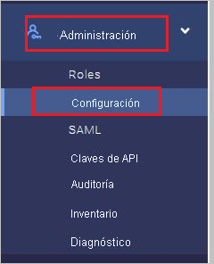
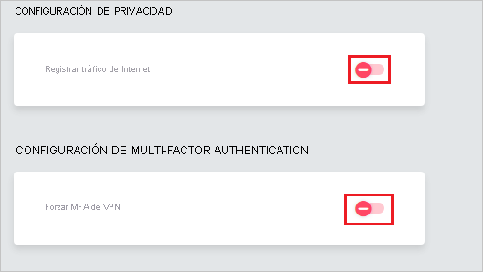
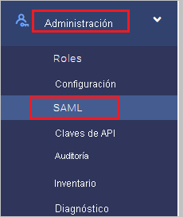
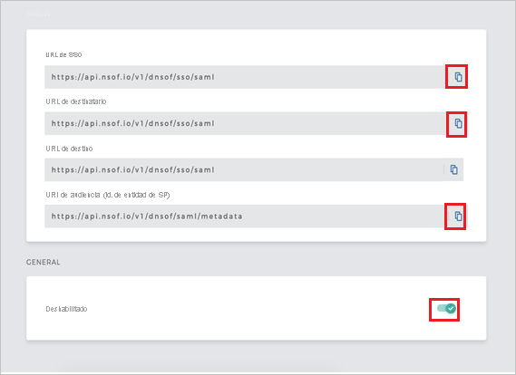
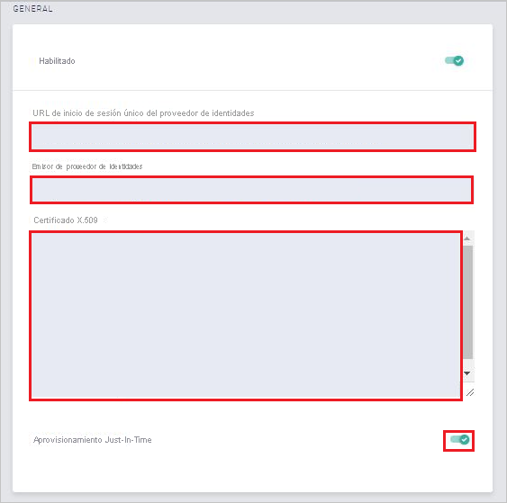

# Tutorial: Integración de Azure Active Directory con Meta Networks Connector

En este tutorial, aprenderá a integrar Meta Networks Connector con Azure Active Directory (Azure AD). Al integrar Meta Networks Connector con Azure AD, puede hacer lo siguiente:

* Controlar en Azure AD quién tiene acceso a Meta Networks Connector.
* Permitir que los usuarios inicien sesión automáticamente en Meta Networks Connector con sus cuentas de Azure AD.
* Administrar las cuentas desde una ubicación central (Azure Portal).

## Requisitos previos

Para empezar, necesita los siguientes elementos:

* Una suscripción de Azure AD. Si no tiene una suscripción, puede crear una [cuenta gratuita](https://azure.microsoft.com/free/).
* Una suscripción habilitada para el inicio de sesión único (SSO) en Meta Networks Connector

## Descripción del escenario

En este tutorial, puede configurar y probar el inicio de sesión único de Azure AD en un entorno de prueba.

* Meta Networks Connector admite SSO iniciado por **SP** e **IDP**.
 
* Meta Networks Connector admite el aprovisionamiento de usuarios **Just-In-Time**.

* Meta Networks Connector admite el [aprovisionamiento de usuarios automatizado](meta-networks-connector-provisioning-tutorial.md).

## Incorporación de Meta Networks Connector desde la galería

Para configurar la integración de Meta Networks Connector en Azure AD, deberá agregar Meta Networks Connector desde la galería a la lista de aplicaciones SaaS administradas.

1. Inicie sesión en Azure Portal con una cuenta personal, profesional o educativa de Microsoft.
1. En el panel de navegación de la izquierda, seleccione el servicio **Azure Active Directory**.
1. Vaya a **Aplicaciones empresariales** y seleccione **Todas las aplicaciones**.
1. Para agregar una nueva aplicación, seleccione **Nueva aplicación**.
1. En la sección **Agregar desde la galería**, escriba **Meta Networks Connector** en el cuadro de búsqueda.
1. Seleccione **Meta Networks Connector** en el panel de resultados y agregue la aplicación. Espere unos segundos mientras la aplicación se agrega al inquilino.

## Configuración y prueba del inicio de sesión único de Azure AD para Meta Networks Connector

Configure y pruebe el inicio de sesión único de Azure AD con Meta Networks Connector mediante un usuario de prueba llamado **B. Simon**. Para que el SSO funcione, es necesario establecer una relación de vinculación entre un usuario de Azure AD y el usuario relacionado de Meta Networks Connector.

Para configurar y probar el inicio de sesión único de Azure AD con Meta Networks Connector, siga este procedimiento:

1. **[Configuración del inicio de sesión único de Azure AD](#configure-azure-ad-sso)** , para permitir que los usuarios puedan utilizar esta característica.
    1. **[Creación de un usuario de prueba de Azure AD](#create-an-azure-ad-test-user)** , para probar el inicio de sesión único de Azure AD con B.Simon.
    1. **[Asignación del usuario de prueba de Azure AD](#assign-the-azure-ad-test-user)** , para habilitar a B.Simon para que use el inicio de sesión único de Azure AD.
1. **[Configuración del inicio de sesión único de Meta Networks Connector](#configure-meta-networks-connector-sso)** : para configurar las opciones de inicio de sesión único en la aplicación.
    1. **[Creación de un usuario de prueba de Meta Networks Connector](#create-meta-networks-connector-test-user)** : para tener un homólogo de B Simon en Meta Networks Connector que esté vinculado a la representación del usuario en Azure AD.
1. **[Prueba del inicio de sesión único](#test-sso)** : para comprobar si la configuración funciona.

## Configuración del inicio de sesión único de Azure AD

Siga estos pasos para habilitar el inicio de sesión único de Azure AD en Azure Portal.

1. En Azure Portal, en la página de integración de aplicaciones de **Meta Networks Connector**, busque la sección **Administrar** y seleccione **Inicio de sesión único**.
1. En la página **Seleccione un método de inicio de sesión único**, elija **SAML**.
1. En la página **Configuración del inicio de sesión único con SAML**, haga clic en el icono de lápiz de **Configuración básica de SAML** para editar la configuración.

   

4. En la sección **Configuración básica de SAML**, si desea configurar la aplicación en el modo iniciado por **IDP** siga estos pasos:

    a. En el cuadro de texto **Identificador**, escriba una dirección URL con el patrón siguiente: `https://login.nsof.io/v1/<ORGANIZATION-SHORT-NAME>/saml/metadata`

    b. En el cuadro de texto **URL de respuesta**, escriba una dirección URL con el siguiente patrón: `https://login.nsof.io/v1/<ORGANIZATION-SHORT-NAME>/sso/saml`

5. Haga clic en **Establecer direcciones URL adicionales** y siga este paso si desea configurar la aplicación en el modo iniciado por **SP**:

    a. En el cuadro de texto **URL de inicio de sesión**, escriba una dirección URL con el siguiente patrón: `https://<ORGANIZATION-SHORT-NAME>.metanetworks.com/login`

    b. En el cuadro de texto **Estado de la retransmisión**, escriba una dirección URL que siga este patrón: `https://<ORGANIZATION-SHORT-NAME>.metanetworks.com/#/`

    > [!NOTE]
    > Estos valores no son reales. La actualización de estos valores por el identificador, dirección URL de respuesta y dirección URL de inicio de sesión reales se explica más adelante en el tutorial.

6. La aplicación Meta Networks Connector espera las aserciones de SAML en un formato específico, que requiere que se agreguen asignaciones de atributos personalizados a la configuración de los atributos del token de SAML. La siguiente captura de muestra la lista de atributos predeterminados. Haga clic en el icono **Editar** para abrir el cuadro de diálogo **Atributos de usuario**.

    
    
7. Además de lo anterior, la aplicación Meta Networks Connector espera que se usen algunos atributos más en la respuesta de SAML. En la sección **Notificaciones del usuario** del cuadro de diálogo **Atributos de usuario**, realice los siguientes pasos para agregar el atributo Token SAML como se muestra en la tabla siguientes:
    
    | Nombre | Atributo de origen | Espacio de nombres|
    | ---------------| --------------- | -------- |
    | firstname | user.givenname | |
    | lastname | user.surname | |
    | emailaddress| user.mail| `http://schemas.xmlsoap.org/ws/2005/05/identity/claims` |
    | name | user.userprincipalname| `http://schemas.xmlsoap.org/ws/2005/05/identity/claims` |
    | phone | user.telephonenumber | |

    a. Haga clic en **Agregar nueva notificación** para abrir el cuadro de diálogo **Administrar las notificaciones del usuario**.

    

    

    b. En el cuadro de texto **Nombre**, escriba el nombre que se muestra para la fila.

    c. Deje **Espacio de nombres** en blanco.

    d. Seleccione **Atributo** como origen.

    e. En la lista **Atributo de origen**, escriba el valor de atributo que se muestra para esa fila.

    f. Haga clic en **Aceptar**.

    g. Haga clic en **Save**(Guardar).

8. En la página **Configurar el inicio de sesión único con SAML**, en la sección **Certificado de firma de SAML**, haga clic en **Descargar** para descargar el **certificado (Base64)** de las opciones proporcionadas según sus requisitos y guárdelo en el equipo.

    

9. En la sección **Set up Meta Networks Connector** (Configurar Meta Networks Connector), copie las direcciones URL que necesite.

    

### Creación de un usuario de prueba de Azure AD 

En esta sección, va a crear un usuario de prueba llamado B.Simon en Azure Portal.

1. En el panel izquierdo de Azure Portal, seleccione **Azure Active Directory**, **Usuarios** y **Todos los usuarios**.
1. Seleccione **Nuevo usuario** en la parte superior de la pantalla.
1. En las propiedades del **usuario**, siga estos pasos:
   1. En el campo **Nombre**, escriba `B.Simon`.  
   1. En el campo **Nombre de usuario**, escriba username@companydomain.extension. Por ejemplo, `B.Simon@contoso.com`.
   1. Active la casilla **Show password** (Mostrar contraseña) y, después, anote el valor que se muestra en el cuadro **Contraseña**.
   1. Haga clic en **Crear**.

### Asignación del usuario de prueba de Azure AD

En esta sección, para permitir que B. Simon use el inicio de sesión único de Azure, le concederá acceso a Meta Networks Connector.

1. En Azure Portal, seleccione sucesivamente **Aplicaciones empresariales** y **Todas las aplicaciones**.
1. En la lista de aplicaciones, seleccione **Meta Networks Connector**.
1. En la página de información general de la aplicación, busque la sección **Administrar** y seleccione **Usuarios y grupos**.
1. Seleccione **Agregar usuario**. A continuación, en el cuadro de diálogo **Agregar asignación**, seleccione **Usuarios y grupos**.
1. En el cuadro de diálogo **Usuarios y grupos**, seleccione **B.Simon** de la lista de usuarios y haga clic en el botón **Seleccionar** de la parte inferior de la pantalla.
1. Si espera que se asigne un rol a los usuarios, puede seleccionarlo en la lista desplegable **Seleccionar un rol**. Si no se ha configurado ningún rol para esta aplicación, verá seleccionado el rol "Acceso predeterminado".
1. En el cuadro de diálogo **Agregar asignación**, haga clic en el botón **Asignar**.

## Configurar del inicio de sesión único de Meta Networks Connector

1. Abra una nueva pestaña en el explorador e inicie sesión en su cuenta de administrador de Meta Networks Connector.
    
    > [!NOTE]
    > Meta Networks Connector es un sistema seguro. Por lo que antes de acceder a su portal deberá hacer que su dirección IP pública se incluya en una lista de permitidos en su lado. Para obtener la dirección IP pública, siga el vínculo especificado [aquí](https://whatismyipaddress.com/). Envíe su dirección IP al [equipo de soporte técnico de Meta Networks Connector](mailto:support@metanetworks.com) para que su dirección IP se incluya en una lista de permitidos.
    
2. Vaya a **Administrador** y seleccione **Configuración**.
    
    
    
3. Asegúrese de que **Registro del tráfico de Internet** y **Forzar MFA de VPN** se establecen en Desactivado.
    
    
    
4. Vaya a **Administrador** y seleccione **SAML**.
    
    
    
5. En la página **Detalles**, lleve a cabo los pasos siguientes:
    
    
    
    a. Copie el valor de **Dirección URL de inicio de sesión único** y péguelo en el cuadro de texto **Dirección URL de inicio de sesión** en la sección **Dominio y direcciones URL de Meta Networks Connector**.
    
    b. Copie el valor de **Dirección URL del destinatario** y péguelo en el cuadro de texto **Dirección URL de respuesta** en la sección **Dominio y direcciones URL de Meta Networks Connector**.
    
    c. Copie el valor de **Identificador URI de audiencia** y péguelo en el cuadro de texto **Identificador (Identificador de entidad)** en la sección **Dominio y direcciones URL de Meta Networks Connector**.
    
    d. Habilite SAML.
    
6. En la pestaña **GENERAL**, realice los pasos siguientes:

    

    a. En **Dirección URL del inicio de sesión único del proveedor de identidades**, pegue el valor de **Dirección URL de inicio de sesión** que ha copiado de Azure Portal.

    b. En **Emisor de proveedor de identidades**, pegue el valor de **Identificador de Azure AD** que ha copiado de Azure Portal.

    c. Abra el certificado descargado desde Azure Portal en el Bloc de notas y péguelo en el cuadro de texto **Certificado X.509**.

    d. Habilite el **Aprovisionamiento Just-in-Time**.

### Creación de un usuario de prueba en Meta Networks Connector

En esta sección, se crea un usuario llamado Britta Simon en Meta Networks Connector. Meta Networks Connector admite el aprovisionamiento Just-In-Time, que está habilitado de forma predeterminada. No hay ningún elemento de acción para usted en esta sección. Si el usuario no existe en Meta Networks Connector, se crea uno cuando se intenta acceder a Meta Networks Connector.

>[!Note]
>Si necesita crear manualmente un usuario, es preciso que se ponga contacto con el [equipo de soporte técnico de Meta Networks Connector](mailto:support@metanetworks.com).

Meta Networks también admite el aprovisionamiento automático de usuarios. [Aquí](./meta-networks-connector-provisioning-tutorial.md) puede encontrar más detalles sobre cómo configurar el aprovisionamiento automático de usuarios.

## Prueba de SSO 

En esta sección, probará la configuración de inicio de sesión único de Azure AD con las siguientes opciones. 

#### Iniciado por SP:

* Haga clic en **Probar esta aplicación** en Azure Portal. Esta acción le redirigirá a la dirección URL de inicio de sesión de Meta Networks Connector, donde puede iniciar el flujo de inicio de sesión.  

* Vaya directamente a la dirección URL de inicio de sesión de Meta Networks Connector e inicie el flujo de inicio de sesión desde allí.

#### Iniciado por IDP:

* Haga clic en **Probar esta aplicación** en Azure Portal. Se debería iniciar sesión automáticamente en la instancia de Meta Networks Connector para la que ha configurado el inicio de sesión único. 

También puede usar Aplicaciones de Microsoft para probar la aplicación en cualquier modo. Al hacer clic en el icono de Meta Networks Connector en Aplicaciones, si se ha configurado en modo SP, se le redirigirá a la página de inicio de sesión de la aplicación para comenzar el flujo de inicio de sesión; si se ha configurado en modo IDP, se debería iniciar sesión automáticamente en la instancia de Meta Networks Connector para la que ha configurado el inicio de sesión único. Para más información acerca de Aplicaciones, consulte [Inicio de sesión e inicio de aplicaciones desde el portal Aplicaciones](https://support.microsoft.com/account-billing/sign-in-and-start-apps-from-the-my-apps-portal-2f3b1bae-0e5a-4a86-a33e-876fbd2a4510).

## Pasos siguientes

Una vez configurado Meta Networks Connector, puede aplicar el control de sesión, que protege contra la filtración y la infiltración de la información confidencial de la organización en tiempo real. El control de sesión procede del acceso condicional. [Aprenda a aplicar el control de sesión con Microsoft Cloud App Security](/cloud-app-security/proxy-deployment-aad).