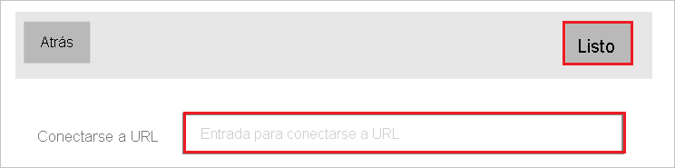
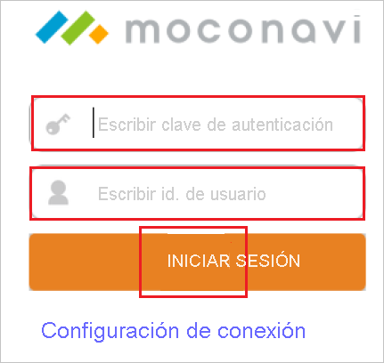
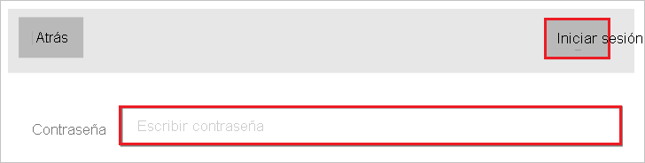
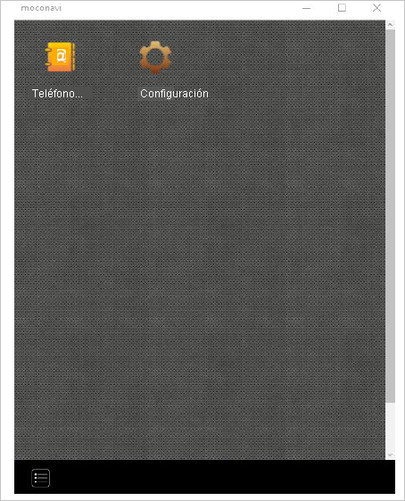

# Tutorial: Integración del inicio de sesión único de Azure AD con moconavi

En este tutorial aprenderá a integrar moconavi con Azure Active Directory (Azure AD). Con la integración de moconavi con Azure AD puede:

* Controlar en Azure AD quién tiene acceso a moconavi.
* Permitir que los usuarios inicien sesión automáticamente en moconavi con sus cuentas de Azure AD.
* Administrar las cuentas desde una ubicación central (Azure Portal).

## Requisitos previos

Para empezar, necesita los siguientes elementos:

* Una suscripción de Azure AD. Si no tiene una suscripción, puede crear una [cuenta gratuita](https://azure.microsoft.com/free/).
* Suscripción de moconavi habilitada para el inicio de sesión único.

## Descripción del escenario

En este tutorial, puede configurar y probar el inicio de sesión único de Azure AD en un entorno de prueba.

* moconavi admite SSO iniciado por **SP**.

## Incorporación de moconavi desde la galería

Para configurar la integración de moconavi en Azure AD, será preciso que agregue moconavi desde la galería a la lista de aplicaciones SaaS administradas.

1. Inicie sesión en Azure Portal con una cuenta personal, profesional o educativa de Microsoft.
1. En el panel de navegación de la izquierda, seleccione el servicio **Azure Active Directory**.
1. Vaya a **Aplicaciones empresariales** y seleccione **Todas las aplicaciones**.
1. Para agregar una nueva aplicación, seleccione **Nueva aplicación**.
1. En la sección **Agregar desde la galería**, escriba **moconavi** en el cuadro de búsqueda.
1. Seleccione **moconavi** en el panel de resultados y agregue la aplicación. Espere unos segundos mientras la aplicación se agrega al inquilino.

## Configuración y prueba del inicio de sesión único de Azure AD para moconavi

Configure y pruebe el inicio de sesión único de Azure AD con moconavi mediante un usuario de prueba llamado **B.Simon**. Para que el inicio de sesión único funcione, es preciso establecer una relación de vinculación entre un usuario de Azure AD y el usuario relacionado de moconavi.

Para configurar y probar el inicio de sesión único de Azure AD con moconavi, siga estos pasos:

1. **[Configuración del inicio de sesión único de Azure AD](#configure-azure-ad-sso)** , para permitir que los usuarios puedan utilizar esta característica.
    1. **[Creación de un usuario de prueba de Azure AD](#create-an-azure-ad-test-user)**, para probar el inicio de sesión único de Azure AD con B.Simon.
    1. **[Asignación del usuario de prueba de Azure AD](#assign-the-azure-ad-test-user)** , para habilitar a B.Simon para que use el inicio de sesión único de Azure AD.
1. **[Configuración del inicio de sesión único en moconavi](#configure-moconavi-sso)** , para configurar los valores de inicio de sesión único en la aplicación.
    1. **[Creación de un usuario de prueba de moconavi](#create-moconavi-test-user)** : para tener un homólogo de B.Simon en moconavi que esté vinculado a la representación del usuario en Azure AD.
1. **[Prueba del inicio de sesión único](#test-sso)** : para comprobar si la configuración funciona.

## Configuración del inicio de sesión único de Azure AD

Siga estos pasos para habilitar el inicio de sesión único de Azure AD en Azure Portal.

1. En Azure Portal, en la página de integración de la aplicación **moconavi**, busque la sección **Administrar** y seleccione **Inicio de sesión único**.
1. En la página **Seleccione un método de inicio de sesión único**, elija **SAML**.
1. En la página **Configuración del inicio de sesión único con SAML**, haga clic en el icono de lápiz de **Configuración básica de SAML** para editar la configuración.

   

4. En la sección **Configuración básica de SAML**, siga estos pasos:

    a. En el cuadro de texto **Identificador**, escriba una dirección URL con el siguiente patrón: `https://<yourserverurl>/moconavi-saml2`

    b. En el cuadro de texto **URL de respuesta**, escriba una dirección URL con el siguiente patrón: `https://<yourserverurl>/moconavi-saml2/saml/SSO`

    c. En el cuadro de texto **URL de inicio de sesión**, escriba una dirección URL con el siguiente patrón: `https://<yourserverurl>/moconavi-saml2/saml/login`

    > [!NOTE]
    > Estos valores no son reales. Actualice estos valores con el identificador y las direcciones URL de inicio de sesión y de respuesta reales. Póngase en contacto con el [equipo de soporte de cliente de moconavi](mailto:support@recomot.co.jp) para obtener estos valores. También puede hacer referencia a los patrones que se muestran en la sección **Configuración básica de SAML** de Azure Portal.

5. En la página **Configurar el inicio de sesión único con SAML**, en la sección **Certificado de firma de SAML**, haga clic en **Descargar** para descargar el **XML de metadatos de federación** de las opciones proporcionadas según sus requisitos y guárdelo en el equipo.

    

6. En la sección **Set up moconavi** (Configurar moconavi), copie las direcciones URL que necesite.

    

### Creación de un usuario de prueba de Azure AD 

En esta sección, va a crear un usuario de prueba llamado B.Simon en Azure Portal.

1. En el panel izquierdo de Azure Portal, seleccione **Azure Active Directory**, **Usuarios** y **Todos los usuarios**.
1. Seleccione **Nuevo usuario** en la parte superior de la pantalla.
1. En las propiedades del **usuario**, siga estos pasos:
   1. En el campo **Nombre**, escriba `B.Simon`.  
   1. En el campo **Nombre de usuario**, escriba username@companydomain.extension. Por ejemplo, `B.Simon@contoso.com`.
   1. Active la casilla **Show password** (Mostrar contraseña) y, después, anote el valor que se muestra en el cuadro **Contraseña**.
   1. Haga clic en **Crear**.

### Asignación del usuario de prueba de Azure AD

En esta sección, va a permitir que B.Simon acceda a moconavi mediante el inicio de sesión único de Azure.

1. En Azure Portal, seleccione sucesivamente **Aplicaciones empresariales** y **Todas las aplicaciones**.
1. Seleccione **moconavi** en la lista de aplicaciones.
1. En la página de información general de la aplicación, busque la sección **Administrar** y seleccione **Usuarios y grupos**.
1. Seleccione **Agregar usuario**. A continuación, en el cuadro de diálogo **Agregar asignación**, seleccione **Usuarios y grupos**.
1. En el cuadro de diálogo **Usuarios y grupos**, seleccione **B.Simon** de la lista de usuarios y haga clic en el botón **Seleccionar** de la parte inferior de la pantalla.
1. Si espera que se asigne un rol a los usuarios, puede seleccionarlo en la lista desplegable **Seleccionar un rol**. Si no se ha configurado ningún rol para esta aplicación, verá seleccionado el rol "Acceso predeterminado".
1. En el cuadro de diálogo **Agregar asignación**, haga clic en el botón **Asignar**.

## Configuración del inicio de sesión único de moconavi

Para configurar el inicio de sesión único en **moconavi**, es preciso enviar el **XML de metadatos de federación** descargado y las direcciones URL apropiadas copiadas de Azure Portal al [equipo de soporte técnico de moconavi](mailto:support@recomot.co.jp). Dicho equipo lo configura para establecer la conexión de SSO de SAML correctamente en ambos lados.

### Creación de un usuario de prueba de moconavi

En esta sección creará un usuario llamado Britta Simon en moconavi. Trabaje con el [equipo de soporte técnico de moconavi](mailto:support@recomot.co.jp) para agregar los usuarios a la plataforma de moconavi. Los usuarios se tienen que crear y activar antes de usar el inicio de sesión único.

## Prueba de SSO

1. Instale moconavi desde Microsoft Store.

2. Inicie moconavi.

3. Haga clic en el botón **Connect setting** (Conectar configuración).

    

4. Escriba `https://mcs-admin.moconavi.biz/gateway` en el cuadro **Connect to URL** (URL de conexión) y haga clic en el botón **Done** (Listo).

    

5. En la siguiente captura de pantalla, siga estos pasos:

    

    a. Escriba la **clave de autenticación**`azureAD` en el cuadro de texto **Input Authentication Key** (Indique la clave de autenticación).

    b. Escriba el **id. de usuario**`your ad account` en el cuadro de texto **Input User ID** (Indique el id. de usuario).

    c. Haga clic en **LOGIN** (INICIAR SESIÓN).

6. Indique su contraseña de Azure AD en el cuadro de texto **Password** (Contraseña) y haga clic en el botón **Login** (Iniciar sesión).

    

7. La autenticación de Azure AD se habrá realizado correctamente cuando se muestre el menú.

    

## Pasos siguientes

Una vez que haya configurado moconavi, puede aplicar el control de sesión, que protege su organización en tiempo real frente a la filtración e infiltración de información confidencial. El control de sesión procede del acceso condicional. [Aprenda a aplicar el control de sesión con Microsoft Defender para aplicaciones en la nube](/cloud-app-security/proxy-deployment-aad).
