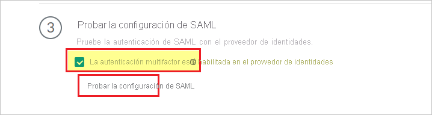
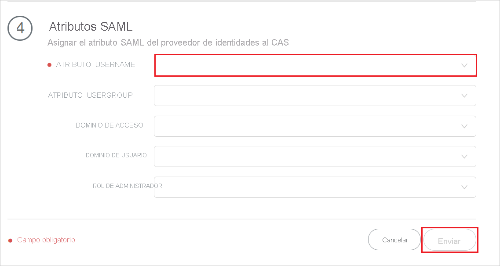

# Tutorial: Integración del inicio de sesión único (SSO) de Azure Active Directory con Palo Alto Networks Cloud Identity Engine - Cloud Authentication Service

En este tutorial, aprenderá a integrar Palo Alto Networks Cloud Identity Engine - Cloud Authentication Service con Azure Active Directory (Azure AD). Al integrar Palo Alto Networks Cloud Identity Engine - Cloud Authentication Service con Azure AD, puede:

* Controlar en Azure AD quién tiene acceso a Palo Alto Networks Cloud Identity Engine - Cloud Authentication Service.
* Permitir que los usuarios inicien sesión automáticamente en Palo Alto Networks Cloud Identity Engine - Cloud Authentication Service con sus cuentas de Azure AD.
* Administrar las cuentas desde una ubicación central (Azure Portal).

## Requisitos previos

Para empezar, necesita los siguientes elementos:

* Una suscripción de Azure AD. Si no tiene una suscripción, puede crear una [cuenta gratuita](https://azure.microsoft.com/free/).
* Suscripción con inicio de sesión único (SSO) en Palo Alto Networks Cloud Identity Engine - Cloud Authentication Service.

## Descripción del escenario

En este tutorial, va a configurar y probar el inicio de sesión único de Azure AD en un entorno de prueba.

* Palo Alto Networks Cloud Identity Engine - Cloud Authentication Service admite SSO iniciado con **SP**.

* Palo Alto Networks Cloud Identity Engine - Cloud Authentication Service admite aprovisionamiento de usuarios **Just-In-time**.

## Incorporación de Palo Alto Networks Cloud Identity Engine - Cloud Authentication Service desde la galería

Para configurar la integración de Palo Alto Networks Cloud Identity Engine - Cloud Authentication Service en Azure AD, debe añadir Palo Alto Networks Cloud Identity Engine - Cloud Authentication Service desde la galería a su lista de aplicaciones SaaS administradas.

1. Inicie sesión en Azure Portal con una cuenta personal, profesional o educativa de Microsoft.
1. En el panel de navegación de la izquierda, seleccione el servicio **Azure Active Directory**.
1. Vaya a **Aplicaciones empresariales** y seleccione **Todas las aplicaciones**.
1. Para agregar una nueva aplicación, seleccione **Nueva aplicación**.
1. En la sección **Agregar desde la galería**, escriba **Palo Alto Networks Cloud Identity Engine - Cloud Authentication Service** en el cuadro de búsqueda.
1. Seleccione **Palo Alto Networks Cloud Identity Engine - Cloud Authentication Service** en el panel de resultados y agregue la aplicación. Espere unos segundos mientras la aplicación se agrega al inquilino.

## Configuración y prueba del inicio de sesión único de Azure AD para Palo Alto Networks Cloud Identity Engine - Cloud Authentication Service

Configure y pruebe el inicio de sesión único de Azure AD con Palo Alto Networks Cloud Identity Engine - Cloud Authentication Service con un usuario de prueba llamado **B.Simon**. Para que el inicio de sesión único funcione, es necesario establecer una relación de vinculación entre un usuario de Azure AD y el usuario relacionado de Palo Alto Networks Cloud Identity Engine - Cloud Authentication Service.

Para configurar y probar el inicio de sesión único de Azure AD con Palo Alto Networks Cloud Identity Engine - Cloud Authentication Service, siga estos pasos:

1. **[Configuración del inicio de sesión único de Azure AD](#configure-azure-ad-sso)** , para permitir que los usuarios puedan utilizar esta característica.
    1. **[Creación de un usuario de prueba de Azure AD](#create-an-azure-ad-test-user)** , para probar el inicio de sesión único de Azure AD con B.Simon.
    1. **[Asignación del usuario de prueba de Azure AD](#assign-the-azure-ad-test-user)** , para habilitar a B.Simon para que use el inicio de sesión único de Azure AD.
1. **[Configure el inicio de sesión único de Palo Alto Networks Cloud Identity Engine - Cloud Authentication Service](#configure-palo-alto-networks-cloud-identity-engine---cloud-authentication-service-sso)** , para configurar los valores de inicio de sesión único en la aplicación.
    1. **[Cree un usuario de prueba de Palo Alto Networks Cloud Identity Engine - Cloud Authentication Service](#create-palo-alto-networks-cloud-identity-engine---cloud-authentication-service-test-user)** , para tener un homólogo de B.Simon en Palo Alto Networks Cloud Identity Engine - Cloud Authentication Service que esté vinculado a la representación Azure AD del usuario.
1. **[Prueba del inicio de sesión único](#test-sso)** : para comprobar si la configuración funciona.

## Configuración del inicio de sesión único de Azure AD

Siga estos pasos para habilitar el inicio de sesión único de Azure AD en Azure Portal.

1. En Azure Portal, en la página de integración de aplicaciones de **Palo Alto Networks Cloud Identity Engine - Cloud Authentication Service**, busque la sección **Administrar** y seleccione **Inicio de sesión único**.
1. En la página **Seleccione un método de inicio de sesión único**, elija **SAML**.
1. En la página **Configuración del inicio de sesión único con SAML**, haga clic en el icono de lápiz de **Configuración básica de SAML** para editar la configuración.

   

1. En la sección **Configuración básica de SAML**, si tiene el **archivo de metadatos del proveedor de servicios**, lleve a cabo los siguientes pasos:

    a. Haga clic en **Cargar el archivo de metadatos**.

    

    b. Haga clic en el **logotipo de la carpeta** para seleccionar el archivo de metadatos y luego en **Cargar**.

    

    c. Una vez que se haya cargado correctamente el archivo de metadatos, el valor de **Identificador** se rellena automáticamente en la sección Configuración básica de SAML.

    d. En el cuadro de texto **URL de inicio de sesión**, escriba una dirección URL con el siguiente patrón: `https://<RegionUrl>.paloaltonetworks.com/sp/acs`

    > [!Note]
    > Si el valor **Identificador** no se rellena automáticamente, hágalo manualmente según sus requisitos. El valor de la dirección URL de inicio de sesión no es real. Actualícelo con la dirección URL de inicio de sesión real. Póngase en contacto con el [equipo de soporte técnico de Palo Alto Networks Cloud Identity Engine - Cloud Authentication Service](mailto:support@paloaltonetworks.com) para obtener este valor. También puede hacer referencia a los patrones que se muestran en la sección **Configuración básica de SAML** de Azure Portal.

1. La aplicación Palo Alto Networks Cloud Identity Engine - Cloud Authentication Service espera que las aserciones de SAML estén en un formato específico, lo cual requiere que se agreguen asignaciones de atributos personalizados a la configuración de los atributos del token de SAML. La siguiente captura de muestra la lista de atributos predeterminados.

    

1. Además de lo anterior, la aplicación Palo Alto Networks Cloud Identity Engine - Cloud Authentication Service espera que se devuelvan algunos atributos más, que se muestran a continuación, en la respuesta de SAML. Estos atributos también se rellenan previamente, pero puede revisarlos según sus requisitos.
    
    | Nombre | Atributo de origen|
    | ---------------| --------- |
    | Grupo |  user.groups |
    | username | user.userprincipalname |

1. En la página **Configurar el inicio de sesión único con SAML**, en la sección **Certificado de firma de SAML**, haga clic en el botón de copia para copiar la **Dirección URL de metadatos de federación de aplicación** y guárdela en su equipo.

    

### Creación de un usuario de prueba de Azure AD

En esta sección, va a crear un usuario de prueba llamado B.Simon en Azure Portal.

1. En el panel izquierdo de Azure Portal, seleccione **Azure Active Directory**, **Usuarios** y **Todos los usuarios**.
1. Seleccione **Nuevo usuario** en la parte superior de la pantalla.
1. En las propiedades del **usuario**, siga estos pasos:
   1. En el campo **Nombre**, escriba `B.Simon`.  
   1. En el campo **Nombre de usuario**, escriba username@companydomain.extension. Por ejemplo, `B.Simon@contoso.com`.
   1. Active la casilla **Show password** (Mostrar contraseña) y, después, anote el valor que se muestra en el cuadro **Contraseña**.
   1. Haga clic en **Crear**.

### Asignación del usuario de prueba de Azure AD

En esta sección, habilitará a B.Simon para usar el inicio de sesión único de Azure al concederle acceso a Palo Alto Networks Cloud Identity Engine - Cloud Authentication Service.

1. En Azure Portal, seleccione sucesivamente **Aplicaciones empresariales** y **Todas las aplicaciones**.
1. En la lista de aplicaciones, seleccione **Palo Alto Networks Cloud Identity Engine - Cloud Authentication Service**.
1. En la página de información general de la aplicación, busque la sección **Administrar** y seleccione **Usuarios y grupos**.
1. Seleccione **Agregar usuario**. A continuación, en el cuadro de diálogo **Agregar asignación**, seleccione **Usuarios y grupos**.
1. En el cuadro de diálogo **Usuarios y grupos**, seleccione **B.Simon** de la lista de usuarios y haga clic en el botón **Seleccionar** de la parte inferior de la pantalla.
1. Si espera que se asigne un rol a los usuarios, puede seleccionarlo en la lista desplegable **Seleccionar un rol**. Si no se ha configurado ningún rol para esta aplicación, verá seleccionado el rol "Acceso predeterminado".
1. En el cuadro de diálogo **Agregar asignación**, haga clic en el botón **Asignar**.

## Configuración del inicio de sesión único de Palo Alto Networks Cloud Identity Engine - Cloud Authentication Service

1. Inicie sesión en el sitio de la compañía Palo Alto Networks Cloud Identity Engine - Cloud Authentication Service como administrador.

1. Vaya a **Autenticación** > **Proveedores de identidades** y haga clic en **Agregar proveedor de identidades**.

     

1. En la página **Configurar autenticación SAML**, siga estos pasos.

     

    a. En el paso 1, haga clic en **Descargar metadatos SP** para descargar el archivo de metadatos y guárdelo en el equipo.

    b. En el paso 2, rellene los campos obligatorios para **configurar el perfil del proveedor de identidades** que ha copiado del Azure Portal. 

    c. En el paso 3, haga clic en **Probar configuración de SAML** para comprobar la configuración del perfil y seleccione **MFA está habilitado en el IDP**.

    

    > [!NOTE]
    > Para probar el inicio de sesión único de **Palo Alto Networks Cloud Identity Engine - Cloud Authentication Service,** abra la consola de **Palo Alto Networks Cloud Identity Engine - Cloud Authentication Service**, haga clic en el botón **Probar conexión** y autentíquese con la cuenta de prueba que ha creado en la sección **Creación de un usuario de prueba de Azure AD**. 

    d. En el paso 4, escriba el **ATRIBUTO DE NOMBRE DE USUARIO** y haga clic en **Enviar**. 

    

### Creación de un usuario de prueba de Palo Alto Networks Cloud Identity Engine - Cloud Authentication Service

En esta sección, se crea un usuario llamado Britta Simon en **Palo Alto Networks Cloud Identity Engine - Cloud Authentication Service**. **Palo Alto Networks Cloud Identity Engine - Cloud Authentication Service** admite aprovisionamiento de usuarios just-in-time, que está habilitado de forma predeterminada. No hay ningún elemento de acción para usted en esta sección. Si un usuario no existe aún en **Palo Alto Networks Cloud Identity Engine - Cloud Authentication Service**, se crea después de la autenticación.

## Prueba de SSO 

Para probar el inicio de sesión único de **Palo Alto Networks Cloud Identity Engine - Cloud Authentication Service,** abra la consola de **Palo Alto Networks Cloud Identity Engine - Cloud Authentication Service**, haga clic en el botón **Probar conexión** y autentíquese con la cuenta de prueba que ha creado en la sección **Creación de un usuario de prueba de Azure AD**.

## Pasos siguientes

Una vez configurado **Palo Alto Networks Cloud Identity Engine - Cloud Authentication Service**, puede aplicar el control de sesión, que protege la filtración y la infiltración de la información confidencial de la organización en tiempo real. El control de sesión procede del acceso condicional. [Aprenda a aplicar el control de sesión con Microsoft Cloud App Security](/cloud-app-security/proxy-deployment-aad).
