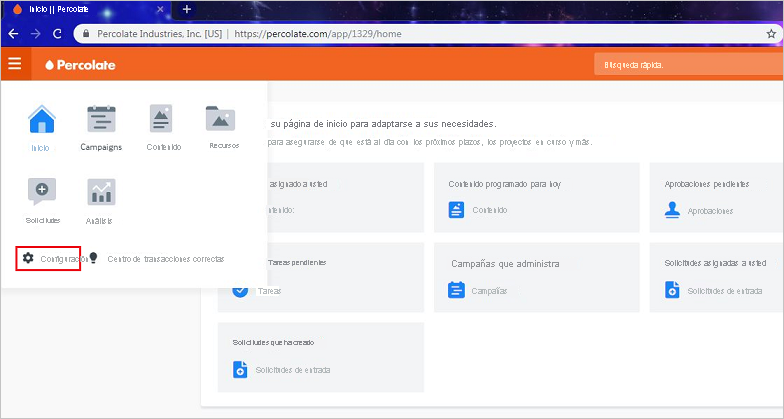

# Tutorial: integración del inicio de sesión único de Azure AD con Percolate

En este tutorial, aprenderá a integrar Percolate con Azure Active Directory (Azure AD). Al integrar Percolate con Azure AD, puede hacer lo siguiente:

* Controlar en Azure AD quién tiene acceso a Percolate.
* Permitir que los usuarios puedan iniciar sesión automáticamente en Percolate con sus cuentas de Azure AD.
* Administrar las cuentas desde una ubicación central (Azure Portal).

## Prerrequisitos

Para configurar la integración de Azure AD con Percolate, necesita los siguientes elementos:

* Una suscripción de Azure AD. Si no dispone de un entorno de Azure AD, puede obtener [una cuenta gratuita](https://azure.microsoft.com/free/).
* Una suscripción de Percolate que tenga habilitado el inicio de sesión único.

## Descripción del escenario

En este tutorial configurará y probará el inicio de sesión único de Azure AD en un entorno de prueba.

* Percolate admite el inicio de sesión único iniciado por SP e IDP.

## Adición de Percolate desde la galería

Para configurar la integración de Percolate en Azure AD, es preciso que agregue Percolate desde la galería a su lista de aplicaciones SaaS administradas.

1. Inicie sesión en Azure Portal con una cuenta personal, profesional o educativa de Microsoft.
1. En el panel de navegación de la izquierda, seleccione el servicio **Azure Active Directory**.
1. Vaya a **Aplicaciones empresariales** y seleccione **Todas las aplicaciones**.
1. Para agregar una nueva aplicación, seleccione **Nueva aplicación**.
1. En la sección **Agregar desde la galería**, escriba **Percolate** en el cuadro de búsqueda.
1. Seleccione **Percolate** en el panel de resultados y agregue la aplicación. Espere unos segundos mientras la aplicación se agrega al inquilino.

## Configuración y prueba del inicio de sesión único de Azure AD para Percolate

Configure y pruebe el inicio de sesión único de Azure AD con Percolate mediante un usuario de prueba llamado **B.Simon**. Para que el inicio de sesión único funcione, es preciso establecer una relación de vinculación entre un usuario de Azure AD y el usuario relacionado de Percolate.

Para configurar y probar el inicio de sesión único de Azure AD con Percolate, lleve a cabo los siguientes pasos:

1. **[Configuración del inicio de sesión único de Azure AD](#configure-azure-ad-sso)** , para permitir que los usuarios puedan utilizar esta característica.
    1. **[Creación de un usuario de prueba de Azure AD](#create-an-azure-ad-test-user)** , para probar el inicio de sesión único de Azure AD con B.Simon.
    1. **[Asignación del usuario de prueba de Azure AD](#assign-the-azure-ad-test-user)** , para habilitar a B.Simon para que use el inicio de sesión único de Azure AD.
1. **[Configuración del inicio de sesión único en Percolate](#configure-percolate-sso)** , para configurar los valores de Inicio de sesión único en la aplicación.
    1. **[Creación de un usuario de prueba de Percolate](#create-percolate-test-user)** : para tener un homólogo de B.Simon en Percolate que esté vinculado a su representación en Azure AD.
1. **[Prueba del inicio de sesión único](#test-sso)** : para comprobar si la configuración funciona.

## Configuración del inicio de sesión único de Azure AD

Siga estos pasos para habilitar el inicio de sesión único de Azure AD en Azure Portal.

1. En Azure Portal, en la página de integración de la aplicación **Percolate**, busque la sección **Administrar** y seleccione **Inicio de sesión único**.
1. En la página **Seleccione un método de inicio de sesión único**, elija **SAML**.
1. En la página **Configuración del inicio de sesión único con SAML**, haga clic en el icono de lápiz de **Configuración básica de SAML** para editar la configuración.

   

4. En el cuadro de diálogo **Configuración básica de SAML**, no es necesario hacer nada para configurar la aplicación en modo iniciado por IdP. La aplicación ya está integrada con Azure.

5. Si quiere configurar la aplicación en modo iniciado por SP, seleccione **Establecer direcciones URL adicionales** y, en el cuadro **URL de inicio de sesión**, escriba **https://percolate.com/app/login** .

6. En la página **Configurar el inicio de sesión único con SAML**, en la sección **Certificado de firma de SAML**, seleccione el icono **Copiar** para copiar la **Dirección URL de metadatos de federación de aplicación**. Guarde esta dirección URL.

    

7. En la sección **Configurar Percolate**, copie las direcciones URL adecuadas según sus necesidades.

    

### Creación de un usuario de prueba de Azure AD

En esta sección, va a crear un usuario de prueba llamado B.Simon en Azure Portal.

1. En el panel izquierdo de Azure Portal, seleccione **Azure Active Directory**, **Usuarios** y **Todos los usuarios**.
1. Seleccione **Nuevo usuario** en la parte superior de la pantalla.
1. En las propiedades del **usuario**, siga estos pasos:
   1. En el campo **Nombre**, escriba `B.Simon`.  
   1. En el campo **Nombre de usuario**, escriba username@companydomain.extension. Por ejemplo, `B.Simon@contoso.com`.
   1. Active la casilla **Show password** (Mostrar contraseña) y, después, anote el valor que se muestra en el cuadro **Contraseña**.
   1. Haga clic en **Crear**.

### Asignación del usuario de prueba de Azure AD

En esta sección, va a permitir que B.Simon acceda a Percolate mediante el inicio de sesión único de Azure.

1. En Azure Portal, seleccione sucesivamente **Aplicaciones empresariales** y **Todas las aplicaciones**.
1. En la lista de aplicaciones, seleccione **Percolate**.
1. En la página de información general de la aplicación, busque la sección **Administrar** y seleccione **Usuarios y grupos**.
1. Seleccione **Agregar usuario**. A continuación, en el cuadro de diálogo **Agregar asignación**, seleccione **Usuarios y grupos**.
1. En el cuadro de diálogo **Usuarios y grupos**, seleccione **B.Simon** de la lista de usuarios y haga clic en el botón **Seleccionar** de la parte inferior de la pantalla.
1. Si espera que se asigne un rol a los usuarios, puede seleccionarlo en la lista desplegable **Seleccionar un rol**. Si no se ha configurado ningún rol para esta aplicación, verá seleccionado el rol "Acceso predeterminado".
1. En el cuadro de diálogo **Agregar asignación**, haga clic en el botón **Asignar**.

## Configuración del inicio de sesión único de Percolate

1. En una nueva ventana del explorador web, inicie sesión en Percolate como administrador.

2. En el lado izquierdo de la página principal, seleccione **Settings** (Configuración):
    
    

3. En el panel izquierdo, seleccione **SSO** en **Organization** (Organización):

    

    1. En el cuadro **Login URL** (URL de inicio de sesión), pegue el valor de la **Dirección URL de inicio de sesión** que copió de Azure Portal.

    1. En el cuadro **Entity ID** (Id. de entidad), pegue el valor de **Identificador de Azure AD** que copió de Azure Portal.

    1. En el Bloc de notas, abra el certificado codificado en base 64 que descargó de Azure Portal. Copie su contenido y péguelo en el cuadro **x509 certificates** (Certificados x509).

    1. En el cuadro **Email attribute** (Atributo de correo electrónico), escriba **emailaddress**.

    1. El cuadro **Identity provider metadata URL** (URL de metadatos del proveedor de identidades) es un campo opcional. Si copió una **dirección URL de metadatos de federación de aplicación** de Azure Portal, puede pegarla en este cuadro.

    1. En la lista **Should AuthNRequests be signed?** (¿Se debe firmar AuthNRequests?), seleccione **No**.

    1. En la lista **Enable SSO auto-provisioning** (Habilitar el aprovisionamiento automático del inicio de sesión único), seleccione **No**.

    1. Seleccione **Guardar**.

### Creación de un usuario de prueba en Percolate

Para permitir que los usuarios de Azure AD inicien sesión en Percolate, deberá agregarlos a esta aplicación. Y los debe agregar manualmente.

Para crear una cuenta de usuario, siga estos pasos:

1. Inicie sesión en Percolate como administrador.

2. En el panel izquierdo, seleccione **Users** (Usuarios) en **Organization** (Organización). Seleccione **New users** (Nuevos usuarios):

    

3. En la página **Create users** (Crear usuarios), siga estos pasos:

    

    1. En el cuadro **Email** (Correo electrónico), escriba la dirección de correo electrónico del usuario. Por ejemplo, brittasimon@contoso.com.

    1. En el cuadro **Full name** (Nombre completo), escriba el nombre del usuario. Por ejemplo, **Brittasimon**.

    1. Seleccione **Create users** (Crear usuarios).

## Prueba de SSO

En esta sección, probará la configuración de inicio de sesión único de Azure AD con las siguientes opciones. 

#### Iniciado por SP:

* Haga clic en **Probar esta aplicación** en Azure Portal. Esto le redirigirá a la dirección URL de inicio de sesión de Percolate, donde puede iniciar el flujo de inicio de sesión.  

* Vaya directamente a la dirección URL de inicio de sesión de Percolate e inicie el flujo de inicio de sesión desde allí.

#### Iniciado por IDP:

* Haga clic en **Probar esta aplicación** en Azure Portal. Se debería iniciar sesión automáticamente en la instancia de Percolate para la que configuró el inicio de sesión único. 

También puede usar Aplicaciones de Microsoft para probar la aplicación en cualquier modo. Al hacer clic en el icono de Percolate en Aplicaciones, si seleccionó el modo SP en la configuración, debería acceder automáticamente a la página de inicio de sesión de la aplicación para comenzar el flujo de inicio de sesión. Por el contrario, si seleccionó el modo IDP en la configuración, debería iniciar sesión automáticamente en la instancia de Percolate en la que configuró el SSO. Para más información acerca de Aplicaciones, consulte [Inicio de sesión e inicio de aplicaciones desde el portal Aplicaciones](../user-help/my-apps-portal-end-user-access.md).

## Pasos siguientes

Una vez que haya configurado Percolate, puede aplicar el control de sesión, que protege a la organización en tiempo real frente a la filtración e infiltración de información confidencial. El control de sesión procede del acceso condicional. [Aprenda a aplicar el control de sesión con Microsoft Cloud App Security](/cloud-app-security/proxy-deployment-aad).