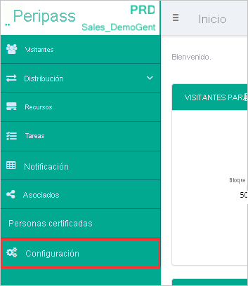
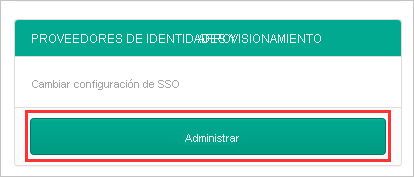
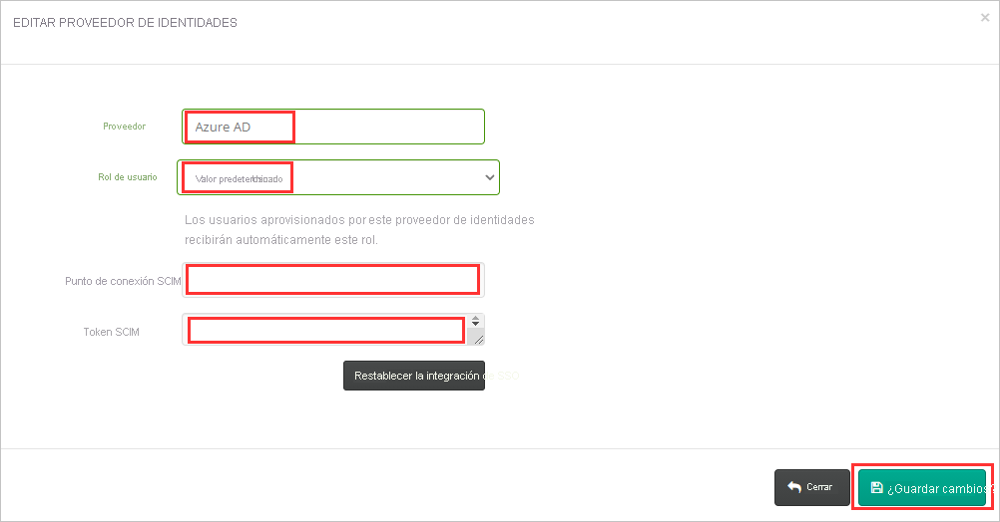
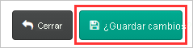

# Tutorial: configuración de Peripass para el aprovisionamiento automático de usuarios

En este tutorial se indican los pasos que se deben realizar en Peripass y Azure Active Directory (Azure AD) para configurar el aprovisionamiento automático de usuarios. Una vez configurado, Azure AD aprovisiona y desaprovisiona automáticamente usuarios y grupos en [Peripass](https://www.peripass.com/) mediante el servicio de aprovisionamiento de Azure AD. Para obtener información importante acerca de lo que hace este servicio, cómo funciona y ver preguntas frecuentes al respecto, consulte [Automatización del aprovisionamiento y desaprovisionamiento de usuarios para aplicaciones SaaS con Azure Active Directory](../app-provisioning/user-provisioning.md).

## Funcionalidades admitidas
> [!div class="checklist"]
> * Creación de usuarios en Peripass
> * Eliminación de usuarios de Peripass cuando ya no necesitan acceso
> * Sincronización de atributos de usuario entre Azure AD y Peripass
> * [Inicio de sesión único](../manage-apps/add-application-portal-setup-oidc-sso.md) en Peripass (recomendado)

## Prerrequisitos

En el escenario descrito en este tutorial se supone que ya cuenta con los requisitos previos siguientes:

* [Un inquilino de Azure AD](../develop/quickstart-create-new-tenant.md) 
* Una cuenta de usuario en Azure AD con [permiso](../roles/permissions-reference.md) para configurar el aprovisionamiento (por ejemplo, Administrador de aplicaciones, Administrador de aplicaciones en la nube, Propietario de la aplicación o Administrador global). 
* Un inquilino de Peripass: póngase en contacto con [Peripass](https://www.peripass.com/) para configurar el inquilino.
* Un usuario de Peripass con permisos en la configuración del inquilino.

## Paso 1. Planeación de la implementación de aprovisionamiento
1. Obtenga información sobre [cómo funciona el servicio de aprovisionamiento](../app-provisioning/user-provisioning.md).
2. Determine quién estará en el [ámbito de aprovisionamiento](../app-provisioning/define-conditional-rules-for-provisioning-user-accounts.md).
3. Determine qué datos [asignar entre Azure AD y Peripass](../app-provisioning/customize-application-attributes.md).

## Paso 2. Configuración de Peripass para admitir el aprovisionamiento con Azure AD

1. Inicie sesión en Peripass con la dirección URL de inicio de sesión del inquilino.

2. Vaya a la **Configuración** del inquilino.

   

3. Abra la opción **Proveedores de identidades y aprovisionamiento**.

   

4. Asigne un **Nombre de proveedor** al proveedor de identidades que está configurando.

5.   Seleccione el **Rol de usuario** que se debe asignar a los usuarios aprovisionados.

6. Anote el **Punto de conexión SCIM** y el **Token SCIM** del inquilino (los va a necesitar más adelante al configurar el aprovisionamiento de usuarios en las aplicaciones de Azure AD Enterprise para usarlos como **URL de inquilino de Peripass** y **Token secreto**).

   

7. **Guarde los cambios** realizados en la configuración.

   

## Paso 3. Incorporación de Peripass desde la galería de aplicaciones de Azure AD

Agregue Peripass desde la galería de aplicaciones de Azure AD para empezar a administrar el aprovisionamiento en Peripass. Si antes ha configurado Peripass para el inicio de sesión único, puede usar la misma aplicación. Sin embargo, se recomienda que cree una aplicación independiente al probar la integración inicialmente. Puede encontrar más información sobre cómo agregar una aplicación desde la galería [aquí](../manage-apps/add-application-portal.md).

## Paso 4. Determinar quién estará en el ámbito de aprovisionamiento

El servicio de aprovisionamiento de Azure AD le permite definir quién se aprovisionará, en función de la asignación a la aplicación y de los atributos del usuario o grupo. Si elige el ámbito del que se aprovisionará en la aplicación en función de la asignación, puede usar los pasos [siguientes](../manage-apps/assign-user-or-group-access-portal.md) para asignar usuarios y grupos a la aplicación. Si elige el ámbito del que se aprovisionará en función únicamente de los atributos del usuario o grupo, puede usar un filtro de ámbito, tal como se describe [aquí](../app-provisioning/define-conditional-rules-for-provisioning-user-accounts.md).

* Al asignar usuarios y grupos a Peripass, debe seleccionar un rol que no sea **Acceso predeterminado**. Los usuarios con el rol de acceso predeterminado se excluyen del aprovisionamiento y se marcarán como no autorizados en los registros de aprovisionamiento. Si el único rol disponible en la aplicación es el rol de acceso predeterminado, puede [actualizar el manifiesto de aplicación](../develop/howto-add-app-roles-in-azure-ad-apps.md) para agregar más roles.

* Empiece por algo pequeño. Pruebe con un pequeño conjunto de usuarios y grupos antes de implementarlo en todos. Cuando el ámbito del aprovisionamiento se define en los usuarios y grupos asignados, puede controlarlo asignando uno o dos usuarios o grupos a la aplicación. Cuando el ámbito se establece en todos los usuarios y grupos, puede especificar un [filtro de ámbito basado en atributos](../app-provisioning/define-conditional-rules-for-provisioning-user-accounts.md).

## Paso 5. Configuración del aprovisionamiento automático de usuarios en Peripass

Esta sección le guía por los pasos necesarios para configurar el servicio de aprovisionamiento de Azure AD a fin de crear, actualizar y deshabilitar usuarios o grupos en TestApp en función de las asignaciones de grupos o usuarios de Azure AD.

### Para configurar el aprovisionamiento automático de usuarios de Peripass en Azure AD:

1. Inicie sesión en [Azure Portal](https://portal.azure.com). Seleccione **Aplicaciones empresariales** y luego **Todas las aplicaciones**.

   

2. En la lista de aplicaciones, seleccione **Peripass**.

   

3. Seleccione la pestaña **Aprovisionamiento**.

   

4. Establezca el **modo de aprovisionamiento** en **Automático**.

   

5. En la sección **Credenciales de administrador**, escriba los valores de URL de inquilino y de token secreto de Peripass. Haga clic en **Probar conexión** para asegurarse de que Azure AD puede conectarse a Peripass. Si la conexión no se establece, asegúrese de que la cuenta de Peripass tiene permisos de administrador y pruebe otra vez.

   

6. En el campo **Correo electrónico de notificación**, escriba la dirección de correo electrónico de una persona o grupo que deba recibir las notificaciones de error de aprovisionamiento y active la casilla **Enviar una notificación por correo electrónico cuando se produzca un error**.

   

7. Seleccione **Guardar**.

8. En la sección **Asignaciones**, seleccione **Synchronize Azure Active Directory Users to Peripass** (Sincronizar usuarios de Azure Active Directory con Peripass).

9. Examine los atributos de grupo que se sincronizan entre Azure AD y Peripass en la sección **Asignación de atributos**. Los atributos seleccionados como propiedades de **Coincidencia** se usan para emparejar las cuentas de usuario de Peripass para las operaciones de actualización. Si decide cambiar el [atributo de destino coincidente](../app-provisioning/customize-application-attributes.md), debe asegurarse de que la API de Peripass admite el filtrado de usuarios basado en ese atributo. Seleccione el botón **Guardar** para confirmar los cambios.

   |Atributo|Tipo|Compatible con el filtrado|
   |---|---|---|
   |userName|String|&check;
   |active|Boolean|
   |DisplayName|String|
   |externalId|String|
   |preferredLanguage|String|
   |name.givenName|String|
   |name.familyName|String|
   |name.formatted|String|
   |phoneNumbers[type eq "mobile"].value|String|
   |emails[type eq "work"].value|String|
   
10. Para configurar filtros de ámbito, consulte las siguientes instrucciones, que se proporcionan en el artículo [Aprovisionamiento de aplicaciones basado en atributos con filtros de ámbito](../app-provisioning/define-conditional-rules-for-provisioning-user-accounts.md).

11. Para habilitar el servicio de aprovisionamiento de Azure AD para Peripass, cambie **Estado de aprovisionamiento** a **Activado** en la sección **Configuración**.

    

12. Defina los usuarios o grupos que quiere aprovisionar en Peripass; para ello, seleccione los valores deseados en **Ámbito**, en la sección **Configuración**.

    

13. Cuando esté listo para realizar el aprovisionamiento, haga clic en **Guardar**.

    

Esta operación inicia el ciclo de sincronización inicial de todos los usuarios y grupos definidos en **Ámbito** en la sección **Configuración**. El ciclo de sincronización inicial tarda más tiempo en realizarse que los ciclos posteriores, que se producen aproximadamente cada 40 minutos si el servicio de aprovisionamiento de Azure AD está ejecutándose.

## Paso 6. Supervisión de la implementación
Una vez configurado el aprovisionamiento, use los recursos siguientes para supervisar la implementación:

1. Use los [registros de aprovisionamiento](../reports-monitoring/concept-provisioning-logs.md) para determinar qué usuarios se han aprovisionado correctamente o sin éxito.
2. Consulte la [barra de progreso](../app-provisioning/application-provisioning-when-will-provisioning-finish-specific-user.md) para ver el estado del ciclo de aprovisionamiento y cuánto falta para que finalice.
3. Si la configuración de aprovisionamiento parece estar en mal estado, la aplicación pasará a estar en cuarentena. Más información sobre los estados de cuarentena [aquí](../app-provisioning/application-provisioning-quarantine-status.md).

## Más recursos

* [Administración del aprovisionamiento de cuentas de usuario para aplicaciones empresariales](../app-provisioning/configure-automatic-user-provisioning-portal.md)
* [¿Qué es el acceso a aplicaciones y el inicio de sesión único con Azure Active Directory?](../manage-apps/what-is-single-sign-on.md)

## Pasos siguientes

* [Aprenda a revisar los registros y a obtener informes sobre la actividad de aprovisionamiento](../app-provisioning/check-status-user-account-provisioning.md)
