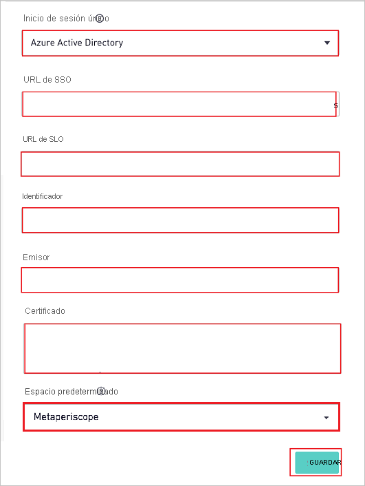
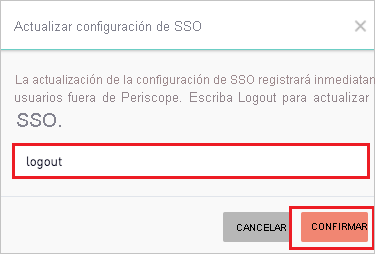
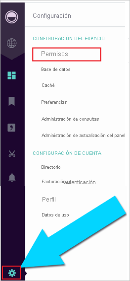

# Tutorial: Integración del inicio de sesión único de Azure AD con Periscope Data

En este tutorial aprenderá a integrar Periscope Data con Azure Active Directory (Azure AD). Al integrar Periscope Data con Azure AD, puede hacer lo siguiente:

* Controlar en Azure AD quién tiene acceso a Periscope Data.
* Permitir que los usuarios inicien sesión automáticamente en Periscope Data con sus cuentas de Azure AD.
* Administrar las cuentas desde una ubicación central (Azure Portal).

## Requisitos previos

Para empezar, necesita los siguientes elementos:

* Una suscripción de Azure AD. Si no tiene una suscripción, puede crear una [cuenta gratuita](https://azure.microsoft.com/free/).
* Suscripción habilitada para el inicio de sesión único en Periscope Data.

## Descripción del escenario

En este tutorial, puede configurar y probar el inicio de sesión único de Azure AD en un entorno de prueba.

* Periscope Data admite el inicio de sesión único iniciado por **SP**.

## Adición de Periscope Data desde la galería

Para configurar la integración de Periscope Data en Azure AD, deberá agregar la aplicación de la galería a la lista de aplicaciones SaaS administradas.

1. Inicie sesión en Azure Portal con una cuenta personal, profesional o educativa de Microsoft.
1. En el panel de navegación de la izquierda, seleccione el servicio **Azure Active Directory**.
1. Vaya a **Aplicaciones empresariales** y seleccione **Todas las aplicaciones**.
1. Para agregar una nueva aplicación, seleccione **Nueva aplicación**.
1. En la sección **Agregar desde la galería**, escriba **Periscope Data** en el cuadro de búsqueda.
1. Seleccione **Periscope Data** en el panel de resultados y agregue la aplicación. Espere unos segundos mientras la aplicación se agrega al inquilino.

## Configuración y prueba del inicio de sesión único de Azure AD para Periscope Data

Configure y pruebe el inicio de sesión único de Azure AD con Periscope Data mediante un usuario de prueba llamado **B.Simon**. Para que el inicio de sesión único funcione, es preciso establecer una relación de vinculación entre un usuario de Azure AD y el usuario relacionado de Periscope Data.

Para configurar y probar el inicio de sesión único de Azure AD con Periscope Data, lleve a cabo los siguientes pasos:

1. **[Configuración del inicio de sesión único de Azure AD](#configure-azure-ad-sso)** , para permitir que los usuarios puedan utilizar esta característica.
    1. **[Creación de un usuario de prueba de Azure AD](#create-an-azure-ad-test-user)**, para probar el inicio de sesión único de Azure AD con B.Simon.
    1. **[Asignación del usuario de prueba de Azure AD](#assign-the-azure-ad-test-user)** , para habilitar a B.Simon para que use el inicio de sesión único de Azure AD.
1. **[Configuración del inicio de sesión único en Periscope Data](#configure-periscope-data-sso)** : para configurar los valores de inicio de sesión único en la aplicación.
    1. **[Creación del usuario de prueba de Periscope Data](#create-periscope-data-test-user)** : para tener un homólogo de B.Simon en Periscope Data vinculado a la representación del usuario en Azure AD.
1. **[Prueba del inicio de sesión único](#test-sso)** : para comprobar si la configuración funciona.

## Configuración del inicio de sesión único de Azure AD

Siga estos pasos para habilitar el inicio de sesión único de Azure AD en Azure Portal.

1. En Azure Portal, en la página de integración de aplicaciones de **Periscope Data**, busque la sección **Administrar** y seleccione **Inicio de sesión único**.
1. En la página **Seleccione un método de inicio de sesión único**, elija **SAML**.
1. En la página **Configuración del inicio de sesión único con SAML**, haga clic en el icono de lápiz de **Configuración básica de SAML** para editar la configuración.

   

4. En la sección **Configuración básica de SAML**, siga estos pasos:

    a. En el cuadro de texto **Identificador (id. de entidad)** , escriba una dirección URL con el siguiente patrón: `https://app.periscopedata.com/<SITENAME>/sso`

    b. En el cuadro de texto **URL de inicio de sesión**, escriba una dirección URL con el siguiente patrón:
    
    | **Dirección URL de inicio de sesión** |
    |--------|
    | `https://app.periscopedata.com/` |
    | `https://app.periscopedata.com/app/<SITENAME>` |

    > [!NOTE]
    > El valor de la dirección URL de inicio de sesión no es real. Actualice estos valores con la dirección URL de inicio de sesión real. Póngase en contacto con el [equipo de soporte técnico para clientes de Periscope Data](mailto:support@periscopedata.com) para obtener este valor y el valor del identificador, cuya explicación se muestra en la sección **Configuración del inicio de sesión único en Periscope Data** más adelante en el tutorial. También puede hacer referencia a los patrones que se muestran en la sección **Configuración básica de SAML** de Azure Portal.

5. En la página **Configurar el inicio de sesión único con SAML**, en la sección **Certificado de firma de SAML**, haga clic en el botón de copia para copiar **Dirección URL de metadatos de federación de aplicación** y guárdela en su equipo.

    

### Creación de un usuario de prueba de Azure AD 

En esta sección, va a crear un usuario de prueba llamado B.Simon en Azure Portal.

1. En el panel izquierdo de Azure Portal, seleccione **Azure Active Directory**, **Usuarios** y **Todos los usuarios**.
1. Seleccione **Nuevo usuario** en la parte superior de la pantalla.
1. En las propiedades del **usuario**, siga estos pasos:
   1. En el campo **Nombre**, escriba `B.Simon`.  
   1. En el campo **Nombre de usuario**, escriba username@companydomain.extension. Por ejemplo, `B.Simon@contoso.com`.
   1. Active la casilla **Show password** (Mostrar contraseña) y, después, anote el valor que se muestra en el cuadro **Contraseña**.
   1. Haga clic en **Crear**.

### Asignación del usuario de prueba de Azure AD

En esta sección, va a conceder a B.Simon acceso a Periscope Data mediante el inicio de sesión único de Azure.

1. En Azure Portal, seleccione sucesivamente **Aplicaciones empresariales** y **Todas las aplicaciones**.
1. En la lista de aplicaciones, seleccione **Periscope Data**.
1. En la página de información general de la aplicación, busque la sección **Administrar** y seleccione **Usuarios y grupos**.
1. Seleccione **Agregar usuario**. A continuación, en el cuadro de diálogo **Agregar asignación**, seleccione **Usuarios y grupos**.
1. En el cuadro de diálogo **Usuarios y grupos**, seleccione **B.Simon** de la lista de usuarios y haga clic en el botón **Seleccionar** de la parte inferior de la pantalla.
1. Si espera que se asigne un rol a los usuarios, puede seleccionarlo en la lista desplegable **Seleccionar un rol**. Si no se ha configurado ningún rol para esta aplicación, verá seleccionado el rol "Acceso predeterminado".
1. En el cuadro de diálogo **Agregar asignación**, haga clic en el botón **Asignar**.

## Configuración del inicio de sesión único de Periscope Data

1. En otra ventana del explorador web, inicie sesión en Periscope Data como administrador.

2. Abra el menú de engranaje de la parte inferior izquierda, abra el menú **Billing** > **Security** (Facturación > Seguridad) y realice los siguientes pasos. Solo los administradores tienen acceso a esta configuración.

    

    a. Copie el valor de **Dirección URL de metadatos de federación de aplicación** del paso 5 de **Certificado de firma de SAML** y ábrala en un explorador. Se abrirá un documento XML.

    b. En el cuadro de texto **Inicio de sesión único**, seleccione **Azure Active Directory**.

    c. Busque la etiqueta **SingleSignOnService** y pegue el valor de **Location** (Ubicación) en el cuadro de texto **SSO URL** (URL de SSO).

    d. Busque la etiqueta **SingleLogoutService** y pegue el valor de **Location** (Ubicación) en el cuadro de texto **SLO URL** (URL de SLO).

    e. Copie el valor de **Identificador** de su instancia y péguelo en el cuadro de texto **Identificador (id. de entidad)** de la sección **Configuración básica de SAML** de Azure Portal.

    f. Busque la primera etiqueta del archivo XML, copie el valor de **entityID** y péguelo en el cuadro de texto **Issuer** (Emisor).

    g. Busque la etiqueta **IDPSSODescriptor** con el protocolo SAML. Dentro de esa sección, busque la etiqueta **KeyDescriptor** con **use=signing**. Copie el valor de **X509Certificate** y péguelo en el cuadro de texto **Certificado**.

    h. Los sitios con varios espacios pueden elegir el espacio predeterminado en la lista desplegable **Default Space** (Espacio predeterminado). Este será el espacio al que se agregarán nuevos usuarios cuando inicien sesión en Periscope Data por primera vez; estos se aprovisionarán mediante el inicio de sesión único de Active Directory.

    i. Por último, escriba **Logout** y haga clic en **Guardar** y **Confirmar** para guardar y confirmar la configuración de inicio de sesión único.

    

### Creación del usuario de prueba en Periscope Data

Para permitir que los usuarios de Azure AD inicien sesión en Periscope Data, deben aprovisionarse en Periscope Data. En Periscope Data, el aprovisionamiento es una tarea manual.

**Para aprovisionar una cuenta de usuario, realice estos pasos:**

1. Inicie sesión en Periscope Data como administrador.

2. Haga clic en el icono **Settings** (Configuración) de la parte inferior izquierda del menú y vaya a **Permissions** (Permisos).

    

3. Haga clic en **ADD USER** (AGREGAR USUARIO) y realice los siguientes pasos:

      

    a. En el cuadro de texto **First Name** (Nombre), escriba el nombre de usuario, en este caso **Britta**.

    b. En el cuadro de texto **Last Name** (Apellidos), escriba el nombre de usuario, en este caso **Simon**.

    c. En el cuadro de texto **Email** (Correo electrónico), escriba el correo electrónico del usuario; por ejemplo, **brittasimon\@contoso.com**.

    d. Haga clic en **ADD** (AGREGAR).

## Prueba de SSO 

En esta sección, probará la configuración de inicio de sesión único de Azure AD con las siguientes opciones. 

* Haga clic en **Probar esta aplicación** en Azure Portal. Esta acción le redirigirá a la dirección URL de inicio de sesión de Periscope Data, donde puede comenzar el flujo de inicio de sesión. 

* Acceda directamente a la URL de inicio de sesión de Periscope Data y comience desde allí el flujo de inicio de sesión.

* Puede usar Mis aplicaciones de Microsoft. Al hacer clic en el icono de Periscope Data en Aplicaciones, se le redirigirá a la dirección URL de inicio de sesión de esta aplicación. Para más información acerca de Aplicaciones, consulte [Inicio de sesión e inicio de aplicaciones desde el portal Aplicaciones](../user-help/my-apps-portal-end-user-access.md).

## Pasos siguientes

Una vez que haya configurado Periscope Data, puede aplicar el control de sesión, que protege a la organización en tiempo real frente a la filtración e infiltración de información confidencial. El control de sesión procede del acceso condicional. [Aprenda a aplicar el control de sesión con Microsoft Defender para aplicaciones en la nube](/cloud-app-security/proxy-deployment-aad).
