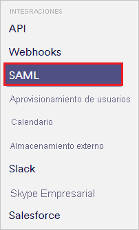
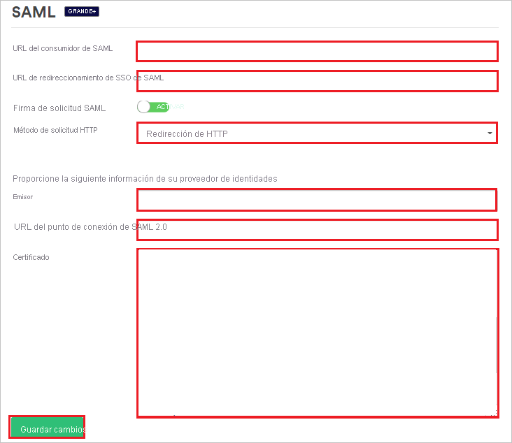
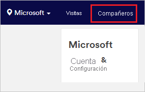
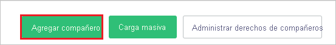
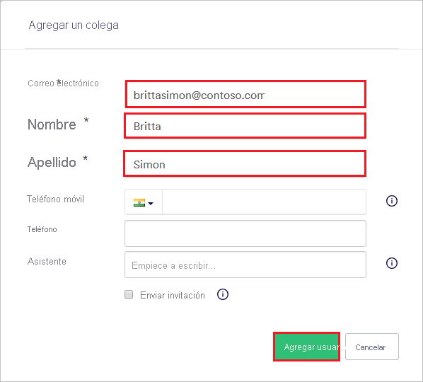

# Tutorial: Integración de Azure Active Directory con Proxyclick

En este tutorial aprenderá a integrar Proxyclick con Azure Active Directory (Azure AD). Al integrar Proxyclick con Azure AD, puede hacer lo siguiente:

* Controlar en Azure AD quién tiene acceso a Proxyclick.
* Permitir que los usuarios inicien sesión automáticamente en Proxyclick con sus cuentas de Azure AD.
* Administrar las cuentas desde una ubicación central (Azure Portal).

## Requisitos previos

Para empezar, necesita los siguientes elementos:

* Una suscripción de Azure AD. Si no tiene una suscripción, puede crear una [cuenta gratuita](https://azure.microsoft.com/free/).
* Una suscripción habilitada para el inicio de sesión único (SSO) en Proxyclick.

## Descripción del escenario

En este tutorial configurará y probará el inicio de sesión único de Azure AD en un entorno de prueba.

* Proxyclick admite el inicio de sesión único iniciado por SP e IDP.

* Proxyclick admite el [aprovisionamiento automático de usuarios](proxyclick-provisioning-tutorial.md).

## Incorporación de Proxyclick desde la galería

Para configurar la integración de Proxyclick en Azure AD, es preciso agregar Proxyclick desde la galería a la lista de aplicaciones SaaS administradas.

1. Inicie sesión en Azure Portal con una cuenta personal, profesional o educativa de Microsoft.
1. En el panel de navegación de la izquierda, seleccione el servicio **Azure Active Directory**.
1. Vaya a **Aplicaciones empresariales** y seleccione **Todas las aplicaciones**.
1. Para agregar una nueva aplicación, seleccione **Nueva aplicación**.
1. En la sección **Agregar desde la galería**, escriba **Proxyclick** en el cuadro de búsqueda.
1. Seleccione **Proxyclick** en el panel de resultados y, a continuación, agregue la aplicación. Espere unos segundos mientras la aplicación se agrega al inquilino.

## Configuración y prueba del inicio de sesión único de Azure AD para Proxyclick

Configure y pruebe el inicio de sesión único de Azure AD con Proxyclick mediante un usuario de prueba llamado **B.Simon**. Para que el inicio de sesión único funcione, es preciso establecer una relación de vinculación entre un usuario de Azure AD y el usuario relacionado de Proxyclick.

Para configurar y probar el inicio de sesión único de Azure AD con Proxyclick, complete los siguientes pasos:

1. **[Configuración del inicio de sesión único de Azure AD](#configure-azure-ad-sso)** , para permitir que los usuarios puedan utilizar esta característica.
    1. **[Creación de un usuario de prueba de Azure AD](#create-an-azure-ad-test-user)** , para probar el inicio de sesión único de Azure AD con B.Simon.
    1. **[Asignación del usuario de prueba de Azure AD](#assign-the-azure-ad-test-user)** , para habilitar a B.Simon para que use el inicio de sesión único de Azure AD.
1. **[Configuración del inicio de sesión único en Proxyclick](#configure-proxyclick-sso)** : para configurar los valores de inicio de sesión único en la aplicación.
    1. **[Creación de un usuario de prueba de Proxyclick](#create-proxyclick-test-user)** : para tener un homólogo de B.Simon en Proxyclick que esté vinculado a la representación del usuario en Azure AD.
1. **[Prueba del inicio de sesión único](#test-sso)** : para comprobar si la configuración funciona.

## Configuración del inicio de sesión único de Azure AD

Siga estos pasos para habilitar el inicio de sesión único de Azure AD en Azure Portal.

1. En Azure Portal, en la página de integración de la aplicación **Proxyclick**, busque la sección **Administrar** y seleccione **Inicio de sesión único**.
1. En la página **Seleccione un método de inicio de sesión único**, elija **SAML**.
1. En la página **Configuración del inicio de sesión único con SAML**, haga clic en el icono de lápiz de **Configuración básica de SAML** para editar la configuración.

   

4. En el cuadro de diálogo **Configuración básica de SAML**, si desea configurar la aplicación en modo iniciado por IdP, realice estos pasos.
    
    a. En el cuadro de texto **Identificador**, escriba una dirección URL con el siguiente patrón: `https://saml.proxyclick.com/init/<COMPANY_ID>`

    b. En el cuadro de texto **URL de respuesta**, escriba una dirección URL con el siguiente patrón: `https://saml.proxyclick.com/consume/<COMPANY_ID>`

5. Seleccione **Establecer direcciones URL adicionales** si desea configurar la aplicación en el modo iniciado por SP. En el cuadro de texto **URL de inicio de sesión**, escriba la dirección URL con el siguiente patrón:
   
   `https://saml.proxyclick.com/init/<COMPANY_ID>`

    > [!NOTE]
    > Estos valores son marcadores de posición. Debe usar los valores reales de identificador, dirección URL de respuesta y dirección URL de inicio de sesión. Los pasos para obtener estos valores se describen más adelante.

6. En la página **Configurar el inicio de sesión único con SAML**, en la sección **Certificado de firma de SAML**, seleccione el vínculo **Descargar** situado junto a **Certificado (Base64)** , según sus requisitos, y guarde el certificado en el equipo:

    

7. En la sección **Set up Proxyclick** (Configurar Proxyclick), copie las direcciones URL adecuadas en función de sus requisitos:

    

### Creación de un usuario de prueba de Azure AD

En esta sección, va a crear un usuario de prueba llamado B.Simon en Azure Portal.

1. En el panel izquierdo de Azure Portal, seleccione **Azure Active Directory**, **Usuarios** y **Todos los usuarios**.
1. Seleccione **Nuevo usuario** en la parte superior de la pantalla.
1. En las propiedades del **usuario**, siga estos pasos:
   1. En el campo **Nombre**, escriba `B.Simon`.  
   1. En el campo **Nombre de usuario**, escriba username@companydomain.extension. Por ejemplo, `B.Simon@contoso.com`.
   1. Active la casilla **Show password** (Mostrar contraseña) y, después, anote el valor que se muestra en el cuadro **Contraseña**.
   1. Haga clic en **Crear**.

### Asignación del usuario de prueba de Azure AD

En esta sección, va a permitir que B.Simon acceda a Proxyclick mediante el inicio de sesión único de Azure.

1. En Azure Portal, seleccione sucesivamente **Aplicaciones empresariales** y **Todas las aplicaciones**.
1. En la lista de aplicaciones, seleccione **Proxyclick**.
1. En la página de información general de la aplicación, busque la sección **Administrar** y seleccione **Usuarios y grupos**.
1. Seleccione **Agregar usuario**. A continuación, en el cuadro de diálogo **Agregar asignación**, seleccione **Usuarios y grupos**.
1. En el cuadro de diálogo **Usuarios y grupos**, seleccione **B.Simon** de la lista de usuarios y haga clic en el botón **Seleccionar** de la parte inferior de la pantalla.
1. Si espera que se asigne un rol a los usuarios, puede seleccionarlo en la lista desplegable **Seleccionar un rol**. Si no se ha configurado ningún rol para esta aplicación, verá seleccionado el rol "Acceso predeterminado".
1. En el cuadro de diálogo **Agregar asignación**, haga clic en el botón **Asignar**.

## Configuración del inicio de sesión único de Proxyclick

1. En otra ventana del explorador web, inicie sesión como administrador en el sitio de la compañía de Proxyclick.

2. Seleccione **Cuenta y configuración**.

    

3. Desplácese hacia abajo hasta la sección **Integrations** (Integraciones) y seleccione **SAML**.

    

4. En la sección **SAML**, siga estos pasos.

    

    1. Copie el valor de **SAML Consumer URL** (URL de consumidor de SAML) y péguelo en el cuadro **URL de respuesta** del cuadro de diálogo **Configuración básica de SAML** de Azure Portal.

    1. Copie el valor de **SAML SSO Redirect URL** (URL de redireccionamiento de SSO de SAML) y péguelo en los cuadros **URL de inicio de sesión** e **Identificador** del cuadro de diálogo **Configuración básica de SAML** de Azure Portal.

    1. En la lista **SAML Request Method** (Método de solicitud SAML), seleccione como **HTTP Redirect** (Redireccionamiento de HTTP).

    1. En el cuadro **Issuer** (Emisor), pegue el valor de **Identificador de Azure AD** que copió de Azure Portal.

    1. En el cuadro **SAML 2.0 Endpoint URL** (URL de punto de conexión de SAML 2.0), pegue el valor de **Dirección URL de inicio de sesión** que copió de Azure Portal.

    1. En el Bloc de notas, abra el archivo de certificado que descargó desde Azure Portal. Pegue el contenido de dicho archivo en el cuadro **Certificate** (Certificado).

    1. Seleccione **Save changes** (Guardar los cambios).

### Creación de un usuario de prueba de Proxyclick

Para que los usuarios de Azure AD puedan iniciar sesión en Proxyclick, es preciso que los agregue a este. Y los debe agregar manualmente.

Para crear una cuenta de usuario, siga estos pasos:

1. Inicie sesión en el sitio de la empresa de Proxyclick como administrador.

1. Seleccione **Colleagues** (Compañeros) en la parte superior de la ventana.

    

1. Seleccione **Add Colleague** (Agregar compañero).

    

1. En la sección **Add a colleague** (Agregar un compañero), siga estos pasos.

    

    1. En el cuadro **Email** (Correo electrónico), escriba la dirección de correo electrónico del usuario. En este caso, **brittasimon\@contoso.com**.

    1. En el cuadro **First Name** (Nombre), escriba el nombre del usuario. En este caso, **Britta**.

    1. En el cuadro **Last Name** (Apellidos), escriba los apellidos del usuario. En este caso, **Simon**.

    1. Seleccione **Agregar usuario**.

> [!NOTE]
> Proxyclick también admite el aprovisionamiento automático de usuarios. [Aquí](./proxyclick-provisioning-tutorial.md) puede encontrar más detalles sobre cómo configurar el aprovisionamiento automático de usuarios.

## Prueba de SSO

En esta sección, probará la configuración de inicio de sesión único de Azure AD con las siguientes opciones. 

#### Iniciado por SP:

* Haga clic en **Probar esta aplicación** en Azure Portal. Esta acción le redirigirá a la URL de inicio de sesión de Proxyclick, donde puede iniciar el flujo de inicio de sesión.  

* Vaya a directamente a la dirección URL de inicio de sesión de Proxyclick y comience el flujo de inicio de sesión desde allí.

#### Iniciado por IDP:

* Haga clic en **Probar esta aplicación** en Azure Portal; debería iniciar sesión automáticamente en la instancia de Proxyclick para la que ha configurado el inicio de sesión único. 

También puede usar Aplicaciones de Microsoft para probar la aplicación en cualquier modo. Al hacer clic en el icono de Proxyclick en Aplicaciones, si se ha configurado en modo SP, se le redirigirá a la página de inicio de sesión de la aplicación para comenzar el flujo de inicio de sesión; y si se ha configurado en modo IDP, se debería iniciar sesión automáticamente en la instancia de Proxyclick para la que ha configurado el inicio de sesión único. Para más información acerca de Aplicaciones, consulte [Inicio de sesión e inicio de aplicaciones desde el portal Aplicaciones](https://support.microsoft.com/account-billing/sign-in-and-start-apps-from-the-my-apps-portal-2f3b1bae-0e5a-4a86-a33e-876fbd2a4510).

## Pasos siguientes

Una vez que haya configurado Proxyclick, puede aplicar el control de sesión, que protege a la organización en tiempo real frente a la filtración e infiltración de información confidencial. El control de sesión procede del acceso condicional. [Aprenda a aplicar el control de sesión con Microsoft Cloud App Security](/cloud-app-security/proxy-deployment-aad).