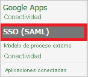
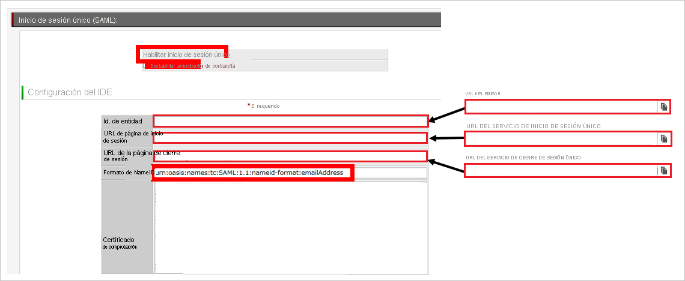

# Tutorial: Integración del inicio de sesión único de Azure AD con Questetra BPM Suite

En este tutorial, aprenderá a integrar Questetra BPM Suite con Azure Active Directory (Azure AD). Al integrar Questetra BPM Suite con Azure AD, puede hacer lo siguiente:

* Controlar en Azure AD quién tiene acceso a Questetra BPM Suite.
* Permitir que los usuarios inicien sesión automáticamente en Questetra BPM Suite con sus cuentas de Azure AD.
* Administrar las cuentas desde una ubicación central (Azure Portal).

## Requisitos previos

Para empezar, necesita los siguientes elementos:

* Una suscripción de Azure AD. Si no tiene una suscripción, puede crear una [cuenta gratuita](https://azure.microsoft.com/free/).
* Una suscripción habilitada para el inicio de sesión único en Questetra BPM Suite.

## Descripción del escenario

En este tutorial, puede configurar y probar el inicio de sesión único de Azure AD en un entorno de prueba.

* Questetra BPM Suite admite el inicio de sesión único iniciado por **SP**.

## Incorporación de Questetra BPM Suite desde la galería

Para configurar la integración de Questetra BPM Suite en Azure AD, deberá agregar Questetra BPM Suite desde la galería a la lista de aplicaciones SaaS administradas.

1. Inicie sesión en Azure Portal con una cuenta personal, profesional o educativa de Microsoft.
1. En el panel de navegación de la izquierda, seleccione el servicio **Azure Active Directory**.
1. Vaya a **Aplicaciones empresariales** y seleccione **Todas las aplicaciones**.
1. Para agregar una nueva aplicación, seleccione **Nueva aplicación**.
1. En la sección **Agregar desde la galería**, escriba **Questetra BPM Suite** en el cuadro de búsqueda.
1. Seleccione **Questetra BPM Suite** en el panel de resultados y agregue la aplicación. Espere unos segundos mientras la aplicación se agrega al inquilino.

## Configuración y prueba del inicio de sesión único de Azure AD para Questetra BPM Suite

Configure y pruebe el inicio de sesión único de Azure AD con Questetra BPM Suite mediante un usuario de prueba llamado **B.Simon**. Para que el inicio de sesión único funcione, es preciso establecer una relación de vinculación entre un usuario de Azure AD y el usuario relacionado de Questetra BPM Suite.

Para configurar y probar el inicio de sesión único de Azure AD con Questetra BPM Suite, siga estos pasos:

1. **[Configuración del inicio de sesión único de Azure AD](#configure-azure-ad-sso)** , para permitir que los usuarios puedan utilizar esta característica.
    1. **[Creación de un usuario de prueba de Azure AD](#create-an-azure-ad-test-user)** , para probar el inicio de sesión único de Azure AD con B.Simon.
    1. **[Asignación del usuario de prueba de Azure AD](#assign-the-azure-ad-test-user)** , para habilitar a B.Simon para que use el inicio de sesión único de Azure AD.
1. **[Configuración del inicio de sesión único de Questetra BPM Suite](#configure-questetra-bpm-suite-sso)** : para configurar los valores de Inicio de sesión único en la aplicación.
    1. **[Creación de un usuario de prueba de Questetra BPM Suite](#create-questetra-bpm-suite-test-user)** : para tener un homólogo de B.Simon en Questetra BPM Suite vinculado a la representación del usuario en Azure AD.
1. **[Prueba del inicio de sesión único](#test-sso)** : para comprobar si la configuración funciona.

## Configuración del inicio de sesión único de Azure AD

Siga estos pasos para habilitar el inicio de sesión único de Azure AD en Azure Portal.

1. En Azure Portal, en la página de integración de aplicaciones de **Questetra BPM Suite**, busque la sección **Administrar** y seleccione **Inicio de sesión único**.
1. En la página **Seleccione un método de inicio de sesión único**, elija **SAML**.
1. En la página **Configuración del inicio de sesión único con SAML**, haga clic en el icono de lápiz de **Configuración básica de SAML** para editar la configuración.

   

4. En la sección **Configuración básica de SAML**, siga estos pasos:

    a. En el cuadro de texto **Identificador (id. de entidad)** , escriba una dirección URL con el siguiente patrón: `https://<subdomain>.questetra.net/`

    b. En el cuadro de texto **URL de inicio de sesión**, escriba una dirección URL con el siguiente patrón: `https://<subdomain>.questetra.net/saml/SSO/alias/bpm`

    > [!NOTE]
    > Estos valores no son reales. Actualice estos valores con el identificador y la dirección URL de inicio de sesión reales. Puede obtener estos valores de la sección **SP Information** (Información de soporte técnico) del sitio de **Questetra BPM Suite** de la empresa, que se explica más adelante en el tutorial, o al ponerse en contacto con el [equipo de atención al cliente de Questetra BPM Suite](https://www.questetra.com/contact/). También puede hacer referencia a los patrones que se muestran en la sección **Configuración básica de SAML** de Azure Portal.

5. En la página **Configurar el inicio de sesión único con SAML**, en la sección **Certificado de firma de SAML**, haga clic en **Descargar** para descargar el **certificado (Base64)** de las opciones proporcionadas según sus requisitos y guárdelo en el equipo.

    

6. En la sección **Configurar Questetra BPM Suite**, copie las direcciones URL adecuadas según sus necesidades.

    

### Creación de un usuario de prueba de Azure AD 

En esta sección, va a crear un usuario de prueba llamado B.Simon en Azure Portal.

1. En el panel izquierdo de Azure Portal, seleccione **Azure Active Directory**, **Usuarios** y **Todos los usuarios**.
1. Seleccione **Nuevo usuario** en la parte superior de la pantalla.
1. En las propiedades del **usuario**, siga estos pasos:
   1. En el campo **Nombre**, escriba `B.Simon`.  
   1. En el campo **Nombre de usuario**, escriba username@companydomain.extension. Por ejemplo, `B.Simon@contoso.com`.
   1. Active la casilla **Show password** (Mostrar contraseña) y, después, anote el valor que se muestra en el cuadro **Contraseña**.
   1. Haga clic en **Crear**.

### Asignación del usuario de prueba de Azure AD

En esta sección, habilitará a B.Simon para que use el inicio de sesión único de Azure al concederle acceso a Questetra BPM Suite.

1. En Azure Portal, seleccione sucesivamente **Aplicaciones empresariales** y **Todas las aplicaciones**.
1. En la lista de aplicaciones, seleccione **Questetra BPM Suite**.
1. En la página de información general de la aplicación, busque la sección **Administrar** y seleccione **Usuarios y grupos**.
1. Seleccione **Agregar usuario**. A continuación, en el cuadro de diálogo **Agregar asignación**, seleccione **Usuarios y grupos**.
1. En el cuadro de diálogo **Usuarios y grupos**, seleccione **B.Simon** de la lista de usuarios y haga clic en el botón **Seleccionar** de la parte inferior de la pantalla.
1. Si espera que se asigne un rol a los usuarios, puede seleccionarlo en la lista desplegable **Seleccionar un rol**. Si no se ha configurado ningún rol para esta aplicación, verá seleccionado el rol "Acceso predeterminado".
1. En el cuadro de diálogo **Agregar asignación**, haga clic en el botón **Asignar**.

## Configuración del inicio de sesión único de Questetra BPM Suite

1. En otra ventana del explorador web, inicie sesión en el sitio de la compañía de **Questetra BPM Suite** como administrador.

2. En el menú de la parte superior, haga clic en **Configuración del sistema**. 
   
    

3. Para abrir la página **SingleSignOnSAML**, haga clic en **SSO (SAML)** . 

    

4. En el sitio **Questetra BPM Suite** de la empresa, en la sección **SP información** (Información de soporte técnico), lleve a cabo los pasos siguientes:

    a. Copie el valor de **ACS URL** (URL de ACS) y péguelo en el cuadro de texto **URL de inicio de sesión** de la sección **Configuración básica de SAML** de Azure Portal.
    
    b. Copie el valor de **Entity Id** (Identificador de entidad) y péguelo en el cuadro de texto **Identificador** de la sección **Configuración básica de SAML** de Azure Portal.

5. En el sitio **Questetra BPM Suite** de la empresa, realice los pasos siguientes: 
   
    
   
    a. Seleccione **Enable Single Sign-On**(Habilitar inicio de sesión único).
   
    b. En el cuadro de texto **Entity Id** (Identificador de entidad), pegue el valor de **Identificador de Azure AD** que copió de Azure Portal.
    
    c. En el cuadro de texto **Dirección URL de la página de inicio de sesión**, pegue el valor de la **dirección URL de inicio de sesión** que ha copiado de Azure Portal.
    
    d. En el cuadro de texto **Dirección URL de la página de cierre de sesión**, pegue el valor de **dirección URL de cierre de sesión** que copió de Azure Portal.
    
    e. En el cuadro de texto **NameID format** (Formato de id. de nombre), escriba `urn:oasis:names:tc:SAML:1.1:nameid-format:emailAddress`.

    f. Abra el certificado codificado en **base 64** descargado de Azure Portal en el bloc de notas, copie su contenido en el portapapeles y péguelo en el cuadro de texto **Certificado de verificación**. 

    g. Haga clic en **Save**(Guardar).

### Creación de un usuario de prueba de Questetra BPM Suite

El objetivo de esta sección es crear un usuario de prueba llamado Britta Simon en Questetra BPM Suite.

**Para crear un usuario llamado Britta Simon en Questetra BPM Suite, realice los pasos siguientes:**

1. Inicie sesión en el sitio Questetra BPM Suite de la empresa como administrador.

2. Vaya a **System Settings > User List > New User** (Configuración del sistema > Lista de usuarios > Nuevo usuario).
 
3. En el cuadro de diálogo Nuevo usuario, realice los pasos siguientes: 
   
    
   
    a. En el cuadro de texto **Name** (Nombre), escriba el **nombre** del usuario: britta.simon@contoso.com.
   
    b. En el cuadro de texto **Email** (Correo electrónico), escriba el **correo electrónico** del usuario: britta.simon@contoso.com.
   
    c. En el cuadro de texto **Password** (Contraseña), escriba una **contraseña** para el usuario.
    
    d. Haga clic en **Add new user**(Agregar nuevo usuario).

## Prueba de SSO 

En esta sección, probará la configuración de inicio de sesión único de Azure AD con las siguientes opciones. 

* Haga clic en **Probar esta aplicación** en Azure Portal. Esto le redirigirá a la dirección URL de inicio de sesión de Questetra BPM Suite, donde puede iniciar el flujo de inicio de sesión. 

* Vaya directamente a la dirección URL de inicio de sesión de Questetra BPM Suite e inicie el flujo de inicio de sesión desde allí.

* Puede usar Mis aplicaciones de Microsoft. Si hace clic en el icono de Questetra BPM Suite en Aplicaciones, se le redireccionará a la dirección URL de inicio de sesión de dicha aplicación. Para más información acerca de Aplicaciones, consulte [Inicio de sesión e inicio de aplicaciones desde el portal Aplicaciones](../user-help/my-apps-portal-end-user-access.md).

## Pasos siguientes

Tras configurar Questetra BPM Suite, puede aplicar el control de sesión, que protege la filtración y la infiltración de la información confidencial de la organización en tiempo real. El control de sesión procede del acceso condicional. [Aprenda a aplicar el control de sesión con Microsoft Cloud App Security](/cloud-app-security/proxy-deployment-aad).