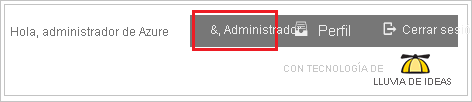

# Tutorial: Integración de Azure Active Directory con QuickHelp

En este tutorial aprenderá a integrar QuickHelp con Azure Active Directory (Azure AD). Al integrar QuickHelp con Azure AD, puede hacer lo siguiente:

* Controlar en Azure AD quién tiene acceso a QuickHelp.
* Permitir que los usuarios inicien sesión automáticamente en QuickHelp con sus cuentas de Azure AD.
* Administrar las cuentas desde una ubicación central (Azure Portal).

## Requisitos previos

Para empezar, necesita los siguientes elementos:

* Una suscripción de Azure AD. Si no tiene una suscripción, puede crear una [cuenta gratuita](https://azure.microsoft.com/free/).
* Una suscripción habilitada para el inicio de sesión único (SSO) en QuickHelp.

## Descripción del escenario

En este tutorial, puede configurar y probar el inicio de sesión único de Azure AD en un entorno de prueba.

* QuickHelp admite el inicio de sesión único iniciado por **SP**.

* QuickHelp admite el aprovisionamiento de usuarios **Just-In-Time**.

> [!NOTE]
> El identificador de esta aplicación es un valor de cadena fijo, por lo que solo se puede configurar una instancia en un inquilino.

## Adición de QuickHelp desde la galería

Para configurar la integración de QuickHelp en Azure AD, deberá agregar QuickHelp desde la galería a la lista de aplicaciones SaaS administradas.

1. Inicie sesión en Azure Portal con una cuenta personal, profesional o educativa de Microsoft.
1. En el panel de navegación de la izquierda, seleccione el servicio **Azure Active Directory**.
1. Vaya a **Aplicaciones empresariales** y seleccione **Todas las aplicaciones**.
1. Para agregar una nueva aplicación, seleccione **Nueva aplicación**.
1. En la sección **Agregar desde la galería**, escriba **QuickHelp** en el cuadro de búsqueda.
1. Seleccione **QuickHelp** en el panel de resultados y agregue la aplicación. Espere unos segundos mientras la aplicación se agrega al inquilino.

## Configuración y prueba del inicio de sesión único de Azure AD para QuickHelp

Configure y pruebe el inicio de sesión único de Azure AD con QuickHelp mediante un usuario de prueba llamado **B.Simon**. Para que el inicio de sesión único funcione, es necesario establecer una relación de vínculo entre un usuario de Azure AD y el usuario relacionado de QuickHelp.

Para configurar y probar el inicio de sesión único de Azure AD con QuickHelp, siga estos pasos:

1. **[Configuración del inicio de sesión único de Azure AD](#configure-azure-ad-sso)** , para permitir que los usuarios puedan utilizar esta característica.
    1. **[Creación de un usuario de prueba de Azure AD](#create-an-azure-ad-test-user)** , para probar el inicio de sesión único de Azure AD con B.Simon.
    1. **[Asignación del usuario de prueba de Azure AD](#assign-the-azure-ad-test-user)** , para habilitar a B.Simon para que use el inicio de sesión único de Azure AD.
1. **[Configuración del inicio de sesión único en QuickHelp](#configure-quickhelp-sso)** : para configurar los valores de inicio de sesión único en la aplicación.
    1. **[Creación de un usuario de prueba de QuickHelp](#create-quickhelp-test-user)** : para tener un homólogo de B.Simon en QuickHelp que esté vinculado a la representación del usuario en Azure AD.
1. **[Prueba del inicio de sesión único](#test-sso)** : para comprobar si la configuración funciona.

## Configuración del inicio de sesión único de Azure AD

Siga estos pasos para habilitar el inicio de sesión único de Azure AD en Azure Portal.

1. En Azure Portal, en la página de integración de la aplicación **QuickHelp**, busque la sección **Administrar** y seleccione **Inicio de sesión único**.
1. En la página **Seleccione un método de inicio de sesión único**, elija **SAML**.
1. En la página **Configuración del inicio de sesión único con SAML**, haga clic en el icono de lápiz de **Configuración básica de SAML** para editar la configuración.

   

4. En la sección **Configuración básica de SAML**, siga estos pasos:

    a. En el cuadro de texto **Identificador (id. de entidad)** , escriba la dirección URL: `https://auth.quickhelp.com`.

    b. En el cuadro de texto **URL de inicio de sesión**, escriba una dirección URL con el siguiente patrón: `https://quickhelp.com/<ROUTE_URL>`

    > [!NOTE]
    > El valor de la dirección URL de inicio de sesión no es real. Actualícelo con la dirección URL de inicio de sesión real. Póngase en contacto con administrador de ayuda rápida de la organización o el administrador de éxito de los clientes de BrainStorm para obtener el valor. También puede hacer referencia a los patrones que se muestran en la sección **Configuración básica de SAML** de Azure Portal.

5. En la página **Configurar el inicio de sesión único con SAML**, en la sección **Certificado de firma de SAML**, haga clic en **Descargar** para descargar el **XML de metadatos de federación** de las opciones proporcionadas según sus requisitos y guárdelo en el equipo.

    

6. En la sección **Set up QuickHelp** (Configurar QuickHelp), copie las direcciones URL adecuadas según sus necesidades.

    

### Creación de un usuario de prueba de Azure AD 

En esta sección, va a crear un usuario de prueba llamado B.Simon en Azure Portal.

1. En el panel izquierdo de Azure Portal, seleccione **Azure Active Directory**, **Usuarios** y **Todos los usuarios**.
1. Seleccione **Nuevo usuario** en la parte superior de la pantalla.
1. En las propiedades del **usuario**, siga estos pasos:
   1. En el campo **Nombre**, escriba `B.Simon`.  
   1. En el campo **Nombre de usuario**, escriba username@companydomain.extension. Por ejemplo, `B.Simon@contoso.com`.
   1. Active la casilla **Show password** (Mostrar contraseña) y, después, anote el valor que se muestra en el cuadro **Contraseña**.
   1. Haga clic en **Crear**.

### Asignación del usuario de prueba de Azure AD

En esta sección, va a permitir que B.Simon acceda a QuickHelp mediante el inicio de sesión único de Azure.

1. En Azure Portal, seleccione sucesivamente **Aplicaciones empresariales** y **Todas las aplicaciones**.
1. En la lista de aplicaciones, seleccione **QuickHelp**.
1. En la página de información general de la aplicación, busque la sección **Administrar** y seleccione **Usuarios y grupos**.
1. Seleccione **Agregar usuario**. A continuación, en el cuadro de diálogo **Agregar asignación**, seleccione **Usuarios y grupos**.
1. En el cuadro de diálogo **Usuarios y grupos**, seleccione **B.Simon** de la lista de usuarios y haga clic en el botón **Seleccionar** de la parte inferior de la pantalla.
1. Si espera que se asigne un rol a los usuarios, puede seleccionarlo en la lista desplegable **Seleccionar un rol**. Si no se ha configurado ningún rol para esta aplicación, verá seleccionado el rol "Acceso predeterminado".
1. En el cuadro de diálogo **Agregar asignación**, haga clic en el botón **Asignar**.

## Configuración del inicio de sesión único de QuickHelp

1. Inicie sesión en el sitio de la empresa de QuickHelp como administrador.

2. En el menú de la parte superior, haga clic en **Administrador**.
   
    

3. En el menú **Administrador de QuickHelp**, haga clic en **Configuración**.
   
    

4. Haga clic en **Configuración de autenticación**.

5. En la página **Configuración de autenticación**, siga estos pasos.
   
    
   
    a. En **Tipo de SSO**, seleccione **WSFederation**.
   
    b. Para cargar el archivo de metadatos de Azure descargado, haga clic en **Examinar**, vaya hasta el archivo y, luego, haga clic en **Cargar metadatos**.
   
    c. En el cuadro de texto **Correo electrónico**, escriba `http://schemas.xmlsoap.org/ws/2005/05/identity/claims/emailaddress`.
   
    d. En el cuadro de texto **Nombre**, `type http://schemas.xmlsoap.org/ws/2005/05/identity/claims/givenname`.
   
    e. En el cuadro de texto **Apellido**, `type http://schemas.xmlsoap.org/ws/2005/05/identity/claims/surname`.
   
    f. En la **Barra de acciones**, haga clic en **Guardar**.

### Creación de un usuario de prueba de QuickHelp

En esta sección, se crea un usuario llamado Britta Simon en QuickHelp. QuickHelp admite el aprovisionamiento de usuarios Just-In-Time, que está habilitado de forma predeterminada. No hay ningún elemento de acción para usted en esta sección. Si el usuario no existe en QuickHelp, se crea uno después de la autenticación.

## Prueba de SSO 

En esta sección, probará la configuración de inicio de sesión único de Azure AD con las siguientes opciones. 

* Haga clic en **Probar esta aplicación** en Azure Portal. Esto le redirigirá a la dirección URL de inicio de sesión de QuickHelp, donde puede iniciar el flujo de inicio de sesión. 

* Vaya directamente a la dirección URL de inicio de sesión de QuickHelp e inicie el flujo de inicio de sesión desde allí.

* Puede usar Mis aplicaciones de Microsoft. Al hacer clic en el icono de QuickHelp en Mis aplicaciones, se le redirigirá a la URL de inicio de sesión de la aplicación. Para más información acerca de Aplicaciones, consulte [Inicio de sesión e inicio de aplicaciones desde el portal Aplicaciones](../user-help/my-apps-portal-end-user-access.md).

## Pasos siguientes

Una vez que haya configurado QuickHelp, podrá aplicar el control de sesión, que protege a la organización en tiempo real frente a la filtración e infiltración de información confidencial. El control de sesión procede del acceso condicional. [Aprenda a aplicar el control de sesión con Microsoft Cloud App Security](/cloud-app-security/proxy-deployment-aad).
