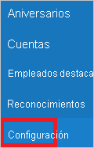
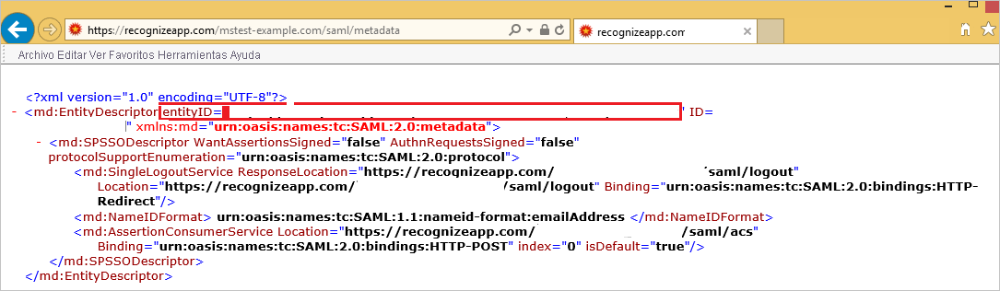

# Tutorial: Integración de Azure Active Directory con Recognize

En este tutorial aprenderá a integrar Recognize con Azure Active Directory (Azure AD). Al integrar Recognize con Azure AD, puede hacer lo siguiente:

* Controlar en Azure AD quién tiene acceso a Recognize.
* Permitir que los usuarios inicien sesión automáticamente en Recognize con sus cuentas de Azure AD.
* Administrar las cuentas desde una ubicación central (Azure Portal).

## Requisitos previos

Para empezar, necesita los siguientes elementos:

* Una suscripción de Azure AD. Si no tiene una suscripción, puede crear una [cuenta gratuita](https://azure.microsoft.com/free/).
* Una suscripción habilitada para el inicio de sesión único (SSO) en Recognize.

## Descripción del escenario

En este tutorial, puede configurar y probar el inicio de sesión único de Azure AD en un entorno de prueba.

* Recognize admite el inicio de sesión único iniciado por **SP**.

## Adición de Recognize desde la galería

Para configurar la integración de Recognize en Azure AD, deberá agregar Recognize desde la galería a la lista de aplicaciones SaaS administradas.

1. Inicie sesión en Azure Portal con una cuenta personal, profesional o educativa de Microsoft.
1. En el panel de navegación de la izquierda, seleccione el servicio **Azure Active Directory**.
1. Vaya a **Aplicaciones empresariales** y seleccione **Todas las aplicaciones**.
1. Para agregar una nueva aplicación, seleccione **Nueva aplicación**.
1. En la sección **Agregar desde la galería**, escriba **Recognize** en el cuadro de búsqueda.
1. Seleccione **Recognize** en el panel de resultados y agregue la aplicación. Espere unos segundos mientras la aplicación se agrega al inquilino.

## Configuración y prueba del inicio de sesión único de Azure AD para Recognize

Configure y pruebe el inicio de sesión único de Azure AD con Recognize mediante un usuario de prueba llamado **B.Simon**. Para que el inicio de sesión único funcione, es necesario establecer una relación de vínculo entre un usuario de Azure AD y el usuario relacionado de Recognize.

Para configurar y probar el inicio de sesión único de Azure AD con Recognize, siga estos pasos:

1. **[Configuración del inicio de sesión único de Azure AD](#configure-azure-ad-sso)** , para permitir que los usuarios puedan utilizar esta característica.
    1. **[Creación de un usuario de prueba de Azure AD](#create-an-azure-ad-test-user)** , para probar el inicio de sesión único de Azure AD con B.Simon.
    1. **[Asignación del usuario de prueba de Azure AD](#assign-the-azure-ad-test-user)** , para habilitar a B.Simon para que use el inicio de sesión único de Azure AD.
1. **[Configuración del inicio de sesión único en Recognize](#configure-recognize-sso)** : para configurar los valores de inicio de sesión único en la aplicación.
    1. **[Creación de un usuario de prueba de Recognize](#create-recognize-test-user)** : para tener un homólogo de B.Simon en Recognize que esté vinculado a la representación del usuario en Azure AD.
1. **[Prueba del inicio de sesión único](#test-sso)** : para comprobar si la configuración funciona.

## Configuración del inicio de sesión único de Azure AD

Siga estos pasos para habilitar el inicio de sesión único de Azure AD en Azure Portal.

1. En Azure Portal, en la página de integración de la aplicación **Recognize**, busque la sección **Administrar** y seleccione **Inicio de sesión único**.
1. En la página **Seleccione un método de inicio de sesión único**, elija **SAML**.
1. En la página **Configuración del inicio de sesión único con SAML**, haga clic en el icono de lápiz de **Configuración básica de SAML** para editar la configuración.

   

4. En la sección **Configuración básica de SAML**, si tiene el **archivo de metadatos del proveedor de servicios**, lleve a cabo los siguientes pasos:

    >[!NOTE]
    >Puede obtener el **archivo de metadatos del proveedor de servicios** en la sección **Configuración del inicio de sesión único de Recognize** del tutorial.

    a. Haga clic en **Cargar el archivo de metadatos**.

    

    b. Haga clic en el **logotipo de la carpeta** para seleccionar el archivo de metadatos y luego en **Cargar**.

    

    c. Una vez que se haya cargado correctamente el archivo de metadatos, el valor de **Identificador** se rellena automáticamente en la sección Configuración básica de SAML.

     En el cuadro de texto **URL de inicio de sesión**, escriba una dirección URL con el siguiente patrón: `https://recognizeapp.com/<YOUR_DOMAIN>/saml/sso`

    > [!Note]
    > Si el valor de **Identificador** no se rellena automáticamente, puede obtenerlo abriendo la dirección URL de metadatos del proveedor de servicios en la sección de configuración del inicio de sesión único como se explica más adelante en la sección **Configuración del inicio de sesión único de Recognize** de este tutorial. El valor de la dirección URL de inicio de sesión no es real. Actualícelo con la dirección URL de inicio de sesión real. Póngase en contacto con el [equipo de soporte técnico de Recognize](mailto:support@recognizeapp.com) para obtener este valor. También puede hacer referencia a los patrones que se muestran en la sección **Configuración básica de SAML** de Azure Portal.

5. En la página **Configurar el inicio de sesión único con SAML**, en la sección **Certificado de firma de SAML**, haga clic en **Descargar** para descargar el **certificado (Base64)** de las opciones proporcionadas según sus requisitos y guárdelo en el equipo.

    

6. En la sección **Configurar Recognize**, copie las direcciones URL adecuadas según sus necesidades.

    

### Creación de un usuario de prueba de Azure AD 

En esta sección, va a crear un usuario de prueba llamado B.Simon en Azure Portal.

1. En el panel izquierdo de Azure Portal, seleccione **Azure Active Directory**, **Usuarios** y **Todos los usuarios**.
1. Seleccione **Nuevo usuario** en la parte superior de la pantalla.
1. En las propiedades del **usuario**, siga estos pasos:
   1. En el campo **Nombre**, escriba `B.Simon`.  
   1. En el campo **Nombre de usuario**, escriba username@companydomain.extension. Por ejemplo, `B.Simon@contoso.com`.
   1. Active la casilla **Show password** (Mostrar contraseña) y, después, anote el valor que se muestra en el cuadro **Contraseña**.
   1. Haga clic en **Crear**.

### Asignación del usuario de prueba de Azure AD

En esta sección, va a permitir que B.Simon acceda a Recognize mediante el inicio de sesión único de Azure.

1. En Azure Portal, seleccione sucesivamente **Aplicaciones empresariales** y **Todas las aplicaciones**.
1. En la lista de aplicaciones, seleccione **Recognize**.
1. En la página de información general de la aplicación, busque la sección **Administrar** y seleccione **Usuarios y grupos**.
1. Seleccione **Agregar usuario**. A continuación, en el cuadro de diálogo **Agregar asignación**, seleccione **Usuarios y grupos**.
1. En el cuadro de diálogo **Usuarios y grupos**, seleccione **B.Simon** de la lista de usuarios y haga clic en el botón **Seleccionar** de la parte inferior de la pantalla.
1. Si espera que se asigne un rol a los usuarios, puede seleccionarlo en la lista desplegable **Seleccionar un rol**. Si no se ha configurado ningún rol para esta aplicación, verá seleccionado el rol "Acceso predeterminado".
1. En el cuadro de diálogo **Agregar asignación**, haga clic en el botón **Asignar**.

## Configuración del inicio de sesión único de Recognize

1. En otra ventana del explorador web, inicie sesión en el inquilino de Recognize como administrador.

2. En la esquina superior derecha, haga clic en **Menú**. Vaya a **Company Admin** (Administrador de empresa).
   
    

3. En la barra de navegación de la izquierda, haga clic en **Settings**(Configuración).
   
    

4. Siga estos pasos en la sección **SSO Settings** (Configuración de SSO).
   
    
    
    a. En **Enable SSO** (Habilitar SSO), seleccione **ON** (Activado).

    b. En el cuadro de texto **IDP Entity ID** (Identificador de la entidad de IdP), pegue el valor de **Identificador de Azure AD** que copió de Azure Portal.
    
    c. En el cuadro de texto **SSO Target URL** (Dirección URL de destino de SSO), pegue el valor de **Dirección URL de inicio de sesión** que ha copiado de Azure Portal.
    
    d. En el cuadro de texto **SSO Target URL** (Dirección URL de destino de SSO), pegue el valor de **URL de cierre de sesión** que ha copiado de Azure Portal. 
    
    e. Abra el archivo descargado **Certificado (Base64)** en el Bloc de notas, copie su contenido en el Portapapeles y luego péguelo en el cuadro de texto **Certificado**.
    
    f. Haga clic en el botón **Guardar configuración**. 

5. Junto a la sección de **configuración de SSO**, copie la dirección URL en **Service Provider Metadata url** (Dirección URL de metadatos del proveedor de servicio).
   
    

6. Abra el vínculo **Dirección URL de metadatos** en un explorador en blanco para descargar el documento de metadatos. Después, copie el valor de EntityDescriptor (entityID) del archivo y péguelo en el cuadro de texto **Identificador** en **Configuración básica de SAML** en Azure Portal.
    
    

### Creación de un usuario de prueba de Recognize

Para permitir que los usuarios de Azure AD inicien sesión en Recognize, deben aprovisionarse en Recognize. En el caso de Recognize, el aprovisionamiento es una tarea manual.

Esta aplicación no admite el aprovisionamiento SCIM, pero tiene una sincronización de usuario alternativa que aprovisiona a los usuarios. 

**Para aprovisionar una cuenta de usuario, realice estos pasos:**

1. Inicie sesión en su sitio de la compañía de Recognize como administrador.

2. En la esquina superior derecha, haga clic en **Menú**. Vaya a **Company Admin** (Administrador de empresa).

3. En la barra de navegación de la izquierda, haga clic en **Settings**(Configuración).

4. En la sección **User Sync** (Sincronización de usuario), siga estos pasos.
   
     (Usuario nuevo)
   
    a. En **Sync Enabled** (Sincronización habilitada), seleccione **ON** (Activado).
   
    b. En **Choose sync provider** (Elegir proveedor de sincronización), seleccione **Microsoft/Office 365**.
   
    c. Haga clic en **Run User Sync** (Ejecutar sincronización de usuario).

## Prueba de SSO 

En esta sección, probará la configuración de inicio de sesión único de Azure AD con las siguientes opciones. 

* Haga clic en **Probar esta aplicación** en Azure Portal. Esto le redirigirá a la dirección URL de inicio de sesión de Recognize, donde puede iniciar el flujo de inicio de sesión. 

* Vaya directamente a la dirección URL de inicio de sesión de Recognize e inicie el flujo de inicio de sesión desde allí.

* Puede usar Mis aplicaciones de Microsoft. Al hacer clic en el icono de Recognize en Mis aplicaciones, se le redirigirá a la URL de inicio de sesión de la aplicación. Para más información acerca de Aplicaciones, consulte [Inicio de sesión e inicio de aplicaciones desde el portal Aplicaciones](../user-help/my-apps-portal-end-user-access.md).

## Pasos siguientes

Una vez que haya configurado Recognize, podrá aplicar el control de sesión, que protege a la organización en tiempo real frente a la filtración e infiltración de información confidencial. El control de sesión procede del acceso condicional. [Aprenda a aplicar el control de sesión con Microsoft Cloud App Security](/cloud-app-security/proxy-deployment-aad).
