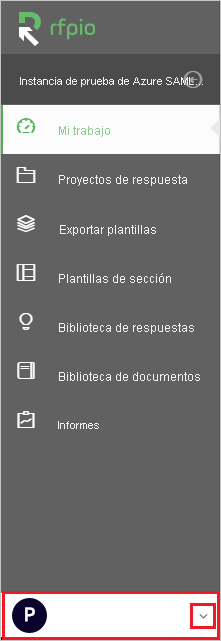
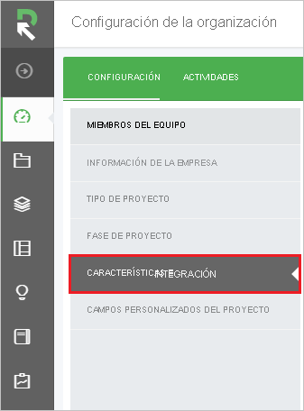
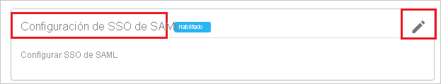
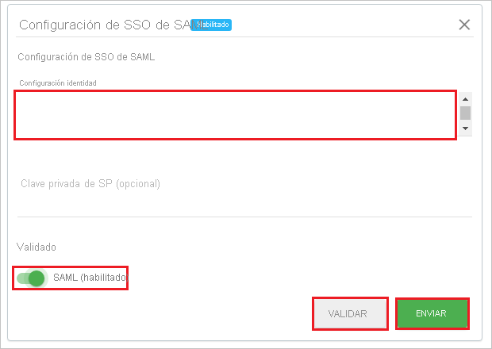
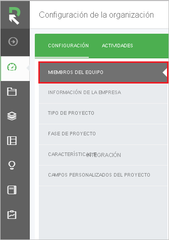

# Tutorial: Integración de Azure Active Directory con RFPIO

En este tutorial, aprenderá a integrar RFPIO con Azure Active Directory (Azure AD). Al integrar RFPIO con Azure AD, puede hacer lo siguiente:

* Controlar en Azure AD quién tiene acceso a RFPIO.
* Permitir que los usuarios inicien sesión automáticamente en RFPIO con sus cuentas de Azure AD.
* Administrar las cuentas desde una ubicación central (Azure Portal).

## Requisitos previos

Para configurar la integración de Azure AD con RFPIO, necesita los siguientes elementos:

* Una suscripción de Azure AD. Si no dispone de un entorno de Azure AD, puede obtener [una cuenta gratuita](https://azure.microsoft.com/free/).
* Suscripción de RFPIO con el inicio de sesión único habilitado

## Descripción del escenario

En este tutorial, puede configurar y probar el inicio de sesión único de Azure AD en un entorno de prueba.

* RFPIO admite el inicio de sesión único iniciado por **SP e IDP**.

> [!NOTE]
> El identificador de esta aplicación es un valor de cadena fijo, por lo que solo se puede configurar una instancia en un inquilino.

## Adición de RFPIO desde la galería

Para configurar la integración de RFPIO en Azure AD, es preciso agregar dicha solución desde la galería a la lista de aplicaciones SaaS administradas.

1. Inicie sesión en Azure Portal con una cuenta personal, profesional o educativa de Microsoft.
1. En el panel de navegación de la izquierda, seleccione el servicio **Azure Active Directory**.
1. Vaya a **Aplicaciones empresariales** y seleccione **Todas las aplicaciones**.
1. Para agregar una nueva aplicación, seleccione **Nueva aplicación**.
1. En la sección **Agregar desde la galería**, escriba **RFPIO** en el cuadro de búsqueda.
1. Seleccione **RFPIO** en el panel de resultados y agregue la aplicación. Espere unos segundos mientras la aplicación se agrega al inquilino.

## Configuración y prueba del inicio de sesión único de Azure AD para RFPIO

Configure y pruebe el inicio de sesión único (SSO) de Azure AD con RFPIO mediante un usuario de prueba llamado **B.Simon**. Para que el inicio de sesión único funcione, es preciso establecer una relación de vinculación entre un usuario de Azure AD y el usuario relacionado de RFPIO.

Para configurar y probar el inicio de sesión único de Azure AD con RFPIO, siga estos pasos:

1. **[Configuración del inicio de sesión único de Azure AD](#configure-azure-ad-sso)** , para permitir que los usuarios puedan utilizar esta característica.
    1. **[Creación de un usuario de prueba de Azure AD](#create-an-azure-ad-test-user)** , para probar el inicio de sesión único de Azure AD con B.Simon.
    1. **[Asignación del usuario de prueba de Azure AD](#assign-the-azure-ad-test-user)** , para habilitar a B.Simon para que use el inicio de sesión único de Azure AD.
1. **[Configuración del inicio de sesión único en RFPIO](#configure-rfpio-sso)** : para configurar los valores de inicio de sesión único en la aplicación.
    1. **[Creación de un usuario de prueba de RFPIO](#create-rfpio-test-user)** , para tener un homólogo de B.Simon en RFPIO que esté vinculado a la representación del usuario en Azure AD.
1. **[Prueba del inicio de sesión único](#test-sso)** : para comprobar si la configuración funciona.

## Configuración del inicio de sesión único de Azure AD

Siga estos pasos para habilitar el inicio de sesión único de Azure AD en Azure Portal.

1. En Azure Portal, en la página de integración de aplicaciones de **RFPIO**, busque la sección **Administrar** y seleccione **Inicio de sesión único**.
1. En la página **Seleccione un método de inicio de sesión único**, elija **SAML**.
1. En la página **Configuración del inicio de sesión único con SAML**, haga clic en el icono de lápiz de **Configuración básica de SAML** para editar la configuración.

   

4. En la sección **Configuración básica de SAML**, si desea configurar la aplicación en modo iniciado por **IDP**, realice los siguientes pasos:

    a. En el cuadro de texto **Identificador**, escriba la dirección URL: `https://www.rfpio.com`

    b. Haga clic en **Establecer direcciones URL adicionales**.

    c. En el cuadro de texto **Estado de la retransmisión**, escriba un valor de cadena. Póngase en contacto con el [equipo de soporte técnico de RFPIO](https://www.rfpio.com/contact/) para obtener este valor.

5. Haga clic en **Establecer direcciones URL adicionales** y siga este paso si desea configurar la aplicación en el modo iniciado por **SP**:

    En el cuadro de texto **URL de inicio de sesión**, escriba la dirección URL: `https://www.app.rfpio.com`

6. En la página **Configurar el inicio de sesión único con SAML**, en la sección **Certificado de firma de SAML**, haga clic en **Descargar** para descargar el **XML de metadatos de federación** de las opciones proporcionadas según sus requisitos y guárdelo en el equipo.

    

7. En la sección **Set up RFPIO** (Configurar RFPIO), copie las direcciones URL adecuadas según sus necesidades.

    

### Creación de un usuario de prueba de Azure AD

En esta sección, va a crear un usuario de prueba llamado B.Simon en Azure Portal.

1. En el panel izquierdo de Azure Portal, seleccione **Azure Active Directory**, **Usuarios** y **Todos los usuarios**.
1. Seleccione **Nuevo usuario** en la parte superior de la pantalla.
1. En las propiedades del **usuario**, siga estos pasos:
   1. En el campo **Nombre**, escriba `B.Simon`.  
   1. En el campo **Nombre de usuario**, escriba username@companydomain.extension. Por ejemplo, `B.Simon@contoso.com`.
   1. Active la casilla **Show password** (Mostrar contraseña) y, después, anote el valor que se muestra en el cuadro **Contraseña**.
   1. Haga clic en **Crear**.

### Asignación del usuario de prueba de Azure AD

En esta sección va a permitir que B.Simon acceda a RFPIO mediante el inicio de sesión único de Azure.

1. En Azure Portal, seleccione sucesivamente **Aplicaciones empresariales** y **Todas las aplicaciones**.
1. En la lista de aplicaciones, seleccione **RFPIO**.
1. En la página de información general de la aplicación, busque la sección **Administrar** y seleccione **Usuarios y grupos**.
1. Seleccione **Agregar usuario**. A continuación, en el cuadro de diálogo **Agregar asignación**, seleccione **Usuarios y grupos**.
1. En el cuadro de diálogo **Usuarios y grupos**, seleccione **B.Simon** de la lista de usuarios y haga clic en el botón **Seleccionar** de la parte inferior de la pantalla.
1. Si espera que se asigne un rol a los usuarios, puede seleccionarlo en la lista desplegable **Seleccionar un rol**. Si no se ha configurado ningún rol para esta aplicación, verá seleccionado el rol "Acceso predeterminado".
1. En el cuadro de diálogo **Agregar asignación**, haga clic en el botón **Asignar**.

## Configuración del inicio de sesión único de RFPIO

1. En otra ventana del explorador web, inicie sesión en el sitio web de **RFPIO** como administrador.

1. Haga clic en la lista desplegable de la esquina inferior izquierda.

    

1. Haga clic en **Organization Settings** (Configuración de la organización). 

    

1. Haga clic en **FEATURES & INTEGRATION** (CARACTERÍSTICAS E INTEGRACIÓN).

    

1. En **SAML SSO Configuration** (Configuración del inicio de sesión único de SAML), haga clic en **Edit** (Editar).

    

1. En esta sección, realice las siguientes acciones:

    
    
    a. Copie el contenido del archivo **XML de metadatos descargado** y péguelo en el campo **identity configuration** (Configuración de identidad).

    > [!NOTE]
    > Para copiar el contenido del archivo **XML de metadatos de federación** descargado, use **Notepad++** o un **Editor XML** adecuado.

    b. Haga clic en **Validar**.

    c. Después de hacer clic en **Validate** (Validar), mueva **SAML(Enabled)** (SAML [Habilitado]) a activado.

    d. Haga clic en **Enviar**.

### Creación de un usuario de prueba de RFPIO

1. Inicie sesión en el sitio de la compañía de RFPIO como administrador.

1. Haga clic en la lista desplegable de la esquina inferior izquierda.

    

1. Haga clic en **Organization Settings** (Configuración de la organización). 

    

1. Haga clic en **TEAM MEMBERS** (MIEMBROS DE EQUIPO).

    

1. Haga clic en **ADD MEMBERS** (AGREGAR MIEMBROS).

    

1. Vaya a la sección **Add New Members** (Agregar nuevos miembros). Realice las siguientes acciones:

    

    a. Escriba la **dirección de correo electrónico** en el campo **Enter one email per line** (Escribir un correo electrónico por línea).

    b. Seleccione **Role** (Role) de acuerdo con sus requisitos.

    c. Haga clic en **ADD MEMBERS** (AGREGAR MIEMBROS).

    > [!NOTE]
    > El titular de la cuenta de Azure Active Directory recibirá un mensaje de correo y seguirá un vínculo para confirmar su cuenta antes de que se active.

## Prueba de SSO

En esta sección, probará la configuración de inicio de sesión único de Azure AD con las siguientes opciones. 

#### Iniciado por SP:

* Haga clic en **Probar esta aplicación** en Azure Portal. Esta acción le redirigirá a la dirección URL de inicio de sesión de RFPIO, donde puede comenzar el flujo de inicio de sesión.  

* Vaya directamente a la dirección URL de inicio de sesión de RFPIO e inicie el flujo de inicio de sesión desde allí.

#### Iniciado por IDP:

* Haga clic en **Probar esta aplicación** en Azure Portal; se debería iniciar sesión automáticamente en la instancia de RFPIO para la que ha configurado el inicio de sesión único. 

También puede usar Aplicaciones de Microsoft para probar la aplicación en cualquier modo. Al hacer clic en el icono de RFPIO en Aplicaciones, si se ha configurado en modo SP, se le redirigirá a la página de inicio de sesión de la aplicación para comenzar el flujo de inicio de sesión; y si se ha configurado en modo IDP, se debería iniciar sesión automáticamente en la instancia de RFPIO para la que configuró el inicio de sesión único. Para más información acerca de Aplicaciones, consulte [Inicio de sesión e inicio de aplicaciones desde el portal Aplicaciones](../user-help/my-apps-portal-end-user-access.md).

## Pasos siguientes

Una vez configurado RFPIO, puede aplicar el control de sesión, que protege la filtración y la infiltración de la información confidencial de la organización en tiempo real. El control de sesión procede del acceso condicional. [Aprenda a aplicar el control de sesión con Microsoft Cloud App Security](/cloud-app-security/proxy-deployment-aad).