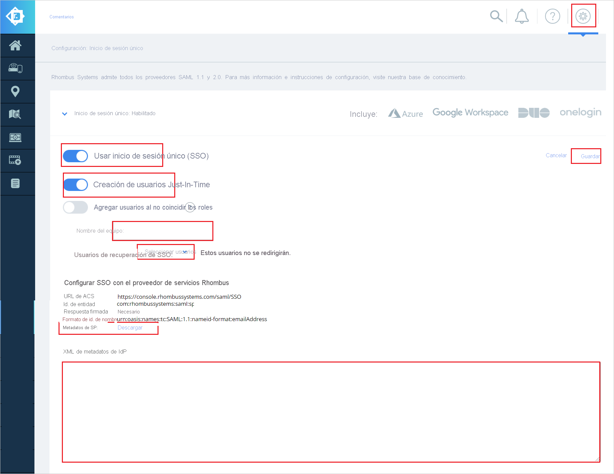

# Tutorial: Integración del inicio de sesión único (SSO) de Azure Active Directory con Rhombus Systems

En este tutorial aprenderá a integrar Rhombus Systems con Azure Active Directory (Azure AD). Al integrar Rhombus Systems con Azure AD, podrá hacer lo siguiente:

* Controlar en Azure AD quién tiene acceso a Rhombus Systems.
* Permitir que los usuarios inicien sesión automáticamente en Rhombus Systems con sus cuentas de Azure AD.
* Administrar las cuentas desde una ubicación central (Azure Portal).

## Requisitos previos

Para empezar, necesita los siguientes elementos:

* Una suscripción de Azure AD. Si no tiene una suscripción, puede crear una [cuenta gratuita](https://azure.microsoft.com/free/).
* Suscripción habilitada para el inicio de sesión único en Rhombus Systems.

## Descripción del escenario

En este tutorial, va a configurar y probar el inicio de sesión único de Azure AD en un entorno de prueba.

* Rhombus Systems admite el inicio de sesión único iniciado por **SP e IDP**.
* Rhombus Systems admite el aprovisionamiento de usuarios **Just-In-Time**.

> [!NOTE]
> El identificador de esta aplicación es un valor de cadena fijo, por lo que solo se puede configurar una instancia en un inquilino.

## Incorporación de Rhombus Systems desde la galería

Para configurar la integración de Rhombus Systems en Azure AD, deberá agregar Rhombus Systems desde la galería a la lista de aplicaciones SaaS administradas.

1. Inicie sesión en Azure Portal con una cuenta personal, profesional o educativa de Microsoft.
1. En el panel de navegación de la izquierda, seleccione el servicio **Azure Active Directory**.
1. Vaya a **Aplicaciones empresariales** y seleccione **Todas las aplicaciones**.
1. Para agregar una nueva aplicación, seleccione **Nueva aplicación**.
1. En la sección **Agregar desde la galería**, escriba **Rhombus Systems** en el cuadro de búsqueda.
1. Seleccione **Rhombus Systems** en el panel de resultados y agregue la aplicación. Espere unos segundos mientras la aplicación se agrega al inquilino.

## Configuración y prueba del inicio de sesión único de Azure AD para Rhombus Systems

Configure y pruebe el inicio de sesión único de Azure AD con Rhombus Systems mediante un usuario de prueba llamado **B.Simon**. Para que el inicio de sesión único funcione, es preciso establecer una relación de vínculo entre un usuario de Azure AD y el usuario correspondiente de Rhombus Systems.

Para configurar y probar el inicio de sesión único de Azure AD con Rhombus Systems, siga estos pasos:

1. **[Configuración del inicio de sesión único de Azure AD](#configure-azure-ad-sso)** , para permitir que los usuarios puedan utilizar esta característica.
    1. **[Creación de un usuario de prueba de Azure AD](#create-an-azure-ad-test-user)** , para probar el inicio de sesión único de Azure AD con B.Simon.
    1. **[Asignación del usuario de prueba de Azure AD](#assign-the-azure-ad-test-user)** , para habilitar a B.Simon para que use el inicio de sesión único de Azure AD.
1. **[Configuración del inicio de sesión único en Rhombus Systems](#configure-rhombus-systems-sso)** : para configurar los valores de inicio de sesión único en la aplicación.
    1. **[Creación de un usuario de prueba en Rhombus Systems](#create-rhombus-systems-test-user)** : para tener un homólogo de B.Simon en Rhombus Systems vinculado a la representación del usuario en Azure AD.
1. **[Prueba del inicio de sesión único](#test-sso)** : para comprobar si la configuración funciona.

## Configuración del inicio de sesión único de Azure AD

Siga estos pasos para habilitar el inicio de sesión único de Azure AD en Azure Portal.

1. En Azure Portal, en la página de integración de la aplicación **Rhombus Systems**, busque la sección **Administrar** y seleccione **Inicio de sesión único**.
1. En la página **Seleccione un método de inicio de sesión único**, elija **SAML**.
1. En la página **Configuración del inicio de sesión único con SAML**, haga clic en el icono de lápiz de **Configuración básica de SAML** para editar la configuración.

   

1. En la sección **Configuración básica de SAML**, si tiene el **archivo de metadatos del proveedor de servicios** y quiere realizar la configuración en el modo iniciado por **IdP**, siga este procedimiento:

    a. Haga clic en **Cargar el archivo de metadatos**.

    

    b. Haga clic en el **logotipo de la carpeta** para seleccionar el archivo de metadatos y luego en **Cargar**.

    

    c. Una vez que se haya cargado correctamente el archivo de metadatos, el valor de **Identificador** y **URL de respuesta** se rellena automáticamente en la sección Configuración básica de SAML.

    > [!Note]
    > Si los valores **Identificador** y **Dirección URL de respuesta** no se rellenan automáticamente, hágalo manualmente según sus necesidades.

1. Haga clic en **Establecer direcciones URL adicionales** y siga este paso si desea configurar la aplicación en el modo iniciado por **SP**:

    En el cuadro de texto **URL de inicio de sesión**, escriba la dirección URL: `https://console.rhombussystems.com/login/`

1. En la página **Configurar el inicio de sesión único con SAML**, en la sección **Certificado de firma de SAML**, busque **XML de metadatos de federación** y seleccione **Descargar** para descargar el certificado y guardarlo en su equipo.

    

1. En la sección **Setup Rhombus Systems** (Configurar Rhombus Systems), copie las direcciones URL que necesite.

    

### Creación de un usuario de prueba de Azure AD

En esta sección, va a crear un usuario de prueba llamado B.Simon en Azure Portal.

1. En el panel izquierdo de Azure Portal, seleccione **Azure Active Directory**, **Usuarios** y **Todos los usuarios**.
1. Seleccione **Nuevo usuario** en la parte superior de la pantalla.
1. En las propiedades del **usuario**, siga estos pasos:
   1. En el campo **Nombre**, escriba `B.Simon`.  
   1. En el campo **Nombre de usuario**, escriba username@companydomain.extension. Por ejemplo, `B.Simon@contoso.com`.
   1. Active la casilla **Show password** (Mostrar contraseña) y, después, anote el valor que se muestra en el cuadro **Contraseña**.
   1. Haga clic en **Crear**.

### Asignación del usuario de prueba de Azure AD

En esta sección va a permitir que B.Simon acceda a Rhombus Systems mediante el inicio de sesión único de Azure.

1. En Azure Portal, seleccione sucesivamente **Aplicaciones empresariales** y **Todas las aplicaciones**.
1. En la lista de aplicaciones, seleccione **Rhombus Systems**.
1. En la página de información general de la aplicación, busque la sección **Administrar** y seleccione **Usuarios y grupos**.
1. Seleccione **Agregar usuario**. A continuación, en el cuadro de diálogo **Agregar asignación**, seleccione **Usuarios y grupos**.
1. En el cuadro de diálogo **Usuarios y grupos**, seleccione **B.Simon** de la lista de usuarios y haga clic en el botón **Seleccionar** de la parte inferior de la pantalla.
1. Si espera que se asigne un rol a los usuarios, puede seleccionarlo en la lista desplegable **Seleccionar un rol**. Si no se ha configurado ningún rol para esta aplicación, verá seleccionado el rol "Acceso predeterminado".
1. En el cuadro de diálogo **Agregar asignación**, haga clic en el botón **Asignar**.

## Configuración del inicio de sesión único en Rhombus Systems

1. Regístrese en el sitio de la compañía Rhombus Systems como administrador.

1. Vaya al icono **Settings** (Configuración) y haga clic en **Single Sign-On** (Inicio de sesión único).

1. En la página **Single sign-on** (Inicio de sesión único) realice los pasos siguientes.

    

    1. Habilite el botón **Use Single Sign-On** (Usar inicio de sesión único).

    1. Habilite el botón **Just-In-Time User Creation** (Crear usuarios Just-In-Time).

    1. Escriba un valor en **Team name** (Nombre del equipo) válido en el cuadro de texto.

    1. Elija **Select Users** (Seleccionar usuarios) en la lista desplegable **SSO Recovery Users** (Usuarios para la recuperación del SSO).

    1. Descargue el archivo de **metadatos de SP** y cárguelo en la sección **Basic SAML Configuration** (Configuración básica de SAML) en Azure Portal.

    1. Copie el archivo **XML de metadatos de federación** de Azure Portal en el Bloc de notas y pegue el contenido en el cuadro de texto **IDP MetaData XML** (XML de metadatos de IDP).

    1. Haga clic en **Guardar**.

### Creación de un usuario de prueba en Rhombus Systems

En esta sección se crea el usuario llamado B.Simon en Rhombus Systems. Rhombus Systems admite el aprovisionamiento de usuarios Just-In-Time, habilitado de forma predeterminada. No hay ningún elemento de acción para usted en esta sección. Si un usuario no existe en Rhombus Systems, se crea después de la autenticación.

## Prueba de SSO 

En esta sección, probará la configuración de inicio de sesión único de Azure AD con las siguientes opciones. 

#### Iniciado por SP:

* Haga clic en **Probar esta aplicación** en Azure Portal. Esta acción le redirigirá a la dirección URL de inicio de sesión de Rhombus Systems, desde donde podrá poner en marcha el flujo de inicio de sesión.  

* Acceda directamente a la URL de inicio de sesión de Rhombus Systems y ponga en marcha el flujo de inicio de sesión desde ahí.

#### Iniciado por IDP:

* Haga clic en **Probar esta aplicación** en Azure Portal. Debería iniciar sesión automáticamente en la instancia de Rhombus Systems para la que configurara el inicio de sesión único. 

También puede usar Aplicaciones de Microsoft para probar la aplicación en cualquier modo. Al hacer clic en el icono de Rhombus Systems en Aplicaciones, si se ha configurado en modo SP, se le redirigirá a la página de inicio de sesión de la aplicación para comenzar el flujo de inicio de sesión; y, si se ha configurado en modo IDP, debería iniciar sesión automáticamente en la instancia de Rhombus Systems para la que configurara el inicio de sesión único. Para más información acerca de Aplicaciones, consulte [Inicio de sesión e inicio de aplicaciones desde el portal Aplicaciones](https://support.microsoft.com/account-billing/sign-in-and-start-apps-from-the-my-apps-portal-2f3b1bae-0e5a-4a86-a33e-876fbd2a4510).

## Pasos siguientes

Una vez configurado Rhombus Systems, podrá aplicar el control de sesión, que protege la información confidencial de la organización de la filtración y la infiltración en tiempo real. El control de sesión procede del acceso condicional. [Aprenda a aplicar el control de sesión con Microsoft Cloud App Security](/cloud-app-security/proxy-deployment-aad).