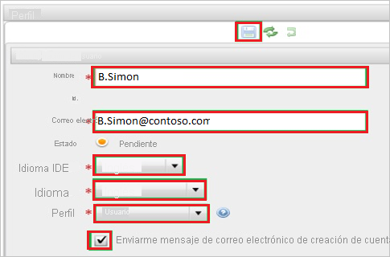

# Tutorial: Integración del inicio de sesión único de Azure AD con RunMyProcess

En este tutorial, aprenderá a integrar RunMyProcess con Azure Active Directory (Azure AD). Al integrar RunMyProcess con Azure AD, puede hacer lo siguiente:

* Controlar en Azure AD quién tiene acceso a RunMyProcess.
* Permitir que los usuarios puedan iniciar sesión automáticamente en RunMyProcess con sus cuentas de Azure AD.
* Administrar las cuentas desde una ubicación central (Azure Portal).

## Requisitos previos

Para empezar, necesita los siguientes elementos:

* Una suscripción de Azure AD. Si no tiene una suscripción, puede crear una [cuenta gratuita](https://azure.microsoft.com/free/).
* Una suscripción habilitada para el inicio de sesión único (SSO) en RunMyProcess.

## Descripción del escenario

En este tutorial, va a configurar y probar el inicio de sesión único de Azure AD en un entorno de prueba.

* RunMyProcess admite inicio de sesión único iniciado por **SP**.

> [!NOTE]
> El identificador de esta aplicación es un valor de cadena fijo, por lo que solo se puede configurar una instancia en un inquilino.

## Adición de RunMyProcess desde la galería

Para configurar la integración de RunMyProcess en Azure AD, será preciso que agregue RunMyProcess desde la galería a la lista de aplicaciones SaaS administradas.

1. Inicie sesión en Azure Portal con una cuenta personal, profesional o educativa de Microsoft.
1. En el panel de navegación de la izquierda, seleccione el servicio **Azure Active Directory**.
1. Vaya a **Aplicaciones empresariales** y seleccione **Todas las aplicaciones**.
1. Para agregar una nueva aplicación, seleccione **Nueva aplicación**.
1. En la sección **Agregar desde la galería**, escriba **RunMyProcess** en el cuadro de búsqueda.
1. Seleccione **RunMyProcess** en el panel de resultados y agregue la aplicación. Espere unos segundos mientras la aplicación se agrega al inquilino.

## Configuración y prueba del inicio de sesión único de Azure AD para RunMyProcess

Configure y pruebe el inicio de sesión único de Azure AD con RunMyProcess utilizando un usuario de prueba llamado **B.Simon**. Para que el inicio de sesión único funcione, es necesario establecer una relación de vinculación entre un usuario de Azure AD y el usuario relacionado de RunMyProcess.

Para configurar y probar el inicio de sesión único de Azure AD con RunMyProcess, siga estos pasos:

1. **[Configuración del inicio de sesión único de Azure AD](#configure-azure-ad-sso)** , para permitir que los usuarios puedan utilizar esta característica.
    1. **[Creación de un usuario de prueba de Azure AD](#create-an-azure-ad-test-user)** , para probar el inicio de sesión único de Azure AD con B.Simon.
    1. **[Asignación del usuario de prueba de Azure AD](#assign-the-azure-ad-test-user)** , para habilitar a B.Simon para que use el inicio de sesión único de Azure AD.
1. **[Configuración del inicio de sesión único en RunMyProcess](#configure-runmyprocess-sso)** , para configurar los valores de inicio de sesión único en la aplicación.
    1. **[Creación de un usuario de prueba de RunMyProcess](#create-runmyprocess-test-user)** : para tener un homólogo de B.Simon en RunMyProcess que esté vinculado a su representación en Azure AD.
1. **[Prueba del inicio de sesión único](#test-sso)** : para comprobar si la configuración funciona.

## Configuración del inicio de sesión único de Azure AD

Siga estos pasos para habilitar el inicio de sesión único de Azure AD en Azure Portal.

1. En Azure Portal, en la página de integración de la aplicación **RunMyProcess**, busque la sección **Administrar** y seleccione **Inicio de sesión único**.
1. En la página **Seleccione un método de inicio de sesión único**, seleccione **SAML**.
1. En la página **Configuración del inicio de sesión único con SAML**, haga clic en el icono de lápiz de **Configuración básica de SAML** para editar la configuración.

   

1. En la sección **Configuración básica de SAML**, siga estos pasos:

    En el cuadro de texto **URL de inicio de sesión**, escriba una dirección URL con el siguiente patrón: `https://live.runmyprocess.com/live/<tenant id>`

    > [!NOTE]
    > Este valor no es real. Actualícelo con la dirección URL de inicio de sesión real. Póngase en contacto con el [equipo de soporte al cliente de RunMyProcess](mailto:support@runmyprocess.com) para obtener este valor. También puede hacer referencia a los patrones que se muestran en la sección **Configuración básica de SAML** de Azure Portal.

1. En la página **Configurar el inicio de sesión único con SAML**, en la sección **Certificado de firma de SAML**, busque **Certificado (Base64)** y seleccione **Descargar** para descargarlo y guardarlo en el equipo.

    

1. En la sección **Configuración de RunMyProcess**, copie las direcciones URL adecuadas según sus necesidades.

    

### Creación de un usuario de prueba de Azure AD

En esta sección, va a crear un usuario de prueba llamado B.Simon en Azure Portal.

1. En el panel izquierdo de Azure Portal, seleccione **Azure Active Directory**, **Usuarios** y **Todos los usuarios**.
1. Seleccione **Nuevo usuario** en la parte superior de la pantalla.
1. En las propiedades del **usuario**, siga estos pasos:
   1. En el campo **Nombre**, escriba `B.Simon`.  
   1. En el campo **Nombre de usuario**, escriba username@companydomain.extension. Por ejemplo, `B.Simon@contoso.com`.
   1. Active la casilla **Show password** (Mostrar contraseña) y, después, anote el valor que se muestra en el cuadro **Contraseña**.
   1. Haga clic en **Crear**.

### Asignación del usuario de prueba de Azure AD

En esta sección, va a permitir que B.Simon acceda a RunMyProcess utilizando el inicio de sesión único de Azure.

1. En Azure Portal, seleccione sucesivamente **Aplicaciones empresariales** y **Todas las aplicaciones**.
1. En la lista de aplicaciones, seleccione **RunMyProcess**.
1. En la página de información general de la aplicación, busque la sección **Administrar** y seleccione **Usuarios y grupos**.
1. Seleccione **Agregar usuario**. A continuación, en el cuadro de diálogo **Agregar asignación**, seleccione **Usuarios y grupos**.
1. En el cuadro de diálogo **Usuarios y grupos**, seleccione **B.Simon** de la lista de usuarios y haga clic en el botón **Seleccionar** de la parte inferior de la pantalla.
1. Si espera que haya un valor de rol en la aserción de SAML, en el cuadro de diálogo **Seleccionar rol**, seleccione en la lista el rol adecuado para el usuario y haga clic en el botón **Seleccionar** en la parte inferior de la pantalla.
1. En el cuadro de diálogo **Agregar asignación**, haga clic en el botón **Asignar**.

## Configuración del inicio de sesión único de RunMyProcess

1. En otra ventana del explorador web, inicie sesión en su inquilino de RunMyProcess como administrador.

1. En el panel de navegación izquierdo, haga clic en **Account** (Cuenta) y seleccione **Configuration** (Configuración).

    

1. Vaya a la sección **Authentication method** (Método de autenticación) y realice los siguientes pasos:

    

    a. En **Método**, seleccione **SSO con Samlv2**.

    b. En el cuadro de texto **SSO redirect** (Redireccionamiento de SSO), pegue el valor de **Dirección URL de inicio de sesión** que ha copiado de Azure Portal.

    c. En el cuadro de texto **Logout redirect** (Redireccionamiento de cierre de sesión), pegue el valor de **Dirección URL de cierre de sesión** que ha copiado de Azure Portal.

    d. En el cuadro de texto **Name ID Format** (Formato de identificador de nombre), escriba el valor del **formato de identificador de nombre** como **urn:oasis:names:tc:SAML:1.1:nameid-format:emailAddress**.

    e. Abra en el Bloc de notas el archivo de certificado que descargó de Azure Portal, copie el contenido del archivo de certificado y, luego, péguelo en el cuadro de texto **Certificado**.

    f. Haga clic en el icono **Guardar**.

### Creación de un usuario de prueba de RunMyProcess

Para permitir que los usuarios de Azure AD inicien sesión en RunMyProcess, deben aprovisionarse en RunMyProcess. En el caso de RunMyProcess, el aprovisionamiento es una tarea manual.

**Para aprovisionar una cuenta de usuario, realice estos pasos:**

1. Inicie sesión en su sitio de la compañía de RunMyProcess como administrador.

1. Haga clic en **Account** (Cuenta) y seleccione **Users** (Usuarios) en el panel de navegación izquierdo y, a continuación, haga clic en **New User** (Usuario nuevo).

     (Usuario nuevo)

1. En la sección **Configuración del usuario** , lleve a cabo estos pasos:

    
  
    a. Escriba el **nombre** y la **dirección de correo electrónico** de una cuenta de Azure AD válida que quiera aprovisionar en los cuadros de texto correspondientes.

    b. Seleccione un **lenguaje IDE**, un **lenguaje** y un **perfil**.

    c. Seleccione **Enviarme mensaje de correo electrónico de creación de cuenta**.

    d. Haga clic en **Save**(Guardar).

    > [!NOTE]
    > Puede usar cualquier otra API o herramienta de creación de cuentas de usuario de RunMyProcess que proporcione RunMyProcess para aprovisionar cuentas de usuario de Azure Active Directory.

## Prueba de SSO 

En esta sección, probará la configuración de inicio de sesión único de Azure AD con las siguientes opciones. 

* Haga clic en **Probar esta aplicación** en Azure Portal. Esto le redirigirá a la dirección URL de inicio de sesión de RunMyProcess, donde puede iniciar el flujo de inicio de sesión. 

* Vaya directamente a la dirección URL de inicio de sesión de RunMyProcess e inicie el flujo de inicio de sesión desde allí.

* Puede usar Mis aplicaciones de Microsoft. Si en Aplicaciones, hace clic en el icono de RunMyProcess, debería acceder automáticamente a la dirección URL de inicio de sesión de esta aplicación. Para más información acerca de Aplicaciones, consulte [Inicio de sesión e inicio de aplicaciones desde el portal Aplicaciones](../user-help/my-apps-portal-end-user-access.md).

## Pasos siguientes

Una vez configurado RunMyProcess, puede aplicar el control de sesión, que protege a su organización en tiempo real frente a la filtración e infiltración de información confidencial. El control de sesión procede del acceso condicional. [Aprenda a aplicar el control de sesión con Microsoft Cloud App Security](/cloud-app-security/proxy-deployment-aad).