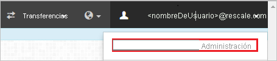
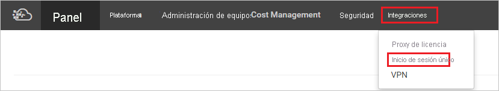

# Tutorial: Integración del inicio de sesión único de Azure AD con ScaleX Enterprise

En este tutorial, aprenderá a integrar ScaleX Enterprise con Azure Active Directory (Azure AD). Al integrar ScaleX Enterprise con Azure AD, puede:

* Controlar en Azure AD quién tiene acceso a ScaleX Enterprise.
* Permitir que los usuarios inicien sesión automáticamente en ScaleX Enterprise con sus cuentas de Azure AD.
* Administrar las cuentas desde una ubicación central (Azure Portal).

## Requisitos previos

Para empezar, necesita los siguientes elementos:

* Una suscripción de Azure AD. Si no tiene una suscripción, puede crear una [cuenta gratuita](https://azure.microsoft.com/free/).
* Una suscripción habilitada para el inicio de sesión único (SSO) en ScaleX Enterprise.

## Descripción del escenario

En este tutorial, va a configurar y probar el inicio de sesión único de Azure AD en un entorno de prueba.

* ScaleX Enterprise admite el inicio de sesión único iniciado por **SP e IDP**.

## Incorporación de ScaleX Enterprise desde la galería

Para configurar la integración de ScaleX Enterprise en Azure AD, deberá agregar esta solución desde la galería a la lista de aplicaciones SaaS administradas.

1. Inicie sesión en Azure Portal con una cuenta personal, profesional o educativa de Microsoft.
1. En el panel de navegación de la izquierda, seleccione el servicio **Azure Active Directory**.
1. Vaya a **Aplicaciones empresariales** y seleccione **Todas las aplicaciones**.
1. Para agregar una nueva aplicación, seleccione **Nueva aplicación**.
1. En la sección **Agregar desde la galería**, escriba **ScaleX Enterprise** en el cuadro de búsqueda.
1. Seleccione **ScaleX Enterprise** en el panel de resultados y, luego, agregue la aplicación. Espere unos segundos mientras la aplicación se agrega al inquilino.

## Configuración y prueba de inicio de sesión único de Azure AD para ScaleX Enterprise

Configure y pruebe el inicio de sesión único (SSO) de Azure AD con ScaleX Enterprise mediante un usuario de prueba llamado **B. Simon**. Para que el inicio de sesión único funcione, es preciso establecer una relación de vinculación entre un usuario de Azure AD y el usuario relacionado de ScaleX Enterprise.

Para configurar y probar el inicio de sesión único de Azure AD con ScaleX Enterprise, siga estos pasos:
1. **[Configuración del inicio de sesión único de Azure AD](#configure-azure-ad-sso)** , para permitir que los usuarios puedan utilizar esta característica.
    1. **[Creación de un usuario de prueba de Azure AD](#create-an-azure-ad-test-user)** , para probar el inicio de sesión único de Azure AD con B.Simon.
    1. **[Asignación del usuario de prueba de Azure AD](#assign-the-azure-ad-test-user)** , para habilitar a B.Simon para que use el inicio de sesión único de Azure AD.
1. **[Configuración del inicio de sesión único de ScaleX Enterprise](#configure-scalex-enterprise-sso)** , para configurar los valores de inicio de sesión único en la aplicación.
    1. **[Creación de un usuario de prueba de ScaleX Enterprise](#create-scalex-enterprise-test-user)** , para tener un homólogo de B. Simon en ScaleX Enterprise que esté vinculado a su representación en Azure AD.
1. **[Prueba del inicio de sesión único](#test-sso)** : para comprobar si la configuración funciona.

## Configuración del inicio de sesión único de Azure AD

Siga estos pasos para habilitar el inicio de sesión único de Azure AD en Azure Portal.

1. En Azure Portal, en la página de integración de aplicaciones de **ScaleX Enterprise**, busque la sección **Administrar** y seleccione **Inicio de sesión único**.
1. En la página **Seleccione un método de inicio de sesión único**, elija **SAML**.
1. En la página **Configuración del inicio de sesión único con SAML**, haga clic en el icono de lápiz de **Configuración básica de SAML** para editar la configuración.

   

1. En la sección **Configuración básica de SAML**, si desea configurar la aplicación en modo iniciado por **IDP**, realice los siguientes pasos:

    a. En el cuadro de texto **Identificador**, escriba una dirección URL con el patrón siguiente: `https://platform.rescale.com/saml2/<company id>/`

    b. En el cuadro de texto **URL de respuesta**, escriba una dirección URL con el siguiente patrón: `https://platform.rescale.com/saml2/<company id>/acs/`

1. Haga clic en **Establecer direcciones URL adicionales** y siga este paso si desea configurar la aplicación en el modo iniciado por **SP**:

    En el cuadro de texto **URL de inicio de sesión**, escriba una dirección URL con el siguiente patrón: `https://platform.rescale.com/saml2/<company id>/sso/`

    > [!NOTE]
    > Estos valores no son reales. Actualice estos valores con los valores reales de Identificador, URL de respuesta y URL de inicio de sesión. Póngase en contacto con el [equipo de soporte de cliente de ScaleX Enterprise](https://about.rescale.com/contactus.html) para obtener estos valores. También puede hacer referencia a los patrones que se muestran en la sección **Configuración básica de SAML** de Azure Portal.

1. La aplicación ScaleX Enterprise espera las aserciones de SAML en un formato específico, que requiere que se agreguen asignaciones de atributos personalizados a la configuración de los atributos del token de SAML. La siguiente captura de pantalla muestra la lista de atributos predeterminados, donde **nameidentifier** se corresponde con **user.mail**. La aplicación ScaleX Enterprise espera que **nameidentifier** se asigne con **user.userprincipalname**, así que debe hacer clic en el icono **Editar** para editar la asignación de atributos y cambiar dicha asignación.

    

1. En la página **Configurar el inicio de sesión único con SAML**, en la sección **Certificado de firma de SAML**, busque **Certificado (Base64)** y seleccione **Descargar** para descargarlo y guardarlo en el equipo.

    

1. En la sección **Set up ScaleX Enterprise** (Configurar ScaleX Enterprise), copie las direcciones URL que necesite.

    

### Creación de un usuario de prueba de Azure AD

En esta sección, va a crear un usuario de prueba llamado B.Simon en Azure Portal.

1. En el panel izquierdo de Azure Portal, seleccione **Azure Active Directory**, **Usuarios** y **Todos los usuarios**.
1. Seleccione **Nuevo usuario** en la parte superior de la pantalla.
1. En las propiedades del **usuario**, siga estos pasos:
   1. En el campo **Nombre**, escriba `B.Simon`.  
   1. En el campo **Nombre de usuario**, escriba username@companydomain.extension. Por ejemplo, `B.Simon@contoso.com`.
   1. Active la casilla **Show password** (Mostrar contraseña) y, después, anote el valor que se muestra en el cuadro **Contraseña**.
   1. Haga clic en **Crear**.

### Asignación del usuario de prueba de Azure AD

En esta sección, va a permitir que B. Simon acceda a ScaleX Enterprise mediante el inicio de sesión único de Azure.

1. En Azure Portal, seleccione sucesivamente **Aplicaciones empresariales** y **Todas las aplicaciones**.
1. En la lista de aplicaciones, seleccione **ScaleX Enterprise**.
1. En la página de información general de la aplicación, busque la sección **Administrar** y seleccione **Usuarios y grupos**.
1. Seleccione **Agregar usuario**. A continuación, en el cuadro de diálogo **Agregar asignación**, seleccione **Usuarios y grupos**.
1. En el cuadro de diálogo **Usuarios y grupos**, seleccione **B.Simon** de la lista de usuarios y haga clic en el botón **Seleccionar** de la parte inferior de la pantalla.
1. Si espera que haya un valor de rol en la aserción de SAML, en el cuadro de diálogo **Seleccionar rol**, seleccione en la lista el rol adecuado para el usuario y haga clic en el botón **Seleccionar** en la parte inferior de la pantalla.
1. En el cuadro de diálogo **Agregar asignación**, haga clic en el botón **Asignar**.

## Configuración del inicio de sesión único de ScaleX Enterprise

1. Para automatizar la configuración en ScaleX Enterprise, debe instalar la **extensión del explorador de inicio de sesión seguro de Mis aplicaciones**. Para ello, haga clic en **Instalar la extensión**.

    

1. Después de agregar la extensión al explorador, haga clic en **Set up ScaleX Enterprise** (Configurar ScaleX Enterprise) para ir a la aplicación del mismo nombre. En ella, escriba las credenciales de administrador para iniciar sesión en ScaleX Enterprise. La extensión de explorador configurará automáticamente la aplicación y automatizará los pasos 3 a 6.

    

1. Si quiere configurar ScaleX Enterprise manualmente, abra una nueva ventana del explorador web, inicie sesión en el sitio de empresa de ScaleX Enterprise como administrador y lleve a cabo los siguientes pasos:

1. Haga clic en el menú en la esquina superior derecha y seleccione **Contoso Administration** (Administración de Contoso).

    > [!NOTE]
    > Contoso solo es un ejemplo. Debería tratarse del nombre real de la empresa.

    

1. Seleccione **Integrations** (Integraciones) en el menú superior y seleccione **Single Sign-On** (Inicio de sesión único).

     

1. Complete el formulario de la siguiente manera:

    

    a. Seleccione **Crear cualquier usuario que se pueda autenticar con SSO**.

    b. **SAML del proveedor de servicios**: pegue el valor **urn:oasis:names:tc:SAML:2.0:nameid-format:persistent**.

    c. **Nombre de campo de correo electrónico del proveedor de identidades en respuestas de ACS**: pegue el valor `http://schemas.xmlsoap.org/ws/2005/05/identity/claims/emailaddress`.

    d. **Identity Provider EntityDescriptor Entity ID** (Identificador de entidad de EntityDescriptor del proveedor de identidades): Pegue el valor de **Azure AD Identifier** (Identificador de Azure AD) que copió de Azure Portal.

    e. **Identity Provider SingleSignOnService URL** (Dirección URL de SingleSignOnService del proveedor de identidades): pegue el valor de **Login URL** (Dirección URL de inicio de sesión) que copió anteriormente de Azure Portal.

    f. **Identity Provider public X509 certificate** (Certificado X509 público del proveedor de identidades): abra el certificado X509 descargado de Azure en el Bloc de notas y pegue el contenido en este cuadro. Asegúrese de que no haya saltos de línea en el medio del contenido del certificado.

    g. Active las siguientes casillas: **Enabled (Habilitado), Encrypt NameID (Cifrar NameID) y Sign AuthnRequests (Firmar AuthnRequests).**

    h. Haga clic en **Update SSO Settings** (Actualizar configuración de SSO) para guardar la configuración.

### Creación de un usuario de prueba de ScaleX Enterprise

Para permitir que los usuarios de Azure AD inicien sesión en ScaleX Enterprise, deben aprovisionarse en ScaleX Enterprise. En el caso de ScaleX Enterprise, el aprovisionamiento es una tarea automática y no se requiere ningún paso manual. Todos los usuarios que se pueden autenticar correctamente con las credenciales de SSO se aprovisionarán automáticamente en ScaleX.

## Prueba de SSO

En esta sección, probará la configuración de inicio de sesión único de Azure AD con las siguientes opciones. 

#### Iniciado por SP:

* Haga clic en **Probar esta aplicación** en Azure Portal. Esto le redirigirá a la dirección URL de inicio de sesión de ScaleX Enterprise, donde puede iniciar el flujo de inicio de sesión.  

* Vaya directamente a la dirección URL de inicio de sesión de ScaleX Enterprise e inicie el flujo de inicio de sesión desde allí.

#### Iniciado por IDP:

* Haga clic en **Probar esta aplicación** en Azure Portal; debería iniciar sesión automáticamente en la instancia de ScaleX Enterprise para la que ha configurado el inicio de sesión único. 

También puede usar Aplicaciones de Microsoft para probar la aplicación en cualquier modo. Al hacer clic en el icono de ScaleX Enterprise en Mis aplicaciones, si ha realizado la configuración en modo SP, se le redirigirá a la página de inicio de sesión de la aplicación para comenzar el flujo de inicio de sesión. Si ha realizado la configuración en modo IDP, debería iniciar sesión automáticamente en la instancia de ScaleX Enterprise para la que ha configurado el inicio de sesión único. Para más información acerca de Aplicaciones, consulte [Inicio de sesión e inicio de aplicaciones desde el portal Aplicaciones](../user-help/my-apps-portal-end-user-access.md).

## Pasos siguientes

Una vez que haya configurado ScaleX Enterprise, podrá aplicar el control de sesión, que protege a la organización en tiempo real frente a la filtración e infiltración de información confidencial. El control de sesión procede del acceso condicional. [Aprenda a aplicar el control de sesión con Microsoft Cloud App Security](/cloud-app-security/proxy-deployment-aad).