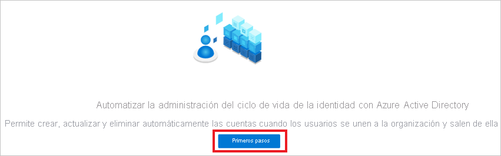

# Tutorial: Configuración de SchoolStream ASA para el aprovisionamiento automático de usuarios en la aplicación

En este tutorial se describen los pasos para seguir en SchoolStream ASA y Azure Active Directory (Azure AD) con el fin de configurar el aprovisionamiento automático de usuarios. Cuando se configura, Azure AD aprovisiona y desaprovisiona de forma automática usuarios y grupos en [SchoolStream ASA](https://www.ssk12.com/) mediante el servicio de aprovisionamiento de Azure AD. Para obtener información importante acerca de lo que hace este servicio, cómo funciona y ver preguntas frecuentes al respecto, consulte [Automatización del aprovisionamiento y desaprovisionamiento de usuarios para aplicaciones SaaS con Azure Active Directory](../app-provisioning/user-provisioning.md). 

## Funcionalidades admitidas
> [!div class="checklist"]
> * Creación de usuarios en SchoolStream ASA 
> * Eliminación de usuarios de SchoolStream ASA cuando ya no necesiten acceso
> * Sincronización de los atributos de usuario entre Azure AD y SchoolStream ASA.
> * Aprovisionamiento de grupos y pertenencias a grupos en SchoolStream ASA.
> * [Inicio de sesión único](../manage-apps/add-application-portal-setup-oidc-sso.md) en SchoolStream ASA (recomendado)

## Requisitos previos

En el escenario descrito en este tutorial se supone que ya cuenta con los requisitos previos siguientes:

* [Un inquilino de Azure AD](../develop/quickstart-create-new-tenant.md) 
* Una cuenta de usuario en Azure AD con [permiso](../roles/permissions-reference.md) para configurar el aprovisionamiento (por ejemplo, Administrador de aplicaciones, Administrador de aplicaciones en la nube, Propietario de la aplicación o Administrador global). 
* Un sitio web de SchoolStream. Si no dispone de uno, contacte [con el equipo de soporte técnico de SchoolStream](mailto:support@rtresponse.com).

## Paso 1. Planeación de la implementación de aprovisionamiento
1. Obtenga información sobre [cómo funciona el servicio de aprovisionamiento](../app-provisioning/user-provisioning.md).
1. Determine quién estará en el [ámbito de aprovisionamiento](../app-provisioning/define-conditional-rules-for-provisioning-user-accounts.md).
1. Decida qué datos desea [asignar entre Azure AD y SchoolStream ASA](../app-provisioning/customize-application-attributes.md). 

## Paso 2. Configuración de SchoolStream ASA para facilitar el aprovisionamiento con Azure AD

1. Contacte con el [equipo de soporte técnico de SchoolStream](mailto:support@rtresponse.com) para solicitar la integración de SchoolStream ASA. Deberá proporcionar el **identificador de inquilino de Azure AD** y la **URL del sitio web de SchoolStream**.

1. Recibirá el **token secreto** y la **URL de inquilino de ASA de SchoolStream** después de que SchoolStream haya asignado su sitio web al identificador de inquilino de Azure AD.

## Paso 3. Incorporación de SchoolStream ASA desde la galería de aplicaciones de Azure AD

Para iniciar el aprovisionamiento en SchoolStream ASA desde Azure AD, agregue la aplicación SchoolStream ASA desde la galería de aplicaciones de Azure AD. 

1. Inicie sesión en Azure Portal con una cuenta personal, profesional o educativa de Microsoft.
1. En el panel de navegación de la izquierda, seleccione el servicio **Azure Active Directory**.
1. Vaya a **Aplicaciones empresariales** y seleccione **Todas las aplicaciones**.
1. Para agregar una nueva aplicación, seleccione **Nueva aplicación**.
1. En la sección **Examinar la galería de Azure AD**, escriba **SchoolStream ASA** en el cuadro de búsqueda.
1. Seleccione **SchoolStream ASA** en el panel de resultados y **regístrese en la aplicación**. Espere unos segundos mientras la aplicación se agrega al inquilino.

Si ya ha configurado SchoolStream ASA para el inicio de sesión único, puede usar la misma aplicación. Sin embargo, se recomienda que cree una aplicación independiente al probar la integración inicialmente. Puede encontrar más información sobre cómo agregar una aplicación desde la galería [aquí](../manage-apps/add-application-portal.md). 

## Paso 4. Determinar quién estará en el ámbito de aprovisionamiento 

El servicio de aprovisionamiento de Azure AD le permite definir quién se aprovisionará, en función de la asignación a la aplicación y de los atributos del usuario o grupo. Si elige el ámbito del que se aprovisionará en la aplicación en función de la asignación, puede usar los pasos [siguientes](../manage-apps/assign-user-or-group-access-portal.md) para asignar usuarios y grupos a la aplicación. Si elige el ámbito del que se aprovisionará en función únicamente de los atributos del usuario o grupo, puede usar un filtro de ámbito, tal como se describe [aquí](../app-provisioning/define-conditional-rules-for-provisioning-user-accounts.md). 

* Al asignar usuarios y grupos a SchoolStream ASA, deberá seleccionar un rol que no esa el **acceso predeterminado**. Los usuarios con el rol de acceso predeterminado se excluyen del aprovisionamiento y se marcarán como no autorizados en los registros de aprovisionamiento. Si el único rol disponible en la aplicación es el rol de acceso predeterminado, puede [actualizar el manifiesto de aplicación](../develop/howto-add-app-roles-in-azure-ad-apps.md) para agregar roles adicionales. 

* Empiece por algo pequeño. Pruebe con un pequeño conjunto de usuarios y grupos antes de implementarlo en todos. Cuando el ámbito del aprovisionamiento se define en los usuarios y grupos asignados, puede controlarlo asignando uno o dos usuarios o grupos a la aplicación. Cuando el ámbito se establece en todos los usuarios y grupos, puede especificar un [filtro de ámbito basado en atributos](../app-provisioning/define-conditional-rules-for-provisioning-user-accounts.md). 

## Paso 5. Configuración del aprovisionamiento automático de usuarios en SchoolStream ASA 

Esta sección le dirige por los pasos necesarios para configurar el servicio de aprovisionamiento de Azure AD con el fin de crear, actualizar y deshabilitar usuarios o grupos en SchoolStream ASA en función de las asignaciones de grupos o usuarios en Azure AD.

### Para configurar el aprovisionamiento automático de usuarios para SchoolStream ASA en Azure AD:

1. Inicie sesión en [Azure Portal](https://portal.azure.com). Seleccione **Aplicaciones empresariales** y luego **Todas las aplicaciones**.

    

1. En la lista de aplicaciones, seleccione **SchoolStream ASA**.

    

1. Seleccione la pestaña **Aprovisionamiento**.

    

1. Si va a configurar el aprovisionamiento por primera vez, seleccione **Comenzar**.

    
    
1. Establezca el **modo de aprovisionamiento** en **Automático**.

    

1. En la sección **Credenciales de administrador**, escriba los valores de **URL de inquilino** y **token secreto** para SchoolStream ASA. Haga clic en **Probar conexión** para asegurarse de que Azure AD se puede conectar a SchoolStream ASA. Si la conexión no funcione, asegúrese de que la cuenta de SchoolStream ASA tenga permisos de administrador e inténtelo de nuevo.

    

1. Seleccione **Guardar** para ver la sección **Configuración**.

1. En el campo **Correo electrónico de notificación** de la sección **Configuración**, escriba la dirección de correo electrónico de la persona o grupo que recibirá las notificaciones de error de aprovisionamiento y seleccione la casilla **Enviar una notificación por correo electrónico cuando se produzca un error**.

    

1. En la sección **Asignaciones**, seleccione **Aprovisionar usuarios de Azure Active Directory**.

1. En la parte inferior, seleccione **Agregar nueva asignación**.

1. En el cuadro de diálogo **Editar atributo**, siga estos pasos: 
    
   * En el campo **Tipo de asignación**, seleccione **Directo** en la lista desplegable.
   * En el campo **Atributo de origen**, seleccione **extensionAttribute1** en la lista desplegable.
   * Escriba su **identificador de inquilino de Azure AD** en el campo **Valor predeterminado**.
   * En el campo **Atributo de destino**, seleccione **urn:ietf:params:scim:schemas:extension:enterprise:2.0:User:organization** en la lista desplegable. 
   * En el campo **Hacer coincidir objetos con este atributo**, seleccione **No** en la lista desplegable.
   * En el campo **Aplicar esta asignación**, seleccione **Siempre** en la lista desplegable.
   * Seleccione **Aceptar**.

       

1. Examine los atributos de usuario que se sincronizan desde Azure AD con SchoolStream ASA en la sección **Asignación de atributos**. Los atributos seleccionados como propiedades **coincidentes** se usan para correlacionar las cuentas de usuario de SchoolStream ASA durante las operaciones de actualización. Si decide cambiar el [atributo de destino coincidente](../app-provisioning/customize-application-attributes.md), deberá asegurarse de que la API de SchoolStream ASA admita el filtrado de usuarios en función de ese atributo.

   |Atributo|Tipo|Compatible con el filtrado|
   |---|---|---|
   |userName|String|&check;
   |active|Boolean|   
   |DisplayName|String|
   |emails[type eq "work"].value|String|
   |preferredLanguage|String|
   |name.givenName|String|
   |name.familyName|String|
   |name.formatted|String|
   |phoneNumbers[type eq "mobile"].value|String|
   |externalId|String|
   |urn:ietf:params:scim:schemas:extension:enterprise:2.0:User:organization|String| 

1. En la sección de **asignaciones**, seleccione **Synchronize Azure Active Directory Groups to UNIFI** (Sincronizar grupos de Azure Active Directory con UNIFI).

1. Revise los atributos de grupo que se sincronizan entre Azure AD y UNIFI en la sección **Attribute-Mapping** (Asignación de atributos). Los atributos seleccionados como propiedades de **coincidencia** se usan para establecer correspondencia con los grupos de UNIFI para operaciones de actualización. Seleccione el botón **Guardar** para confirmar los cambios.

      |Atributo|Tipo|Compatible con el filtrado|
      |---|---|---|
      |DisplayName|String|&check;
      |members|Referencia|
      |externalId|String|      

1. Seleccione el botón **Guardar** para confirmar los cambios. Puede volver a la pestaña **Aplicación** y seleccionar la opción para **editar el aprovisionamiento** y continuar.

1. Para configurar filtros de ámbito, consulte las siguientes instrucciones, que se proporcionan en el artículo [Aprovisionamiento de aplicaciones basado en atributos con filtros de ámbito](../app-provisioning/define-conditional-rules-for-provisioning-user-accounts.md).

1. Si desea habilitar el servicio de aprovisionamiento de Azure AD para SchoolStream ASA, cambie el **estado de aprovisionamiento** a **Activado** en la sección **Configuración**.

    

1. Para definir los usuarios o grupos que desea aprovisionar en SchoolStream ASA, seleccione los valores deseados en **Ámbito**, en la sección **Configuración**.

    

1. Cuando esté listo para realizar el aprovisionamiento, haga clic en **Guardar**.

    

Esta operación inicia el ciclo de sincronización inicial de todos los usuarios y grupos definidos en **Ámbito** en la sección **Configuración**. El ciclo de sincronización inicial tarda más tiempo en realizarse que los ciclos posteriores, que se producen aproximadamente cada 40 minutos si el servicio de aprovisionamiento de Azure AD está ejecutándose. 

## Paso 6. Supervisión de la implementación
Una vez configurado el aprovisionamiento, use los recursos siguientes para supervisar la implementación:

* Use los [registros de aprovisionamiento](../reports-monitoring/concept-provisioning-logs.md) para determinar qué usuarios se han aprovisionado correctamente o sin éxito.
* Consulte la [barra de progreso](../app-provisioning/application-provisioning-when-will-provisioning-finish-specific-user.md) para ver el estado del ciclo de aprovisionamiento y cuánto falta para que finalice.
* Si la configuración de aprovisionamiento parece estar en mal estado, la aplicación pasará a estar en cuarentena. Más información sobre los estados de cuarentena [aquí](../app-provisioning/application-provisioning-quarantine-status.md).  

## Registro de cambios

* 24/09/2020: se ha habilitado el aprovisionamiento de grupos.

## Más recursos

* [Administración del aprovisionamiento de cuentas de usuario para aplicaciones empresariales](../app-provisioning/configure-automatic-user-provisioning-portal.md)
* [¿Qué es el acceso a aplicaciones y el inicio de sesión único con Azure Active Directory?](../manage-apps/what-is-single-sign-on.md)

## Pasos siguientes

* [Aprenda a revisar los registros y a obtener informes sobre la actividad de aprovisionamiento](../app-provisioning/check-status-user-account-provisioning.md)